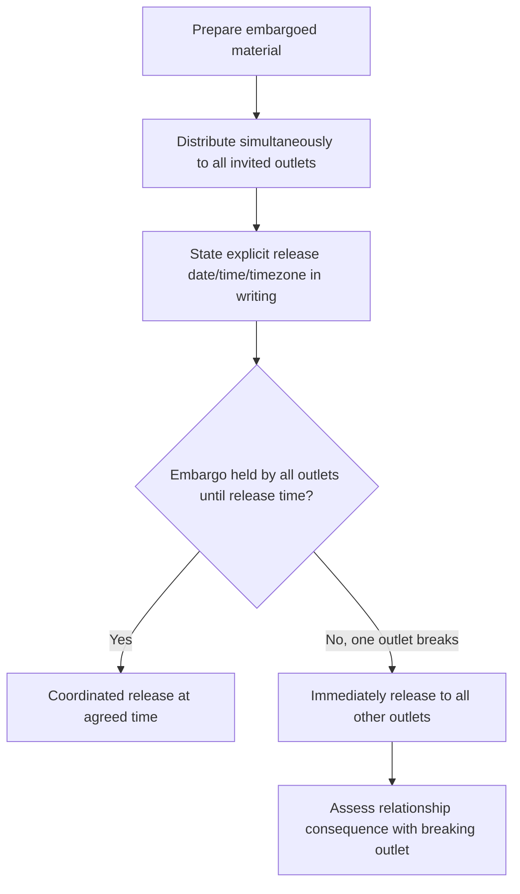
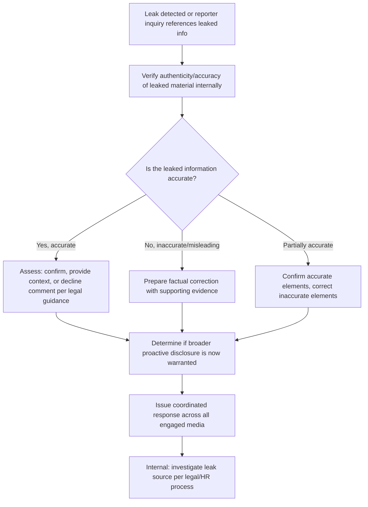

## Embargoes, Exclusives, and Leak Management

### Overview

Embargoes, exclusives, and leak management are three related but distinct tools/problems in controlling the timing and distribution of sensitive information to media during a crisis. Embargoes and exclusives are proactive, negotiated arrangements the organization initiates to shape *when* and *to whom* information first reaches the public; leak management is reactive, addressing unauthorized disclosure that has already occurred or is imminent, outside organizational control. Conflating these tools, or mishandling the transition from one to another (e.g., an embargo breaking into an uncontrolled leak), is a recurring source of crisis escalation.

### Embargoes

#### Definition and Mechanism

- An embargo is an agreement in which a reporter or outlet receives information in advance of a specified release time, with an explicit agreement not to publish before that time.
- Distinct from off-the-record or background attribution status (see *Attribution Norms*): an embargo concerns *timing* of publication, not attribution terms — embargoed information is typically intended to be fully on-the-record and quotable once the embargo lifts.
- Embargoes are conventionally honored by professional journalists as a courtesy that enables more accurate, better-prepared reporting, but they are not legally binding; enforcement depends entirely on the reporter's/outlet's voluntary adherence and the source's ongoing relationship credibility with that reporter.

#### When Embargoes Are Used in Crisis Communications

**Key Points**

- Providing complex or technical information (e.g., investigation findings, root-cause analysis) to multiple outlets simultaneously in advance of a public announcement, allowing reporters time to prepare accurate coverage rather than rushing a same-day, under-researched story.
- Coordinating a single release moment across multiple outlets and time zones to avoid one outlet breaking a story ahead of others, which can otherwise create a perception of favoritism or an uncontrolled information cascade.
- [Inference] Embargoes are more commonly used for scheduled, planned disclosures (e.g., an investigation's conclusion, a settlement announcement) than for breaking-news-stage crisis response, since a live, still-developing crisis rarely affords the lead time an embargo requires to be meaningfully honored.

#### Setting and Managing an Embargo

- State the embargo terms explicitly and in writing at the point information is shared (exact release date/time, time zone specified) — ambiguity in stated terms is a common cause of accidental breaks.
- Provide the same embargoed material and lift time to all outlets receiving it simultaneously, unless a deliberate exclusive arrangement (see below) is separately and knowingly chosen.
- [Inference] An embargo is more reliably honored when the reporter/outlet perceives clear mutual benefit (accurate, well-prepared coverage) rather than being used primarily to suppress or delay unfavorable news, since outlets that perceive an embargo as a suppression tactic are more likely to break it or decline the arrangement.
- Have a pre-agreed response plan for a break: if one outlet publishes before the embargo lifts (accidentally or deliberately), the standard practice is to release the material to all other embargoed outlets immediately rather than continuing to hold them to the original time, since continuing to enforce an embargo after one break unfairly disadvantages the compliant outlets.

### Exclusives

#### Definition and Mechanism

- An exclusive is an arrangement granting a single outlet or reporter first (and sometimes sole) access to a story or interview, ahead of or instead of simultaneous distribution to other media.
- Distinguishing feature from an embargo: an exclusive concerns *which outlet* gets the story, potentially with no fixed release-time coordination with other outlets at all, whereas an embargo concerns coordinated *timing* across multiple outlets receiving the same material.

#### Strategic Use in Crisis Communications

**Key Points**

- Granting an exclusive to a specific, trusted reporter or outlet for a significant update (e.g., an executive's first public interview post-crisis) can help ensure a fair, well-researched initial framing from a reporter with a track record of accuracy, potentially setting a more balanced tone for subsequent broader coverage.
- [Inference] Granting exclusives is a double-edged tool during a crisis: it can secure favorable initial framing but risks alienating other outlets who perceive themselves as deliberately excluded, which can affect the tone of their independent coverage and long-term relationship health with the organization.
- Exclusives are more commonly and less riskily used for positive or neutral developments (a recovery milestone, a leadership change) than for the initial disclosure of negative crisis facts, where simultaneous, broad distribution is generally viewed as more appropriate to avoid the appearance of managing bad news through favorable outlet selection.
- Selection criteria for an exclusive partner ideally include demonstrated fairness and accuracy in the outlet's prior coverage of the organization or comparable situations, and audience reach appropriate to the significance of the story — not simply prior favorable coverage, which risks the appearance of rewarding favorable treatment (see *Managing Journalist Relationships Under Pressure*).

### Leak Management

#### Definition and Scope

- A leak is the unauthorized disclosure of sensitive information to media (or the public) outside approved organizational channels, whether through an internal source, a compromised document, an unintentional statement by an untrained employee, or external discovery (e.g., a public records request, a security researcher, a whistleblower).
- Leaks are inherently reactive from the organization's perspective; the objective shifts from controlling *initial disclosure* to controlling *narrative accuracy and containment* after disclosure has already begun or is imminent.

#### Immediate Response Workflow

#### Assessing Response to a Leak

**Key Points**

- The first step upon learning a reporter possesses leaked material is internal verification: confirm what was actually leaked, whether it is accurate, complete, or taken out of context, before any external response.
- [Inference] A reporter possessing partial leaked material and seeking comment often already intends to publish regardless of organizational response; the practical decision is typically how to shape accuracy and context in the resulting story, not whether a story occurs at all.
- Standard response options once a leak is confirmed accurate: (a) confirm and provide full context proactively, (b) confirm narrowly without elaboration, (c) decline to comment on leaked/purportedly leaked material as a matter of policy (with legal guidance on whether this is advisable given the specific content).
- [Inference] Declining to comment on confirmed-accurate leaked material that a reporter is likely to publish regardless often forfeits the opportunity to shape context and accuracy in the resulting story, whereas providing calibrated context can reduce the risk of the leak being reported with a more damaging framing than the underlying facts support — the appropriate choice depends on legal exposure and the specific content, decided case by case.
- If the leaked material is inaccurate or misleading, prepare a fact-based, evidence-supported correction rather than a general denial, since a general denial without supporting detail is often less persuasive to a skeptical reporter already in possession of documents.

#### Deciding Whether to Accelerate Proactive Disclosure

**Key Points**

- A confirmed leak to one reporter is a strong signal to assess whether proactive, simultaneous disclosure to all engaged media is now warranted, since allowing the story to run first through the leak recipient outlet cedes framing control and can create the appearance of unequal access or an intended exclusive that was not actually planned.
- [Inference] Once leaked information is confirmed to be circulating (even to a single reporter), the organization's control over the release timeline has typically already been substantially reduced regardless of subsequent internal action, making rapid, broad, accurate disclosure often preferable to continued containment attempts once containment is assessed as unlikely to succeed.

#### Internal Leak Source Investigation

**Key Points**

- Leak source investigation is typically handled by legal/HR/security functions separately from the external-facing communications response, and should not delay or be conflated with the external accuracy/context response to media, which operates on a much faster required timeline.
- [Unverified] The relative frequency of leaks originating from disgruntled current employees, departing employees, external parties with document access (e.g., through litigation discovery, vendors, regulators), versus other sources varies by organization and industry and should not be assumed without organization-specific investigation.
- Overly aggressive or visible internal leak-hunting (mass device audits, public warnings to staff) can itself become a secondary story if it becomes known externally, and is generally weighed against morale and legal/employment-law considerations before being pursued.

### Comparison Summary

| Tool | Initiated by | Concerns | Typical trigger | Reversibility |
| --- | --- | --- | --- | --- |
| Embargo | Organization (proactive) | Coordinated timing of release | Complex/technical disclosure requiring prep time | Breakable; requires pre-agreed break-response plan |
| Exclusive | Organization (proactive) | Which single outlet gets first/sole access | Desire for accurate initial framing, favorable milestone | Fixed once granted; relationship risk with excluded outlets |
| Leak | External/unauthorized (reactive) | Unauthorized disclosure outside approved channel | Internal source, compromised document, external discovery | Not reversible; response is containment/context, not prevention after the fact |

### Common Failure Modes

- **Ambiguous embargo terms** (no explicit time zone, unclear release moment), leading to accidental breaks disputed as good-faith versus deliberate.
- **Continuing to enforce a broken embargo** against compliant outlets after one outlet has already published, disadvantaging cooperative reporters and damaging future embargo credibility.
- **Granting exclusives on negative crisis facts**, which can appear as managing bad news through selective outlet access rather than transparent disclosure.
- **Declining all comment on confirmed-accurate leaked material by default**, forfeiting the opportunity to shape context in a story that is likely to run regardless.
- **General denial without supporting evidence** in response to accurate leaked documentation, which tends to reduce credibility with a reporter already holding primary source material.
- **Conflating internal leak-source investigation with external media response**, delaying the time-sensitive external accuracy response while pursuing the (typically slower, legally sensitive) internal investigation.
- **Visible, aggressive internal leak-hunting** that becomes externally known, generating a secondary story about internal culture or retaliation concerns.

### Illustration: Information Control Spectrum

<svg xmlns="http://www.w3.org/2000/svg" viewBox="0 0 880 260">
<text x="440" y="28" font-size="18" font-weight="bold" text-anchor="middle" fill="#1a1a1a">Information Control Spectrum (svg_diagram)</text>
<line x1="60" y1="140" x2="820" y2="140" stroke="#888" stroke-width="3" />
<circle cx="120" cy="140" r="9" fill="#27ae60" />
<text x="120" y="100" font-size="13" font-weight="bold" text-anchor="middle" fill="#1a1a1a">Embargo</text>
<text x="120" y="170" font-size="11" text-anchor="middle" fill="#555">Org-controlled timing</text>
<circle cx="380" cy="140" r="9" fill="#f1c40f" />
<text x="380" y="100" font-size="13" font-weight="bold" text-anchor="middle" fill="#1a1a1a">Exclusive</text>
<text x="380" y="170" font-size="11" text-anchor="middle" fill="#555">Org-controlled outlet choice</text>
<circle cx="650" cy="140" r="9" fill="#c0392b" />
<text x="650" y="100" font-size="13" font-weight="bold" text-anchor="middle" fill="#1a1a1a">Leak</text>
<text x="650" y="170" font-size="11" text-anchor="middle" fill="#555">Uncontrolled disclosure</text>

<text x="440" y="220" font-size="12" text-anchor="middle" fill="#555" font-style="italic">Decreasing organizational control over timing and framing, left to right</text>

</svg>

**Related Topics**

- Attribution norms: on the record, off the record, background (cross-reference)
- Managing journalist relationships under pressure (cross-reference)
- Legal considerations in confirming or denying leaked material
- Internal document security and access-control review post-leak
- Coordinating simultaneous multi-outlet disclosure logistics
- Assessing whistleblower-originated disclosures versus unauthorized leaks
- Post-crisis review of leak source and containment effectiveness