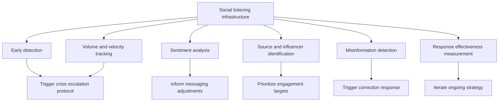
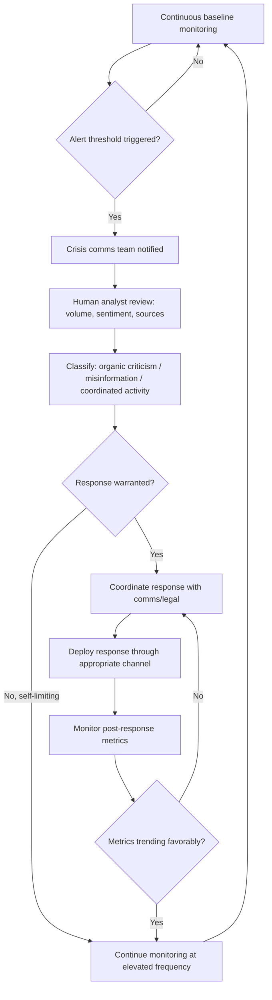

## Real-Time Social Listening and Monitoring

### Overview

Real-time social listening and monitoring is the continuous, systematic tracking of social media, news, forums, and other public digital channels to detect emerging crises, measure sentiment and volume trends, and inform response decisions as a situation develops. In crisis management specifically, it functions as both an early-warning system (detecting a potential crisis before it reaches mainstream media) and an ongoing situational-awareness tool during an active crisis (tracking how a response is landing, whether misinformation is spreading, and where the conversation is concentrated).

### Core Functions in Crisis Management

### Early Detection

**Key Points**

- The objective is to identify signals of a potential crisis before it crosses into mainstream media coverage or reaches a volume threshold that makes it materially harder to manage — colloquially, catching a story while it is still small.
- Detection sources typically include: direct mentions of the organization/brand/executives, relevant hashtags, known complaint patterns, competitor/industry-adjacent conversation that could implicate the organization, and monitoring of specific known critics, activist accounts, or previously identified risk topics.
- [Inference] A meaningful proportion of issues that escalate into full crises show a detectable early period of low-volume but pointed negative discussion (customer complaints, employee posts, niche community threads) before reaching broader visibility, though the length and detectability of that window varies substantially by incident type and cannot be assumed uniform.
- Alert thresholds should be pre-configured before a crisis (rather than improvised during one) based on combinations of factors: unusual volume spikes relative to baseline, sentiment shift magnitude, appearance of specific high-risk keywords, or activity from accounts/outlets with substantial reach.

### Volume and Velocity Tracking

**Key Points**

- Volume (raw count of mentions) and velocity (rate of change in mentions over time) are tracked together, since a moderate volume with rapidly accelerating velocity is often a stronger crisis-escalation signal than a high but stable/plateauing volume.
- Baseline comparison is essential: monitoring tools should be configured with the organization's normal day-to-day mention volume so that spikes are measured as deviation from baseline, not absolute numbers alone, since baseline mention volume varies enormously by organization size and industry.
- Track platform-specific patterns separately rather than as an aggregate total, since a crisis can be concentrated on one platform initially (e.g., a specific forum, a regional platform) before spreading, and platform-specific patterns inform which channel needs the most immediate response attention.

### Sentiment Analysis

**Key Points**

- Automated sentiment classification (positive/negative/neutral, sometimes with emotion-level granularity) provides directional trend tracking at scale, but [Inference] automated sentiment classifiers are known to struggle with sarcasm, context-dependent meaning, and mixed sentiment within a single post, so automated sentiment scores are generally treated as a directional signal requiring human review of a representative sample rather than a fully reliable standalone metric, particularly for high-stakes crisis decisions.
- Track sentiment trend over time relative to specific triggering events (a statement release, a press conference, a correction) to assess whether a specific response action improved, worsened, or had no discernible effect on public sentiment — this requires timestamping response actions precisely against the monitoring data.
- Segment sentiment by audience where possible (general public, customers, employees, investors, media) since a response can affect different audience segments differently, and a single aggregate sentiment score can mask a significant negative reaction within a specific important segment.

### Source and Influencer Identification

**Key Points**

- Identify which specific accounts, publications, or individuals are driving the volume and shaping the narrative — a small number of high-reach accounts often account for a disproportionate share of a crisis's visibility and framing.
- Distinguish between organic public reaction, media amplification, and coordinated or inauthentic activity (bot networks, coordinated posting), since the appropriate response can differ substantially depending on which is driving the conversation.
- [Unverified] Precisely distinguishing coordinated/inauthentic activity from organic viral spread using automated tools alone carries a meaningful error rate and generally benefits from human analyst review before any public claim of "coordinated" or "inauthentic" activity is made, since such claims carry their own reputational and factual risk if incorrect.
- Identify whether journalists or media outlets are actively monitoring/sourcing from the social conversation (a common practice for breaking stories), since this indicates the online conversation may soon translate into traditional media coverage.

### Misinformation and Inaccuracy Detection

**Key Points**

- Monitor specifically for the spread of factually inaccurate claims, manipulated media, or out-of-context framing related to the crisis, as distinct from negative-but-accurate criticism, since the appropriate response differs (correction versus substantive engagement with valid criticism).
- Establish a verification workflow before issuing any public correction: confirm internally that the claim is actually inaccurate (with supporting evidence) before responding, since publicly disputing a claim that later proves accurate or partially accurate compounds reputational damage.
- Track how far and how fast a specific inaccurate claim is spreading (volume, velocity, and whether higher-reach accounts have amplified it) to help prioritize which inaccuracies warrant an active public correction versus which are low-reach and likely to be self-limiting without direct engagement.

### Response Effectiveness Measurement

**Key Points**

- Use monitoring data to assess, in near-real-time, whether a specific response action (a statement, press conference, executive interview) is measurably changing volume, velocity, or sentiment trends, allowing iterative adjustment of strategy during a still-unfolding crisis rather than waiting until after resolution to evaluate effectiveness.
- Compare pre- and post-response metrics using consistent time windows and the same baseline methodology to avoid drawing conclusions from noisy short-term fluctuations.
- [Inference] A response that reduces negative-sentiment volume without addressing the underlying substantive concern raised by critics may show favorable monitoring metrics in the short term while leaving the organization exposed to renewed criticism later if the underlying issue resurfaces — monitoring metrics should be interpreted alongside substantive assessment of whether the actual concern was addressed, not treated as a standalone success measure.

### Operational Workflow During an Active Crisis

### Tooling and Infrastructure Considerations

**Key Points**

- Standard capability categories: keyword/hashtag/mention tracking, sentiment classification, volume/velocity dashboards, influencer/source identification, and alerting (threshold-based notifications to designated personnel).
- [Unverified] Specific vendor tool capabilities, pricing, and platform API access/coverage change frequently and vary by vendor; current tool selection should be verified against up-to-date vendor documentation and platform API terms rather than assumed static, since social platform API access policies for third-party monitoring tools have changed materially over time across the industry.
- Coverage should explicitly include: primary social platforms relevant to the organization's audience, review/complaint platforms relevant to the industry, mainstream and trade news outlets, and forums/communities specific to the organization's sector, since limiting monitoring to only mainstream social platforms can miss early signals concentrated in niche communities.
- Establish a 24/7 or extended-hours monitoring capability (staffed or alert-based) for organizations at meaningful ongoing crisis risk, since crisis-triggering activity does not reliably align with standard business hours, and delayed detection materially narrows the available response window.

### Common Failure Modes

- **No pre-established baseline**, making it difficult to distinguish a genuine volume spike from normal day-to-day variation.
- **Over-reliance on automated sentiment scores** for high-stakes decisions without human review of context, sarcasm, or mixed-sentiment content.
- **Monitoring gaps outside standard business hours**, missing early-stage escalation that occurs overnight or on weekends.
- **Conflating negative-but-accurate criticism with misinformation**, leading to an inappropriate "correction" response to valid criticism, which can itself generate backlash.
- **Publicly disputing a claim without first internally verifying its accuracy**, risking a credibility-damaging reversal if the disputed claim later proves accurate.
- **Treating favorable short-term sentiment metrics as full resolution** without addressing the substantive underlying concern, risking recurrence.
- **Narrow platform coverage**, missing early signals concentrated in niche or regional platforms/communities outside the organization's default monitoring scope.
- **Premature public claims of "coordinated" or "bot" activity** based on automated detection alone without analyst verification, which carries independent reputational and factual risk if incorrect.

### Illustration: Crisis Signal Escalation Over Time

<svg xmlns="http://www.w3.org/2000/svg" viewBox="0 0 880 300">
<text x="440" y="28" font-size="18" font-weight="bold" text-anchor="middle" fill="#1a1a1a">Crisis Signal Escalation Over Time (svg_diagram)</text>
<line x1="70" y1="250" x2="820" y2="250" stroke="#888" stroke-width="2" />
<line x1="70" y1="60" x2="70" y2="250" stroke="#888" stroke-width="2" />
<text x="30" y="65" font-size="11" text-anchor="middle" fill="#555">Volume</text>
<text x="440" y="275" font-size="12" text-anchor="middle" fill="#555">Time</text>
<polyline points="70,240 200,235 320,225 420,180 520,110 650,75 800,65" fill="none" stroke="#c0392b" stroke-width="3" />
<line x1="70" y1="200" x2="820" y2="200" stroke="#f1c40f" stroke-width="1.5" stroke-dasharray="6,4" />
<text x="800" y="195" font-size="10" text-anchor="end" fill="#a67c00">Alert threshold</text>
<circle cx="320" cy="225" r="6" fill="#2980b9" />
<text x="320" y="212" font-size="10" text-anchor="middle" fill="#1a1a1a">Early low-volume</text>
<text x="320" y="200" font-size="10" text-anchor="middle" fill="#1a1a1a" opacity="0">.</text>
<circle cx="420" cy="180" r="6" fill="#e67e22" />
<text x="420" y="167" font-size="10" text-anchor="middle" fill="#1a1a1a">Threshold crossed</text>
<circle cx="520" cy="110" r="6" fill="#c0392b" />
<text x="520" y="97" font-size="10" text-anchor="middle" fill="#1a1a1a">Media pickup</text>

<text x="440" y="285" font-size="11" text-anchor="middle" fill="#555" font-style="italic">Illustrative escalation pattern — actual detectability window varies by incident type [Inference]</text>

</svg>

**Related Topics**

- Alert threshold configuration and escalation protocol design
- Distinguishing organic criticism, misinformation, and coordinated inauthentic activity
- Sentiment analysis tooling: capability and limitation assessment
- Building a 24/7 monitoring and on-call crisis response capability
- Correcting misinformation on social platforms (cross-reference: Digital and Social Media Crisis Management)
- Measuring crisis response effectiveness via monitoring metrics
- Platform-specific monitoring coverage and niche community risk