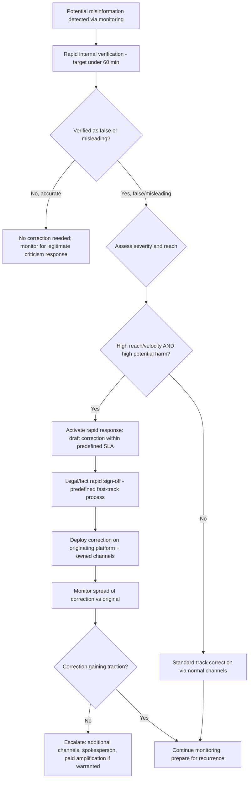

## Viral Misinformation and Rapid Response Protocols

### Overview

Viral misinformation is factually inaccurate or misleading content about an organization that spreads rapidly across digital channels, often outpacing the organization's ability to verify facts and respond through normal channels. Rapid response protocols are the pre-established decision frameworks and operational workflows that allow an organization to assess and respond within the compressed timeframe viral spread demands — typically hours rather than the days a normal communications cycle might allow. The central tension in this domain is between response speed (critical given how quickly viral content can reach peak audience) and response accuracy (critical because a rushed, incorrect, or premature correction can itself become a second wave of damaging, credibility-eroding content).

### Why Viral Misinformation Requires a Distinct Protocol

**Key Points**

- Viral spread follows a compressed timeline compared to traditional media cycles: peak audience exposure can occur within hours, meaning a correction issued on a traditional-media timeline (verified, legal-reviewed, released same-day or next-day) may reach only a fraction of the audience that saw the original content.
- [Inference] Independent research on crowdsourced correction mechanisms (see *Platform-Specific Crisis Dynamics*) has found that even well-designed correction tools can be too slow to meaningfully reduce engagement during the earliest and most viral phase of a misleading post's spread, suggesting that platform-native corrections alone are generally insufficient as a primary rapid-response strategy and should be supplemented by direct, owned-channel response.
- The standard "verify everything internally before saying anything publicly" approach, appropriate for most crisis communications, can be too slow for viral misinformation specifically, creating a structural tension between the general principle of factual caution and the practical reality of viral timing — this tension is resolved through pre-established rapid-verification workflows rather than abandoning verification.

### Rapid Response Decision Framework

### Rapid Internal Verification

**Key Points**

- The verification step cannot be skipped even under severe time pressure; issuing a correction to something that turns out to be true, or partially true, causes more lasting damage than a modest delay to correct it.
- Pre-establish a rapid-verification protocol before a crisis occurs: identify in advance which internal roles (specific named individuals or clearly defined backups) can authoritatively confirm or deny specific categories of claims within a compressed timeframe, so the crisis team is not searching for the right person to ask during the live event.
- [Inference] A rapid-response protocol that has not been rehearsed or pre-assigned before an actual viral event typically loses a meaningful portion of its available response window simply identifying who has the authority and information to verify the claim — pre-assignment of verification authority by claim category is a primary lever for compressing real-world response time.
- Distinguish between claims requiring simple factual verification (a quoted number, a stated policy, a described event) versus claims requiring judgment or investigation (attributing intent, causation, or blame) — the former can often be verified rapidly; the latter frequently cannot be responsibly resolved on a viral timescale and may require an interim "we are looking into this" holding response rather than a substantive rapid correction.

### Assessing Severity and Reach

**Key Points**

- Not all inaccurate content warrants an active rapid response; low-reach, low-velocity inaccuracies are often better left to normal-track correction or platform-native tools (see *Platform-Specific Crisis Dynamics*), since an aggressive rapid response to low-visibility content can itself draw additional attention to it (sometimes called the amplification or "Streisand" risk).
- Standard severity assessment factors: current reach and velocity (see *Real-Time Social Listening and Monitoring*), potential for real-world harm (safety-relevant misinformation warrants faster/more assertive response than reputational-only misinformation), likelihood of mainstream media pickup, and whether the claim, if unaddressed, is likely to be treated as confirmed fact by default.
- [Inference] Content involving potential physical safety risk (e.g., false claims about product safety, health guidance, or emergency instructions) generally warrants a materially lower threshold for rapid response than reputational-only misinformation, given the asymmetric cost of delay when public safety guidance is at stake.
- Pre-define severity tiers and corresponding response SLAs (e.g., a safety-critical tier requiring response within a specific compressed window, a reputational-only tier on a longer track) before a crisis occurs, so severity classification during a live event is a matter of applying a pre-agreed framework rather than debating criteria under time pressure.

### Fast-Track Legal and Approval Process

**Key Points**

- Standard crisis approval workflows (sequential legal review, executive sign-off, communications review) are frequently too slow for viral-timescale response; a pre-established fast-track process — for example, pre-delegated authority to a smaller, named rapid-response team for time-critical corrections meeting specific pre-agreed criteria — is a common structural solution.
- [Inference] Organizations that rely on their standard, full crisis-approval chain for viral-misinformation response commonly find the approval process itself consumes the majority of the effective response window, since standard approval chains are typically designed for accuracy and consensus rather than speed, and were not built with viral timescales in mind.
- The fast-track process should still include a legal check, but scoped narrowly and rapidly (e.g., a pre-cleared response template requiring only fact substitution, or a designated on-call legal reviewer with authority to approve within a compressed window) rather than a full case-by-case legal drafting process.
- Pre-approved response templates for common misinformation categories (a factual correction template, a "we're investigating" holding-response template, a template correcting a misattributed quote) can be drafted and legal-reviewed in advance, dramatically reducing live drafting and approval time when a matching situation arises.

### Correction Content and Format

**Key Points**

- Lead with the correct information rather than repeating the false claim prominently; [Inference] research on correction and rumor-diffusion suggests that prominently repeating a false claim, even while denying it, risks reinforcing recall of the false version in some audiences (sometimes discussed as a backfire or repetition-reinforcement risk), so corrections are generally structured to foreground the accurate fact rather than leading with the myth.
- **Example** (correction structure)
  > "The accurate figure is [X], as confirmed by [source/evidence]. A claim circulating online stating [brief, non-emphasized reference to false claim] is incorrect."
- Provide supporting evidence or a verifiable source alongside the correction where possible (data, documentation, a link to a primary source) rather than an unsupported assertion, since an unsupported denial is generally less persuasive to a skeptical audience already exposed to the viral claim.
- Match correction format to the platform and format of the original misinformation (see *Platform-Specific Crisis Dynamics*) — a viral video claim is generally more effectively corrected with a video response than a text-only statement, since the correction needs to reach the same audience through comparable content formats to be effective.

### Deployment and Amplification

**Key Points**

- Deploy the correction through multiple channels simultaneously: directly on the platform/thread where the misinformation originated (where platform features allow, e.g., a reply, a quote-post, a Community Note contribution/support), the organization's owned channels, and if warranted, through direct outreach to journalists actively covering or monitoring the story.
- [Inference] A correction posted only on the organization's own official channels, without also engaging directly on the platform/thread where the misinformation is actively circulating, often reaches a substantially smaller portion of the exposed audience than one that meets the audience where the misinformation is spreading — owned-channel-only correction is generally treated as necessary but not sufficient.
- For severe, high-reach cases, consider whether paid amplification (promoted posts) of the correction is warranted to accelerate reach, weighed against cost and the risk of the promotion itself becoming a secondary story ("company paying to push its narrative").
- Engage credible third-party validators where appropriate and available (independent experts, fact-checking organizations, credible creators/journalists who have already engaged accurately) — third-party corroboration is often perceived as more credible than a self-interested organizational denial alone.

### Monitoring the Correction's Effectiveness

**Key Points**

- Track whether the correction itself is gaining traction (reach, engagement, sentiment shift) relative to the continued spread of the original misinformation, using the same monitoring infrastructure described in *Real-Time Social Listening and Monitoring*.
- If the correction is not gaining sufficient traction relative to the original claim's continued spread, escalate: additional channels, a more senior or credible spokesperson, direct media outreach, or (for safety-critical cases) formal channels such as a regulator or platform escalation/reporting process.
- [Inference] Misinformation that has been effectively corrected once can resurface later (a "zombie claim" reappearing in a new context or platform), so monitoring should continue at an elevated baseline for a period after the initial correction appears successful, rather than assuming a single successful correction fully resolves recurrence risk.

### Pre-Crisis Preparation Checklist

**Key Points**

- Pre-assign verification authority by claim category (who can authoritatively confirm/deny specific types of factual claims).
- Establish a fast-track legal/approval process distinct from the standard full crisis-approval chain, with clear, narrow, pre-agreed criteria for when it applies.
- Draft and pre-clear response templates for anticipated misinformation categories relevant to the organization's specific risk profile.
- Define severity tiers and corresponding response-time SLAs before a crisis, so classification during a live event applies a pre-agreed framework.
- Identify and pre-establish direct escalation contacts for major platforms (where available) for severe, safety-relevant, or high-reach cases requiring platform-level intervention.
- Build relationships in advance with credible third-party validators (independent experts, established fact-checking resources relevant to the organization's sector) who may be called upon during an active event.
- Conduct periodic rehearsal/simulation of the rapid-response workflow (a tabletop exercise using a plausible misinformation scenario) to identify gaps in the pre-established process before an actual event.

### Common Failure Modes

- **Skipping verification under time pressure**, issuing a correction to a claim that later proves accurate or partially accurate, which is generally more damaging than a modest delay.
- **Using the standard full crisis-approval chain** for a viral-timescale event, consuming the effective response window before a correction is issued.
- **Correcting low-reach, low-velocity content aggressively**, inadvertently amplifying content that would otherwise have remained low-visibility.
- **Leading the correction with prominent repetition of the false claim**, risking reinforcement of the inaccurate version in audience recall.
- **Owned-channel-only correction** without engaging directly on the platform/thread where the misinformation is actively spreading, reaching only a fraction of the exposed audience.
- **Treating a single correction as final** without continued monitoring for resurgence, missing a later recurrence of the same claim in a new context.
- **No pre-established severity tiers or SLAs**, resulting in ad hoc, inconsistent severity judgments made under pressure during the live event.
- **Uncorroborated self-denial for high-stakes claims**, missing an opportunity for more persuasive third-party validation.

### Illustration: Viral Spread vs. Response Timeline

<svg xmlns="http://www.w3.org/2000/svg" viewBox="0 0 900 320">
<text x="450" y="28" font-size="18" font-weight="bold" text-anchor="middle" fill="#1a1a1a">Viral Spread vs. Response Timeline (svg_diagram)</text>
<line x1="70" y1="260" x2="840" y2="260" stroke="#888" stroke-width="2" />
<line x1="70" y1="60" x2="70" y2="260" stroke="#888" stroke-width="2" />
<text x="35" y="65" font-size="11" text-anchor="middle" fill="#555">Reach</text>
<text x="450" y="285" font-size="12" text-anchor="middle" fill="#555">Time since original post</text>
<path d="M70,250 C200,240 300,100 450,70 C600,50 720,45 840,42" fill="none" stroke="#c0392b" stroke-width="3" />
<text x="700" y="55" font-size="11" fill="#c0392b">Original misinformation</text>
<path d="M340,250 C420,248 500,220 600,150 C700,90 780,70 840,65" fill="none" stroke="#27ae60" stroke-width="3" stroke-dasharray="0" />
<text x="620" y="200" font-size="11" fill="#27ae60">Rapid correction (deployed ~T+2-4hr)</text>
<path d="M600,250 C650,248 720,235 840,190" fill="none" stroke="#7f8c8d" stroke-width="3" stroke-dasharray="5,4" />
<text x="700" y="240" font-size="11" fill="#7f8c8d">Standard-track correction (T+24hr+)</text>
<circle cx="340" cy="250" r="6" fill="#e67e22" />
<text x="340" y="230" font-size="10" text-anchor="middle" fill="#1a1a1a">Verification +</text>
<text x="340" y="217" font-size="10" text-anchor="middle" fill="#1a1a1a">fast-track approval</text>

<text x="450" y="305" font-size="11" text-anchor="middle" fill="#555" font-style="italic">Illustrative pattern — actual curves vary substantially by platform, content type, and claim severity [Inference]</text>

</svg>

**Related Topics**

- Real-time social listening and monitoring (cross-reference)
- Platform-specific crisis dynamics and correction mechanisms (cross-reference)
- Pre-approved response template libraries by misinformation category
- Fast-track legal review process design for time-critical corrections
- Third-party validator relationship-building pre-crisis
- Tabletop simulation exercises for rapid-response readiness
- Monitoring for misinformation recurrence post-correction