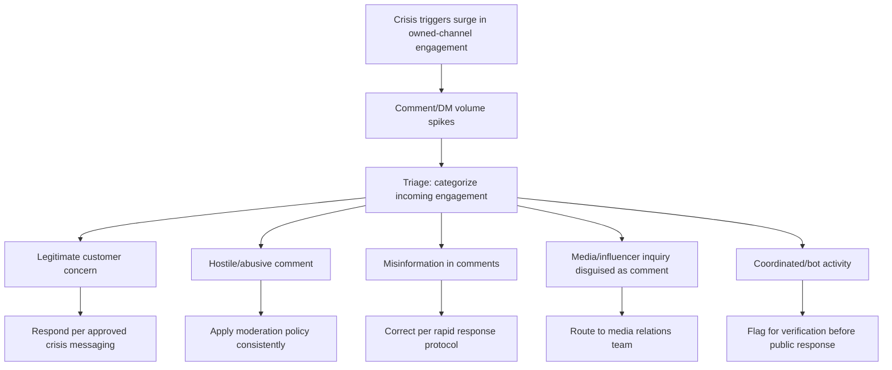
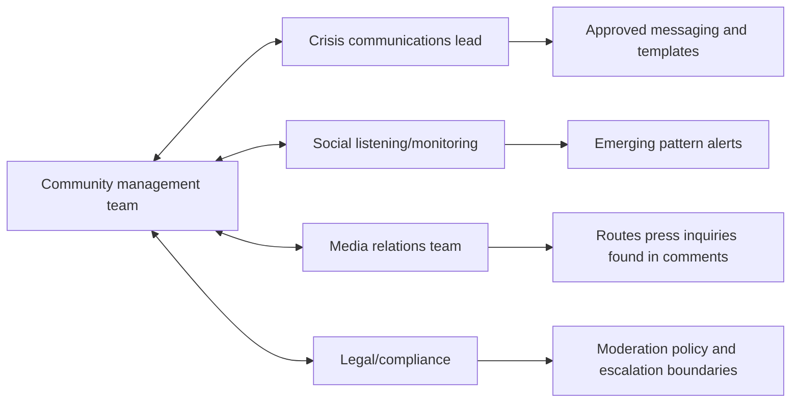

## Community Management During an Active Crisis

### Overview

Community management during an active crisis refers to the ongoing, direct engagement with an organization's own owned-channel audience — comments, replies, direct messages, and community spaces the organization controls or moderates — as distinct from broader media relations or platform-wide misinformation response. This function sits at the frontline interface between the organization and its most engaged audience segment during a crisis: customers, followers, employees, and other stakeholders who comment directly on the organization's own posts or reach out via owned channels. It requires distinct operational protocols from general crisis messaging because it is high-volume, highly visible, and often the first place the public sees how an organization treats individuals during a crisis, one comment or reply at a time.

### Distinguishing Community Management From Adjacent Functions

**Key Points**

- Community management concerns direct, often one-to-one or one-to-few interactions (replying to a comment, responding to a DM) on owned channels, whereas broader crisis communications concerns one-to-many public statements, and social listening (see *Real-Time Social Listening and Monitoring*) concerns detection and measurement rather than direct engagement.
- [Inference] Because community management interactions are visible to other observers reading the same comment thread, each individual reply functions simultaneously as a private response to one person and a public demonstration to everyone else reading the thread of how the organization treats people during the crisis — this dual audience should inform tone and consistency even in what may feel like a one-to-one exchange.
- Community managers are frequently the first organizational responders to see emerging complaint patterns or misinformation in real time, making close coordination with the social listening/monitoring function and the broader crisis communications team essential rather than optional.

### Core Operational Challenges During an Active Crisis

### Volume Surge and Triage

**Key Points**

- Comment and message volume on owned channels frequently increases sharply during an active crisis, often exceeding normal staffing capacity; a pre-established surge staffing plan (additional trained personnel, extended hours, or a temporary escalation protocol) should be activated rather than attempting to absorb the volume with routine day-to-day staffing.
- Triage incoming engagement into categories requiring different response paths: legitimate customer/stakeholder concerns, hostile or abusive comments, misinformation appearing in the comment section itself, media or influencer inquiries submitted informally through comments/DMs rather than official channels, and potential coordinated or automated activity.
- [Inference] Treating all incoming engagement with an identical response protocol during high-volume crisis periods is generally inefficient and can result in slower response to genuinely urgent legitimate concerns because response capacity is consumed by lower-priority or bad-faith engagement — triage prioritization is a practical necessity, not merely an efficiency preference.

### Responding to Legitimate Concerns

**Key Points**

- Individual responses to legitimate customer or stakeholder concerns should be consistent with the organization's approved crisis messaging (see the core message architecture from *Preparing for and Running Press Conferences*) while still reading as genuinely responsive to the specific concern raised, not a copy-pasted generic reply.
- [Inference] A visibly identical, copy-pasted response repeated across many different individual comments is frequently perceived as dismissive or inauthentic even when the underlying information is accurate, and can itself become a secondary complaint ("they're just copy-pasting the same non-answer") — response templates are useful as a starting structure but generally benefit from light individualization referencing the specific concern raised.
- Where an individual's concern requires case-specific resolution (a specific order, incident, or personal impact) rather than general crisis information, move the conversation to a private channel (DM, dedicated support line) promptly rather than attempting to resolve individual case details in a public comment thread, while still providing an initial public acknowledgment so other observers see the concern was not ignored.
- **Example**
  > Public reply: "We're sorry to hear this affected you directly — we'd like to look into your specific situation. Could you send us a DM with [relevant details] so we can help directly?"

### Moderation Policy and Hostile/Abusive Engagement

**Key Points**

- Apply a pre-established, consistently enforced moderation policy distinguishing between legitimate (even angry or highly critical) expression, which should generally remain visible and be engaged with respectfully, versus content that violates platform policy or the organization's stated community guidelines (harassment, threats, hate speech, spam), which can be moderated per policy.
- [Inference] Removing or hiding comments simply because they are critical of the organization, as opposed to violating an actual conduct policy, is a practice that — if discovered or suspected by the community — tends to generate a distinct secondary controversy about censorship or suppression, often more damaging than the original critical comments themselves; moderation decisions should be defensible against an explicit, consistently applied policy rather than based on whether a comment is unfavorable.
- Document moderation actions taken during a crisis (what was removed/hidden, under which specific policy provision, when) to maintain an internal record defensible if moderation decisions are later questioned publicly or by media.
- Maintain consistent moderation standards across all posts and comment threads during the crisis; inconsistent enforcement (removing a comment on one post but leaving a similar comment on another) is a common source of perceived unfairness or bias claims.

### Identifying Misinformation and Media Inquiries Within Comments

**Key Points**

- Comment sections on the organization's own posts are a common location for both organic misinformation to spread (see *Viral Misinformation and Rapid Response Protocols*) and for genuine media/influencer inquiries to arrive informally, mixed in with general public comments — both require identification and routing distinct from standard customer-service replies.
- Misinformation appearing within the organization's own comment threads should be corrected using the same verified, rapid-response approach applied elsewhere (see *Viral Misinformation and Rapid Response Protocols*), since an inaccurate claim left uncorrected in the organization's own comment section can be misread by other readers as tacit confirmation.
- Journalists and influential accounts sometimes post questions or requests for comment directly in public comment threads rather than through formal media channels; community management staff should be trained to recognize this and route it promptly to the media relations team (see *Managing Journalist Relationships Under Pressure*) rather than responding with a standard customer-service reply, which is generally an inadequate response to a press inquiry.

### Coordinated and Automated Activity

**Key Points**

- During high-visibility crises, comment sections can attract coordinated posting campaigns or automated/bot activity in addition to organic engagement; distinguishing these from genuine public sentiment is important before drawing conclusions about the scale or nature of public reaction.
- [Unverified] Reliably distinguishing coordinated/automated activity from organic engagement using automated detection tools alone carries a meaningful error rate, and any public organizational claim that criticism is "coordinated" or "not genuine" carries independent reputational risk if incorrect or if it appears to dismiss legitimate criticism as inauthentic — such claims generally warrant analyst-level verification and cautious, specific phrasing rather than broad public assertions.
- Standard practice is to apply platform moderation tools (reporting, blocking per policy) to clearly automated/spam activity through normal channels, without making public claims about the nature or source of the activity unless verified with confidence and where making such a claim serves a clear communications purpose.

### Internal Coordination During Active Community Management

- Community management staff need real-time access to the same approved core messages and fact updates used elsewhere in the crisis response, and any change to approved messaging should be communicated to the community management team promptly to avoid outdated or inconsistent individual replies.
- Establish a clear escalation path for community managers encountering a situation outside their pre-authorized response scope (a legally sensitive question, a safety-critical concern, a high-profile individual's comment) so it reaches the appropriate specialist quickly rather than receiving an improvised reply.
- [Inference] Community management staff are frequently the first to observe a shift in sentiment, an emerging specific complaint pattern, or the earliest indication that a piece of misinformation is gaining traction, given their direct, continuous exposure to owned-channel engagement — a structured, low-friction channel for community managers to flag emerging patterns to the crisis team supports earlier detection than monitoring tools alone might provide.

### Tone and Consistency Considerations

**Key Points**

- Maintain a calm, respectful, non-defensive tone across all individual replies regardless of how hostile or repetitive specific comments become; visible frustration or a curt reply to one commenter is often screenshotted and can circulate independently of the original crisis context.
- [Inference] A single visibly dismissive, sarcastic, or curt reply from an official account during a crisis carries disproportionate risk relative to its apparent size, since such replies are easily screenshotted and can themselves become a standalone secondary story, independent of and sometimes overshadowing the underlying crisis facts.
- Empathy expressed in individual replies should be specific to the situation described, not a generic phrase repeated identically across many different comments, to avoid the same authenticity concern noted above regarding copy-pasted responses.

### Pre-Crisis Preparation

**Key Points**

- Establish a surge staffing plan (additional pre-trained personnel, defined escalation triggers for activating it) before a crisis, so capacity does not have to be assembled ad hoc during a live volume spike.
- Draft a clear, specific moderation policy in advance (what specifically constitutes a removable violation versus permissible criticism) and train community management staff on consistent application before a crisis, rather than making case-by-case judgment calls under pressure.
- Pre-approve a flexible response template library covering anticipated common concern categories, structured to allow light individualization rather than verbatim copy-paste repetition.
- Establish the internal coordination and escalation pathways (to crisis communications, media relations, legal) before a crisis, so community managers know exactly where to route edge cases in real time.

### Common Failure Modes

- **Insufficient surge staffing**, leading to slow response times during peak volume, which is itself frequently read as organizational indifference.
- **Identical copy-pasted replies** across many individual comments, perceived as inauthentic or dismissive despite accurate underlying content.
- **Inconsistent moderation enforcement**, removing similar comments on some posts but not others, generating perceived bias or unfairness claims.
- **Moderating comments based on unfavorable tone rather than actual policy violation**, risking a distinct censorship-perception controversy.
- **Treating a press inquiry posted informally in a comment thread as a standard customer question**, resulting in an inadequate or delayed media response.
- **Visible defensiveness or a single curt/dismissive reply**, which can be screenshotted and become a standalone secondary story.
- **Making public claims of "coordinated" or "bot" activity without adequate verification**, risking both factual error and the appearance of dismissing genuine criticism.
- **Community management team working from outdated messaging** due to insufficient real-time coordination with the broader crisis communications team.

### Illustration: Comment Triage Priority Flow

<svg xmlns="http://www.w3.org/2000/svg" viewBox="0 0 880 300">
<text x="440" y="28" font-size="18" font-weight="bold" text-anchor="middle" fill="#1a1a1a">Comment Triage Priority Flow (svg_diagram)</text>
<rect x="360" y="50" width="160" height="45" rx="6" fill="#2980b9" />
<text x="440" y="78" font-size="12" text-anchor="middle" fill="#fff">Incoming comment</text>
<line x1="440" y1="95" x2="440" y2="120" stroke="#333" stroke-width="2" />
<rect x="60" y="120" width="160" height="50" rx="6" fill="#c0392b" />
<text x="140" y="142" font-size="11" text-anchor="middle" fill="#fff">Safety-critical /</text>
<text x="140" y="157" font-size="11" text-anchor="middle" fill="#fff">urgent concern</text>
<rect x="250" y="120" width="160" height="50" rx="6" fill="#e67e22" />
<text x="330" y="142" font-size="11" text-anchor="middle" fill="#fff">Legitimate</text>
<text x="330" y="157" font-size="11" text-anchor="middle" fill="#fff">customer concern</text>
<rect x="440" y="120" width="160" height="50" rx="6" fill="#f1c40f" />
<text x="520" y="142" font-size="11" text-anchor="middle" fill="#1a1a1a">Misinformation</text>
<text x="520" y="157" font-size="11" text-anchor="middle" fill="#1a1a1a">in thread</text>
<rect x="630" y="120" width="110" height="50" rx="6" fill="#8e44ad" />
<text x="685" y="142" font-size="11" text-anchor="middle" fill="#fff">Press inquiry</text>
<text x="685" y="157" font-size="11" text-anchor="middle" fill="#fff">in comments</text>
<line x1="380" y1="95" x2="140" y2="115" stroke="#333" stroke-width="1.5" />
<line x1="410" y1="95" x2="330" y2="115" stroke="#333" stroke-width="1.5" />
<line x1="460" y1="95" x2="520" y2="115" stroke="#333" stroke-width="1.5" />
<line x1="500" y1="95" x2="685" y2="115" stroke="#333" stroke-width="1.5" />
<rect x="60" y="210" width="160" height="45" rx="6" fill="#27ae60" />
<text x="140" y="237" font-size="11" text-anchor="middle" fill="#fff">Immediate escalation</text>
<rect x="250" y="210" width="160" height="45" rx="6" fill="#27ae60" />
<text x="330" y="232" font-size="11" text-anchor="middle" fill="#fff">Personalized reply,</text>
<text x="330" y="247" font-size="11" text-anchor="middle" fill="#fff">move to DM if needed</text>
<rect x="440" y="210" width="160" height="45" rx="6" fill="#27ae60" />
<text x="520" y="232" font-size="11" text-anchor="middle" fill="#fff">Apply rapid-response</text>
<text x="520" y="247" font-size="11" text-anchor="middle" fill="#fff">correction protocol</text>
<rect x="630" y="210" width="110" height="45" rx="6" fill="#27ae60" />
<text x="685" y="237" font-size="11" text-anchor="middle" fill="#fff">Route to media relations</text>
<line x1="140" y1="170" x2="140" y2="205" stroke="#333" stroke-width="1.5" />
<line x1="330" y1="170" x2="330" y2="205" stroke="#333" stroke-width="1.5" />
<line x1="520" y1="170" x2="520" y2="205" stroke="#333" stroke-width="1.5" />
<line x1="685" y1="170" x2="685" y2="205" stroke="#333" stroke-width="1.5" />
</svg>

**Related Topics**

- Real-time social listening and monitoring (cross-reference)
- Viral misinformation and rapid response protocols (cross-reference)
- Managing journalist relationships under pressure (cross-reference)
- Moderation policy design and consistent enforcement documentation
- Surge staffing and crisis-period customer service planning
- Screenshot risk and individual-reply tone guidelines
- Identifying coordinated inauthentic activity versus organic criticism