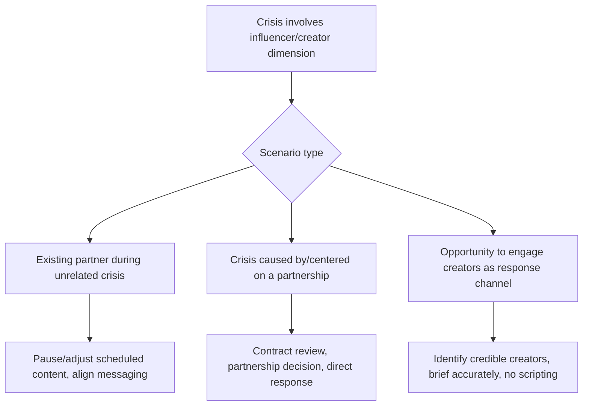

## Working with Influencers and Creators in Crisis

### Overview

Working with influencers and creators in crisis concerns two related but distinct scenarios: (1) an organization's existing influencer/creator partnerships during a crisis unrelated to or caused by that partnership, requiring coordination, contract review, and messaging alignment; and (2) engaging independent creators as a communications channel during a crisis, where a creator's own credibility with their audience can help convey accurate information more effectively than an official corporate channel alone. A third, adjacent scenario — a crisis caused by or centered on an influencer/creator relationship itself (a partner's misconduct, a botched sponsored post) — draws on both areas and is addressed separately below.

### Core Scenario Types

### Existing Partnerships During an Unrelated Crisis

**Key Points**

- When a crisis breaks that is unrelated to a specific influencer/creator partnership, review all scheduled sponsored content for tonal appropriateness before it publishes — a lighthearted or unrelated sponsored post going out during a serious organizational crisis can appear tone-deaf and generate its own secondary criticism, independent of the crisis's substance.
- [Inference] Automated or pre-scheduled sponsored content that continues publishing on its normal schedule during an active crisis is a recurring, avoidable source of secondary reputational damage, since audiences frequently interpret unchanged routine promotional content during a visible crisis as organizational indifference — pausing or rescheduling planned creator content is a standard early step in crisis response protocol, not merely a precaution.
- Communicate proactively and promptly with active partners about the crisis and any resulting changes to campaign timing, messaging constraints, or talking points, rather than leaving partners to learn about the crisis independently and improvise their own response regarding the partnership.
- Partners may face their own audience questions about the partnership in light of the crisis; providing them with accurate, approved information (within the bounds of what can be shared per legal guidance) helps prevent a partner from speculating publicly or providing inaccurate information to their own audience.

### Crises Caused By or Centered On a Partnership

**Key Points**

- When the crisis originates from the partnership itself (a partner's personal misconduct becomes public, a sponsored post is factually inaccurate or offensive, a partner breaches contract terms), the organization typically needs to make a relatively fast public decision regarding the status of the partnership, since prolonged public silence about an active, visible partnership during a related controversy is often read as tacit continued endorsement.
- Review the partnership contract promptly for relevant terms: morality/conduct clauses, termination rights, required approval processes for partner content, and any provisions governing public statements about the partnership — legal counsel should be involved early given the contractual and potential liability dimensions.
- [Inference] The range of appropriate organizational responses to partner-related controversy is broad and situation-dependent — from continued support (if allegations are unsubstantiated or the conduct is unrelated and non-severe) to immediate termination and public statement (for severe, substantiated misconduct) — and the appropriate response generally depends on severity, substantiation, and relevance to the partnership's purpose rather than a single default response applying uniformly across all cases.
- If a sponsored/partnered post itself is the source of the problem (factual inaccuracy, insensitive content, non-disclosure violations), immediate corrective action (content removal or correction, clear disclosure remediation) is typically warranted regardless of the partnership's future status, since the content-level problem and the relationship-level decision are separable issues requiring separate, prompt handling.
- Any public statement addressing the partnership status should be reviewed against the same core crisis-message architecture used elsewhere (acknowledgment, action, accountability — see *Preparing for and Running Press Conferences*) rather than treated as a separate, ad hoc communications track.

### Engaging Creators as a Crisis Response Channel

**Key Points**

- In some circumstances, a credible independent creator or influencer already trusted by a specific audience segment can convey accurate crisis-related information more effectively to that segment than an official corporate statement alone, particularly for audiences that are skeptical of or disengaged from traditional corporate communications.
- [Inference] A creator's effectiveness as a crisis-communications channel is generally contingent on their perceived independence and authenticity with their audience; audiences that detect a creator is delivering an obviously scripted, corporate-controlled message during a sensitive crisis may react with increased skepticism toward both the creator and the organization, potentially undermining the credibility benefit the engagement was intended to provide.
- Provide creators with accurate factual briefing materials and clear boundaries on what can and cannot be said (consistent with legal guidance), but generally avoid providing a fully scripted statement for the creator to read verbatim, since visible scripting can undermine the authenticity that made engaging the creator valuable in the first place.
- Disclosure requirements (compensation disclosure, material connection disclosure per applicable advertising/consumer-protection regulation) apply to crisis-related creator content in the same way they apply to standard sponsored content, and should not be waived or overlooked simply because the content addresses a crisis rather than a standard promotional topic.
- Selecting creators for crisis-related engagement should prioritize genuine subject-matter credibility and existing audience trust relevant to the specific crisis topic over reach/follower count alone, since a mismatched or purely reach-driven selection can appear opportunistic rather than substantively helpful.

### Monitoring Independent Creator Coverage

**Key Points**

- Independent creators (with no prior organizational relationship) frequently cover a crisis on their own initiative — explainer videos, reaction content, investigative-style coverage — and this should be tracked as part of the broader social listening function (see *Real-Time Social Listening and Monitoring*) rather than treated as outside the monitoring scope simply because it is not traditional press.
- [Inference] Independent creator coverage of a crisis, particularly from creators with substantial reach in a relevant niche, can shape audience understanding of the crisis at a scale comparable to traditional media coverage, and factually inaccurate independent creator content warrants the same rapid-response correction consideration as inaccurate content from any other source (see *Viral Misinformation and Rapid Response Protocols*), rather than being deprioritized simply because it did not originate from a traditional outlet.
- Direct outreach to an independent creator whose coverage contains a factual inaccuracy (providing accurate information, offering an interview or comment opportunity) is a reasonable and often effective response, analogous to a correction request sent to a traditional media outlet, while recognizing that independent creators may or may not have an established editorial correction process comparable to traditional newsrooms.
- Distinguish between independent creators offering substantive, good-faith coverage (who may be worth engaging directly and respectfully) versus those primarily seeking engagement/controversy for its own sake, where direct organizational engagement may be less productive and could inadvertently amplify low-quality content; this judgment should be made case by case rather than via a blanket policy in either direction.

### Contractual and Legal Considerations

**Key Points**

- Standard influencer/creator agreements should, where possible, include provisions anticipated to be relevant in a crisis scenario: conduct/morality clauses, crisis-related pause or rescheduling rights for scheduled content, required disclosure standards, and clear approval/review processes for content addressing sensitive topics.
- [Inference] Organizations without pre-existing crisis-relevant contract provisions in influencer agreements often find themselves with substantially less contractual flexibility to pause content, require message alignment, or terminate a partnership cleanly during an active crisis — reviewing and updating standard creator-partnership contract templates to anticipate crisis scenarios is a preventive measure best addressed before partnerships are signed, not during an active crisis.
- Legal counsel should review any crisis-related public statement concerning a specific named partner or partnership for defamation, contractual, and other liability considerations before publication, given the direct implication of a named third party.

### Common Failure Modes

- **Scheduled sponsored content continuing to publish unchanged during an active crisis**, appearing tone-deaf regardless of the crisis's relevance to the specific content.
- **Prolonged public silence regarding an active partnership during a related controversy**, read as tacit continued endorsement.
- **Providing a creator with an obviously scripted statement** for crisis-related content, undermining the authenticity that motivated the engagement.
- **Overlooking disclosure requirements** for crisis-related sponsored or compensated creator content.
- **Selecting creators for crisis engagement based primarily on reach** rather than genuine subject-matter credibility, appearing opportunistic.
- **No pre-existing contractual provisions** anticipating crisis scenarios, reducing flexibility to pause content or address a partner-related crisis cleanly when one arises.
- **Ignoring or deprioritizing independent creator coverage** in monitoring and correction efforts simply because it did not originate from traditional media.
- **Treating content-level correction and partnership-status decisions as a single bundled decision**, when they are generally separable issues each requiring prompt, distinct handling.

### Illustration: Influencer/Creator Crisis Decision Path

<svg xmlns="http://www.w3.org/2000/svg" viewBox="0 0 880 320">
<text x="440" y="28" font-size="18" font-weight="bold" text-anchor="middle" fill="#1a1a1a">Influencer/Creator Crisis Decision Path (svg_diagram)</text>
<rect x="340" y="50" width="200" height="45" rx="6" fill="#2980b9" />
<text x="440" y="78" font-size="12" text-anchor="middle" fill="#fff">Crisis has creator dimension</text>
<line x1="440" y1="95" x2="440" y2="120" stroke="#333" stroke-width="2" />
<rect x="60" y="120" width="220" height="50" rx="6" fill="#27ae60" />
<text x="170" y="142" font-size="11" text-anchor="middle" fill="#fff">Unrelated crisis,</text>
<text x="170" y="157" font-size="11" text-anchor="middle" fill="#fff">existing partnership active</text>
<rect x="330" y="120" width="220" height="50" rx="6" fill="#c0392b" />
<text x="440" y="142" font-size="11" text-anchor="middle" fill="#fff">Crisis originates from</text>
<text x="440" y="157" font-size="11" text-anchor="middle" fill="#fff">the partnership itself</text>
<rect x="600" y="120" width="220" height="50" rx="6" fill="#f1c40f" />
<text x="710" y="142" font-size="11" text-anchor="middle" fill="#1a1a1a">Opportunity to engage</text>
<text x="710" y="157" font-size="11" text-anchor="middle" fill="#1a1a1a">creator as response channel</text>
<line x1="380" y1="95" x2="170" y2="115" stroke="#333" stroke-width="1.5" />
<line x1="420" y1="95" x2="440" y2="115" stroke="#333" stroke-width="1.5" />
<line x1="480" y1="95" x2="710" y2="115" stroke="#333" stroke-width="1.5" />
<rect x="60" y="210" width="220" height="55" rx="6" fill="#ecf0f1" />
<text x="170" y="232" font-size="11" text-anchor="middle" fill="#1a1a1a">Pause/review scheduled</text>
<text x="170" y="247" font-size="11" text-anchor="middle" fill="#1a1a1a">content; brief partner</text>
<text x="170" y="262" font-size="11" text-anchor="middle" fill="#1a1a1a">on approved facts</text>
<rect x="330" y="210" width="220" height="55" rx="6" fill="#ecf0f1" />
<text x="440" y="232" font-size="11" text-anchor="middle" fill="#1a1a1a">Legal contract review;</text>
<text x="440" y="247" font-size="11" text-anchor="middle" fill="#1a1a1a">decide partnership status;</text>
<text x="440" y="262" font-size="11" text-anchor="middle" fill="#1a1a1a">correct content if needed</text>
<rect x="600" y="210" width="220" height="55" rx="6" fill="#ecf0f1" />
<text x="710" y="232" font-size="11" text-anchor="middle" fill="#1a1a1a">Select for credibility, not</text>
<text x="710" y="247" font-size="11" text-anchor="middle" fill="#1a1a1a">just reach; brief, don't</text>
<text x="710" y="262" font-size="11" text-anchor="middle" fill="#1a1a1a">script; ensure disclosure</text>
<line x1="170" y1="170" x2="170" y2="205" stroke="#333" stroke-width="1.5" />
<line x1="440" y1="170" x2="440" y2="205" stroke="#333" stroke-width="1.5" />
<line x1="710" y1="170" x2="710" y2="205" stroke="#333" stroke-width="1.5" />
</svg>

**Related Topics**

- Real-time social listening and monitoring (cross-reference)
- Viral misinformation and rapid response protocols (cross-reference)
- Community management during an active crisis (cross-reference)
- Influencer/creator contract clause design for crisis scenarios
- Disclosure and advertising-regulation compliance for sponsored crisis content
- Distinguishing good-faith independent creator coverage from engagement-seeking content
- Partnership termination decision frameworks for partner-related misconduct