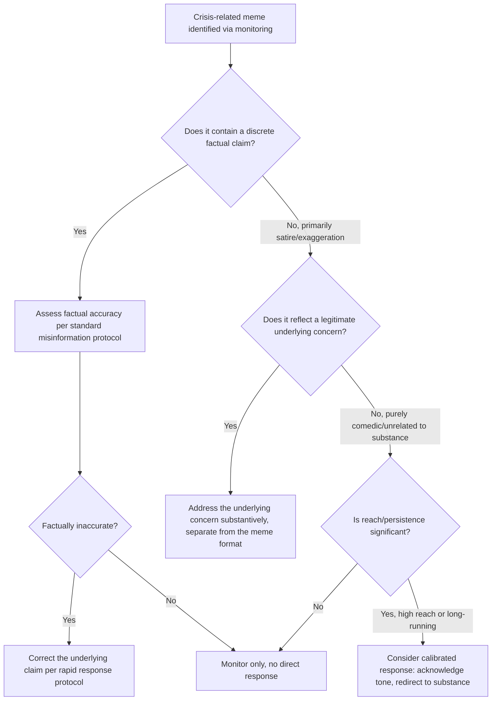

## Meme Culture and Crisis Amplification

### Overview

Meme culture and crisis amplification concerns how humor, irony, remixable image/video formats, and participatory internet culture can accelerate, reshape, or trivialize a crisis narrative in ways distinct from conventional text-based misinformation or criticism. Memes spread through mechanisms — format remixability, humor-driven shareability, ironic distancing, and rapid mutation — that differ structurally from both traditional news coverage and straightforward factual misinformation, and therefore require a distinct assessment and response approach rather than the standard rapid-response correction playbook applied unmodified.

### Why Memes Behave Differently From Standard Misinformation

**Key Points**

- A meme is often not making a strict factual claim in the way a misinformation post typically does; it may exaggerate, satirize, or reframe a real event for comedic or rhetorical effect, meaning a standard "this is factually inaccurate, here is the correction" response can be a poor fit or can itself appear humorless and out of touch.
- [Inference] Because meme formats are designed for rapid remixing (a template, a reaction image, a short audio clip applied to new contexts), a single viral meme about an organization's crisis can generate a large number of derivative variations faster than any single correction or response could plausibly address each instance individually — response strategy for memes generally needs to target the underlying narrative or format rather than attempting to counter each individual instance.
- Humor and irony can make a meme more memorable and more widely shared than a straightforward critical statement covering the same underlying concern, meaning a memed version of a criticism can reach and stick with a much broader audience than the original, more literal criticism or news coverage.
- [Inference] Attempting to respond to a meme with the same tone and format used for factual misinformation correction (formal, corrective, humorless) frequently reads as tone-deaf to the audience engaging with the meme, and can itself become fodder for further meme derivatives mocking the organization's response — tone-matching (without becoming dismissive of the underlying substance) is a distinct strategic consideration specific to this format.

### Assessing Whether a Meme Warrants Response

- Distinguish whether the meme contains an embedded factual claim (which can be evaluated for accuracy) versus whether it is primarily exaggeration, humor, or reframing without a discrete factual assertion to correct — these warrant different assessment paths.
- Even where a meme is not making a strict factual claim, it may still be amplifying or crystallizing a legitimate underlying concern in comedic form; the appropriate response in that case is generally to address the underlying substantive concern directly, rather than treating the meme itself as the problem to be corrected.
- Reach and persistence matter: a meme with limited spread or a short lifespan often does not warrant direct organizational engagement, since responding can inadvertently extend its lifespan or reach (an amplification risk analogous to responding to low-visibility misinformation, discussed in *Viral Misinformation and Rapid Response Protocols*).

### When a Meme Reflects Legitimate Underlying Criticism

**Key Points**

- A common pattern is a meme format crystallizing and popularizing a genuine, substantive criticism in a more memorable and widely shared form than the original literal complaint or news coverage.
- [Inference] Dismissing or attempting to suppress a meme that has crystallized a legitimate underlying concern, without addressing the substantive issue itself, is generally ineffective and can appear to confirm the meme's framing, since the organization would be seen as more concerned with the format of the criticism than its substance.
- The appropriate response in this scenario generally addresses the underlying substantive concern through standard crisis communications channels (see the core message architecture in *Preparing for and Running Press Conferences*), separate from any specific engagement with the meme format itself.

### When a Meme Is Primarily Comedic Without Substantive Claim

**Key Points**

- Some crisis-adjacent memes are primarily reactive humor with limited or no substantive claim about the organization, functioning more as commentary on the general absurdity or notability of the situation than as criticism requiring a factual or substantive response.
- [Inference] Organizations that respond defensively or with visible irritation to primarily comedic, low-substance meme content risk a disproportionate reaction relative to the actual reputational stakes involved, and a defensive response to humor is frequently perceived as thin-skinned, which can generate more negative attention than the original meme would have on its own.
- In select cases, and only where organizationally appropriate to brand voice and crisis severity, acknowledging a purely comedic meme with measured, self-aware humor (rather than corporate humor that reads as forced) can be effective at defusing rather than amplifying attention — but this approach carries meaningful risk if miscalibrated, and is generally inappropriate for crises involving genuine harm, safety concerns, or significant severity, where a humorous response would likely be read as inappropriate regardless of the meme's own tone.

### Risk of Direct Engagement

**Key Points**

- Directly engaging with (replying to, quote-posting, or attempting to counter) a specific viral meme carries a meaningful risk of amplifying its reach to audiences who had not yet encountered it, an amplification risk that should be weighed explicitly before choosing to engage rather than monitor.
- [Inference] Organizational engagement with a meme is generally more defensible and lower-risk when it substantively addresses an underlying concern the meme reflects, rather than attempting to directly counter, mock, or dismiss the meme itself, since the latter risks appearing thin-skinned or can inadvertently provide additional material for further derivative memes.
- Legal and brand-voice review should apply to any organizational content responding directly to meme culture in the same way it applies to any other public crisis communication, notwithstanding the informal tone such content may adopt — informal tone does not reduce the need for accuracy or appropriate review.

### Monitoring Considerations Specific to Meme Formats

**Key Points**

- Meme-format content can be harder to detect through standard keyword-based monitoring than text-based misinformation, since memes frequently rely on visual formats, indirect references, in-group terminology, or evolving templates that may not contain the organization's name or standard tracked keywords in text form.
- [Unverified] The specific technical capability of current social listening tools to reliably detect and track visual meme-format content (as opposed to text-based mentions) varies by vendor and tool, and should be verified against current tool documentation rather than assumed comprehensive, since meme detection (particularly of evolving visual templates and indirect references) is a more technically difficult monitoring problem than straightforward keyword or hashtag tracking.
- Human analyst review remains particularly important for meme-format content specifically, given the contextual, in-group, and rapidly evolving nature of meme references, which automated tools may be more prone to misclassify (missing genuine instances, or over-flagging benign unrelated content) compared to more straightforward text-based misinformation.

### Pre-Crisis Preparation

**Key Points**

- Establish a clear internal understanding, before a crisis, of the organization's brand-appropriate tone boundaries for meme-adjacent engagement (if any), so a decision about whether and how to engage does not have to be made from scratch under time pressure during a live event.
- [Inference] Organizations without any pre-established brand voice guidance specific to informal/meme-adjacent content are more likely to either miscalibrate a response (attempting humor inappropriate to their brand or the crisis's severity) or default to no engagement at all even in cases where a measured response might have been effective — having this guidance pre-established, even as a general principle rather than crisis-specific script, supports better real-time judgment.
- Coordinate meme-monitoring and response consideration with the broader social listening function (see *Real-Time Social Listening and Monitoring*) and community management function (see *Community Management During an Active Crisis*), since meme-format content often surfaces first in owned-channel comments or in niche communities before broader spread.

### Common Failure Modes

- **Applying the standard factual-correction playbook unmodified to non-factual, satirical meme content**, appearing tone-deaf or humorless to the audience engaging with it.
- **Direct engagement that amplifies reach** to audiences who had not yet encountered the meme, when monitoring-only would have been the lower-risk choice.
- **Dismissing a meme that reflects legitimate underlying criticism** without addressing the substantive concern, appearing to confirm the meme's framing.
- **Defensive or irritated response to primarily comedic content**, generating disproportionate secondary attention relative to the original meme's actual reach or severity.
- **Attempting humor inappropriate to crisis severity** (e.g., in cases involving genuine harm or safety concerns), which is generally read as seriously inappropriate regardless of the meme's own tone.
- **Under-detection via keyword-only monitoring**, missing meme-format spread that does not contain standard tracked text terms.
- **No pre-established brand voice guidance for informal content**, leading to inconsistent or poorly calibrated real-time judgment calls during an active crisis.

### Illustration: Meme Response Risk-Calibration Spectrum

<svg xmlns="http://www.w3.org/2000/svg" viewBox="0 0 880 260">
<text x="440" y="28" font-size="18" font-weight="bold" text-anchor="middle" fill="#1a1a1a">Meme Response Risk-Calibration Spectrum (svg_diagram)</text>
<line x1="60" y1="140" x2="820" y2="140" stroke="#888" stroke-width="3" />
<circle cx="130" cy="140" r="9" fill="#27ae60" />
<text x="130" y="100" font-size="12" font-weight="bold" text-anchor="middle" fill="#1a1a1a">Monitor only</text>
<text x="130" y="170" font-size="10" text-anchor="middle" fill="#555">Low reach, purely comedic</text>
<circle cx="330" cy="140" r="9" fill="#f1c40f" />
<text x="330" y="100" font-size="12" font-weight="bold" text-anchor="middle" fill="#1a1a1a">Address substance</text>
<text x="330" y="170" font-size="10" text-anchor="middle" fill="#555">Reflects real concern</text>
<circle cx="530" cy="140" r="9" fill="#e67e22" />
<text x="530" y="100" font-size="12" font-weight="bold" text-anchor="middle" fill="#1a1a1a">Correct claim</text>
<text x="530" y="170" font-size="10" text-anchor="middle" fill="#555">Contains factual assertion</text>
<circle cx="730" cy="140" r="9" fill="#c0392b" />
<text x="730" y="100" font-size="12" font-weight="bold" text-anchor="middle" fill="#1a1a1a">Avoid direct engagement</text>
<text x="730" y="170" font-size="10" text-anchor="middle" fill="#555">High severity / safety concern</text>

<text x="440" y="215" font-size="12" text-anchor="middle" fill="#555" font-style="italic">Response choice depends on claim type, underlying substance, and crisis severity — not a single default [Inference]</text>

</svg>

**Related Topics**

- Real-time social listening and monitoring (cross-reference)
- Viral misinformation and rapid response protocols (cross-reference)
- Community management during an active crisis (cross-reference)
- Brand voice guidelines for informal and humor-adjacent content
- Visual/meme-format detection capability in monitoring tools
- Distinguishing satire from factual misinformation for response purposes
- Amplification risk assessment before direct engagement with viral content