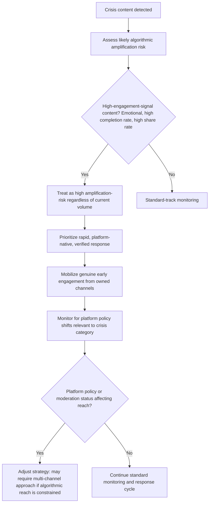

## Algorithmic Amplification and Platform Policy Impacts

### Overview

Algorithmic amplification and platform policy impacts concerns how automated content-ranking systems and platform-level policy decisions independently shape the scale, speed, and reach of a crisis — separate from anything the organization itself does. Unlike message strategy or community management, this dimension is largely outside organizational control: an organization cannot directly alter how a platform's recommendation system scores its content, but understanding the mechanics materially affects both monitoring priorities and response strategy, since the same crisis content can reach dramatically different audience sizes depending on how the platform's algorithm and policy apparatus responds to it.

### Core Mechanics of Algorithmic Amplification

**Key Points**

- As of 2026, major platforms have broadly shifted from follower-graph-based distribution (content primarily reaching a poster's existing followers) toward interest-graph/recommendation-based distribution, meaning content can reach large non-follower audiences based on predicted relevance and engagement rather than the poster's existing audience size — this materially changes crisis dynamics because even a low-follower account's crisis-related post can achieve large reach if the content scores well on ranking signals. [Unverified — general industry pattern; verify against current platform-specific documentation]
- Common ranking signal categories reported across major platforms include watch time/dwell time and completion rate, engagement velocity (how quickly content accumulates interaction after posting), "meaningful" engagement signals (comments, shares, saves, private shares/DMs) weighted more heavily than passive engagement (likes alone), and increasingly, broader satisfaction or intent signals inferred by machine-learning systems rather than raw engagement counts alone.
- [Inference] Crisis-related content often scores highly on multiple ranking signals simultaneously — high emotional engagement, high comment volume, high share rate, high completion rate for video — which can cause algorithmic systems to amplify crisis content at a rate disproportionate to what organic reach alone would produce, independent of the content's accuracy or the organization's own actions.
- An early engagement window (commonly cited as roughly the first hour after posting) appears to function as a significant signal in several platforms' ranking systems, training how broadly content is subsequently distributed — meaning the earliest reactions to a piece of crisis content (accurate or not) can disproportionately determine its ultimate reach. [Unverified — general pattern reported across industry sources; platform-specific mechanics vary and change over time]

### Amplification Risk for Organizational Response Content

**Key Points**

- The same amplification mechanics that can spread misinformation rapidly also apply to an organization's own corrective or crisis-response content; response content engineered for the specific platform's native format (rather than cross-posted, generic content) is more likely to achieve meaningful algorithmic reach.
- [Inference] Cross-posted content not adapted to platform-specific format norms (wrong aspect ratio, visible watermark from another platform, mismatched content structure) reportedly faces distribution penalties on several platforms relative to natively produced content, meaning a crisis response drafted once and cross-posted unmodified across platforms may achieve substantially lower algorithmic reach than the original crisis content it is attempting to counter, compounding the asymmetry between viral misinformation and organizational correction (see *Viral Misinformation and Rapid Response Protocols*).
- Given the reported significance of early engagement velocity in several platforms' ranking systems, mobilizing an initial wave of genuine engagement (not artificial/coordinated engagement, which typically violates platform policy and carries its own risk) in the first response window may meaningfully affect a correction's subsequent algorithmic distribution — this generally means having the correction ready to deploy the moment verification is complete, and ensuring it reaches existing engaged audiences (owned-channel subscribers, employees, partners) promptly to build genuine early engagement momentum.

### Platform Policy Decisions as an Independent Variable

**Key Points**

- Platform-level policy decisions — content moderation rule changes, fact-checking program structure, labeling systems, account-level enforcement actions — operate as a variable largely independent of any individual organization's crisis, but can materially affect how a specific crisis unfolds on that platform.
- Platforms have shown willingness to adjust policy rapidly in response to a specific fast-moving situation: for example, during the 2026 Iran war, X announced within days of the conflict's escalation that it would demonetise for 90 days any account sharing AI-generated images of armed conflict without disclosing that the images were artificially created, in direct response to a surge of viral AI-generated propaganda content — illustrating that platform policy can shift during a live event in ways relevant to monitoring and response strategy for any crisis with a comparable public-safety, safety-critical, or high-volume-misinformation dimension.
- Crowdsourced correction/fact-checking systems (Community Notes-style mechanisms, now used by both X and, in varying stages of rollout, Meta's platforms) are themselves subject to ongoing platform policy evolution — for instance, Meta's program has faced documented criticism over low publication rates and gaps in coverage for certain content types, and Meta's own Oversight Board has publicly cautioned against treating these crowdsourced systems as a full substitute for professional fact-checking, particularly in international contexts — meaning the reliability of platform-native correction tools should not be assumed constant and should be reassessed for the current state of each platform at the time of an active crisis (see *Platform-Specific Crisis Dynamics*).
- [Inference] Because platform moderation and fact-checking policy has been an area of substantial, sometimes rapid change across major platforms in recent years, crisis communications teams should treat platform policy specifics as requiring verification at the time of an active crisis rather than assumed static from prior experience with the same platform, given the documented pace of change in this specific area.

### Deprioritized and Suppressed Content Categories

**Key Points**

- Reported categories of content that major platforms' algorithms are described as deprioritizing include content flagged as spam or violating community guidelines, content a user has marked "not interested," and content classified as potentially harmful or sensitive, which several platforms describe as subject to stricter moderation and more limited organic distribution.
- [Inference] If an organization's own crisis-response content is automatically classified by a platform's moderation system as "sensitive" (due to crisis-related keywords, imagery, or topic classification), it risks reduced algorithmic distribution even when the content is accurate, policy-compliant, and intended as a legitimate correction — this is a structural risk worth accounting for when assessing why an owned-channel crisis response may be underperforming relative to the reach of the original crisis content, and may warrant using multiple response formats/channels rather than relying on a single post achieving broad reach.
- Community moderation-integrated platforms (where ranking incorporates community-specific moderation actions and norms, such as forum/subreddit-style platforms) present a distinct dynamic: content visibility depends partly on community-specific moderator and member behavior in addition to platform-wide algorithmic signals, meaning organizational engagement strategy on these platforms needs to account for community-specific norms and moderation culture separately from platform-wide algorithmic mechanics (see *Platform-Specific Crisis Dynamics*).

### Practical Implications for Crisis Strategy

- Because algorithmic reach can differ substantially from raw follower count or initial post visibility, monitoring should track reach and velocity trends directly (see *Real-Time Social Listening and Monitoring*) rather than relying on assumptions about how far content "should" spread based on the poster's apparent profile size.
- Response content should be produced natively for each platform's specific format norms rather than cross-posted unmodified, given the reported distribution penalties associated with non-native content on several platforms.
- Do not assume a platform's crowdsourced correction tool (Community Notes-style features) will reliably and promptly counter viral crisis misinformation; treat platform-native correction as a supplement to, not a substitute for, direct organizational rapid response (see *Viral Misinformation and Rapid Response Protocols*).
- Build a light-touch practice of monitoring platform policy announcements and enforcement actions relevant to the organization's industry or crisis category during an active crisis, since a platform policy shift can materially change the effective landscape mid-crisis.

### Common Failure Modes

- **Assuming reach correlates with follower count**, missing that interest-graph/recommendation-based distribution can give low-follower crisis content outsized reach independent of the poster's audience size.
- **Cross-posting unmodified content across platforms**, incurring distribution penalties relative to natively formatted content and underperforming the original crisis content it is meant to counter.
- **Delayed response missing the early engagement window**, given the reported significance of early engagement velocity in several platforms' ranking systems.
- **Assuming platform-native correction tools (Community Notes-style features) are a reliable primary defense**, when available evidence suggests variable and sometimes low effectiveness, particularly during the earliest, most-viral phase of spread.
- **Assuming platform moderation policy is static**, missing a policy shift that materially affects reach or classification of crisis-related content mid-event.
- **Not accounting for potential "sensitive content" deprioritization** of the organization's own legitimate crisis-response content, leading to an underestimate of the multi-channel effort required to achieve adequate reach.
- **Applying a single platform's dynamics uniformly across all platforms**, when ranking signals, moderation structures, and community-integration mechanics vary meaningfully by platform (see *Platform-Specific Crisis Dynamics*).

### Illustration: Algorithmic Amplification Feedback Loop

<svg xmlns="http://www.w3.org/2000/svg" viewBox="0 0 880 320">
<text x="440" y="28" font-size="18" font-weight="bold" text-anchor="middle" fill="#1a1a1a">Algorithmic Amplification Feedback Loop (svg_diagram)</text>
<circle cx="440" cy="170" r="130" fill="none" stroke="#888" stroke-width="1.5" stroke-dasharray="4,3" />
<rect x="360" y="55" width="160" height="45" rx="6" fill="#2980b9" />
<text x="440" y="83" font-size="11" text-anchor="middle" fill="#fff">Content posted</text>
<rect x="560" y="130" width="160" height="45" rx="6" fill="#e67e22" />
<text x="640" y="150" font-size="11" text-anchor="middle" fill="#fff">Early engagement</text>
<text x="640" y="165" font-size="11" text-anchor="middle" fill="#fff">signals measured</text>
<rect x="360" y="270" width="160" height="45" rx="6" fill="#f1c40f" />
<text x="440" y="290" font-size="11" text-anchor="middle" fill="#1a1a1a">Ranking layer</text>
<text x="440" y="305" font-size="11" text-anchor="middle" fill="#1a1a1a">scores content</text>
<rect x="160" y="130" width="160" height="45" rx="6" fill="#27ae60" />
<text x="240" y="150" font-size="11" text-anchor="middle" fill="#fff">Broader distribution</text>
<text x="240" y="165" font-size="11" text-anchor="middle" fill="#fff">to non-followers</text>
<path d="M480,95 Q560,105 610,128" fill="none" stroke="#333" stroke-width="1.5" marker-end="url(#arrow2)" />
<path d="M640,175 Q560,240 480,268" fill="none" stroke="#333" stroke-width="1.5" marker-end="url(#arrow2)" />
<path d="M400,270 Q300,220 250,178" fill="none" stroke="#333" stroke-width="1.5" marker-end="url(#arrow2)" />
<path d="M240,128 Q320,90 400,90" fill="none" stroke="#333" stroke-width="1.5" marker-end="url(#arrow2)" />
<text x="440" y="305" font-size="0" fill="none" />

<text x="440" y="55" font-size="0" fill="none" />

<text x="440" y="300" font-size="0" fill="none" />

<text x="440" y="300" font-size="0" fill="none" />

<text x="440" y="300" font-size="0" />

<text x="440" y="300" font-size="0" fill="transparent" />

<text x="440" y="300" fill="transparent" font-size="0">.</text>

<text x="440" y="0" font-size="0" />

<text x="440" y="300" font-size="0" />

<text x="440" y="0" font-size="0" />

<text x="440" y="0" font-size="0" />

<text x="440" y="0" font-size="0" />

<text x="440" y="0" font-size="0" />

<text x="440" y="0" font-size="0" />

<text x="440" y="0" font-size="0" />

<text x="440" y="0" font-size="0" />

<text x="440" y="345" font-size="12" text-anchor="middle" fill="#555" font-style="italic">Broader distribution generates further engagement, reinforcing the loop — mechanics vary by platform and change over time</text>

</svg>

**Related Topics**

- Platform-specific crisis dynamics (cross-reference)
- Real-time social listening and monitoring: reach and velocity tracking (cross-reference)
- Viral misinformation and rapid response protocols (cross-reference)
- Native content production workflows for multi-platform crisis response
- Monitoring platform policy announcements during active crises
- Content classification and "sensitive content" deprioritization risk for owned-channel crisis response
- Community-integrated moderation dynamics on forum-style platforms