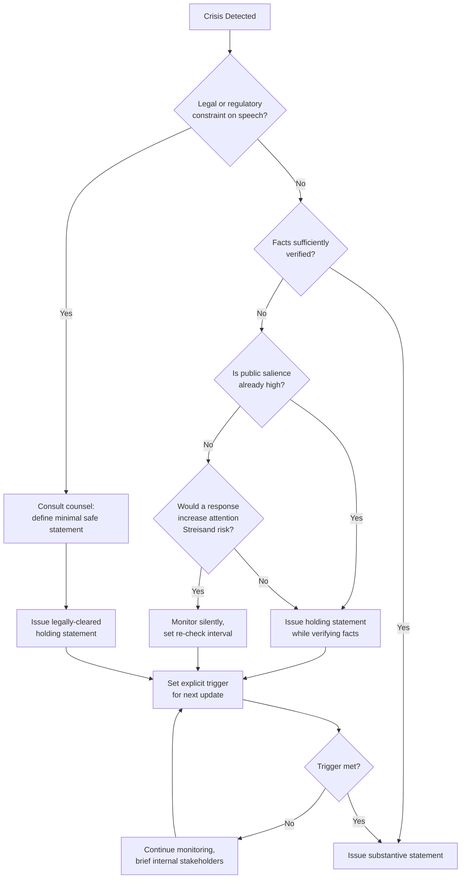

## The Strategic Silence Approach and Its Risks

### Definition and Conceptual Foundation

Strategic silence is a deliberate crisis response posture in which an organization consciously withholds public comment, delays statements, or minimizes communication output during an unfolding crisis, as a chosen strategy rather than as an oversight or resourcing failure. It is distinct from "no comment," which is typically a reflexive, unplanned refusal that signals evasiveness. Strategic silence, properly executed, is a calculated decision grounded in legal, factual, or reputational reasoning, usually accompanied by internal justification and a defined re-engagement trigger.

**Key Points**

- Silence is a communication choice, not an absence of one; audiences interpret silence as a message in itself.
- The strategy assumes that speaking prematurely carries greater risk than the reputational cost of appearing unresponsive.
- It requires active internal management (legal review, fact-gathering, monitoring) even though external output is minimal.
- It is time-bound by design — indefinite silence collapses into the "stonewalling" failure mode described below.

### When Strategic Silence Is Typically Considered

- **Active legal proceedings or litigation risk**: Counsel advises against public statements that could constitute admissions of liability or prejudice a case.
- **Incomplete or unverified facts**: The organization does not yet have a reliable account of what happened (common in industrial accidents, cybersecurity breaches, or multi-party incidents).
- **Ongoing law enforcement or regulatory investigation**: Authorities may explicitly request that the organization not comment publicly.
- **Third-party-controlled situations**: The organization is not the primary actor (e.g., a partner, vendor, or employee is the direct cause) and speaking first could overstep or misstate facts owned by another party.
- **De-escalation of a low-salience event**: Some minor issues generate more attention from a corporate response than they would if left alone — the "Streisand effect" risk.

### The Streisand Effect as a Counter-Consideration

$$P(\text{amplification}) \propto \frac{1}{S} \times V$$

Where $S$ represents the initial salience of the issue and $V$ represents the perceived value of an organizational reaction (i.e., low-salience issues are disproportionately amplified by a visible response). This is a heuristic framing, not a validated statistical model — [Inference] the relationship is directional and illustrative, not empirically quantified in crisis communication literature.

This dynamic is the primary argument *for* silence on minor issues, and it is frequently in direct tension with the arguments *against* silence on major issues, which is the core strategic tension this topic addresses.

### The Core Risk Framework: Why Silence Fails

<svg xmlns="http://www.w3.org/2000/svg" viewBox="0 0 900 460">
<text x="450" y="30" text-anchor="middle" font-size="18" font-weight="bold" fill="#1a1a1a">Strategic Silence: Risk Escalation Timeline (svg_diagram)</text>
<line x1="60" y1="80" x2="860" y2="80" stroke="#333" stroke-width="2" />
<polygon points="860,80 848,74 848,86" fill="#333" />
<text x="860" y="100" text-anchor="end" font-size="12" fill="#555">Time →</text>
<circle cx="100" cy="80" r="6" fill="#2b6cb0" />
<text x="100" y="130" text-anchor="middle" font-size="12" font-weight="bold">T+0</text>
<text x="100" y="146" text-anchor="middle" font-size="11">Incident occurs</text>
<circle cx="260" cy="80" r="6" fill="#2b6cb0" />
<text x="260" y="130" text-anchor="middle" font-size="12" font-weight="bold">T+1-6h</text>
<text x="260" y="146" text-anchor="middle" font-size="11">Silence acceptable</text>
<text x="260" y="160" text-anchor="middle" font-size="10" fill="#555">(fact-gathering window)</text>
<circle cx="440" cy="80" r="6" fill="#dd6b20" />
<text x="440" y="130" text-anchor="middle" font-size="12" font-weight="bold">T+6-24h</text>
<text x="440" y="146" text-anchor="middle" font-size="11">Vacuum risk rises</text>
<text x="440" y="160" text-anchor="middle" font-size="10" fill="#555">(speculation fills gap)</text>
<circle cx="620" cy="80" r="6" fill="#c53030" />
<text x="620" y="130" text-anchor="middle" font-size="12" font-weight="bold">T+24-72h</text>
<text x="620" y="146" text-anchor="middle" font-size="11">Narrative capture</text>
<text x="620" y="160" text-anchor="middle" font-size="10" fill="#555">(media/critics own the story)</text>
<circle cx="800" cy="80" r="6" fill="#822727" />
<text x="800" y="130" text-anchor="middle" font-size="12" font-weight="bold">T+72h+</text>
<text x="800" y="146" text-anchor="middle" font-size="11">Stonewalling perception</text>
<text x="800" y="160" text-anchor="middle" font-size="10" fill="#555">(trust erosion, regulatory scrutiny)</text>
<rect x="60" y="200" width="200" height="70" rx="6" fill="#ebf8ff" stroke="#2b6cb0" />
<text x="160" y="225" text-anchor="middle" font-size="12" font-weight="bold" fill="#2b6cb0">Low Risk Zone</text>
<text x="160" y="245" text-anchor="middle" font-size="10" fill="#333">Verifying facts,</text>
<text x="160" y="258" text-anchor="middle" font-size="10" fill="#333">consulting counsel</text>
<rect x="340" y="200" width="200" height="70" rx="6" fill="#fffaf0" stroke="#dd6b20" />
<text x="440" y="225" text-anchor="middle" font-size="12" font-weight="bold" fill="#dd6b20">Elevated Risk Zone</text>
<text x="440" y="245" text-anchor="middle" font-size="10" fill="#333">Media begins framing</text>
<text x="440" y="258" text-anchor="middle" font-size="10" fill="#333">the story without you</text>
<rect x="560" y="200" width="180" height="70" rx="6" fill="#fff5f5" stroke="#c53030" />
<text x="650" y="225" text-anchor="middle" font-size="12" font-weight="bold" fill="#c53030">High Risk Zone</text>
<text x="650" y="245" text-anchor="middle" font-size="10" fill="#333">Employees, whistleblowers,</text>
<text x="650" y="258" text-anchor="middle" font-size="10" fill="#333">or leaks speak instead</text>
<rect x="740" y="200" width="120" height="70" rx="6" fill="#fff5f5" stroke="#822727" />
<text x="800" y="225" text-anchor="middle" font-size="12" font-weight="bold" fill="#822727">Critical Zone</text>
<text x="800" y="245" text-anchor="middle" font-size="10" fill="#333">Regulators, investors</text>
<text x="800" y="258" text-anchor="middle" font-size="10" fill="#333">demand answers</text>
<line x1="160" y1="200" x2="160" y2="90" stroke="#2b6cb0" stroke-dasharray="3,3" />
<line x1="440" y1="200" x2="440" y2="90" stroke="#dd6b20" stroke-dasharray="3,3" />
<line x1="650" y1="200" x2="650" y2="90" stroke="#c53030" stroke-dasharray="3,3" />
<line x1="800" y1="200" x2="800" y2="90" stroke="#822727" stroke-dasharray="3,3" />
<rect x="60" y="310" width="800" height="120" rx="6" fill="#f7fafc" stroke="#a0aec0" />
<text x="80" y="335" font-size="13" font-weight="bold" fill="#2d3748">Underlying Mechanism:</text>
<text x="80" y="358" font-size="12" fill="#333">Information vacuum → filled by fastest available narrative (rarely the org's own)</text>
<text x="80" y="380" font-size="12" fill="#333">Perceived silence duration → interpreted as evidence of concealment, not caution</text>
<text x="80" y="402" font-size="12" fill="#333">Each hour of silence compounds the eventual "why did it take so long" narrative</text>
</svg>

### The Primary Risks of Strategic Silence

**1. Narrative Vacuum Effect**

When an organization does not supply information, journalists, competitors, activists, and social media users construct their own narrative from available fragments — leaked documents, victim accounts, speculation, or analogous past incidents. Once a narrative frame takes hold ("the company knew and hid it," "this is just like [past scandal]"), it is markedly harder to displace than to have shaped from the outset. [Inference] The difficulty of frame-displacement is a widely observed pattern in crisis communication case studies rather than a measurable constant.

**2. The Silence-as-Guilt Heuristic**

Audiences frequently apply a cognitive shortcut equating non-response with concealment or wrongdoing, regardless of the actual reason for silence. This is compounded in high-trust-deficit sectors (finance, pharmaceuticals, tech data privacy) where publics already hold priors of corporate evasiveness.

**3. Stakeholder Differentiation Failure**

Silence is typically undifferentiated — it withholds information from employees, investors, customers, and media simultaneously. This can breach expectations of specific stakeholder groups who have a legitimate claim to information (e.g., employees under safety risk, investors under disclosure obligations) even if public-facing silence toward media is appropriate.

**4. Regulatory and Legal Exposure**

In regulated industries, prolonged silence can itself trigger regulatory action — for example, delayed disclosure of a material event to shareholders can violate securities law obligations independent of the underlying crisis. Silence chosen for legal protection in one domain can create legal liability in another.

**5. Employee-Driven Information Leakage**

In the absence of official communication, employees become default spokespeople via social media, personal networks, or anonymous platforms (e.g., Glassdoor, Blind). Their accounts are uncontrolled, may be incomplete or emotionally charged, and are perceived by outside audiences as more "authentic" than corporate statements — making them highly durable in the narrative.

**6. Erosion of Trust Capital Over Time**

Trust functions similarly to a depleting resource during a crisis: each period of unexplained silence draws down accumulated goodwill. [Inference] The rate of depletion is context-dependent (industry, prior reputation, severity of the underlying incident) and is not a fixed or measurable decay rate; it is a conceptual model used in reputation management rather than an empirical formula.

**7. Digital Permanence and Screenshot Culture**

On social platforms, the *absence* of a statement is itself documented and circulated (e.g., "Company X has been silent for 48 hours" posts), meaning silence generates its own trackable, shareable evidence trail — something not true in pre-digital crisis environments where silence was less visible or measurable.

### Strategic Silence vs. Stonewalling: The Critical Distinction

| Dimension | Strategic Silence (Managed) | Stonewalling (Failure Mode) |
| --- | --- | --- |
| Duration | Time-boxed, tied to a defined trigger (e.g., "until legal review completes") | Indefinite, no clear re-engagement point |
| Internal activity | Active fact-gathering, monitoring, stakeholder briefing continues | Internal paralysis or avoidance |
| Communication with affected parties | Direct, private channels remain open (e.g., to regulators, employees) even if public statements are withheld | All channels closed, including direct ones |
| Intent signaled externally | Can be framed as "reviewing facts before commenting" if acknowledged | Reads as evasion or non-engagement |
| Monitoring posture | Active social/media listening to detect narrative shifts | Often paired with disengagement from monitoring |
| Typical outcome | Preserves credibility for eventual full statement | Compounds crisis into a secondary "cover-up" crisis |

### The "Holding Statement" as a Mitigation Layer

A common technique to reduce silence-related risk while still withholding substantive comment is issuing a **holding statement**: a brief, factual acknowledgment that:

1. Confirms awareness of the situation.
2. States that the organization is actively investigating or gathering facts.
3. Provides a general timeframe or channel for further updates.
4. Avoids speculation, blame attribution, or premature conclusions.

**Example**

> "We are aware of reports regarding [incident]. We are actively gathering information and will provide an update as soon as we have verified facts. The safety of our [customers/employees] remains our top priority."

This converts pure silence into what practitioners sometimes term "active waiting" — audiences perceive engagement even though no substantive information has been disclosed. [Inference] Whether a holding statement meaningfully reduces negative sentiment versus true silence is context- and case-dependent; some studies in crisis communication suggest it reduces uncertainty-driven anxiety, but effect sizes vary by sector and severity.

### Decision Framework for Choosing Silence

### Sector-Specific Risk Amplifiers

- **Publicly traded companies**: Material non-disclosure during silence periods can trigger SEC (or equivalent regulator) scrutiny; silence must be reconciled with disclosure timelines, not just PR timelines.
- **Healthcare and pharmaceuticals**: Silence during safety-related incidents (e.g., adverse drug events) is highly scrutinized by both regulators and the public, given the direct harm stakes.
- **Consumer tech and data breaches**: Many jurisdictions impose mandatory breach notification windows (e.g., 72 hours under GDPR Article 33), which legally cap how long "strategic silence" can be maintained regardless of communications preference.
- **Political and government entities**: Silence is often read through a partisan lens, with opponents actively working to fill the vacuum with unfavorable framing.

### Monitoring Requirements During a Silence Period

Even when public output is suppressed, an organization pursuing strategic silence should maintain:

- **Real-time social listening** to detect narrative velocity and sentiment shifts.
- **Media tracking** to identify which outlets are running the story and what sources they're citing.
- **Internal stakeholder briefings** so employees are not blindsided and do not become uncontrolled sources.
- **Pre-drafted statement templates** ready for rapid deployment once the trigger condition is met.
- **Legal/regulatory liaison** to track whether disclosure obligations have been triggered independent of PR strategy.

### Common Failure Patterns Observed in Practice

- Silence maintained past the point where facts were actually available, due to internal indecision rather than legal necessity.
- No internal owner assigned to monitor when the "silence trigger" condition (e.g., "once legal clears it") is actually met, causing indefinite drift into stonewalling.
- Silence applied uniformly to all channels, including direct stakeholder channels (employees, key customers) where more disclosure was both possible and expected.
- Absence of a pre-prepared statement, meaning that once the organization decides to speak, there is additional delay to draft and clear a response — compounding the original delay.

[Unverified] Specific historical case outcomes (e.g., named corporate crises and their measured stock or sentiment impact) are illustrative in general crisis-communication literature but should be independently verified against primary sources if cited for a specific claim, since interpretations of "cause" in reputational damage are often contested among practitioners.

### Related Topics

- Holding Statements: Structure and Legal Clearance Workflows
- The Golden Hour: First-Response Timing in Digital Crises
- Social Listening Tools for Real-Time Crisis Monitoring
- Stakeholder-Differentiated Communication Strategies
- Regulatory Disclosure Obligations vs. PR Timing Conflicts
- Employee Communication Protocols During Active Crises
- Narrative Framing and Frame Displacement Theory
- Case Study Analysis: Silence-to-Statement Transition Timing