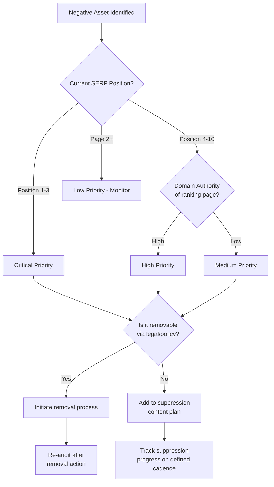

## Branded SERP Audits and Negative Asset Mapping

### Definition and Purpose

A branded SERP audit is the systematic process of capturing, documenting, and analyzing every visible element on search engine results pages for a given name, brand, or entity, in order to establish a factual baseline of current search visibility. Negative asset mapping is the subsequent analytical layer applied to that baseline: identifying, categorizing, and prioritizing specifically the content elements that pose reputational risk, so that suppression or remediation resources can be allocated efficiently rather than reactively.

**Key Points**

- The audit is a documentation exercise (what currently exists); asset mapping is an analytical/prioritization exercise (what matters and why).
- Both must be repeated on a defined cadence, since SERPs are dynamic and can shift meaningfully within days for high-volatility topics.
- The output of this process is the direct input to any subsequent SERM suppression, content, or legal strategy — it cannot be skipped or assumed.

### Step 1: Query Set Construction

Before capturing any SERP, the full set of queries to audit must be defined. A narrow query set (just the exact name) will miss significant reputational exposure.

**Core query categories:**

- **Exact match**: `"[Full Name]"`, `"[Company Name]"`
- **Name + qualifier**: `[Name] + CEO`, `[Name] + [Company]`, `[Name] + [City/Location]`
- **Sentiment/intent modifiers**: `[Name] + reviews`, `complaints`, `scam`, `lawsuit`, `fraud`, `scandal`, `fired`, `controversy`
- **Comparative**: `[Name] vs [Competitor]`
- **Variant spellings and nicknames**: Common misspellings, maiden names, former company names, abbreviations
- **Question-format queries**: `is [Name] legit`, `what happened to [Name]`, `why did [Company] [event]`

**Example**

For an executive named Jane Smith at Acme Corp who has faced litigation:



```
"Jane Smith"
"Jane Smith Acme"
"Jane Smith CEO"
"Jane Smith lawsuit"
"Jane Smith Acme lawsuit"
"is Jane Smith legit"
"Jane Smith fired"
"Jane Smith controversy"
```

### Step 2: Multi-Surface Capture

A comprehensive audit captures more than the primary organic results list. Each surface can independently carry reputational content.

| Surface | What to Capture |
| --- | --- |
| Organic results (positions 1–10, and page 2) | URL, title, meta description, domain authority estimate, sentiment |
| Knowledge Panel | Presence/absence, accuracy of data, source attribution, associated images |
| Featured Snippet / Answer Box | Content shown, source domain, whether it reflects negative framing |
| "People Also Ask" | Question phrasing (often reveals reputational concerns before they rank independently) |
| Autocomplete suggestions | Full list of suggested completions for the base query |
| Related Searches (bottom of page) | Full list, since these often surface adjacent reputational queries |
| Image Pack | Top images returned, source pages, whether any are unflattering or mislabeled |
| Video results | Platform, uploader, view count, sentiment |
| News tab | Recency and sentiment of any indexed news coverage |
| Local Pack (if applicable) | Google Business Profile presence, review score, review sentiment |

**Example**

An autocomplete audit might reveal:



```
"acme corp" + [space]
→ acme corp reviews
→ acme corp layoffs
→ acme corp stock
→ acme corp lawsuit
→ acme corp ceo
```

The presence of "layoffs" and "lawsuit" in autocomplete before any negative organic result appears is itself a leading indicator worth flagging, since autocomplete reflects aggregate search behavior and can surface concerns before they've fully materialized in ranked content.

### Step 3: Cross-Engine and Cross-Geography Capture

- **Multiple search engines**: Google typically dominates audit priority, but Bing (which powers some enterprise/government search defaults) and regionally dominant engines (e.g., Baidu, Yandex, Naver) should be included for entities with relevant geographic exposure.
- **Geographic variance**: Google localizes results by ccTLD and by the searcher's detected location; a global brand should audit from multiple country/language contexts, since a negative story may rank on page one in one market and be entirely absent in another.
- **Logged-out, incognito capture**: Audits should be performed in a logged-out/private browsing state to avoid personalization bias skewing the results away from what a neutral third party would see.

### Step 4: Negative Asset Categorization Framework

Once captured, each negative or risk-bearing element should be classified along multiple dimensions to inform prioritization.

**By content type:**

- News/media coverage (legitimate journalism)
- User-generated content (reviews, forum posts, social media)
- Competitor-driven content
- Regulatory/legal/public record content (court filings, government databases)
- Misinformation or factually incorrect content
- Impersonation or fraudulent content

**By actionability:**

- **Removable**: Violates platform policy, defamatory, or subject to legitimate legal takedown
- **Suppressible only**: Legitimate content that cannot be removed but can be outranked
- **Requires direct engagement**: Content from a reviewer or stakeholder where direct response/resolution may resolve the underlying issue (e.g., a business dispute reflected in a review)
- **Monitor only**: Low-ranking or low-risk content not currently worth resource allocation

**By severity/priority:**



### Step 5: Documentation and Reporting Structure

A negative asset map should be maintained as a living document (typically a spreadsheet or dashboard) with, at minimum:

| Field | Purpose |
| --- | --- |
| URL | The specific ranking page |
| Query it ranks for | Which of the audited queries surfaces this content |
| Current position | Baseline for tracking movement over time |
| Domain authority (estimated) | Informs how much competing authority is needed to outrank it |
| Content summary | Brief factual description of what the content contains |
| Sentiment classification | Negative / Neutral / Mixed / Positive |
| Actionability classification | Removable / Suppressible / Engage / Monitor |
| Priority tier | Critical / High / Medium / Low |
| Owner | Who is responsible for the remediation action |
| Status | Not started / In progress / Resolved / Recurring |
| Last checked date | Supports audit cadence tracking |

### Audit Cadence and Triggers

- **Baseline audit**: Full comprehensive capture at program start.
- **Scheduled re-audits**: Typically monthly or quarterly for stable situations; weekly or more frequent during an active crisis.
- **Event-triggered audits**: Immediately following any major news event, legal filing, or viral social media moment involving the entity, since SERP composition can shift within hours in high-volatility scenarios.
- [Inference] The specific cadence appropriate for a given entity depends on its baseline search volume, industry volatility, and current risk exposure; there is no single industry-standard interval, and cadence should be adjusted based on observed rate of SERP change for that specific entity.

### Tooling Categories Used in Practice

- **Rank tracking platforms**: Track position changes for defined query sets over time (category includes tools such as SEMrush, Ahrefs, or specialized reputation-monitoring platforms).
- **SERP screenshot/archiving tools**: Preserve dated visual evidence of SERP state, useful both for tracking progress and for any legal documentation needs.
- **Domain authority estimators**: Provide a proxy metric (each major SEO tool has its own proprietary scoring methodology) for how difficult a given ranking page will be to outrank.
- **Alert-based monitoring**: Google Alerts and similar services for early detection of new content before it gains ranking traction.
- [Unverified] Specific tool feature sets, pricing, and accuracy claims change frequently and should be verified against current vendor documentation rather than assumed.

### Common Pitfalls in Audit Execution

- **Auditing while logged in or with search history influencing results**, producing a personalized (and therefore non-representative) view of the SERP.
- **Auditing only the exact name query**, missing the modifier and autocomplete signals that often reveal reputational risk earliest.
- **Treating the audit as a one-time deliverable** rather than an ongoing monitoring function, allowing new negative content to go undetected until it has already accumulated ranking authority.
- **Failing to distinguish domain authority from content severity** — a low-authority page with extremely damaging content still warrants urgent attention even if it's not currently ranking highly, since it can gain traction rapidly if shared or linked.
- **Ignoring visual/image SERP tabs**, which are commonly under-audited despite carrying independent reputational visibility.

### Related Topics

- Search Engine Reputation Management Fundamentals
- Suppression Content Strategy and Execution
- Domain Authority Building for Owned Assets
- Sentiment Classification Methodologies for Reputation Monitoring
- Crisis-Triggered Rapid Re-Audit Protocols
- Legal Takedown and Right-to-Be-Forgotten Processes
- Review Platform Management and Response Strategy
- Competitive SERP Displacement Tactics