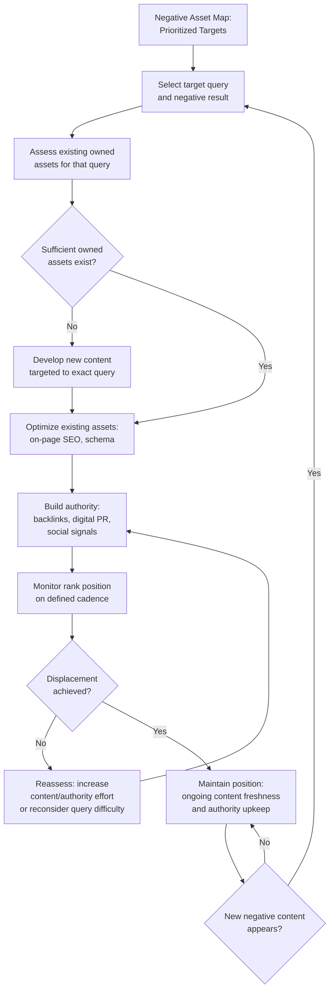

## Content Displacement and Suppression Strategy

### Definition and Core Mechanism

Content displacement (also called suppression) is the SEO- and content-driven practice of reducing the visibility of negative or undesirable search results by increasing the relative ranking authority of positive or neutral content, rather than attempting to remove the negative content itself. It operates on the premise that search engines rank pages based on relevance and authority signals, and that a sufficiently strong competing set of owned or earned assets can mathematically outrank an existing negative result for the same query.

**Key Points**

- Displacement does not delete or alter the negative content; it changes its *relative position* by strengthening competitors for the same ranking position.
- It is the default strategy in most SERM programs because removal is legally or practically unavailable for the majority of negative content (legitimate journalism, protected opinion, factual court records).
- Success is measured against the specific query set established during the SERP audit, not against generic brand visibility.

### The Ranking Competition Model

Search engines rank pages for a given query based on a composite of relevance and authority signals. To displace a negative result at position $N$, a competing page must out-score it on the weighted combination of signals the algorithm uses for that query. This can be conceptually represented as:

$$\text{Rank Position} \propto f(\text{Relevance}, \text{Domain Authority}, \text{Content Freshness}, \text{User Engagement Signals})$$

[Inference] This is a simplified conceptual model for planning purposes, not the actual search engine algorithm, which is proprietary, includes hundreds of weighted factors, and is not fully disclosed by any major search engine. Practitioners work from observed correlations (documented in SEO industry research) rather than verified formulas.

The practical implication: displacement requires building assets that are simultaneously *as relevant* to the target query and *more authoritative* than the negative result — relevance alone is insufficient if the negative page has substantially higher domain authority.

### Step 1: Target Selection from the Negative Asset Map

Displacement strategy is applied selectively, not universally, drawing directly from the prioritization output of a prior branded SERP audit and negative asset mapping exercise:

- Focus first on Critical and High priority items (typically positions 1–5 for high-visibility queries).
- Deprioritize items already on page two or beyond, since displacement effort yields diminishing reputational return outside page one.
- Exclude items flagged as more appropriately handled via legal removal or direct stakeholder engagement rather than suppression.

### Step 2: Asset Inventory and Gap Analysis

For each target negative result, assess what already exists and what needs to be built:

| Existing Asset Type | Displacement Readiness |
| --- | --- |
| Owned website/blog | Often needs new, targeted content optimized for the specific query |
| Wikipedia (if notable) | High authority; update or create if notability criteria are met |
| LinkedIn / professional profiles | Generally strong for name-based queries; ensure completeness and activity |
| Press coverage (existing) | Audit for whether it's optimized/indexed for the target query |
| Owned social profiles | Assess current optimization and posting cadence |
| Third-party high-authority mentions (directories, industry associations) | Identify opportunities for new listings or profile claims |

### Step 3: New Content Development for Target Queries

New content must be built specifically to compete for the exact queries identified in the audit — generic brand content rarely displaces specifically-worded negative results (e.g., "[Name] lawsuit").

**Content types commonly deployed:**

- **Owned long-form content**: Articles, FAQs, or resource pages that naturally and legitimately address the topic area (e.g., a factual statement page addressing a resolved legal matter, rather than avoiding the topic entirely).
- **Earned media placements**: Interviews, guest bylines, and expert commentary that generate new indexable, high-authority pages.
- **Video content**: YouTube carries substantial domain authority and frequently ranks well in the main SERP (not just the video tab) for branded queries.
- **Structured profile pages**: Award listings, speaker bios, conference pages, and industry directory listings.
- **Social media content cadence**: Regularly updated, keyword-relevant posts on high-authority platforms (LinkedIn, X/Twitter, Instagram) that rank for branded queries due to platform-level domain authority.

**Example**

If "[Name] lawsuit" ranks a negative news article at position 2, a displacement plan might include:

1. A factual, legally-reviewed statement page on the owned website addressing the matter directly (avoiding the appearance of evasion, which itself reduces the "hidden information" narrative risk).
2. A LinkedIn post or article from the individual addressing the topic in professional terms, generating a second competing high-authority result.
3. Outreach for a follow-up or resolution-stage news story (if the matter has concluded), since fresh, higher-context coverage can outrank older, less contextualized coverage on recency signals.

### Step 4: On-Page and Technical SEO Optimization

Content alone is insufficient without technical optimization aligned to the target query:

- **Title tags and meta descriptions** matching the exact phrasing patterns identified in the audit (e.g., including the full name and relevant qualifier terms naturally).
- **Header structure (H1/H2)** reflecting the target query's semantic intent.
- **Schema markup** (Person, Organization, or Article schema) to improve entity recognition and SERP feature eligibility.
- **Internal linking** from other high-authority owned pages to consolidate ranking signals toward the priority displacement page.
- **Page load performance and mobile usability**, which remain baseline ranking factors independent of content quality.

### Step 5: Authority Building (Off-Page)

Owned content needs external authority signals to compete with already-established negative results:

- **Backlink acquisition** from reputable, relevant domains linking to the new owned content.
- **Digital PR campaigns** designed explicitly to generate coverage and links to the displacement content, not just brand awareness.
- **Guest content and syndication** on industry-relevant, higher-authority third-party sites, with links back to owned assets.
- [Inference] The volume and quality of backlinks required to displace a specific result depends heavily on the existing authority of the negative page and the specific query's competitiveness; there is no fixed number of links that guarantees displacement.

### Suppression Workflow

### Timeframes and Expectations

Displacement is not immediate. Search engines require time to crawl, index, and re-rank new or updated content, and authority-building (particularly backlink acquisition) compounds gradually.

- **Low-competition queries** (narrow name + qualifier combinations with limited competing content): [Inference] often observable movement within weeks to a couple of months, though this varies by query and existing competition.
- **High-competition queries** (common names, high-authority negative content, high search volume): [Inference] can take several months to over a year of sustained effort, and full displacement is not guaranteed in every case, particularly against extremely high-authority negative sources (e.g., major national news outlets).
- Practitioners should set stakeholder expectations accordingly at program start; overpromising specific timelines is a common source of program credibility loss when displacement takes longer than anticipated.

### Ethical and Policy Boundaries

- **Legitimate displacement** (building genuinely valuable, accurate owned content) is standard SEO/PR practice and does not violate search engine guidelines.
- **Manipulative tactics** — such as fake reviews, link schemes designed purely to manipulate rankings without genuine relevance, cloaking, or deceptive content designed to mislead algorithms rather than inform users — violate most search engines' webmaster guidelines and can result in penalties that damage the owned domain's authority, worsening the overall SERP situation.
- **Negative SEO countermeasures** (a related but distinct discipline) address cases where a third party is deliberately attacking an entity's existing rankings, which requires different technical remediation than standard displacement.
- [Unverified] Specific search engine penalty policies and enforcement mechanisms change over time; current guideline details should be verified against the platform's currently published webmaster/search guidelines.

### Measuring Success

| Metric | What It Indicates |
| --- | --- |
| Rank position change for target queries (tracked against audit baseline) | Direct measure of displacement progress |
| SERP composition shift (% positive/neutral vs. negative in top 10) | Overall reputational health of the query set |
| New asset indexation status | Confirms content is being crawled and considered by search engines |
| Backlink growth to displacement content | Leading indicator of authority-building progress |
| Sentiment distribution across page-one results | Qualitative complement to positional data |

### Common Pitfalls

- **Building content that is topically adjacent but not query-matched**, resulting in content that ranks for the wrong terms and fails to compete for the actual problem query.
- **One-time content creation without sustained authority building**, causing initial gains to plateau or reverse as the negative content's relative authority remains unchallenged.
- **Ignoring content freshness decay** — displacement content that is not periodically updated can lose ranking position over time as freshness signals favor newer competing content, including potentially newer negative content.
- **Using manipulative tactics** that risk search engine penalties, which can be more damaging to overall reputation and visibility than the original negative content.
- **Failing to address the underlying issue** the negative content reflects — displacement changes visibility, not the underlying facts or stakeholder relationships, meaning a purely technical fix without genuine remediation carries recurrence risk.

### Related Topics

- Search Engine Reputation Management Fundamentals
- Branded SERP Audits and Negative Asset Mapping
- Digital PR and Earned Media for Authority Building
- Wikipedia and Wikidata Reputation Strategy
- Negative SEO Attack Detection and Defense
- Schema Markup and Entity Optimization for Reputation
- Backlink Acquisition Strategy and Risk Management
- Content Freshness Signals and Maintenance Cadence