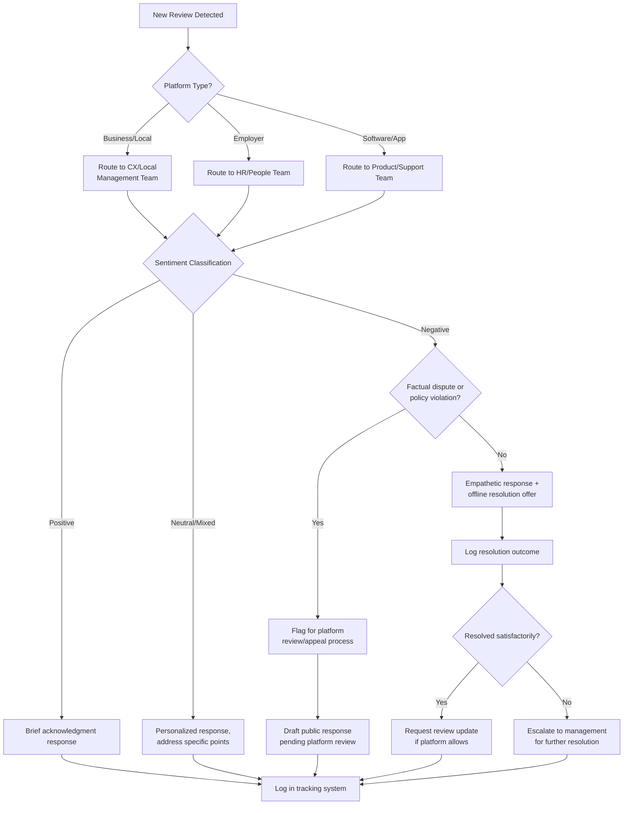

## Review Ecosystem Management and Response Workflows

### Definition and Scope

Review ecosystem management is the discipline of monitoring, responding to, and strategically influencing consumer- and employee-generated reviews across the full set of platforms relevant to an organization — including business review sites, employer review sites, app stores, and vertical-specific review platforms. It differs from broader sentiment monitoring in that reviews are structured, platform-hosted, semi-permanent artifacts with their own algorithms, response mechanisms, and platform-specific policies, requiring dedicated workflows rather than general social listening alone.

**Key Points**

- Reviews function as both a reputational signal to prospective customers/employees and as a ranking/visibility input on the hosting platform itself (and often in search engine results).
- Response workflows must be platform-aware: response norms, timing expectations, and policy constraints differ substantially between a Google Business Profile review, a Glassdoor review, and an app store review.
- Unmanaged review ecosystems tend toward volatility bias — dissatisfied customers/employees are statistically more likely to leave unsolicited reviews than satisfied ones, which structurally skews visible sentiment negative absent active solicitation of positive reviews.

### The Review Platform Landscape

| Platform Category | Examples | Primary Audience Impact |
| --- | --- | --- |
| General business/local | Google Business Profile, Yelp, TripAdvisor | Prospective customers, local search visibility |
| Employer/workplace | Glassdoor, Indeed, Comparably | Prospective employees, talent acquisition |
| Software/app | Apple App Store, Google Play, G2, Capterra, TrustRadius | Prospective software buyers/users |
| E-commerce/marketplace | Amazon, Trustpilot, BBB | Prospective product buyers |
| Industry-vertical | Healthgrades (healthcare), Zillow (real estate), Avvo (legal) | Sector-specific prospective clients |

[Inference] The relative importance of each platform varies substantially by industry and business model; a B2B software company's priority set differs meaningfully from a local retail business's, and this table should be treated as a general map rather than a universal priority ranking.

### Monitoring Infrastructure

**1. Platform-native alerts**: Most major review platforms offer owner/claimed-profile notification systems for new reviews — these should be configured as the baseline layer, not relied upon exclusively due to occasional delivery gaps.

**2. Aggregation and monitoring tools**: Dedicated reputation management platforms (category includes tools such as Podium, BirdEye, Reputation.com, and similar) consolidate reviews across multiple platforms into a single dashboard, typically with sentiment tagging and response-routing capabilities.

**3. Response time SLAs**: Organizations should define internal service-level targets for review response, differentiated by severity:

- Critical (1-star, safety/legal implications): same-day response target
- Negative (1–2 star, standard complaint): 24–48 hour response target
- Neutral/mixed (3-star): 48–72 hour response target
- Positive (4–5 star): acknowledgment within a defined window, often lower urgency but still valuable for engagement signals

[Inference] Specific SLA windows are organizational policy choices rather than fixed industry standards; the appropriate target depends on review volume, team capacity, and platform norms.

### Response Workflow Architecture

### Response Drafting Principles

**Structure of an effective negative review response:**

1. Acknowledge the specific concern raised (avoid generic templated language that reads as insincere).
2. Avoid defensiveness or dispute of the reviewer's experience in the public response, even when internal records suggest a different account.
3. Take specifics offline (provide a direct contact method) rather than attempting to resolve detailed disputes in the public comment thread.
4. Keep the response concise and professional — the primary audience for a review response is not the original reviewer but future readers evaluating the organization's responsiveness.

**Example**

> "Thank you for sharing this feedback, [Name]. We're sorry to hear your experience didn't meet expectations regarding [specific issue mentioned]. We'd like to understand more and make this right — please reach out to us directly at [contact] so we can address this properly."

**What to avoid:**

- Arguing facts publicly ("That's not what happened, our records show...") — this rarely persuades the original reviewer and often reads as dismissive to third-party readers.
- Generic copy-paste responses with no specific reference to the review content, which signal low engagement to platform algorithms and to human readers alike.
- Overly legalistic or corporate language that reads as evasive rather than genuinely responsive.

### Employer Review Platforms: Distinct Considerations

Employer review platforms (Glassdoor, Indeed, Comparably) carry unique dynamics compared to consumer review platforms:

- Reviews are typically anonymous by platform design, limiting the organization's ability to verify claims or resolve disputes privately with the specific reviewer.
- Responses are read primarily by prospective candidates during recruiting, making response tone and consistency a direct talent-acquisition factor.
- Platform policies (e.g., Glassdoor's community guidelines) restrict what employers can request or incentivize regarding review solicitation — mass-soliciting only positive reviews or offering incentives contingent on rating can violate platform policy.
- HR/People teams, not marketing/PR teams, typically own this response workflow, requiring cross-functional coordination within the broader review ecosystem strategy.

### Review Solicitation Strategy (Proactive Volume Management)

Because dissatisfied customers are structurally more likely to leave unsolicited reviews, a core mitigation strategy is systematic, policy-compliant solicitation of reviews from the broader (typically more neutral-to-positive) customer base:

- **Post-transaction request workflows**: Automated email/SMS requests timed after a positive interaction signal (successful delivery, support ticket resolution, etc.).
- **In-product or in-app prompts**: Timed requests within a software product following a positive usage milestone.
- **Staff-prompted requests**: Front-line staff trained to request reviews at natural positive touchpoints (with care to avoid platform policy violations around solicitation timing or selectivity).

**Platform policy caution**: Most major platforms (Google, Yelp, Apple App Store) explicitly prohibit incentivized reviews (offering discounts or compensation contingent on leaving a review) and selectively soliciting only satisfied customers while suppressing dissatisfied ones ("review gating"). [Unverified] Specific platform enforcement mechanisms and policy wording change over time and should be verified against each platform's current guidelines before implementing a solicitation program.

### Handling Fraudulent or Policy-Violating Reviews

Not all negative reviews warrant a resolution-focused response; some qualify for platform-level dispute:

- **Clear policy violations**: Reviews containing hate speech, unrelated content, conflicts of interest (e.g., a competitor posing as a customer), or reviews from individuals with no verifiable interaction with the business.
- **Dispute/flagging process**: Most platforms provide a formal flagging mechanism requiring evidence or justification; approval is at the platform's discretion and is not guaranteed even for seemingly clear violations.
- **Documentation requirement**: Maintaining records (transaction logs, support tickets) that can substantiate a dispute claim strengthens the flagging request.
- [Inference] Success rates for review disputes vary significantly by platform and are not predictable in advance; flagging should be reserved for genuine policy violations rather than used as a general tool for addressing unfavorable-but-legitimate reviews, since platforms typically decline disputes based solely on unfavorable content.

### Aggregate Rating Impact and Prioritization

<svg xmlns="http://www.w3.org/2000/svg" viewBox="0 0 850 380">
<text x="425" y="30" text-anchor="middle" font-size="17" font-weight="bold" fill="#1a1a1a">Review Volume vs. Rating Impact (svg_diagram)</text>
<line x1="80" y1="320" x2="780" y2="320" stroke="#333" stroke-width="2" />
<line x1="80" y1="320" x2="80" y2="60" stroke="#333" stroke-width="2" />
<text x="430" y="355" text-anchor="middle" font-size="12" fill="#555">Total Review Count</text>
<text x="30" y="190" text-anchor="middle" font-size="12" fill="#555" transform="rotate(-90 30 190)">Rating Volatility</text>
<path d="M 100 100 Q 250 280 400 300 T 760 310" stroke="#c53030" stroke-width="3" fill="none" />
<text x="150" y="90" font-size="11" fill="#822727">High volatility per review</text>
<text x="600" y="295" font-size="11" fill="#822727">Stabilized average</text>
<circle cx="100" cy="100" r="5" fill="#c53030" />
<circle cx="200" cy="200" r="5" fill="#c53030" />
<circle cx="400" cy="300" r="5" fill="#c53030" />
<circle cx="600" cy="308" r="5" fill="#c53030" />
<circle cx="760" cy="310" r="5" fill="#c53030" />

<text x="100" y="130" text-anchor="middle" font-size="10">n=5</text>

<text x="200" y="230" text-anchor="middle" font-size="10">n=25</text>

<text x="400" y="330" text-anchor="middle" font-size="10">n=100</text>

<text x="600" y="340" text-anchor="middle" font-size="10">n=300</text>

<rect x="500" y="60" width="260" height="60" rx="6" fill="#f7fafc" stroke="#a0aec0" />
<text x="515" y="80" font-size="11" fill="#333">A single negative review has</text>
<text x="515" y="96" font-size="11" fill="#333">outsized impact on low-volume</text>
<text x="515" y="112" font-size="11" fill="#333">profiles — solicitation matters most early.</text>
</svg>

At low review counts, each individual review has disproportionate weight on the aggregate star rating displayed to prospective customers; this makes early-stage review solicitation strategically important, since a small number of early reviews sets a rating baseline that becomes progressively harder to shift as volume grows. [Inference] The precise volume threshold at which rating volatility stabilizes varies by platform's specific rating algorithm (some platforms weight recency or reviewer credibility) and is not a fixed, universal number.

### Cross-Functional Ownership Model

Effective review ecosystem management typically requires a defined ownership matrix rather than a single team handling all platforms:

| Function | Typical Owner |
| --- | --- |
| Consumer/local reviews | Marketing, Customer Experience, or local operations teams |
| Employer reviews | HR / People / Talent Acquisition |
| Software/product reviews | Product Marketing or Customer Success |
| Crisis-level review spikes | Escalation to Communications/PR per crisis protocol |

Without clear ownership boundaries, reviews are commonly either duplicated in response effort or, more commonly, left unaddressed as each team assumes another owns the platform.

### Reporting and Continuous Improvement

- **Aggregate rating tracking** across all relevant platforms on a recurring cadence, benchmarked against direct competitors where available.
- **Response rate and response time metrics**, tracked as an internal accountability measure.
- **Theme extraction from review content**: Recurring complaint themes (e.g., repeated mentions of a specific product defect or service gap) should feed back into operational/product improvement processes, not just communications response — review management functions most effectively as a feedback loop rather than a purely defensive communications function.
- **Resolution tracking**: Whether offline resolution offers made in public responses are actually followed through on, since a pattern of unfulfilled resolution offers itself becomes a visible reputational liability over time.

### Common Pitfalls

- **Templated, impersonal responses** at scale, which readers can easily identify as non-genuine and which can appear worse than no response at all.
- **Arguing with reviewers publicly**, which typically damages perception among third-party readers regardless of factual accuracy.
- **Neglecting employer review platforms** while focusing exclusively on consumer-facing platforms, despite employer reviews' direct impact on recruiting and, increasingly, on general public perception when surfaced in broader searches.
- **Review gating or incentivized review solicitation** that violates platform policy, risking account penalties or review removal at scale if detected.
- **Treating review response as purely reactive** rather than feeding recurring themes into operational improvement, resulting in a persistent cycle of the same complaints recurring across new reviews.

### Related Topics

- Search Engine Reputation Management Fundamentals
- Branded SERP Audits and Negative Asset Mapping
- Employer Brand Management and Glassdoor Strategy
- Customer Experience Feedback Loop Integration
- Crisis Escalation Thresholds for Review Spikes
- Platform Policy Compliance for Review Solicitation
- Sentiment Analysis and Theme Extraction Methodologies
- Local SEO and Google Business Profile Optimization