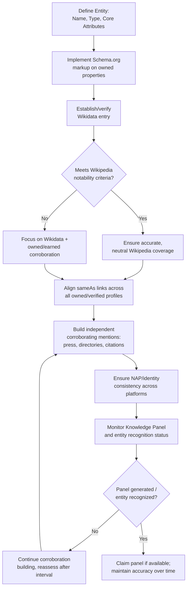

## Knowledge Graph and Entity Authority Building

### Definition and Conceptual Foundation

Entity authority building is the practice of establishing an organization, person, or brand as a clearly defined, verified "entity" within search engines' underlying knowledge systems — most notably Google's Knowledge Graph — rather than being treated merely as a string of text matched across web pages. Search engines increasingly reason about the web in terms of entities (distinct real-world things with attributes and relationships) rather than purely keyword matching, and an entity with a well-established, disambiguated profile tends to receive more stable, accurate, and favorable search treatment, including eligibility for Knowledge Panels.

**Key Points**

- The Knowledge Graph is Google's proprietary database of entities and their relationships; other search engines (Bing) maintain analogous but separate systems (Bing Entity Graph/Satori).
- Entity authority is foundational to reputation management because a well-established entity profile is harder for negative or fraudulent content to distort or impersonate.
- This is a long-horizon, cumulative strategy — entity recognition strengthens gradually through consistent, corroborated signals across many sources rather than through a single action.

### What a Knowledge Panel Is and How It's Populated

A Knowledge Panel is the information box that can appear on the right side (desktop) or top (mobile) of a Google search results page for a recognized entity, typically containing a summary, image, key facts, and links to official/associated profiles.

[Inference] Google does not publish the complete, current algorithmic criteria for Knowledge Panel eligibility or generation, since this is proprietary and evolves over time; the description below reflects widely observed patterns from SEO industry practice rather than official specification.

**Commonly observed contributing signals:**

- Presence and quality of a **Wikipedia** article (a historically strong signal for panel generation, particularly for well-established entities).
- **Wikidata** entries, which structurally define entity attributes and relationships in a machine-readable format Google's systems can reference.
- **Structured data (schema.org markup)** on owned properties, explicitly declaring entity type and attributes.
- **Cross-platform consistency**: consistent name, description, and associated profile links (via the `sameAs` property) across owned and verified third-party properties.
- **Volume and authority of independent, corroborating mentions** across reputable sources — search engines appear to weight independent verification, not self-declared claims alone.
- **Google's own direct data sources**: Google Business Profile (for local entities), verified social profiles, and in some cases direct submission/claim processes for certain entity types.

### Entity Types and Applicable Strategies

| Entity Type | Primary Authority-Building Levers |
| --- | --- |
| Individual (executive, public figure) | Wikipedia (if notable), LinkedIn, Wikidata, structured `Person` schema, consistent bio across bylines/speaker pages |
| Company/organization | Wikipedia, Wikidata, `Organization` schema, Google Business Profile (if applicable), consistent NAP (Name/Address/Phone) data, Crunchbase/industry databases |
| Product | `Product` schema, manufacturer/retailer corroboration, review aggregation platforms |
| Local business | Google Business Profile as the primary driver, supplemented by local citation consistency across directories |

### Step 1: Structured Data Implementation (Schema.org)

Structured data provides search engines an explicit, machine-readable declaration of entity information, reducing reliance on inference from unstructured page content.

**Example — Organization schema:**

```json
{
  "@context": "https://schema.org",
  "@type": "Organization",
  "name": "Example Corp",
  "url": "https://example.com",
  "logo": "https://example.com/logo.png",
  "sameAs": [
    "https://www.linkedin.com/company/example-corp",
    "https://twitter.com/examplecorp",
    "https://www.wikidata.org/wiki/Q123456789"
  ],
  "founder": {
    "@type": "Person",
    "name": "Jane Smith"
  }
}
```

**Example — Person schema:**

```json
{
  "@context": "https://schema.org",
  "@type": "Person",
  "name": "Jane Smith",
  "jobTitle": "Chief Executive Officer",
  "worksFor": {
    "@type": "Organization",
    "name": "Example Corp"
  },
  "sameAs": [
    "https://www.linkedin.com/in/janesmith",
    "https://www.wikidata.org/wiki/Q987654321"
  ]
}
```

The `sameAs` property is the primary mechanism for explicitly linking an entity's various online representations, helping search engines consolidate signals about a single entity rather than treating each profile as potentially distinct or ambiguous. [Inference] The specific weight `sameAs` carries relative to other corroborating signals in Google's actual ranking/entity-resolution systems is not publicly disclosed with precision.

### Step 2: Wikidata as a Foundational Layer

Wikidata is a structured, machine-readable, collaboratively edited knowledge base (a sister project to Wikipedia) that many automated systems, including search engines, reference for entity data.

- Unlike Wikipedia, Wikidata has comparatively lower notability barriers for many entity types, making it more accessible as an early-stage entity authority asset.
- A Wikidata entry structurally defines entity type, aliases, relationships (e.g., "employer," "founded by," "instance of"), and links to external identifiers (ISNI, ORCID, VIAF, official website) — this structured relational data is precisely the format automated knowledge systems can parse reliably.
- Entries must comply with Wikidata's own sourcing and notability policies; unsourced or promotional edits are subject to community review and removal, similar to Wikipedia's editorial norms.

### Step 3: Wikipedia (Where Notability Criteria Are Met)

Wikipedia remains one of the highest-authority, most frequently Knowledge-Panel-triggering sources, but it is governed by strict, community-enforced policies that must be respected:

- **Notability requirement**: The subject must meet Wikipedia's notability guidelines (substantial independent, reliable source coverage) — an entity cannot simply create a page because it wants search visibility.
- **Conflict of interest (COI) disclosure**: Individuals or organizations with a direct interest in the subject must disclose this per Wikipedia's COI policy; undisclosed paid editing violates Wikipedia's Terms of Use.
- **Neutral point of view requirement**: Content must be neutrally written and verifiable against independent reliable sources, not promotional in tone.
- [Unverified] Wikipedia's specific policies, notability thresholds, and enforcement practices are maintained by the Wikimedia community and evolve over time; current policy pages should be consulted directly before undertaking any Wikipedia editing activity.

Given these constraints, Wikipedia strategy for reputation purposes typically focuses on ensuring existing articles are accurate and well-sourced (correcting factual errors, adding legitimately missing context via talk-page proposals) rather than attempting to create promotional new entries.

### Step 4: Cross-Platform Consistency (NAP and Identity Signals)

For local and organizational entities, consistency of core identity data across all platforms — commonly referred to as NAP (Name, Address, Phone) consistency in local SEO contexts — supports entity resolution confidence:

- Identical business name formatting across Google Business Profile, directories, social platforms, and the website.
- Consistent address formatting (avoiding variations like "St." vs. "Street" across listings).
- Consistent phone number and, where applicable, consistent hours of operation.

Inconsistent data across sources can fragment entity signals, potentially causing search engines to treat listings as referring to distantly related or ambiguous entities rather than reinforcing a single, confident profile.

### Entity Authority Building Process Flow



### Claiming and Maintaining a Knowledge Panel

Where a Knowledge Panel exists and a claiming mechanism is available (Google offers a verification process for certain panel types, typically via a verified Google account associated with the entity):

- Claiming allows direct feedback/correction submission for inaccurate panel data.
- It does not typically grant full editorial control — Google's systems retain final determination over displayed information, drawing from its broader corroborated source set.
- [Unverified] Specific claiming mechanisms, eligibility, and available controls vary by entity type and change over time; current process details should be verified directly against Google's current published support documentation.

### Relationship to Broader Reputation Management

Entity authority building is a foundational, preventive layer within the broader Online Reputation Management discipline:

- A strongly established entity profile makes it structurally harder for impersonation, misattribution, or fragmented/conflicting information to gain traction, since search systems have a well-corroborated reference point to compare against.
- It directly supports SERM suppression efforts, since a recognized entity with a Knowledge Panel occupies prominent SERP real estate that inherently displaces competing (including negative) content from top visual attention.
- It is complementary to, not a substitute for, content displacement and review management — entity authority strengthens the foundation those tactics build upon.

### Common Pitfalls

- **Attempting to force Wikipedia creation without meeting notability criteria**, resulting in article deletion and, in cases of undisclosed paid editing, potential public exposure of the attempt itself (a secondary reputational risk).
- **Inconsistent identity data across platforms**, fragmenting entity signals and slowing recognition confidence.
- **Treating entity building as a one-time setup task**, when in practice ongoing corroboration (new press mentions, updated profiles, maintained accuracy) is required to sustain and strengthen recognition over time.
- **Neglecting Wikidata** in favor of focusing solely on Wikipedia, missing an accessible structured-data opportunity with a lower barrier to entry.
- **Assuming schema markup alone guarantees a Knowledge Panel**, when in practice it is one contributing signal among many, and panel generation for a given entity involves criteria not fully disclosed by the search engine, so outcomes should not be treated as within complete practitioner control. [Inference] Panel generation for less prominent entities may not occur even with strong signal implementation, since a baseline level of independent public interest/corroboration appears to remain a factor.

### Related Topics

- Search Engine Reputation Management Fundamentals
- Branded SERP Audits and Negative Asset Mapping
- Content Displacement and Suppression Strategy
- Wikipedia and Wikidata Editing Policy Compliance
- Schema.org Structured Data Implementation
- Local SEO and Google Business Profile Optimization
- Digital PR for Independent Corroboration Building
- Impersonation and Identity Fraud Mitigation Online