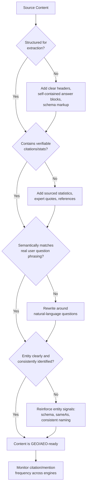

## Answer Engine and Generative Engine Optimization


### Definition and Terminology Landscape

Answer Engine Optimization (AEO) and Generative Engine Optimization (GEO) are related but distinct disciplines concerned with how an entity is represented, cited, or recommended within AI-mediated information surfaces — featured snippets, AI Overviews, and conversational AI assistants (ChatGPT, Claude, Perplexity, Gemini, Copilot) — rather than in traditional ranked search results. AEO optimizes the answer surfaced in featured snippets, People Also Ask, and increasingly AI Overviews, while GEO optimizes for being cited inside generative responses across AI Overviews, ChatGPT, Perplexity, Gemini, and Claude. [Progress](https://www.progress.com/blogs/seo-and-geo-guide)

**Key Points**

- Both disciplines share fundamentals with traditional SEO but serve different audiences and surfaces, and neither replaces SEO — GEO fits into a broader cross-functional strategy including SEO, content marketing, PR, and social media. [Progress](https://www.progress.com/blogs/seo-and-geo-guide)[Firebrand](https://www.firebrand.marketing/2025/12/geo-best-practices-2026/)
- The reputational stakes are distinct from traditional SERM: a generative engine can synthesize a summary judgment about an entity's reputation directly in its answer, without the user ever visiting a source page, meaning there is no click-through opportunity to correct context.
- The term "generative engine optimization" originated in AI/NLP research literature, not marketing practice, and its practical application has evolved substantially as adoption spread. [Wikipedia](https://en.wikipedia.org/wiki/Generative_engine_optimization)

### Why This Matters for Reputation Management Specifically

Unlike a traditional SERP listing, which a user can click through, read in context, and evaluate against the source's credibility, a generative engine's answer is presented as a synthesized, seemingly authoritative statement. If an AI assistant characterizes an organization's reputation, safety record, or business practices inaccurately or unfavorably, that characterization reaches the user directly, with the underlying sources often abstracted away or buried in a citation list the user may never open. This shifts reputational risk upstream: an entity now needs to be concerned not only with what search engines *rank*, but with what conversational AI systems *say* when asked about it.

### AEO vs. GEO vs. Traditional SEO

| Dimension | SEO | AEO | GEO |
| --- | --- | --- | --- |
| Target surface | Ranked organic listings | Featured snippets, structured answers, voice search | AI-generated answers and recommendations |
| Optimization unit | Full page ranking | Direct-answer format (FAQ, definition blocks) | Citation-worthy passages within content |
| Success signal | Position, click-through rate | Snippet capture rate | Mention frequency and favorability within category prompts |
| Core technique | Keywords, technical optimization, backlinks, content quality | FAQs, snippets, short definitions, structured formatting | Citing sources, statistics, semantic clarity, quoting experts |

### Evidence Base: What Actually Improves GEO Performance

The term was introduced in a November 2023 research paper by researchers from Princeton, Georgia Tech, the Allen Institute for AI, and IIT Delhi, which demonstrated that targeted optimization can increase visibility in generative responses by up to 40%. According to that research, the top optimization methods — citing sources, adding statistics, and including quotations — can improve AI visibility by 30-40% compared to unoptimized content. Notably, the same research tested keyword stuffing as a technique, which did not improve results — a meaningful divergence from legacy SEO tactics that reward keyword density. [SEO and GEO: A Practical Guide for 2026 | Progress Sitefinity +2](https://www.progress.com/blogs/seo-and-geo-guide)

**Techniques with documented support:**

- **Citation-rich content**: Backing claims with named, verifiable sources rather than unsupported assertions.
- **Statistical specificity**: Including concrete figures rather than vague qualitative claims.
- **Expert attribution**: Quoting experts and using authoritative language. [Progress](https://www.progress.com/blogs/seo-and-geo-guide)
- **Semantic clarity and question-matched structure**: Structuring content so AI tools can extract short, self-contained sections, since AI tools pull short sections from different sites rather than reading a full page as a human would. [SeoTuners](https://seotuners.com/blog/generative-engine-optimization/generative-engine-optimization-best-practices/)[SeoTuners](https://seotuners.com/blog/generative-engine-optimization/generative-engine-optimization-best-practices/)
- **Question-first framing**: Content built around how people actually phrase their questions performs better in AI search than keyword-first content. [SeoTuners](https://seotuners.com/blog/generative-engine-optimization/generative-engine-optimization-best-practices/)

[Inference] The specific percentage improvements cited above come from a single foundational academic study using a defined benchmark methodology; real-world results for any specific brand or content set will vary by domain, competitive density, and the specific generative engine's retrieval architecture, and should not be treated as a guaranteed outcome for any given optimization effort.

### Technical Foundations Content Should Meet



### Entity Clarity as a Prerequisite

GEO focuses on entity clarity and citation signals as core mechanisms distinct from traditional ranking factors. This directly connects AEO/GEO strategy to the entity authority foundation established via schema markup, Wikidata, and cross-platform consistency: generative engines that retrieve or have been trained on well-corroborated, unambiguous entity data are structurally more likely to represent that entity accurately and favorably, since ambiguous or conflicting entity signals increase the risk of hallucinated or misattributed characterizations. [ShopOS](https://shopos.ai/blog/generative-engine-optimization-best-practices-2026)

### Measurement: Share of Model

The emerging primary metric for tracking AI-answer visibility is commonly called **"Share of Model" (SoM)** — the percentage of AI assistant answers or recommendations in a product category that mention or recommend a specific brand, positioned as the AI-search counterpart to share of voice in traditional media. [CDP](https://cdp.com/glossary/share-of-model/)

**Key characteristics of the metric:**

- Unlike a keyword ranking, which is static, Share of Model is probabilistic — an LLM might mention a brand in 80% of responses to one query phrasing and only 20% of responses to a closely related phrasing. [Yotpo](https://www.yotpo.com/blog/ai-visibility-brand-presence-llms/)[Yotpo](https://www.yotpo.com/blog/ai-visibility-brand-presence-llms/)
- It is an early-stage metric; the term and its measurement conventions are still settling, though the underlying behavior it tracks is real. [CDP](https://cdp.com/glossary/share-of-model/)
- No standard methodology currently exists — vendor dashboards differ, and numbers are not comparable across tools. [CDP](https://cdp.com/glossary/share-of-model/)
- A commonly used measurement approach uses a polling-based model: a representative sample of high-intent queries functions as a population proxy, systematically submitted across multiple LLMs, with brand mentions tracked and compared. [Symphonicdigital](https://www.symphonicdigital.com/blog/understanding-share-of-model)
- A more complete measurement typically layers presence, citation frequency, sentiment, and competitive share into a single diagnostic, since high presence with low citation frequency indicates the brand is mentioned but not trusted as a primary source, which requires a different remediation than being simply absent. [AIO Copilot](https://www.aiocopilot.com/blog/share-of-model-ai-visibility-measurement-2026)[AIO Copilot](https://www.aiocopilot.com/blog/share-of-model-ai-visibility-measurement-2026)

**Example prompt set construction** (for a mid-market SaaS company):



```
"best project management software for remote teams"
"[Company] vs [Competitor A]"
"is [Company] good for enterprise use"
"top CRM alternatives to [Category Leader]"
"[Company] reviews and reputation"
```

Common measurement pitfalls include tracking only branded prompts instead of category-level prompts, measuring citation presence without evaluating recommendation quality, and ignoring competitor visibility benchmarks — a category-only or branded-only prompt set produces an incomplete picture of actual competitive position within AI answers. [Gigawatt Group](https://gigawattgroup.com/generative-engine-optimization/share-of-model-measure-brand-visibility-ai-answers/)

### Correlation with Business Outcomes

A Similarweb study across finance, travel, and beauty sectors found that direct visits and brand searches increase more for companies mentioned in AI responses than for those not mentioned. However, the study itself notes the cause-and-effect relationship still needs confirmation across other sectors and brand sizes, and practitioners are advised to track Share of Model alongside traditional metrics like direct traffic and brand searches rather than in isolation. [Inference] This is a single early study rather than an established causal literature; treating SoM improvement as a guaranteed driver of downstream business metrics for any specific organization would overstate current evidence. [Share of Model: How to measure your AI visibility in 2026 +2](https://ellevate.fr/en/blog/share-of-model-visibility-ia/)

### Reputation-Specific Application: Auditing AI Answer Sentiment

Beyond mention frequency, a reputation-focused AEO/GEO audit should specifically probe:

- **Sentiment classification** of how AI assistants characterize the entity when asked reputation-adjacent questions ("is [Company] trustworthy," "has [Company] had any controversies").
- **Factual accuracy** of AI-generated summaries against verified organizational facts, since generative engines can synthesize outdated, incomplete, or hallucinated claims from imperfectly weighted source material.
- **Source attribution patterns**: which underlying sources (news articles, review aggregators, Wikipedia, owned content) the AI engine appears to be drawing from for reputation-relevant answers, since this indicates where corrective or reinforcing content effort should be concentrated.
- **Cross-engine consistency**: whether different AI assistants (ChatGPT, Claude, Gemini, Perplexity) characterize the entity similarly or divergently, since divergence may indicate a specific engine has been trained on or retrieves from a disproportionately negative source set.

[Inference] Systematically correcting an inaccurate AI-generated characterization is considerably harder than correcting a search-ranked page, since it may involve both retrieval-time source correction (achievable through content and citation strategy) and underlying model training data (not directly correctable by any external content strategy, and dependent on the AI provider's own update and grounding practices).

### Relationship to the Broader ORM Toolkit

AEO/GEO does not operate independently of the other Online Reputation Management disciplines covered elsewhere in this chapter — it depends on and reinforces them:

- **Entity authority building** (schema, Wikidata, consistent identity signals) directly improves the model's ability to correctly identify and describe the entity.
- **Content displacement/suppression** principles apply analogously: strengthening authoritative, accurate owned and earned content increases the likelihood it is the source material generative engines draw from.
- **Review ecosystem management** matters because AI assistants increasingly synthesize review sentiment directly into comparative answers ("which vendor has better reviews").
- **Wikipedia/public profile accuracy** remains disproportionately influential, since Wikipedia is a heavily represented source in many large language models' training and retrieval corpora.

### Common Pitfalls

- **Treating GEO as a separate discipline requiring an entirely new strategy**, when it is more accurately understood as an extension of established SEO practices rather than a wholesale replacement. [Progress](https://www.progress.com/blogs/seo-and-geo-guide)
- **Keyword-stuffing GEO content** based on legacy SEO habits, despite research showing this technique does not improve generative engine visibility. [Progress](https://www.progress.com/blogs/seo-and-geo-guide)
- **Measuring only branded queries**, missing the category-level competitive visibility that determines whether the entity is recommended at all during a prospect's research phase.
- **Comparing Share of Model figures across different vendor tools as if standardized**, when no standard methodology currently exists and vendor numbers are not directly comparable. [CDP](https://cdp.com/glossary/share-of-model/)
- **Assuming a single successful correction propagates instantly across all AI engines**, when different engines have different training cutoffs, retrieval architectures, and update cadences, meaning correction efforts may show inconsistent timing and completeness across platforms.

### Related Topics

- Knowledge Graph and Entity Authority Building
- Content Displacement and Suppression Strategy
- Wikipedia and Public Profile Management
- Review Ecosystem Management and Response Workflows
- Schema.org and Structured Data for AI Retrieval
- AI Hallucination Risk and Correction Pathways
- Competitive Benchmarking in AI Answer Environments
- Search Engine Reputation Management Fundamentals