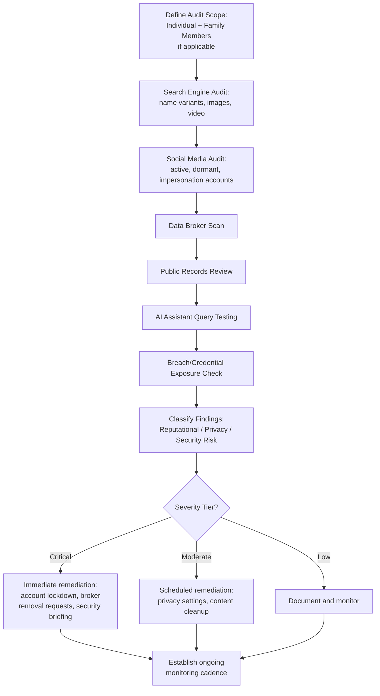

## Digital Footprint Audits for Executives and Individuals

### Definition and Purpose

A digital footprint audit is the systematic process of discovering, cataloging, and assessing all publicly accessible information associated with an individual — executives, board members, public figures, or high-profile employees — across search engines, social media, data broker sites, public records, and AI-generated summaries, in order to identify reputational, security, and privacy risk exposure. Unlike a branded SERP audit (which focuses on organizational entities and their name-based search visibility), a digital footprint audit is individual-centric and typically incorporates a broader surface area, including personal social accounts, data broker aggregation, and physical security-adjacent exposure (home address, family information, daily patterns).

**Key Points**

- Executive digital footprint audits sit at the intersection of reputation management, corporate communications, and executive protection/security — they are frequently commissioned jointly by PR/communications and corporate security functions.
- The audit distinguishes between professional exposure (relevant to reputation and business risk) and personal exposure (relevant to physical safety, privacy, and family security).
- Individuals often significantly underestimate their own footprint, since much of it derives from third-party sources (data brokers, old accounts, tagged content, public records) rather than content they directly posted or control.

### Why Executive-Specific Audits Differ from General SERM

Executives carry a dual reputational surface: their personal name and their organizational role are often inseparable in public perception, meaning personal controversies, past statements, or exposed personal information can directly affect organizational reputation, and vice versa. Additionally, executives face elevated targeting risk (phishing, social engineering, doxxing, harassment campaigns) precisely because their identity and role are typically already public and high-value to bad actors — making the audit's security dimension materially more significant than in a typical individual privacy audit.

### Audit Scope: Core Categories

**1. Search Engine Presence**

- Standard branded SERP audit methodology applied to the individual's full name, common variants, and name + role/company combinations.
- Autocomplete and "People Also Ask" review for reputational or security-relevant surfacing.
- Image and video search review, since these are frequently overlooked but carry independent exposure (e.g., outdated or unflattering images ranking prominently, or geolocation-tagged content).

**2. Social Media Footprint**

- **Active accounts**: Audit privacy settings, historical post content, tagged content, and follower/connection visibility across all platforms the individual currently uses.
- **Dormant/forgotten accounts**: Old accounts (from earlier career stages, college, or discontinued platforms) that remain publicly accessible and may contain outdated or inconsistent information, or content inconsistent with current professional positioning.
- **Impersonation accounts**: Fake profiles using the individual's name, photo, or likeness, which pose both reputational risk (fraudulent statements attributed to the individual) and direct fraud risk (impersonation-based scams targeting the individual's network).
- **Family and close associate visibility**: Publicly accessible information about family members that could constitute a security risk (school names, routine locations, home imagery) even where the executive's own accounts are well-managed.

**3. Data Broker and People-Search Site Exposure**

Data broker sites aggregate and republish personal information (home address, phone number, age, relatives, property records) drawn from public records and other sources, often without the individual's direct action or consent.

- Common categories include people-search sites, background-check aggregators, and marketing data brokers.
- [Unverified] The specific list of active data broker sites, their opt-out processes, and their compliance obligations vary by jurisdiction and change frequently as sites emerge, merge, or shut down; a current audit should verify against up-to-date data broker directories rather than a static list.
- Many jurisdictions (e.g., California under the CCPA/CPRA, and comparable frameworks elsewhere) provide a legal right to request data removal from broker sites, though processes and enforcement vary by jurisdiction and by broker compliance posture.

**4. Public Records and Government Databases**

- Property records, court records, business filings (e.g., SEC filings for executives at public companies), and voter registration data are often publicly searchable and can reveal home addresses or other sensitive information as an unintended byproduct of legally mandated disclosure.
- [Inference] The extent to which specific public records are searchable online (versus requiring in-person courthouse access) varies significantly by jurisdiction and record type, and should be assessed on a per-jurisdiction basis rather than assumed uniform.

**5. AI-Generated Summaries and Answer Engines**

Increasingly, conversational AI assistants can generate biographical summaries or answer reputation-adjacent questions about named individuals when prompted, drawing on training data and retrieval sources. An audit should include probing common AI assistants with representative queries about the individual to assess accuracy and sentiment, connecting this audit discipline directly to the broader Answer Engine/Generative Engine Optimization considerations covered elsewhere in this chapter.

**6. Dark Web and Breach Exposure**

- Checking whether the individual's credentials, email addresses, or personal data appear in known data breach repositories, which represents both a security risk (credential reuse enabling account compromise) and, in some cases, a reputational risk if breach-exposed data includes sensitive personal information.
- [Unverified] Specific breach-checking tools and their coverage vary; results should be treated as indicative of exposure risk rather than a complete or fully current record of all compromised data.

### Audit Workflow

### Risk Classification Framework

| Category | Example Finding | Primary Risk Type |
| --- | --- | --- |
| Outdated/inconsistent professional info | Old job title on a dormant profile | Reputational (minor) |
| Personal controversy resurfacing | Old social post inconsistent with current public role | Reputational (significant) |
| Impersonation account | Fake profile soliciting funds from the individual's network | Reputational + Fraud |
| Home address exposure | Property records or data broker listing | Physical security |
| Family member exposure | Children's school or routine tagged in others' public posts | Physical security (elevated) |
| Credential/breach exposure | Email/password found in breach database | Cybersecurity |
| AI-generated inaccuracy | Chatbot summary conflating individual with unrelated negative story | Reputational (emerging risk category) |

### Remediation Categories

**1. Direct Content Control**

- Adjusting privacy settings on active accounts to limit public visibility of personal (non-professional) content.
- Requesting removal or archiving of outdated dormant accounts where feasible.
- Reviewing and untagging or requesting removal of content posted by third parties that creates disproportionate exposure.

**2. Data Broker Opt-Out**

- Submitting removal requests to major data broker and people-search platforms, following each platform's specific opt-out process.
- [Inference] Manual opt-out across the full data broker landscape is time-intensive and requires periodic repetition, since brokers frequently re-aggregate data from public records after an initial removal; many executive protection programs use dedicated data-removal services to manage this at scale, though the completeness and recurrence of protection varies by service and by how frequently new brokers emerge.

**3. Impersonation Response**

- Reporting fake accounts through each platform's official impersonation-reporting mechanism.
- For accounts engaged in active fraud (e.g., soliciting money from contacts), documentation should be preserved for potential law enforcement referral in addition to platform reporting.

**4. Security Coordination**

- Findings indicating physical security exposure (home address, family routine information, travel patterns) should be routed to corporate security or executive protection functions, not handled purely as a communications matter.
- Coordinated response may include adjusted public appearance protocols, physical security assessments of disclosed locations, and briefing the individual and family on operational security practices.

**5. AI/Search Accuracy Correction**

- Where AI assistants or search results contain factual inaccuracies, remediation follows the same pathways covered under Knowledge Graph/Entity Authority Building and Answer Engine Optimization — reinforcing accurate, well-corroborated source material rather than attempting direct "correction" of a model's output, which is not typically a mechanism available to the individual or organization.

### Cadence and Triggers for Re-Audit

- **Baseline audit**: Comprehensive initial assessment, typically conducted when an individual assumes a new public-facing executive role or experiences a significant increase in public profile.
- **Scheduled re-audits**: [Inference] Commonly conducted on a quarterly-to-annual cadence for standing executive protection programs, though appropriate frequency depends on the individual's public profile level, industry risk factors, and organizational risk tolerance — there is no universal standard interval.
- **Event-triggered audits**: Following a promotion, media appearance surge, activist campaign, litigation, or any public controversy involving the individual or their organization, since these events often precipitate a surge in both search interest and targeted content (positive and negative) about the individual.

### Family and Household Considerations

A comprehensive executive digital footprint audit frequently extends to immediate family members, particularly minor children, given the elevated safety stakes:

- Family members' own social media activity can inadvertently expose information the executive has otherwise carefully protected (e.g., a spouse's public account revealing home location or routine).
- Age-appropriate conversations with family members about personal information sharing are a common component of executive security briefings accompanying the audit findings.
- [Inference] The appropriate scope of family-inclusive auditing is a judgment call balancing security benefit against family members' own privacy and autonomy, and is typically handled with sensitivity and the family's informed involvement rather than unilateral organizational action.

### Governance and Ethical Considerations

- **Consent and scope boundaries**: Digital footprint audits of executives should be conducted with the individual's knowledge and consent regarding scope, particularly when extending to family members or highly personal content categories.
- **Data handling**: Audit findings often include sensitive personal information; organizations conducting these audits should apply strict access controls and data retention limits to the audit output itself, since the audit report becomes a sensitive document in its own right.
- **Distinction from surveillance**: A legitimate footprint audit is scoped to publicly accessible information relevant to defined reputational and security risk categories — it is distinct from, and should not be conflated with, ongoing covert monitoring of an individual's private communications or activities.

### Common Pitfalls

- **Treating the audit as a one-time exercise**, when digital footprints continuously accumulate new content and data broker re-aggregation occurs on an ongoing basis, requiring periodic re-assessment.
- **Focusing exclusively on the executive's own accounts** while neglecting third-party-posted content, data broker aggregation, and family member exposure, which often constitute the majority of actual risk surface.
- **Treating reputational and physical security findings identically**, when they require different remediation ownership (communications versus corporate security) and different urgency assessments.
- **Neglecting AI assistant query testing**, an increasingly important and still-underweighted audit dimension as conversational AI becomes a common way people research individuals.
- **Conducting the audit without the individual's informed involvement**, which can undermine trust and cooperation with subsequent remediation steps, particularly those requiring the individual's own action (adjusting personal account settings, family conversations).

### Related Topics

- Branded SERP Audits and Negative Asset Mapping
- Knowledge Graph and Entity Authority Building
- Answer Engine and Generative Engine Optimization
- Executive Protection and Physical Security Coordination
- Data Broker Opt-Out Processes and Legal Frameworks
- Impersonation and Identity Fraud Mitigation Online
- Social Media Privacy Configuration for Public Figures
- Crisis Preparedness for Executive-Level Reputational Events