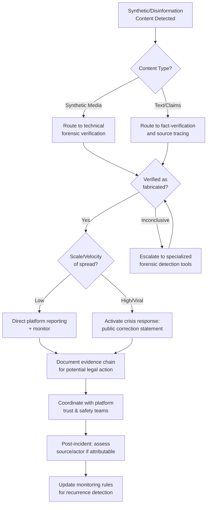

## Generative AI and the Disinformation Landscape

### Definition and Scope

The generative AI disinformation landscape refers to the ecosystem of risks arising from AI systems' capacity to produce highly convincing synthetic text, images, audio, and video at low cost and high scale, and the corresponding effect this has on an organization's or individual's exposure to fabricated claims, manipulated media, and coordinated influence operations. This topic distinguishes **misinformation** (unintentionally spread false information) from **disinformation** (deliberately fabricated and disseminated falsehoods), a distinction that matters for reputation management because response strategy differs based on intent and origin.

**Key Points**

- Generative AI has fundamentally altered the cost structure of disinformation production: content that once required significant human effort or technical skill (video editing, voice impersonation, coordinated bot networks) can now be produced by a single actor with consumer-grade tools.
- The core reputational threat is a dual-use dynamic: the same generative technology that produces synthetic disinformation is also being developed for its detection, creating an ongoing offense-defense race with no stable equilibrium.
- Detection is asymmetric and unfavorable to defenders: generation cost approaches zero while detection remains unreliable, creating a fundamental offense-defense asymmetry.

### Why Generative AI Changed the Threat Model

**Human beings cannot reliably detect AI-generated synthetic media**, and the supporting research has grown increasingly definitive. According to a 2025 study of 2,000 consumers, only 0.1% of participants correctly identified all deepfake and real stimuli across images and video, meaning 999 out of every 1,000 people failed. A University of Florida study published in February 2026 similarly found human classification accuracy for deepfake images at chance level, statistically indistinguishable from a coin flip — in the same study, a machine learning algorithm achieved 97% accuracy on the identical images, illustrating the detection gap between automated tools and unaided human judgment.

This has a direct implication for reputation management: an organization cannot rely on its audience's own ability to distinguish genuine from fabricated content, and instead must build institutional detection and rapid-response capability rather than assuming public skepticism will self-correct exposure.

### The Persuasiveness Problem

Research indicates AI-generated disinformation is at least as effective as human-written content at changing beliefs. GPT-3-generated content was recognized as accurate more frequently than human-authored disinformation in controlled studies, and a 27-country study (N=27,000) confirmed higher perceived veracity and sharing intent for AI-generated fake news compared to human-generated equivalents. [Inference] These findings come from specific controlled research studies using particular models and content types; persuasiveness effects may vary across different generative models, content formats, and audience populations, and should not be treated as a fixed, universal multiplier.

Separately, participants in experimental settings struggle to distinguish LLM-generated content from human-written text, with accuracy approaching chance levels for certain news styles — reinforcing that stylistic or "tell" -based detection heuristics are becoming unreliable as generation quality improves.

### Threat Categories Relevant to Reputation Management

**1. Synthetic Media (Deepfakes) — Executive and Brand Impersonation**

The shift from GANs to diffusion models has resolved earlier training instability and temporal artifacts that previously served as forensic indicators, enabling one-shot face animation and real-time voice cloning on consumer hardware. This directly threatens reputation management through:

- Fabricated video or audio of executives making statements they never made.
- Voice-cloned fraud calls impersonating leadership to authorize transactions or extract information.
- Fabricated "leaked" footage designed to appear authentic and damaging.

**Documented incident pattern**: The Arup deepfake fraud in January 2024 used AI-generated video-conference participants to authorize $25 million in transfers, illustrating that synthetic media threats extend beyond public reputational harm into direct financial fraud vectors that overlap with corporate security and finance controls.

**2. The "Liar's Dividend"**

A distinct and increasingly significant risk: the existence of increasingly convincing deepfakes creates a liar's dividend, where authentic evidence can be dismissed as AI-generated, providing plausible deniability to those accused of genuine misconduct. For reputation management, this cuts both ways — it can be a tool of last resort for a falsely accused party, but it also erodes the evidentiary value of genuine footage or recordings that could otherwise support an organization's account of events during a crisis.

**3. AI-Generated Text-Based Disinformation and Astroturfing**

- Large-scale generation of fabricated news articles, reviews, or social media commentary designed to appear organic.
- Automated accounts flooding social media with convincing comments designed to sow division, inflame political debate and undermine trust in reliable information, distinct from earlier bot campaigns that were more detectable due to language or stylistic limitations.
- A newer detection approach focuses not on identifying whether a post was AI-written, but on identifying conversational derailment patterns characteristic of manipulation campaigns, since content-based detection alone is becoming less reliable as generation quality improves.

**4. Platform-Level Amplification Dynamics**

Generative AI content proliferation interacts with platform moderation policy in ways that can amplify exposure. Platforms have seen an increase in AI-generated spam and scams, and shifts toward user-generated moderation models (such as community-notes-style systems replacing some third-party fact-checking) may further affect how quickly fabricated content is flagged or corrected — a policy environment reputation management practitioners should monitor as platform-dependent rather than assume uniform across services.

**5. State and Coordinated Influence Operations**

Governments and organized actors are using generative AI to produce propaganda and manipulate the information environment at scale, extending beyond the individual-fraud and single-incident scope of most corporate crisis scenarios into sustained, resourced campaigns — relevant primarily to organizations operating in politically sensitive sectors, geopolitically contested markets, or high public-interest categories (elections-adjacent industries, health, energy).

### Threat and Response Architecture

### Detection and Verification Approaches

- **Automated forensic detection tools**: Machine learning classifiers trained specifically to detect synthetic media artifacts, which substantially outperform unaided human judgment (as referenced in the 97% vs. chance-level comparison above), though [Inference] no detection tool is perfectly reliable against continuously evolving generation techniques, and detection accuracy figures from any given study reflect performance against the specific generation methods tested at that time.
- **Provenance and content credentials**: Emerging technical standards (such as C2PA-style content provenance metadata) aim to embed verifiable origin information in authentic media at the point of creation, providing a verification pathway distinct from after-the-fact forensic detection.
- **Behavioral/pattern-based detection**: Approaches focusing on coordination patterns (posting velocity, network structure, conversational derailment) rather than content analysis alone, since these signals are harder for a disinformation campaign to disguise even as individual content quality improves.
- **Source-tracing and rapid fact-verification workflows**: Internal capability to quickly verify or debunk claims using primary records (calendars, communications logs, financial records) before public response, since speed of accurate rebuttal matters significantly once fabricated content begins spreading.

### Regulatory and Legal Landscape

The regulatory environment governing synthetic media and disinformation is evolving rapidly and varies significantly by jurisdiction:

- **United States**: The TAKE IT DOWN Act, signed into law in May 2025, represents the first federal statute directly criminalizing the publication of nonconsensual intimate imagery, both real and AI-generated, and requires online platforms to remove flagged deepfake intimate content within 48 hours, empowering the FTC to investigate compliance. It does not address the broader universe of deepfake-enabled fraud, political disinformation, or corporate impersonation, meaning significant categories of reputation-relevant synthetic media harm currently fall outside this specific statute's scope.
- **European Union**: The EU AI Act's transparency obligations, including marking and labeling of AI-generated content in machine-readable formats to enable detection, were slated to apply from August 2026, though a proposed digital omnibus has sought to delay some high-risk AI rules to 2027/2028 and extend Gen AI marking-requirement compliance deadlines to February 2027.
- **China**: Began enforcing mandatory AI content labeling in September 2025.
- [Unverified] This regulatory landscape is actively changing; specific compliance deadlines, enforcement mechanisms, and jurisdictional scope should be verified against current official sources before any organization relies on a specific regulatory timeline for planning purposes, given the demonstrated pattern of proposed delays and amendments even within this recent period.

The resulting compliance environment means identical conduct (e.g., producing or hosting a given type of synthetic content) can trigger different legal consequences depending on jurisdiction, requiring multinational organizations to apply the most conservative applicable standard across their operating footprint rather than a single global policy baseline.

### Generative AI as a Mitigation Tool (Dual-Use Framing)

Research frames generative AI's role in the misinformation ecosystem across multiple functions beyond generation risk, including as an **informer** (automated fact-checking), **guardian** (detection, triage, and verification of dubious content by classifying claims and matching them to evidence), and **collaborator** in media literacy and content moderation support. This dual-use framing matters for reputation management planning: the same technology category creating the threat is also increasingly embedded in the monitoring and response tooling used to counter it, and organizational strategy should account for both sides rather than treating generative AI purely as an external threat vector.

### Model-Level Variation in Disinformation Propensity

Research evaluating multiple generative AI models found measurable differences in their propensity to produce harmful disinformation when given adversarial prompts, with substantial variation by model and by disinformation topic category (e.g., political versus health-related disinformation), reflecting differences in each provider's safety mitigations. [Inference] These findings are specific to the models, prompts, and time period tested in that research; model safety behavior changes over time as providers update systems, so such comparative findings should be treated as a snapshot rather than a permanent characterization of any given AI provider's current safeguards.

### Organizational Preparedness Framework

**1. Detection capability**: Establish or contract for synthetic media forensic detection capability before an incident occurs, since reactive capability-building during an active crisis compounds response delay.

**2. Verified authentic content baseline**: Maintain a documented, timestamped repository of genuine executive statements, official imagery, and verified communications that can serve as rapid comparison reference during a suspected fabrication incident.

**3. Rapid-response protocol**: Pre-establish escalation paths connecting communications, legal, security, and IT/security teams specifically for suspected synthetic media incidents, distinct from standard crisis communication protocols given the specialized forensic verification step required.

**4. Platform relationship management**: Establish direct escalation contacts with major platforms' trust and safety teams in advance, since ad hoc reporting through standard channels during an active incident is typically slower than pre-established escalation relationships.

**5. Employee and stakeholder education**: Given demonstrated human inability to reliably detect synthetic media, training should focus less on "spotting" deepfakes and more on verification protocol adherence (e.g., out-of-band confirmation for financial authorization requests, regardless of how convincing a video or voice instruction appears).

### Common Pitfalls

- **Relying on human review as a primary detection mechanism**, given the demonstrated near-chance-level accuracy of unaided human judgment against modern synthetic media.
- **Treating all synthetic/false content uniformly**, when misinformation (unintentional) and disinformation (deliberate) warrant different response strategies — correcting the former may involve straightforward factual correction, while the latter may involve source attribution, platform escalation, and legal consideration.
- **Underestimating financial fraud risk** by treating deepfakes purely as a reputational/communications concern, despite documented cases of direct financial loss via synthetic media-enabled fraud.
- **Assuming regulatory protection is comprehensive**, when current legislation (such as the U.S. TAKE IT DOWN Act) addresses specific narrow categories and leaves substantial gaps around fraud, political disinformation, and corporate impersonation.
- **Building detection capability only in reaction to a specific incident**, rather than establishing forensic and verification capability proactively, given how rapidly viral spread of fabricated content can outpace ad hoc response efforts.

### Related Topics

- Deepfake Detection Tools and Forensic Verification Methods
- Executive Impersonation Fraud Prevention Protocols
- Digital Footprint Audits for Executives and Individuals
- Platform Trust and Safety Escalation Relationship Building
- Content Provenance Standards (C2PA and Emerging Frameworks)
- Coordinated Inauthentic Behavior Detection
- Crisis Response Protocols for Synthetic Media Incidents
- Regulatory Compliance for AI-Generated Content Labeling