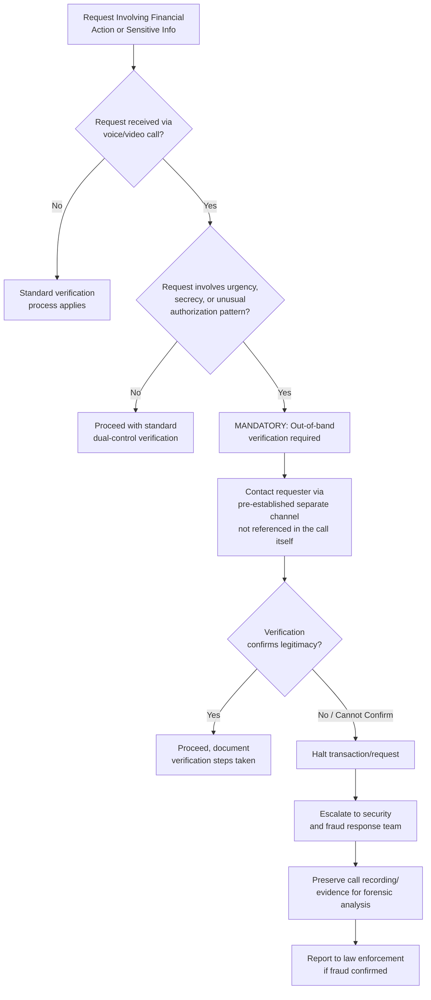

## Deepfake Fraud and Executive Impersonation

### Definition and Scope

Deepfake fraud and executive impersonation refers to the use of AI-generated synthetic audio, video, or image content to convincingly imitate a real executive, employee, or trusted individual for the purpose of deceiving targets into authorizing fraudulent transactions, disclosing sensitive information, or taking other harmful actions. This differs from broader disinformation (covered separately) in that the objective here is typically direct financial or operational fraud through targeted, often one-to-one or small-group deception, rather than mass public narrative manipulation.

**Key Points**

- The threat vector combines two previously distinct fraud categories — social engineering and identity impersonation — with a technical capability (real-time voice and video synthesis) that removes the traditional tells (voice inconsistency, video artifacts) that once helped targets detect deception.
- This is simultaneously a security/fraud-prevention problem and a reputation management problem: successful incidents create direct financial loss, and public disclosure of the incident (voluntary or forced) creates secondary reputational exposure regarding organizational security posture.
- Effective defense relies on procedural controls (verification protocols) rather than perceptual detection, since humans and current technology both struggle to reliably distinguish synthetic from authentic media in real time.

### Technical Capability Driving the Threat

The shift from GANs (generative adversarial networks) to diffusion-based generative models has resolved earlier training instability and temporal artifacts that previously served as forensic indicators of synthetic video, enabling one-shot face animation and real-time voice cloning on consumer-grade hardware. This means the technical barrier to producing convincing synthetic executive impersonation has dropped from requiring specialized skill and equipment to being achievable with widely available consumer tools, fundamentally changing the threat's accessibility to a broader range of potential bad actors, not just sophisticated organized fraud operations.

### Documented Incident Pattern

**The Arup case (January 2024)**: A finance employee at the engineering firm Arup was deceived into authorizing $25 million in transfers after participating in a video conference call featuring AI-generated synthetic representations of company executives, including the CFO. This incident is frequently cited as a landmark example because it demonstrated that synthetic media fraud had moved beyond single-channel deception (a phone call using cloned voice) to multi-participant, real-time video impersonation sophisticated enough to withstand live interaction rather than merely pre-recorded content.

[Inference] This is one specific, well-documented case; the broader base rate of similar incidents (including those not publicly disclosed, given reputational incentives to avoid disclosure) is difficult to estimate precisely and should not be assumed representative of typical incident scale or frequency across all organizations.

### The Fundamental Asymmetry

Generation cost for synthetic media approaches zero while detection remains unreliable, creating a fundamental offense-defense asymmetry: an attacker needs only a modest amount of publicly available audio/video of the target executive (often readily available from earnings calls, conference talks, or media appearances) and consumer-grade tools, while a defending organization must build and maintain forensic detection capability, verification protocols, and organizational awareness on an ongoing basis. This asymmetry is structural rather than temporary, meaning defense strategy should assume the threat will remain persistent and evolving rather than treat any single detection method as a durable solution.

### Attack Patterns and Vectors

**1. CEO/Executive Voice Fraud ("Vishing" with Cloning)**

- A cloned voice, often trained on publicly available audio (earnings calls, interviews, podcasts), used in a phone call to instruct an employee — typically in finance or accounts payable — to execute an urgent wire transfer or payment.
- Frequently paired with urgency and authority pressure tactics consistent with traditional business email compromise (BEC) social engineering, now enhanced with audio verification that previously served as a trust signal.

**2. Real-Time Video Conference Impersonation**

- As in the Arup incident, synthetic video representations of one or more executives participate in a live video call, lending the fraudulent request additional credibility through the appearance of multi-person verification.
- This attack pattern specifically defeats "call them back" or "verify visually" advice that was previously considered a reasonably strong control, since the video itself is the compromised element.

**3. Pre-Recorded Synthetic Statement Fraud**

- Fabricated video or audio clips designed to appear as a leaked or recorded statement from an executive, used either for direct fraud (e.g., fake announcements affecting stock price) or reputational sabotage.
- Distinct from real-time impersonation in that it does not require live interaction, making it detectable via forensic analysis given sufficient time, but also capable of rapid viral spread before verification can occur.

**4. Impersonation for Information Extraction**

- Rather than directly requesting a financial transaction, synthetic impersonation is used to extract sensitive information (credentials, strategic plans, confidential data) under the guise of a legitimate internal request from a trusted authority figure.

### Defense Architecture

### Core Procedural Controls

**1. Out-of-band verification (the primary defense)**

The single most robust control against synthetic media fraud is requiring verification through a channel independent of the one used to make the request. If a request arrives via video call, verification should occur via a separately initiated phone call to a known, pre-verified number — not a number provided during the suspicious call itself, and not a reply to the same communication thread.

**2. Dual-control and multi-person authorization for high-value transactions**

Financial controls requiring independent authorization from a second party for transactions above a defined threshold reduce reliance on any single point of human judgment being deceived by synthetic media, since the fraud would need to simultaneously deceive multiple independent verification points.

**3. Codeword or challenge-response protocols**

Pre-established verification phrases or challenge questions known only to legitimate parties, used specifically for high-stakes verbal or video authorization requests, provide a verification layer that synthetic media (which typically cannot access private, non-public information) cannot easily replicate.

**4. Mandatory delay/cooling-off periods for unusual requests**

Procedural requirements that introduce a time delay for atypical, urgent, or first-time transaction requests reduce the effectiveness of urgency-based social engineering tactics that both traditional and AI-enhanced fraud rely on.

**5. Employee training reframed around protocol adherence, not detection**

Given the demonstrated near-chance-level human accuracy in detecting synthetic media, training should explicitly de-emphasize "learning to spot deepfakes" as a primary defense and instead reinforce unconditional adherence to verification protocol regardless of how convincing or authoritative a request appears — including scenarios where the "executive" on the call expresses frustration or urgency about the verification delay itself.

### Reducing Attack Surface: Limiting Exploitable Source Material

Since synthetic voice and video generation typically requires source material of the target (audio/video samples), organizations can consider:

- Auditing the volume and accessibility of high-quality audio/video content of senior executives across public platforms, as part of the broader digital footprint audit process for high-profile individuals.
- [Inference] This is a partial mitigation at best — the trade-off between limiting public executive visibility (which itself has legitimate business, investor relations, and brand value) and reducing exploitable source material requires case-by-case judgment, and it does not address risk from executives whose public speaking or media presence is a core job function that cannot reasonably be curtailed.

### Detection and Forensic Response

When a suspected deepfake fraud attempt occurs or is detected after the fact:

- **Preserve all available evidence**: Call recordings, video files, associated communications, and transaction records should be preserved immediately and in their original format for forensic analysis, since compression or format conversion can degrade forensic-relevant artifacts.
- **Engage specialized forensic detection**: Automated detection tools substantially outperform human judgment in identifying synthetic media artifacts, though [Inference] no detection tool provides guaranteed accuracy against continuously evolving generation techniques, and results should be treated as an input to investigation rather than definitive proof in isolation.
- **Coordinate with financial institutions immediately**: For attempted or completed fraudulent transfers, immediate notification to involved financial institutions can in some cases enable transaction recall or freezing, though success depends heavily on elapsed time and the destination institution's cooperation.
- **Law enforcement engagement**: Given the cross-jurisdictional nature of much deepfake-enabled fraud, engagement with appropriate law enforcement (which may include specialized cybercrime units) should occur promptly, recognizing that recovery of funds is not guaranteed even with timely reporting.

### Reputational Dimension: Disclosure Decisions

Beyond the immediate fraud response, organizations face a reputational decision regarding public disclosure of a successful or attempted deepfake fraud incident:

- **Regulatory disclosure obligations**: Publicly traded companies may have securities disclosure obligations if the incident is material, independent of communications preference — this connects directly to the broader tension between strategic silence and legal disclosure requirements covered elsewhere in this curriculum.
- **Stakeholder trust considerations**: Proactive, transparent disclosure of a fraud incident (once confirmed and appropriately investigated) can in some cases be framed constructively as evidence of sophisticated threat awareness and response capability, whereas delayed or forced disclosure (e.g., via investigative journalism or regulatory action) tends to compound reputational damage with a secondary "cover-up" narrative.
- **Industry-wide framing opportunity**: Since deepfake fraud is a rapidly growing, widely-discussed threat category, organizations disclosing incidents are increasingly able to frame their experience within a broader industry context (i.e., "this is an evolving threat affecting organizations broadly") rather than as an isolated organizational failure — though this framing must be handled carefully to avoid appearing to minimize accountability for internal control gaps that contributed to the incident.

### Regulatory Context

Current regulation directly targeting deepfake-enabled fraud remains limited relative to the scale of the threat. In the United States, the TAKE IT DOWN Act (May 2025) criminalizes nonconsensual intimate imagery, including AI-generated content, but does not address the broader universe of deepfake-enabled fraud, political disinformation, or corporate impersonation — meaning organizations largely rely on existing wire fraud, financial crime, and corporate governance frameworks rather than deepfake-specific statutes when pursuing legal remedies for this particular threat category. [Unverified] The regulatory landscape specific to deepfake fraud is evolving and jurisdiction-dependent; current applicable statutes should be verified with legal counsel rather than assumed from general regulatory trend awareness.

### Common Pitfalls

- **Relying on visual/audio "gut check" as a verification method**, given demonstrated near-chance-level human detection accuracy against modern synthetic media, including in live, interactive video contexts.
- **Treating a phone callback to a number provided during the suspicious interaction as sufficient verification**, when legitimate out-of-band verification requires an independently sourced, pre-existing contact method.
- **Single-point-of-failure authorization processes** for high-value transactions, which synthetic media fraud specifically exploits by targeting the human judgment of a single decision-maker.
- **Treating this purely as an IT/security issue**, when effective defense requires coordinated protocol design and training across finance, executive assistants, and any staff with transaction authorization responsibility.
- **No pre-established incident response and disclosure protocol specific to synthetic media fraud**, resulting in ad hoc, reactive decision-making during an active incident regarding both fraud containment and reputational disclosure strategy.

### Related Topics

- Generative AI and the Disinformation Landscape
- Digital Footprint Audits for Executives and Individuals
- Business Email Compromise and Social Engineering Defense
- The Strategic Silence Approach and Its Risks
- Regulatory Disclosure Obligations for Material Security Incidents
- Financial Controls and Dual-Authorization Frameworks
- Crisis Response Protocols for Synthetic Media Incidents
- Law Enforcement Coordination for Cross-Border Cyber Fraud