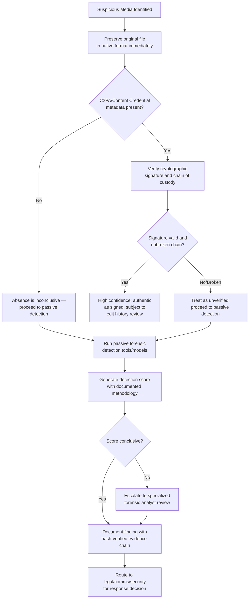

## Deepfake Detection and Forensic Verification

### Definition and Scope

Deepfake detection and forensic verification is the combined technical and procedural discipline of establishing whether a given piece of media (image, audio, or video) is authentic or synthetically generated/manipulated, and of producing evidence about that determination robust enough to support organizational decision-making, public correction statements, or legal proceedings. The field splits into two structurally different approaches: **passive detection** (after-the-fact analysis of content to identify synthetic artifacts) and **proactive provenance** (establishing verifiable authenticity at the moment of capture or creation), and a mature verification capability requires both.

**Key Points**

- Passive detection and provenance are complementary, not substitutable: provenance systems require the *authentic* content to have been signed at creation, meaning they offer no protection for the vast volume of unmarked content already in circulation or for generators that decline to participate.
- Detection accuracy figures from any benchmark are time-bound: they reflect performance against known generation methods at the time of testing, and new generation techniques continuously emerge that may evade previously effective detectors.
- Forensic verification for legal or public-disclosure purposes requires not just a detection judgment but a defensible chain of custody and documentation process, since a technically correct determination without proper evidentiary handling may not hold up under later scrutiny.

### Passive Detection: How It Works

Passive detection tools apply machine learning classifiers trained to identify artifacts characteristic of synthetic generation — inconsistencies in texture, sensor noise patterns, temporal inconsistencies across video frames, or statistical signatures left by generative model architectures.

**Performance context**: Automated detection substantially outperforms unaided human judgment. In controlled studies, human classification accuracy for deepfake images has been found to sit at chance level, statistically indistinguishable from a coin flip, while machine learning approaches evaluated on the same image sets have achieved substantially higher accuracy (97% in at least one cited study). [Inference] This gap is well-documented directionally, but exact accuracy figures are specific to the benchmark, generation methods, and detection model tested; they should not be read as a fixed, universal performance guarantee for any given commercial detection tool against all current or future generation techniques.

**Structural limitation**: NIST runs the Open Media Forensics Challenge, which benchmarks deepfake-detection tools and has documented their limits — a program specifically established because passive detection tools have known, measurable failure modes, which is a primary reason provenance-by-design approaches are increasingly emphasized as complementary rather than passive detection being treated as a sufficient standalone solution.

**Adversarial dynamics**: Passive detection operates in an ongoing adversarial environment: as detection methods improve, generation methods evolve to evade them, and benchmark competitions (such as recent NTIRE deepfake detection challenges) explicitly test detector robustness against degraded or adversarially modified content, with top-performing approaches typically relying on large foundation models, ensembles, and degradation training to combine generality and robustness rather than any single simple heuristic.

### Proactive Provenance: Content Credentials and C2PA

**What C2PA is**: The Coalition for Content Provenance and Authenticity (C2PA) is an open technical standard, founded in February 2021 by Adobe, Arm, BBC, Intel, and Microsoft, that embeds verifiable, cryptographically signed provenance metadata into digital content at the point of creation — recording who created content, with what tool, and what edits were subsequently applied.

**Critical limitation to understand**: C2PA does not detect deepfakes or classify content as real or fake. It is a provenance standard that records the history of a digital file, not a forensic authenticity judgment. This distinction matters significantly: the presence of a C2PA credential does not by itself prove content is "real," and the absence of one does not prove content is fake — it simply provides (or fails to provide) a documented chain of custody for content that was signed at creation.

**Industry adoption status**: The standard has moved from theoretical proposal to hardware implementation. Camera manufacturers including Sony, Canon, Nikon, Leica, and Samsung now sign images at the moment of capture with hardware-rooted cryptographic keys, and version 2.2 (May 2025) added video and streaming support, with live-stream segment signing following in late 2025. The C2PA steering committee includes Adobe, Google, Microsoft, OpenAI, Amazon, Meta, BBC, and Sony, and the standard surpassed 6,000 members and affiliates by January 2026.

**Generation-side watermarking**: A complementary proactive approach embeds imperceptible signals directly into generative AI outputs at the moment of creation (an approach exemplified by watermarking schemes such as SynthID), aiming to make AI-generated content self-identifying rather than relying solely on detection of authentic content's absence of a provenance signal.

**The fundamental adoption gap**: Both C2PA provenance and generation-side watermarking are voluntary and depend on adoption by device manufacturers and AI providers; they provide no protection against the enormous volume of unmarked content already in circulation, or against generators that decline to participate in these standards, meaning passive detection remains the only recourse for that unmarked content.

### Detection and Verification Workflow

### Evidentiary Chain of Custody Requirements

For findings that may support legal action, regulatory disclosure, or public correction statements, technical detection alone is insufficient — a defensible evidentiary process is required:

- **Cryptographic hashing for integrity verification**: SHA-256 is a commonly used working standard — a hash fingerprints the artifact, and recomputing and comparing that hash each time custody changes proves the file has not been altered during the investigation process.
- **NIST digital evidence guidance**: NIST Special Publication 800-86 ("Guide to Integrating Forensic Techniques into Incident Response") and related guidance such as SP 800-201 establish integrity-verification practices that support defensible digital evidence handling, anchored on this cryptographic hashing approach.
- **Immutable logging**: Detection findings (confidence scores, timestamps, detection model/version used) should be logged in a form that cannot be silently overwritten or altered before it is needed, supporting later scrutiny of how a determination was reached.
- [Unverified] Specific evidentiary admissibility standards (such as proposed rules addressing AI-generated or authenticated digital evidence in various legal systems) are an actively evolving area of law; current admissibility requirements in a specific jurisdiction should be confirmed with legal counsel rather than assumed from general forensic best practice alone.

### Real-Time Detection for Live Communications

Beyond after-the-fact analysis of static files, emerging enterprise approaches address real-time verification during live video/audio communications — directly relevant to defending against the live executive-impersonation fraud patterns covered in the deepfake fraud topic:

- Systems can extract and generate digital fingerprints from a known individual's visual and audio characteristics, compare them against pre-stored normalized fingerprints during a live session, and apply an AI-based detection model to flag potential synthetic manipulation in real time.
- Policy-based response frameworks can then apply differentiated actions based on detected risk level and the user's role — for example, holding access and requiring re-authentication on a fingerprint mismatch, or escalating to administrator contact and blocking access entirely when multiple detection flags trigger simultaneously.
- [Inference] This class of real-time enterprise detection capability is an emerging and rapidly developing product category rather than a mature, standardized practice; specific vendor capabilities, accuracy rates, and deployment maturity vary and should be evaluated directly against current documentation rather than assumed uniform across providers.

### Regulatory Drivers for Provenance Adoption

The EU AI Act's Article 50 establishes transparency obligations for AI-generated content, requiring providers of AI systems that generate synthetic content (images, audio, video, text) to ensure outputs are marked in a machine-detectable manner as artificially generated, with obligations slated to be fully applicable from August 2, 2026 (though, as with other AI Act provisions, associated timelines have been subject to proposed delays via a digital omnibus process — see the broader disinformation-landscape discussion for the caveat on this evolving timeline). This regulatory direction is a primary driver of accelerating provenance standard adoption, since compliance increasingly requires machine-readable provenance marking rather than voluntary best practice alone.

### Building Organizational Forensic Capability

**1. Establish detection capability before an incident, not during one**

Given the technical complexity and evidentiary requirements involved, ad hoc detection tool selection and deployment during an active crisis compounds response delay; organizations should identify and, where appropriate, contract with forensic detection capability in advance.

**2. Combine passive detection with provenance where possible**

Since neither approach is individually sufficient, a mature verification posture uses provenance signals as a first check (where available) and falls back to passive forensic detection for unmarked or unverifiable content — consistent with the dual-layer approach described in current industry guidance combining content credentials with certified forensic acquisition methodology.

**3. Maintain a verified-authentic content baseline**

A documented, hash-verified repository of known-authentic executive statements and official media (referenced in the deepfake fraud topic) supports faster comparative verification when a suspected fabrication surfaces, since analysts have a trusted reference point rather than needing to establish authenticity from first principles under time pressure.

**4. Define escalation thresholds tied to confidence and impact**

Not every suspected synthetic media incident warrants the same response intensity; a defined framework connecting detection confidence level and potential organizational impact to specific escalation paths (legal, communications, security, law enforcement) avoids both under-reaction to high-confidence, high-impact findings and resource-wasting over-escalation of low-confidence, low-impact ones.

**5. Plan for inconclusive outcomes**

Because detection tools have documented, benchmarked limits, organizations should have a defined process for handling genuinely inconclusive forensic findings — including specialized analyst escalation and, where public-facing stakes are high, appropriately hedged public communication that does not overstate certainty in either direction.

### Common Pitfalls

- **Treating the presence of C2PA metadata as proof of authenticity**, when the standard explicitly does not classify content as real or fake — it records provenance history, which must still be evaluated for signature validity and completeness.
- **Treating detection tool output as infallible**, when NIST's own benchmarking programs exist specifically because these tools have documented, measurable limits, particularly against novel generation methods not represented in a detector's training data.
- **Skipping chain-of-custody documentation** during initial informal investigation, only to find the evidence insufficiently documented if the matter later escalates to legal or regulatory proceedings.
- **Assuming provenance standards protect against all synthetic media risk**, when adoption remains voluntary and provides no coverage for the substantial volume of already-circulating unmarked content or non-participating generation tools.
- **Building detection capability only after facing an incident**, rather than establishing verification infrastructure, vendor relationships, and internal protocols proactively, given the response-time pressure inherent in fast-spreading synthetic media incidents.

### Related Topics

- Deepfake Fraud and Executive Impersonation
- Generative AI and the Disinformation Landscape
- Content Provenance Standards (C2PA and Emerging Frameworks)
- Crisis Response Protocols for Synthetic Media Incidents
- Digital Evidence Handling and Chain-of-Custody Practices
- Regulatory Compliance for AI-Generated Content Labeling
- Real-Time Communication Security for Executive Verification
- Law Enforcement Coordination for Cross-Border Cyber Fraud