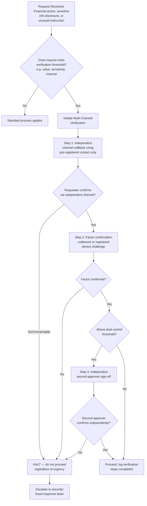

## Multi-Channel and Multi-Factor Verification Protocols

### Definition and Scope

Multi-channel and multi-factor verification protocols are procedural controls designed to confirm the authenticity of a request, instruction, or communication by requiring confirmation across independent channels and/or independent factors, rather than trusting the apparent authenticity of any single communication instance. In the context of AI and synthetic media threats, these protocols function as the primary organizational defense against deepfake-enabled fraud and impersonation, since they shift the security dependency away from human perceptual judgment (which is demonstrably unreliable against synthetic media) and onto structural, procedural redundancy that synthetic content alone cannot satisfy.

**Key Points**

- The core design principle is independence: a verification channel or factor is only protective if an attacker who has compromised the primary communication vector (a cloned voice, a synthetic video feed, a compromised email account) cannot also control or predict the verification channel.
- These protocols are the direct procedural countermeasure to the finding that humans cannot reliably detect synthetic media — rather than asking staff to "spot the fake," the protocol removes the need for that judgment entirely by requiring independent confirmation regardless of how convincing the original request appears.
- Verification protocols must be designed to withstand social pressure, since skilled social engineering (AI-enhanced or otherwise) specifically targets urgency, authority, and secrecy to discourage exactly the verification step the protocol requires.

### Core Design Principles

**1. Channel independence**

A verification channel is independent only if it does not share a compromise point with the original communication. A callback to a phone number provided during a suspicious call is not independent verification, since the attacker controls that number. A callback to a number retrieved from a pre-existing, separately maintained directory is independent.

**2. Factor diversity**

Multi-factor verification combines different categories of confirmation — something known (a codeword), something possessed (a registered device receiving a confirmation code), and procedural confirmation (a second authorized person's independent sign-off) — so that compromising one factor does not compromise the whole verification.

**3. Protocol invariance under pressure**

An effective protocol is designed to apply uniformly regardless of the requester's apparent seniority, urgency, or stated justification for bypassing it. Verification steps that can be waived by sufficient authority or urgency are not genuine controls, since urgency and authority pressure are precisely the tactics used in both traditional social engineering and AI-enhanced impersonation attacks.

**4. Pre-established, not improvised, verification paths**

Verification contact methods, codewords, and escalation paths must be established and documented before they are needed. Improvising a verification method during an active, high-pressure interaction defeats the purpose, since the improvised method itself may be suggested or influenced by the attacker.

### Verification Protocol Architecture

### Protocol Components in Detail

**Out-of-band callback verification**

The foundational control: any request received through one channel (video call, phone call, email, chat) that involves financial action, credential disclosure, or a significant deviation from routine process must be confirmed through a separately initiated contact using a pre-existing, independently sourced method — typically a phone number retrieved from an internal directory maintained outside the communication channel in question, not one supplied during the interaction itself.

**Codeword and challenge-response systems**

Pre-arranged verification phrases, known only to legitimate parties and established through a separate, secure channel in advance, provide a lightweight but effective factor that synthetic media cannot replicate without prior compromise of that specific information — distinguishing this from generic identity claims that a well-informed impersonator (human or AI-assisted) might otherwise satisfy.

**Dual control and independent second-approval**

For transactions or disclosures above a defined risk threshold, requiring sign-off from a second, independent authorized individual — who did not participate in or witness the original request — ensures that successfully deceiving one person is insufficient to complete the action. This is a structural, not perceptual, control: it does not depend on the second approver being more skilled at detecting deception, only on the attack needing to succeed twice, independently, to proceed.

**Mandatory delay for atypical requests**

Introducing a defined minimum time delay before executing first-time, unusually large, or urgent-and-unprecedented requests interrupts the psychological pressure tactics that both traditional social engineering and AI-enhanced impersonation rely on, giving verification steps room to occur before irreversible action is taken.

**Device or credential-based confirmation**

Requiring confirmation via a registered device (e.g., a push notification to a company-issued phone, or a hardware security key) adds a possession-based factor that is not satisfied merely by convincing audio or video content, since the attacker would additionally need physical or software access to the registered device itself.

### Applying the Protocol Across Request Types

| Request Type | Minimum Verification Requirement |
| --- | --- |
| Routine, previously-established recurring payment | Standard process; no elevated verification |
| First-time or unusual-value financial transfer | Out-of-band callback + codeword confirmation |
| Transfer above high-value threshold | Out-of-band callback + codeword + independent second-approver |
| Sensitive credential or data disclosure request | Out-of-band callback via pre-registered contact only |
| Instruction to bypass standard process "due to urgency" | Treat urgency itself as an elevated-risk signal; apply full protocol, never reduce it |
| Executive request received via video/voice call with unusual characteristics | Full protocol regardless of apparent seniority of requester |

### Organizational Implementation Considerations

**Directory and contact management**

The integrity of out-of-band verification depends entirely on the independence and accuracy of the pre-registered contact directory. This directory must be maintained through a controlled, auditable process separate from day-to-day communications, and access to modify it should itself be subject to verification controls, since a compromised directory undermines every verification built on top of it.

**Training reframed around protocol adherence, not detection skill**

Given the demonstrated unreliability of human synthetic-media detection, training programs should explicitly avoid framing success as "learning to recognize a deepfake." Instead, training should reinforce unconditional protocol adherence — including specific rehearsal of scenarios where a "senior executive" expresses frustration or urgency about the verification delay, since resistance to authority pressure is often the actual point of failure rather than a lack of technical awareness.

**Executive and assistant-level buy-in**

Verification protocols are frequently undermined not by front-line staff but by senior individuals who bypass their own organization's verification steps out of impatience or a belief that the protocol doesn't apply to them personally. Explicit executive sponsorship and visible adherence to the protocol by leadership themselves is a meaningful factor in whether staff feel empowered to enforce verification against an apparently senior requester.

**Protocol testing and drills**

[Inference] Periodic simulated social-engineering or impersonation drills are a commonly recommended practice for validating that verification protocols function under realistic pressure rather than only in tabletop discussion, though the appropriate frequency and format depend on organizational risk profile and resourcing, and there is no single universal standard for drill cadence.

### Interaction with Real-Time Technical Detection

Multi-channel/multi-factor procedural verification and real-time technical deepfake detection (covered in the forensic verification topic) are complementary layers rather than substitutes for one another:

- Procedural verification does not depend on correctly identifying synthetic media in the moment, making it robust even against generation techniques that would defeat current detection tools.
- Technical detection can serve as an additional signal feeding into the decision of whether to escalate a request to full verification protocol, but should not be relied upon as a sufficient standalone gate given documented detection tool limitations.
- Some enterprise systems combine both: real-time fingerprint-mismatch or AI-detection flags during a live call can automatically trigger a policy response requiring the human-verification steps described here, rather than either layer operating in isolation.

### Common Pitfalls

- **Allowing exceptions for "urgent" or "confidential" requests**, which defeats the protocol's purpose since urgency and confidentiality framing are the specific pressure tactics the protocol is designed to withstand.
- **Using a callback number or contact method supplied during the suspicious interaction itself**, which provides no actual independence and creates false confidence in a verification step that has not genuinely occurred.
- **Treating verification as a one-time setup rather than an audited, maintained system**, allowing the underlying contact directory or codeword system to become stale, inaccurate, or informally bypassed over time.
- **Applying verification inconsistently by seniority**, exempting senior executives from the same protocol required of other staff, despite executives being high-value impersonation targets specifically because of the authority their instructions carry.
- **Relying solely on perceptual judgment as a backstop**, retaining an implicit assumption that staff will "notice something off" even after a procedural protocol is implemented, undermining the protocol's core purpose of removing dependence on unreliable human detection.

### Related Topics

- Deepfake Fraud and Executive Impersonation
- Deepfake Detection and Forensic Verification
- Business Email Compromise and Social Engineering Defense
- Financial Controls and Dual-Authorization Frameworks
- Crisis Response Protocols for Synthetic Media Incidents
- Employee Training Design for Social Engineering Resistance
- Real-Time Communication Security for Executive Verification
- Incident Escalation Pathways for Suspected Fraud Attempts