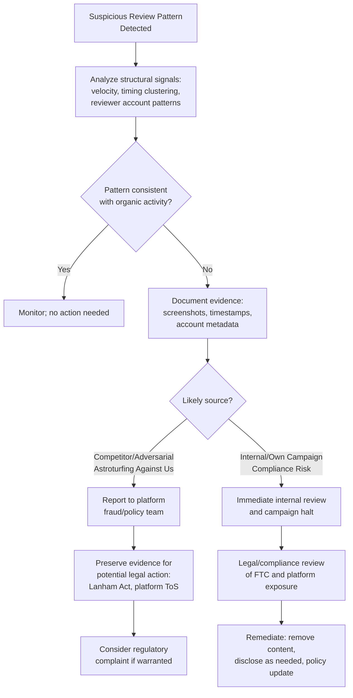

## AI-Generated Fake Reviews and Astroturfing

### Definition and Scope

AI-generated fake reviews and astroturfing refer to the use of generative AI to produce fabricated consumer reviews, testimonials, or seemingly organic public commentary designed to manufacture the appearance of independent, grassroots sentiment. Astroturfing specifically describes campaigns where a political actor, company, or other funded party pays or directs people (or systems) to write, post, or call while presenting the result as unprompted sentiment — what makes the practice deceptive is not necessarily the message itself, which may be true, but the concealment of who is paying for it or directing it.

**Key Points**

- This threat cuts both directions for reputation management: an organization may be targeted by competitor- or activist-driven fake negative reviews, or may face direct regulatory and legal liability for using or commissioning fake positive reviews about its own products.
- Generative AI has made fabricated reviews substantially more fluent and harder to detect via content analysis alone, shifting effective detection focus from individual review text to structural and behavioral patterns (velocity, distribution shape, network signals).
- Regulatory enforcement in this space (particularly in the U.S.) has moved from guidance to binding rule with substantial per-violation penalties, making this a compliance risk area, not merely a reputational nuisance.

### The Scale of the Problem

Fake reviews are estimated to represent a substantial share of online reviews, with one widely cited estimate placing the figure around 30% of online reviews being fake. Research (including a cited 2025 NBER/Wharton study) has found that fake reviews reduce consumer welfare, shift sales from honest to dishonest sellers, and ultimately harm the platform itself — establishing that this is a market-wide structural problem, not an isolated incident category, and that platforms' own detection and removal efforts, despite investment, catch only a fraction of the total volume. [Inference] Specific prevalence percentages vary across studies and methodologies and should be treated as estimates rather than precise, universally agreed figures.

### Why Generative AI Changed Detection Difficulty

Individual fabricated reviews are no longer reliably identifiable by eye — the same dynamic observed with AI-generated images applies to text: detection has shifted from reading individual reviews for stylistic "tells" to reading the structural patterns around a review set, including posting velocity, distribution shape, and reviewer account characteristics. Notably, clean, tidy, marketing-style writing — once itself a minor red flag for a scripted fake review — is now a weaker signal than before, since generative AI produces fluent, natural-sounding text by default, meaning polish and coherence can no longer be relied upon as a genuineness indicator, and some current guidance suggests overly polished writing should if anything be treated as a mild flag rather than a sign of authenticity, given how easily AI tools produce it.

**A related manipulation vector**: "Brushing scams" generate reviews that appear verified because they are attached to real shipments of (often unrequested or cheap) items to real addresses, meaning "verified purchase" status alone is an increasingly insufficient authenticity signal on its own.

### Regulatory Landscape (United States)

The FTC's Consumer Reviews and Testimonials Rule, codified at 16 CFR Part 465 and effective October 2024, explicitly bans fake or AI-generated reviews, reviews purchased conditional on sentiment, undisclosed insider reviews, suppression of negative reviews, and company-controlled sites posing as independent. This is a binding rule, not merely guidance, meaning violations carry direct civil penalty exposure.

**Penalty structure**: Civil penalties have been reported in the range of approximately $50,000–$53,088 per violation (figures vary slightly across sources reflecting different inflation-adjustment update points), and each individual non-compliant instance can be treated as a separate violation — meaning a campaign involving many fabricated reviews or posts could theoretically expose an organization to penalty exposure well into the millions of dollars in aggregate.

**Enforcement activity and signals**:

- The FTC issued warning letters to companies regarding potential Consumer Review Rule violations as an initial enforcement step, signaling active regulatory attention to this area rather than a purely dormant rule.
- In January 2026, the FTC reportedly established a dedicated AI enforcement unit, and advertising enforcement cases were reported to have increased substantially in 2025, alongside what was described as the first enforcement action specifically targeting undisclosed AI-generated advertising content beginning in late 2025.
- A notable case: the FTC charged the AI writing service Rytr with providing a service used to generate fake reviews containing fabricated details; a consent order was issued in December 2024, then reportedly set aside in December 2025 amid shifting federal AI enforcement priorities — illustrating that even recent, seemingly settled enforcement actions in this fast-moving area can change status, and current standing should be verified before being relied upon.
- [Unverified] Given the demonstrated volatility in this specific enforcement area (including the Rytr consent order reversal), current enforcement posture, rule status, and specific penalty figures should be verified against current FTC publications or legal counsel rather than assumed stable from any single point-in-time source.

### Regulatory Landscape (Beyond the U.S.)

Regulators outside the United States generally pursue similar conduct under general consumer protection frameworks rather than U.S.-style endorsement-specific law, and the UK's Competition and Markets Authority (CMA) and EU frameworks (including the Digital Services Act) provide analogous enforcement pathways for fake review and astroturfing conduct in their respective jurisdictions. [Inference] The specific mechanisms, thresholds, and enforcement intensity vary meaningfully by jurisdiction and should be assessed individually for organizations operating across multiple regulatory regimes rather than assumed equivalent to the U.S. framework.

### Disclosure Requirements for AI-Assisted Marketing Content

Separate from the outright fake-review prohibition, a broader compliance layer applies to AI-generated or AI-assisted advertising and testimonial content generally: if AI was used to create or substantially modify advertising content, the applicable principle in current FTC guidance is that consumers must be informed — existing deception, endorsement, and fake-testimonial rules apply to AI-driven content with the same force as human-created content, without a general AI exemption. Notably, disclosure does not cure a fundamentally fake review or testimonial — an AI-generated testimonial, by definition, does not reflect the honest opinion of a real person who has actually used the product, meaning labeling it as AI-generated does not make it compliant if it is presented as a customer endorsement.

Platform-level rules add a parallel compliance layer: major platforms have implemented their own AI-content labeling requirements (for example, some platforms require "AI-generated" or "Made with AI" labels for synthetic people or realistic AI-generated characters, in some cases using C2PA metadata detection to apply labels automatically). Meeting platform rules does not guarantee regulatory compliance, and regulatory compliance does not guarantee platform compliance — both must be satisfied independently.

### Detection and Response Workflow (Defensive Perspective)

### Defensive Measures Against Being Targeted (Adversarial Fake Reviews)

**1. Structural pattern monitoring**

Since individual review text is no longer a reliable detection signal, monitoring should focus on aggregate patterns: unusual review velocity spikes, clustering of reviews within narrow time windows, and disproportionate concentration of new or low-activity reviewer accounts.

**2. Forensic documentation for legal/regulatory action**

Where adversarial fake reviews (e.g., from a competitor or bad-faith actor) are suspected, evidence should be preserved forensically — screenshots with timestamps, reviewer account details, and pattern documentation — since remedies including FTC complaints, Lanham Act claims (in the U.S., addressing false advertising/unfair competition), or platform enforcement typically require substantiated, well-documented evidence rather than assertion alone.

**3. Platform reporting**

Most major review platforms maintain dedicated fraud and policy violation reporting channels distinct from standard customer support; using the correct channel with adequate documentation improves the likelihood of platform-level review removal or account action.

**4. Distinguishing detection tools from proof**

Automated fake-review detection tools can be a useful first-pass filter, but they typically produce probability estimates rather than definitive verdicts, and detection lags generation — meaning tool output should inform investigation rather than substitute for it, particularly where the finding may support a formal complaint or legal claim.

### Compliance Measures Against Committing This Risk (Own-Side Prevention)

**1. Prohibit AI-generated testimonial content presented as genuine customer opinion**

Given that AI-generated testimonials do not reflect the honest opinion of a real product user by definition, marketing and customer success teams should have explicit policy prohibiting the use of AI tools to draft or supplement content presented as authentic customer reviews or testimonials.

**2. Audit third-party marketing and review-management vendors**

Given enforcement actions targeting AI services used to generate fake reviews (such as the Rytr case), organizations should assess whether any contracted marketing, reputation management, or review-solicitation vendor's practices could expose the organization to derivative liability for vendor-generated fake content.

**3. Apply the strictest applicable jurisdictional standard for multi-region campaigns**

Given inconsistent and evolving state- and country-level requirements, national or international campaigns are generally best managed by complying with the most stringent applicable standard across all operating jurisdictions rather than tailoring compliance region by region, reducing the risk of inadvertent violation in a stricter jurisdiction.

**4. Maintain disclosure discipline for any AI-assisted advertising content**

Even where content is not a fabricated testimonial, any advertising content substantially created or modified by AI should be evaluated against current disclosure obligations, tracking both regulatory (FTC and equivalent) and platform-specific labeling requirements as separate compliance checks.

### Common Pitfalls

- **Assuming disclosure resolves a fundamentally fake review or testimonial**, when current guidance treats a fabricated testimonial as impermissible regardless of AI-use labeling, since it does not reflect a real customer's honest opinion.
- **Relying on "verified purchase" badges as a sufficient authenticity signal**, given the existence of brushing-scam techniques that generate verified status through real but illegitimate shipments.
- **Treating individual review content analysis as sufficient detection**, when structural and behavioral pattern analysis has become the more reliable detection layer as generated text has become more fluent.
- **Underestimating penalty exposure by treating each fake review as a single violation event**, when regulatory frameworks may treat each individual non-compliant post or review as a separate violation, compounding exposure rapidly at scale.
- **Assuming regulatory or enforcement status in this area is stable**, given documented volatility (such as the Rytr consent order being issued and later set aside) — current compliance guidance should be verified rather than assumed fixed from any single reference point.

### Related Topics

- Review Ecosystem Management and Response Workflows
- Generative AI and the Disinformation Landscape
- Deepfake Detection and Forensic Verification
- FTC Consumer Review Rule Compliance Programs
- Competitor-Driven Reputational Attacks and Legal Remedies
- Platform Policy Enforcement and Reporting Mechanisms
- Digital Evidence Documentation for Legal Action
- Marketing Vendor Due Diligence for AI-Generated Content