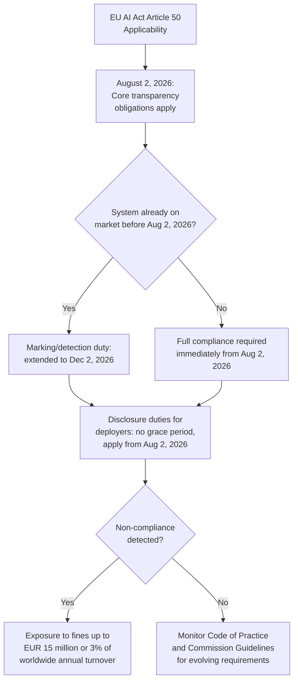

## Regulatory Responses to AI-Generated Content

### Definition and Scope

This topic covers the emerging body of law and regulation specifically governing the creation, labeling, and disclosure of AI-generated and synthetic content — the legal infrastructure organizations must navigate when producing, deploying, or being targeted by AI-generated media. Unlike the fraud- and detection-focused topics elsewhere in this chapter, this topic addresses the compliance and legal-exposure dimension: what organizations are legally required to disclose, what liability attaches to non-compliant AI-generated content, and how the regulatory landscape is evolving across major jurisdictions as of this writing (September 2026).

**Key Points**

- The most consequential and detailed framework currently in force is the EU AI Act's Article 50, which became applicable on August 2, 2026 — meaning organizations reading this content are operating under an active, binding transparency regime, not a future proposal.
- Regulatory approaches diverge significantly by jurisdiction: the EU has adopted a comprehensive, disclosure-centered framework, while the U.S. approach remains more fragmented, combining existing consumer protection law (FTC rules) with a patchwork of state-level requirements and no comprehensive federal AI-content statute.
- This is an unusually fast-moving regulatory area even by AI-policy standards; specific deadlines, penalty figures, and compliance mechanisms have already been subject to proposed delays and amendments within the current year, meaning organizations should treat any specific compliance detail as time-sensitive and verify current status before relying on it.

### EU AI Act Article 50: Core Obligations

Article 50 of Regulation (EU) 2024/1689 became applicable on August 2, 2026, establishing that providers and deployers of AI systems placed on or used in the EU market must make it immediately clear to users when audio, video, images, or text have been generated or manipulated by artificial intelligence, with a reinforced disclosure obligation specifically for deepfakes.

**The obligation centers on four distinct cases**, each with different triggering conditions and responsible parties:

1. **Disclosing AI interaction**: Users must know they are interacting with an AI system at the moment of contact, not through a reference buried in fine print — this includes agentic AI acting autonomously on a user's behalf.
2. **Machine-readable marking of synthetic content**: Providers must implement technical marking (metadata, watermarking, or fingerprinting) enabling detection of AI-generated output.
3. **Emotion recognition and biometric categorization disclosure**: Users must be informed when such systems are being applied to them.
4. **Deepfake and AI-generated public-interest text disclosure**: A dedicated, more stringent disclosure duty applies specifically to deepfakes and to AI-generated text published on matters of public interest.

**Deepfake-specific duty**: Deployers of AI systems that generate or manipulate image, audio, or video content constituting a deepfake must disclose that the content has been artificially generated or manipulated, with disclosure required to be clear and distinguishable, no later than the time of first interaction or exposure. Notably, this duty applies regardless of the artistic quality of the output and regardless of whether the deepfake is benign or malicious — meaning there is no exemption for non-malicious creative or satirical use, though narrow carve-outs exist for content that is clearly fantastical or physically impossible.

**Text content carve-out**: A narrow exemption applies for editorially reviewed AI-generated text — but simply having a human "check" AI-generated content is not sufficient; only genuine, substantive editorial oversight with clear accountability qualifies for exemption from labeling obligations, meaning a cursory review process is unlikely to satisfy this standard.

### Compliance Timeline and Penalties

Systems already on the market before August 2, 2026 have an extended deadline of December 2, 2026 to meet the technical marking duty specifically, per Commission guidance — but disclosure duties toward users and audiences carry no such grace period and apply from the core August 2, 2026 date. Penalties for infringement may reach up to €15 million or 3% of total worldwide annual turnover, whichever is higher, with the lower of the two figures applying for SMEs and startups. Content generated before the applicability date does not require retroactive labeling.

### The Code of Practice on Transparency

Because Article 50 establishes binding legal obligations without fully specifying technical implementation, the European Commission and AI Office have developed a **Code of Practice on Transparency of AI-generated Content**, covering marking/detection rules for providers and labeling rules for deployers of deepfakes and AI-generated text. Adherence is voluntary, but the Commission and AI Board have confirmed the Code as an adequate tool for demonstrating compliance with the underlying legal obligations — meaning non-signatories may still comply through alternative means, but may face heavier evidentiary burdens and more frequent scrutiny from market surveillance authorities. By the end of July 2026, approximately 190 companies and organizations had signed the Code, and a standardized EU visual label for AI-generated content (interim "AI"/"KI"/"IA" icon pending a unified EU-wide symbol) has been developed as part of this framework.

### An Important Structural Limitation

Article 50 does not stop a fraudster from generating a deepfake — a person using synthetic video to defraud a bank was already committing offenses under existing fraud law and will not be deterred by a labeling duty they have no intention of honoring. What the framework builds instead is **provenance infrastructure carried by the compliant majority**: the labeling regime assumes the highest-risk attacker will not label their content, meaning the disclosure duty's practical value lies in establishing a baseline of legitimate, identifiable AI content against which unlabeled, non-compliant content becomes comparatively more suspicious — not in directly preventing malicious use. [Inference] This is a structural design tradeoff acknowledged even within analysis of the Act itself; whether this distribution of compliance effort (falling on legitimate actors while bad actors ignore it) proves proportionate to the harm addressed is a live, unresolved policy question, and early enforcement decisions will likely shape how this tension is addressed in practice.

### United States Regulatory Landscape

Unlike the EU's comprehensive AI Act framework, the U.S. approach is fragmented across existing consumer protection statutes, targeted state laws, and narrow federal statutes addressing specific harm categories rather than a single comprehensive AI-content law:

- **FTC Consumer Reviews and Testimonials Rule** (16 CFR Part 465, effective October 2024): Directly prohibits fake and AI-generated reviews and testimonials, covered in detail in the fake reviews/astroturfing topic — this remains the most directly applicable federal rule for AI-generated content specifically in the commercial review/endorsement context.
- **TAKE IT DOWN Act** (May 2025): Criminalizes nonconsensual intimate imagery, including AI-generated content, and requires platforms to remove flagged content within 48 hours — narrow in scope, not addressing broader deepfake fraud, political disinformation, or corporate impersonation.
- **State-level requirements**: A patchwork of state laws (with California and New York frequently cited as setting relatively stringent standards) creates a compliance environment where national campaigns are generally best served by complying with the strictest applicable state standard across the board, since satisfying a more permissive state's requirements does not ensure compliance in a stricter one.
- **No comprehensive federal AI-content transparency statute** currently parallels the EU's Article 50 approach; enforcement instead relies on applying existing deception, endorsement, and sector-specific frameworks to AI-generated content, layered with narrower targeted statutes as they emerge.
- [Unverified] The U.S. federal AI enforcement posture has shown documented volatility within 2026 (including a notable enforcement action being set aside amid shifting federal AI enforcement priorities); current federal enforcement priorities should be verified against current agency guidance rather than assumed static.

### Other Jurisdictions

- **China**: Began enforcing mandatory AI content labeling in September 2025, representing one of the earlier binding mandatory labeling regimes among major economies.
- **General international pattern**: Regulators outside the U.S. and China frequently pursue AI-generated content harms (particularly fake reviews and deceptive synthetic media) under general consumer protection or platform regulation frameworks (such as the EU's Digital Services Act, which has separately been used to require identification and labeling of manipulated content, cooperation with fact-checkers, and data sharing to improve detection tools) rather than AI-specific endorsement statutes.
- [Inference] The global regulatory landscape for AI-generated content remains in active development across virtually all major jurisdictions; organizations operating internationally should expect continued change and treat any jurisdiction-specific summary, including this one, as a snapshot requiring periodic reconfirmation.

### Platform-Level Rules as a Parallel Compliance Layer

Major platforms have implemented their own AI-content labeling requirements operating alongside, not in place of, governmental regulation — for example, video platforms increasingly require synthetic content (AI voices, deepfakes) to be disclosed during upload, using automated detection methods including C2PA metadata detection in some cases to apply labels. Critically, meeting platform rules does not guarantee regulatory compliance, and regulatory compliance does not guarantee platform compliance — organizations must satisfy both independently, since the scope, triggers, and labeling formats differ between governmental and platform frameworks.

### Practical Compliance Steps for Organizations

**1. Map AI system usage across the organization**

Identify every point where AI-generated or AI-assisted content is published externally — websites, social media, marketing materials, reports, presentations, public-facing comments, chatbots, and voicebots — since regulatory obligations attach broadly across content types and distribution channels, not merely to obvious cases like marketing video.

**2. Assess applicability and available carve-outs per content type**

For deepfake imagery, audio, or video, plan disclosure from the outset rather than retrofitting it. For text content, assess whether the narrow editorial-oversight carve-out genuinely applies, recognizing that superficial human review does not qualify.

**3. Monitor evolving technical guidance**

Given that final Guidelines and the Code of Practice were still being finalized close to the applicability date, organizations should track ongoing Commission guidance and Code of Practice updates as the practical implementation benchmark, even though the Code itself remains formally voluntary.

**4. Build labeling into content production workflows, not as an afterthought**

Given the modality-specific labeling expectations under development (persistent labels for video, visible labels for images, audible disclaimers for audio), compliance is more reliably achieved by integrating labeling into the content creation and publishing pipeline itself rather than as a manual post-production compliance check.

**5. Coordinate legal, communications, and technical teams**

Given the direct connection between this regulatory framework and the broader synthetic media/deepfake threat topics in this chapter, compliance strategy should be coordinated with detection/forensic capability and crisis response planning, since a regulatory disclosure failure during an active synthetic media incident compounds both legal and reputational exposure simultaneously.

### Common Pitfalls

- **Assuming a human "checked" AI-generated content satisfies the editorial carve-out**, when current guidance requires genuine, substantive editorial oversight with clear accountability, not a cursory review.
- **Treating platform compliance as equivalent to regulatory compliance**, when the two frameworks operate independently and satisfying one does not ensure satisfying the other.
- **Assuming benign or non-deceptive intent exempts a deepfake from disclosure duties**, when the EU framework's deepfake disclosure obligation applies regardless of artistic quality and regardless of whether the content is benign or malicious.
- **Treating the current regulatory snapshot as stable**, given the demonstrated pattern of proposed delays, evolving guidelines, and shifting enforcement priorities across multiple jurisdictions within the current year alone.
- **Focusing compliance efforts only on obvious synthetic media (deepfake video) while neglecting AI-generated text and voice content**, which fall under the same broad transparency obligations but are frequently under-audited in practice.

### Related Topics

- Generative AI and the Disinformation Landscape
- AI-Generated Fake Reviews and Astroturfing
- Deepfake Detection and Forensic Verification
- Content Provenance Standards (C2PA and Emerging Frameworks)
- Crisis Response Protocols for Synthetic Media Incidents
- Cross-Jurisdictional Compliance Strategy for Multinational Organizations
- Platform Trust and Safety Escalation Relationship Building
- Marketing Vendor Due Diligence for AI-Generated Content