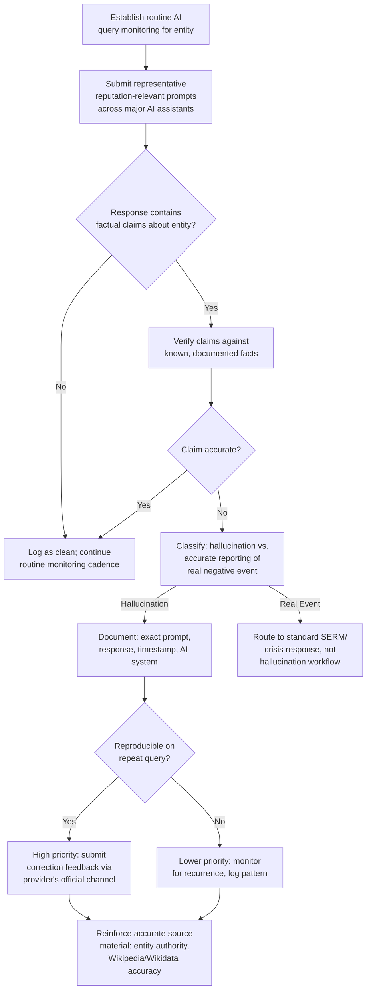

## Managing Hallucinated and Inaccurate AI-Generated Claims

### Definition and Scope

AI hallucination refers to instances where a generative AI system produces confident, fluent, but factually incorrect or fabricated content — including false claims about organizations, individuals, products, or events that the system presents with the same authoritative tone as accurate information. For reputation management, this creates a distinct threat category from either traditional misinformation or deliberate disinformation: hallucinated content typically originates from the AI system itself (through probabilistic prediction errors or training data gaps) rather than from a human or organized actor with harmful intent, meaning response strategy must account for the absence of a traditional "bad actor" to counter, negotiate with, or hold accountable in the usual sense.

**Key Points**

- Hallucinations often arise from training data gaps and probabilistic predictions rather than any intent to deceive, distinguishing this threat from deliberate disinformation even though the downstream reputational harm can be similar or worse.
- A compounding risk factor is that users often perceive AI outputs as objective and credible — a pattern researchers describe as the "machine heuristic" — making hallucinated content especially concerning since it may be uncritically accepted as fact precisely because of its confident, well-formatted presentation.
- Correcting a hallucinated claim is structurally different from correcting a human-authored false claim: it may require both retrieval-time source correction (achievable through content and entity-authority strategy) and, in some cases, addressing underlying model training data or grounding behavior, which is not directly controllable by the affected organization and depends on the AI provider's own practices.

### Why Hallucinations Are a Distinct Reputational Risk Category

Traditional reputation management assumes a locatable source: a news article, a review, a social media post, a person or organization that made a specific claim, which can be engaged, corrected, or legally addressed. Hallucinated AI content breaks this assumption in several ways:

- **No single authorable source**: A hallucination may not trace back to any specific document or claim — it can emerge from the model's statistical pattern-completion behavior, potentially blending unrelated facts about similarly-named entities, outdated information, or plausible-sounding fabrication.
- **Inconsistent reproducibility**: The same query posed to the same AI system may not reliably reproduce the same hallucinated claim, since generation is probabilistic — making it harder to document a "stable" false claim in the way one might screenshot a persistent web page.
- **Cross-system variability**: Different AI systems (ChatGPT, Claude, Gemini, Perplexity, Copilot) may hallucinate different claims, or hallucinate about the same entity with different frequency, since each has distinct training data, retrieval architecture, and grounding mechanisms.
- **The "machine heuristic" effect**: Users tend to perceive AI-generated outputs as objective and credible by default, a documented psychological tendency that increases the risk that a hallucinated claim will be uncritically accepted as fact rather than appropriately scrutinized the way a single unverified human source might be.

### Categories of Hallucinated Content Relevant to Reputation Management

| Category | Description | Example Pattern |
| --- | --- | --- |
| Entity conflation | AI blends facts about the target with a similarly-named or related entity | Attributing a competitor's lawsuit or scandal to the wrong company |
| Fabricated events | AI generates plausible-sounding events, statements, or incidents that never occurred | A fabricated quote attributed to an executive |
| Outdated information presented as current | AI presents stale training-data facts as current status | Describing a resolved legal matter as ongoing |
| Fabricated citations/sources | AI invents a source or misattributes a real claim to a nonexistent article | Citing a "study" or "report" that does not exist |
| Sentiment distortion | AI synthesizes an inaccurately negative (or positive) overall characterization from mixed source material | Characterizing an entity as broadly controversial based on a single, resolved, minor incident |

### Detection and Monitoring Workflow

### Response and Mitigation Strategies

**1. Systematic monitoring across AI assistants**

Given that hallucinations vary by system and are not reliably reproducible, organizations with meaningful public profile should incorporate periodic, structured querying of major AI assistants with representative reputation-relevant prompts as part of their broader digital footprint and SERM monitoring cadence, rather than waiting for a hallucination to surface through user reports.

**2. Provider feedback and correction channels**

Most major AI providers offer some mechanism for reporting inaccurate or harmful outputs (in-product feedback tools, dedicated reporting channels, or support processes). [Unverified] The specific correction mechanisms, response times, and effectiveness of these channels vary by provider and change over time as products evolve; current processes should be verified directly against each provider's published documentation rather than assumed uniform or guaranteed to result in a specific correction outcome.

**3. Strengthening the accurate source foundation**

Since hallucinations often arise from training data gaps or ambiguous source material, the most durable mitigation is reinforcing the same entity-authority and accurate-source foundation covered elsewhere in this chapter — accurate, well-corroborated Wikipedia and Wikidata entries, consistent schema markup, and authoritative owned/earned content. This does not guarantee a specific hallucination will not recur, but improves the underlying source material that retrieval-augmented systems draw from and that future model training may incorporate.

**4. Distinguishing hallucination from accurate-but-unwelcome reporting**

A critical triage step: a negative AI-generated characterization is not automatically a hallucination. If an AI system accurately summarizes a genuine, documented negative event (a real lawsuit, a real controversy), this is not a hallucination and should be routed to standard reputation management and crisis response processes, not treated as a correctable AI error. Conflating the two risks both wasted effort chasing an uncorrectable "error" that is actually accurate, and, more seriously, creates the appearance of attempting to suppress truthful information under the guise of correcting AI inaccuracy.

**5. Public correction and clarification content**

Where a hallucination is documented and appears to recur, publishing clear, authoritative, and easily crawlable correction content (a factual statement page, an FAQ addressing the specific false claim) can help both direct human searchers and, over time, retrieval-augmented AI systems that draw on current web content rather than relying solely on static training data.

**6. Legal considerations**

[Inference] The legal landscape for holding an AI provider liable for a hallucinated defamatory claim is still developing and varies significantly by jurisdiction, with unresolved questions around platform liability frameworks, the applicability of existing defamation law to probabilistic AI outputs, and evolving case law; organizations facing a seriously damaging, reproducible hallucination should consult legal counsel for a jurisdiction-specific assessment rather than assuming either broad protection or broad liability applies to the AI provider.

### Documentation Standards for Hallucination Reports

Given the reproducibility challenges, a hallucination report intended for provider feedback, internal escalation, or potential legal consultation should capture:

- The exact prompt or query used, verbatim.
- The full response received, including any citations the system provided.
- Timestamp and specific AI system/model version (where determinable) queried.
- Whether the response was reproduced on repeat, identical querying, and if so, how many times out of how many attempts.
- Comparison against the actual, verifiable facts, with supporting documentation.

### Interaction with Answer Engine and Generative Engine Optimization

This topic connects directly to the broader Answer Engine/Generative Engine Optimization discipline covered earlier in this chapter: the same entity-clarity and source-authority signals that improve favorable mention frequency and accurate representation in AI answers (schema markup, Wikidata, consistent cross-platform identity, authoritative owned content) are the primary lever available for reducing hallucination risk, since there is no direct mechanism for an external party to edit a model's internal weights or force a specific correction. Effective hallucination management is therefore less a standalone tactic and more an application of the broader entity-authority and content-authority strategy specifically targeted at AI-answer accuracy monitoring.

### Organizational Readiness Considerations

**1. Assign clear ownership**

Given the cross-disciplinary nature of this risk (touching communications, legal, SEO/entity strategy, and potentially security if hallucinations are severe enough to constitute reputational attacks), organizations should designate clear ownership for AI-hallucination monitoring and response rather than allowing it to fall into gaps between existing SERM, legal, and crisis communication functions.

**2. Set realistic expectations regarding correction timelines and completeness**

Unlike a search-ranked page, which can be directly displaced through documented SEO effort, hallucination correction outcomes are less predictable and slower, given the dependency on provider-side processes and potential model update cycles. Stakeholders should be given realistic expectations rather than assurances of guaranteed or rapid correction.

**3. Prioritize by severity and reproducibility**

Given limited resources, hallucination monitoring findings should be triaged by combined severity (potential reputational or legal harm) and reproducibility (consistent, repeatable false claims warrant more urgent attention than a single, non-reproducible instance), rather than treating every flagged AI response as equally urgent.

### Common Pitfalls

- **Treating every negative AI-generated statement as a hallucination**, when accurate reporting of genuine negative events requires standard reputation management response, not hallucination-specific correction efforts, and misclassifying it risks appearing to suppress accurate information.
- **Assuming a single successful correction propagates across all AI systems and future queries**, when different systems, different training cutoffs, and probabilistic generation mean a "corrected" claim may still resurface inconsistently.
- **Underestimating the machine heuristic effect**, failing to account for the elevated credibility users may extend to a hallucinated claim simply because it was AI-generated, compared to an equivalent claim from an unverified human source.
- **Relying solely on provider feedback mechanisms without also strengthening underlying source material**, missing the more durable, controllable lever of entity-authority and content-accuracy reinforcement.
- **No documented, reproducible evidence when raising a hallucination with a provider or considering legal consultation**, weakening the ability to demonstrate the issue's scope, severity, or persistence.

### Related Topics

- Answer Engine and Generative Engine Optimization
- Knowledge Graph and Entity Authority Building
- Generative AI and the Disinformation Landscape
- Regulatory Responses to AI-Generated Content
- Digital Footprint Audits for Executives and Individuals
- Wikipedia and Public Profile Management
- Crisis Response Protocols for Synthetic Media Incidents
- Legal Frameworks for AI Provider Liability and Defamation