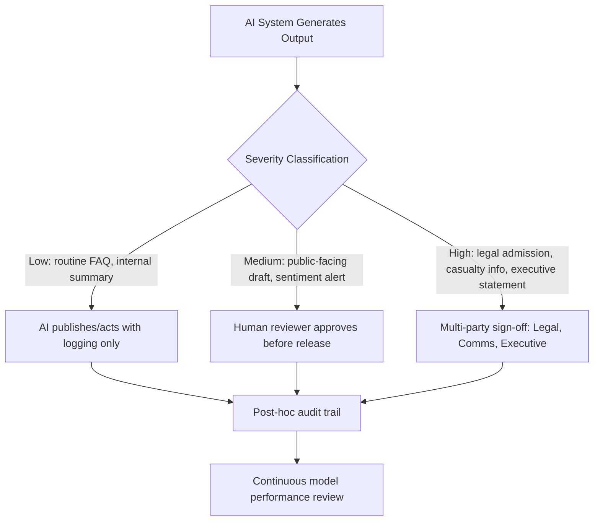

## Ethical Use of AI in Crisis Response

### Definition and Scope

Ethical use of AI in crisis response refers to the governance principles, operational safeguards, and decision-making frameworks that ensure artificial intelligence tools deployed during crisis and reputation management events (monitoring, drafting, sentiment analysis, synthetic media detection, chatbot response, decision support) do not themselves create harm, legal exposure, misinformation, or trust erosion. This sits at the intersection of crisis communications, AI governance, media ethics, and risk management.

The scope covers: (1) AI-assisted crisis monitoring and detection, (2) AI-generated or AI-assisted communications, (3) automated decision support and triage, (4) human oversight requirements, and (5) disclosure obligations to stakeholders.

### Why This Matters in Crisis & Reputation Management

Crises compress decision timelines. Organizations increasingly rely on AI to accelerate monitoring, drafting, and triage under this pressure. That same speed advantage is what makes unethical or careless AI use dangerous during a crisis:

- **Amplification risk**: An AI system trained to optimize for engagement or speed can amplify a narrative before facts are verified.
- **Authenticity risk**: Stakeholders scrutinize crisis communications more closely than routine ones; AI-generated content that reads as generic, evasive, or inauthentic damages credibility further.
- **Legal and regulatory risk**: Statements generated or approved by AI without adequate human review can create liability (e.g., admissions of fault, inaccurate casualty figures, discriminatory language).
- **Second-order crisis risk**: Misuse of AI during a crisis (e.g., a deepfake detector giving a false negative, or a chatbot giving harmful advice to affected individuals) can create a second, compounding crisis.

### Core Ethical Principles

**Key Points**

- **Human-in-the-loop for high-stakes decisions**: No AI system should autonomously issue public statements, apologies, admissions, casualty figures, or legal positions during a crisis without human sign-off.
- **Transparency and disclosure**: Stakeholders should generally be informed when they are interacting with an AI system (chatbot, automated response) versus a human, particularly during sensitive crisis communications (e.g., product recalls, safety incidents, bereavement contexts).
- **Accuracy over speed**: AI tools used for monitoring or drafting should be configured to flag uncertainty rather than present unverified information as fact. [Inference] Organizations that fail to build in verification checkpoints face materially higher retraction and correction risk during fast-moving incidents.
- **Non-manipulation**: AI must not be used to generate or amplify synthetic sentiment (bot networks, fake grassroots support/opposition — "astroturfing") to shape public perception of a crisis.
- **Proportionality**: The level of AI autonomy granted should be inversely proportional to the severity and sensitivity of the situation (e.g., a minor product FAQ chatbot vs. a mass-casualty incident statement).
- **Bias auditing**: Sentiment analysis and monitoring tools can systematically misclassify dialects, languages, or cultural expressions of distress or anger, skewing an organization's read of stakeholder sentiment during a crisis.
- **Data privacy**: Crisis-related AI tools often process sensitive personal data (victim identities, health information, complaint details); use must comply with applicable data protection frameworks (e.g., GDPR, CCPA) and internal data minimization policies.

### Common AI Applications in Crisis Response and Their Ethical Considerations

| Application | Function | Primary Ethical Risk | Mitigation |
| --- | --- | --- | --- |
| Social listening / sentiment analysis | Detects emerging issues, tracks narrative spread | Misclassification, echo-chamber bias, overreaction to bot-driven noise | Human review of flagged spikes; bot-traffic filtering |
| Synthetic/deepfake detection | Identifies manipulated media referencing the organization | False negatives/positives; delayed detection eroding trust | Multi-tool verification; forensic escalation path |
| AI drafting assistants | Speeds up holding statements, FAQs, internal briefings | Generic or tone-deaf language; factual hallucination | Mandatory human editorial and legal review before release |
| Chatbots / virtual agents | Handles high-volume stakeholder inquiries during an incident | Giving incorrect or harmful guidance; lack of disclosure it's automated | Clear AI disclosure; escalation triggers to human agents |
| Predictive/decision-support models | Forecasts issue escalation, media reach, reputational impact | Over-reliance on model output as if deterministic; opaque scoring | Present as one input among several; document model limitations |

### The Human-in-the-Loop Framework

A practical model for governing AI autonomy during a crisis, scaled to decision severity:

This tiering structure (svg_diagram) is shown below as an SVG for environments that render inline vector graphics:

<svg xmlns="http://www.w3.org/2000/svg" viewBox="0 0 720 320">
<text x="360" y="24" font-size="15" font-weight="bold" text-anchor="middle" fill="#1a1a1a">AI Autonomy Tiering in Crisis Response (svg_diagram)</text>
<rect x="20" y="50" width="200" height="90" rx="8" fill="#e8f4ea" stroke="#3c8c4a" stroke-width="1.5" />
<text x="120" y="80" font-size="12" font-weight="bold" text-anchor="middle" fill="#1a1a1a">Low Severity</text>
<text x="120" y="98" font-size="10.5" text-anchor="middle" fill="#333">Routine FAQ, internal</text>
<text x="120" y="112" font-size="10.5" text-anchor="middle" fill="#333">summaries, tagging</text>
<text x="120" y="128" font-size="10.5" text-anchor="middle" fill="#2a6b35">AI acts, logs only</text>
<rect x="260" y="50" width="200" height="90" rx="8" fill="#fdf3e0" stroke="#c9861f" stroke-width="1.5" />
<text x="360" y="80" font-size="12" font-weight="bold" text-anchor="middle" fill="#1a1a1a">Medium Severity</text>
<text x="360" y="98" font-size="10.5" text-anchor="middle" fill="#333">Public drafts, sentiment</text>
<text x="360" y="112" font-size="10.5" text-anchor="middle" fill="#333">alerts, chatbot replies</text>
<text x="360" y="128" font-size="10.5" text-anchor="middle" fill="#a6690f">Human approval required</text>
<rect x="500" y="50" width="200" height="90" rx="8" fill="#fbe6e6" stroke="#b23a3a" stroke-width="1.5" />
<text x="600" y="80" font-size="12" font-weight="bold" text-anchor="middle" fill="#1a1a1a">High Severity</text>
<text x="600" y="98" font-size="10.5" text-anchor="middle" fill="#333">Legal admissions,</text>
<text x="600" y="112" font-size="10.5" text-anchor="middle" fill="#333">casualty data, exec statements</text>
<text x="600" y="128" font-size="10.5" text-anchor="middle" fill="#8f2323">Multi-party sign-off</text>
<line x1="120" y1="140" x2="360" y2="200" stroke="#888" stroke-width="1.2" />
<line x1="360" y1="140" x2="360" y2="200" stroke="#888" stroke-width="1.2" />
<line x1="600" y1="140" x2="360" y2="200" stroke="#888" stroke-width="1.2" />
<rect x="240" y="200" width="240" height="50" rx="8" fill="#e6eef9" stroke="#3a5fb2" stroke-width="1.5" />
<text x="360" y="222" font-size="11.5" font-weight="bold" text-anchor="middle" fill="#1a1a1a">Audit Trail Logging</text>
<text x="360" y="238" font-size="10" text-anchor="middle" fill="#333">All tiers, timestamped, reviewable</text>
<line x1="360" y1="250" x2="360" y2="270" stroke="#888" stroke-width="1.2" />
<rect x="220" y="270" width="280" height="40" rx="8" fill="#f0ecf7" stroke="#6b4fa0" stroke-width="1.5" />
<text x="360" y="294" font-size="11" font-weight="bold" text-anchor="middle" fill="#1a1a1a">Continuous Model Performance Review</text>
</svg>

### Governance Frameworks and Standards

Organizations building AI-in-crisis policies typically draw on a combination of:

- **NIST AI Risk Management Framework (AI RMF 1.0)**: Provides a Govern–Map–Measure–Manage structure applicable to crisis-context AI tools, emphasizing risk documentation and impact assessment before deployment.
- **EU AI Act**: Classifies certain crisis-adjacent AI uses (e.g., biometric identification, emotion recognition in specific contexts) as high-risk or prohibited, with direct implications for AI-assisted crisis monitoring in EU-facing operations. [Unverified] Specific thresholds and enforcement timelines should be confirmed against current EU AI Office guidance, as implementation phases continue to roll out.
- **IPTC/Partnership on AI content provenance guidance**: Relevant to disclosure and labeling of AI-generated or AI-detected synthetic media referenced during a crisis.
- **Internal AI Acceptable Use Policies**: Most mature organizations maintain a crisis-specific addendum to their general AI governance policy specifying which AI tools may operate autonomously, which require review, and escalation contacts.

### Practical Example: AI-Assisted Statement Drafting Workflow

**Example**

A mid-size airline experiences a mechanical incident causing a flight delay and minor injuries. The crisis team uses an AI drafting assistant to accelerate the holding statement process:

1. AI ingests incident intake data (time, location, known facts) and drafts three tonal variants of a holding statement (empathetic-brief, informational-detailed, regulatory-compliant).
2. AI flags any claim in its draft that it cannot verify against the provided intake data (e.g., number of injuries) rather than inventing a plausible-sounding figure.
3. Legal and Communications leads jointly review all three drafts; no draft is published without this step regardless of time pressure.
4. The final statement explicitly avoids AI-hallucinated specifics; anything uncertain is phrased as "we are still confirming" rather than a fabricated number.
5. An audit log records that AI was used in drafting, which reviewers approved it, and what changes were made — supporting later regulatory or legal inquiry.

This workflow demonstrates proportional human oversight: the AI accelerates production, but no unverified or high-stakes claim reaches the public without human accountability attached.

### Common Failure Modes

- **Automation bias**: Reviewers rubber-stamping AI drafts because they assume the tool is "probably right," undermining the human-in-the-loop safeguard in practice even when it exists on paper.
- **Hallucinated specificity**: Language models producing confident-sounding but fabricated details (exact casualty counts, quotes, dates) that then get published under time pressure.
- **Sentiment tool overcorrection**: Treating a spike in AI-flagged negative sentiment as equivalent to a real-world escalation without verifying whether the spike is organic or bot-driven.
- **Silent AI use**: Deploying AI-driven chatbots or auto-responders during a crisis without disclosing to affected stakeholders that they are not speaking with a human, which can itself become a secondary trust crisis if discovered.
- **Static playbooks for adaptive tools**: Treating AI model outputs as fixed and reliable without periodic re-validation, even though model behavior can drift as underlying training data, fine-tuning, or prompting changes over time. [Inference] Teams that skip periodic re-validation are more likely to be surprised by degraded model performance precisely when the tool is under the heaviest crisis load.

### Related Topics

- Deepfake and Synthetic Media Detection in Crisis Monitoring
- AI-Generated Disinformation Campaigns Targeting Organizations
- Chatbot Governance and Disclosure Standards
- Algorithmic Bias in Social Listening Tools
- Legal Liability for AI-Generated Public Statements
- Crisis Communication Audit Trails and Documentation Standards
- Regulatory Landscape: EU AI Act and Crisis-Relevant AI Classifications
- Human-in-the-Loop Design Patterns for High-Stakes Automation