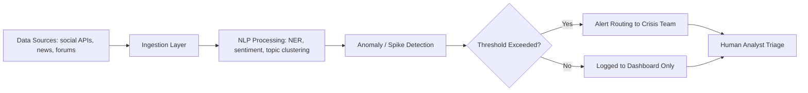

## AI-Assisted Monitoring and Drafting Tools

### Definition and Scope

AI-assisted monitoring and drafting tools are the technology layer that supports crisis and reputation management teams in two distinct functions: (1) **monitoring** — continuously scanning news, social media, forums, and broadcast/print sources to detect emerging issues, track narrative spread, and quantify sentiment; and (2) **drafting** — using generative AI to accelerate production of holding statements, FAQs, internal briefings, social posts, and stakeholder communications. This item covers the technical architecture, common tool categories, capabilities, and limitations of both functions as deployed in real-world crisis response operations.

### Why This Matters in Crisis & Reputation Management

Crisis outcomes are heavily determined by detection speed and communication turnaround time. Manual monitoring (human analysts scanning media manually) cannot match the volume and velocity of digital-era information flow — a single crisis-triggering event can generate hundreds of thousands of social posts within hours. AI-assisted tools compress the detection-to-response cycle, but they also introduce new dependencies: tool accuracy, model bias, false-positive/negative rates, and vendor reliability all become part of the organization's crisis-readiness posture.

### Monitoring Tools: Architecture and Function

**Key Points**

- **Data ingestion layer**: Aggregates content from APIs (social platforms, news wire services), web scraping, RSS feeds, and licensed media databases (e.g., Meltwater, Cision, Brandwatch, Talkwalker).
- **Natural Language Processing (NLP) layer**: Applies named entity recognition (NER) to detect brand/executive mentions, sentiment classification (positive/negative/neutral), and topic clustering to group related mentions into narrative threads.
- **Anomaly/spike detection**: Statistical or ML-based models flag volume spikes against a rolling baseline, typically using methods such as z-score thresholds or more advanced time-series anomaly detection (e.g., seasonal-trend decomposition, Prophet-style forecasting).
- **Alerting and routing layer**: Pushes flagged spikes or high-severity sentiment shifts to designated crisis team channels (email, Slack/Teams, SMS) based on configurable thresholds.
- **Dashboard/visualization layer**: Presents share-of-voice, sentiment trend lines, geographic spread, and influencer/amplifier identification.

A simplified monitoring pipeline:

### Common Monitoring Tool Categories

| Category | Examples (illustrative, not exhaustive) | Core Function |
| --- | --- | --- |
| Enterprise media monitoring suites | Meltwater, Cision, Brandwatch, Talkwalker, Signal AI | Broad multi-source ingestion, sentiment, share-of-voice |
| Social listening specialists | Sprinklr, Brand24, Mentionlytics | Real-time social platform focus, influencer tracking |
| Custom/in-house pipelines | Built on APIs (X/Twitter API, Reddit API, NewsAPI) + open-source NLP (spaCy, Hugging Face transformers) | Tailored detection logic, lower per-seat cost, higher engineering overhead |
| Synthetic media / deepfake detection add-ons | Sensity, Reality Defender, Hive Moderation | Flags manipulated video/image/audio referencing the brand |

[Unverified] Specific vendor feature sets, pricing tiers, and accuracy benchmarks change frequently; current vendor documentation should be checked before procurement decisions.

### Drafting Tools: Architecture and Function

**Key Points**

- **Prompt/template layer**: Crisis teams typically pre-build prompt templates for common statement types (holding statement, apology, FAQ, internal memo, executive talking points) so that generation is fast and consistent under pressure.
- **Retrieval-augmented generation (RAG)**: More mature setups connect the drafting model to a verified internal knowledge base (incident intake forms, legal-approved boilerplate, prior statements) so drafts are grounded in confirmed facts rather than the model's general knowledge, reducing hallucination risk.
- **Multi-variant generation**: Tools typically generate multiple tonal/structural variants (e.g., empathetic-brief vs. detailed-technical) for human selection rather than a single output.
- **Constraint and guardrail layer**: System prompts or fine-tuning constrain the model from stating unverified facts, admitting legal liability, or using prohibited language (this is a policy/prompt-engineering safeguard, not a guarantee).
- **Review/approval workflow integration**: Drafting tools in mature crisis operations are wired into an approval workflow (e.g., a shared doc, ticketing system, or dedicated crisis-management platform) rather than allowing direct publication.

### Practical Example: RAG-Grounded Drafting Architecture

**Example**

A telecommunications company builds an internal drafting assistant for outage-related crisis communications:

1. **Incident intake**: Operations team logs outage details (affected region, start time, root cause status, estimated resolution) into a structured internal system.
2. **Retrieval step**: When a comms lead requests a draft, the system retrieves the current incident record plus the company's approved outage-statement boilerplate and legal disclaimers from a vector database.
3. **Generation step**: A language model is prompted with the retrieved context plus a template instruction ("Draft a customer-facing holding statement using only the facts provided below; do not state a resolution time unless explicitly given.").
4. **Output**: Three variants are generated — SMS-length, social-post-length, and full press-statement-length — all grounded in the same verified facts.
5. **Human review**: Comms and legal review before release; any AI-invented detail not present in the retrieved incident record is treated as a hard stop for revision.

This pattern (retrieval grounding + constrained generation + mandatory human review) is standard practice for reducing hallucination risk in high-stakes drafting contexts.

### Technical Considerations and Limitations

- **Latency vs. accuracy trade-off**: Real-time monitoring tools often trade some classification accuracy for speed; sentiment classifiers in particular have measurable error rates, especially with sarcasm, code-switching, and non-English text.
- **False positive fatigue**: Overly sensitive spike-detection thresholds generate alert fatigue, causing crisis teams to deprioritize or ignore alerts — a known failure mode in security operations centers that transfers directly to crisis monitoring contexts. [Inference] Teams that don't periodically retune thresholds against actual incident history are more likely to experience this fatigue effect over time.
- **Hallucination in drafting**: Generative models can produce fluent, confident, but factually incorrect content (invented statistics, misattributed quotes, incorrect dates) — this is a well-documented characteristic of large language model output and is mitigated, not eliminated, by RAG grounding.
- **Model drift**: Both monitoring classifiers and drafting models can change behavior over time due to underlying model updates (for third-party APIs) or data drift (for in-house models), requiring periodic revalidation.
- **Multilingual and dialectal coverage**: Detection accuracy is typically uneven across languages and dialects; global organizations should validate tool performance for each market rather than assuming uniform accuracy.
- **Data retention and privacy**: Monitoring tools often ingest personal data embedded in public posts (usernames, images, sometimes identifiable individuals in leaked content); retention and processing must align with applicable privacy law.

### Evaluation Criteria for Tool Selection

**Next Steps**

When evaluating monitoring and drafting tools for crisis readiness, organizations typically assess:

- Source coverage (which platforms, languages, and media types are ingested)
- Alert latency (time from event occurrence to internal notification)
- False positive/negative rate on historical incident data (backtesting)
- Integration capability with existing crisis workflow/ticketing systems
- Data residency and privacy compliance (especially for multinational operations)
- Model transparency (can the vendor explain why a sentiment score or spike alert was triggered)
- Human override and audit logging capability

### Related Topics

- Ethical Use of AI in Crisis Response
- Deepfake and Synthetic Media Detection Techniques
- Building an Internal Crisis Knowledge Base for Retrieval-Augmented Drafting
- Alert Threshold Calibration and False Positive Management
- Sentiment Analysis Accuracy Across Languages and Dialects
- Vendor Due Diligence for Crisis-Critical AI Tools
- Human-in-the-Loop Approval Workflows for AI-Generated Content