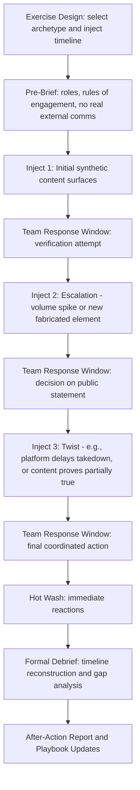

## War-Gaming AI-Era Crisis Scenarios

### Definition and Scope

War-gaming AI-era crisis scenarios refers to structured simulation exercises designed to test an organization's crisis response capabilities against threats that are novel to, or amplified by, artificial intelligence and synthetic media — including deepfake-driven disinformation, AI-generated coordinated inauthentic behavior, AI-hallucinated "facts" entering public discourse, and adversarial misuse of the organization's own AI tools. This differs from traditional crisis simulation (product recall, executive scandal, natural disaster) primarily in the speed, scale, and evidentiary ambiguity these scenarios introduce.

### Why This Matters in Crisis & Reputation Management

Traditional tabletop exercises were built around information environments where fabrication was detectable through effort (forged documents, staged photos) and spread at human-mediated speed. AI-era threats compress both dimensions: convincing synthetic video/audio can now be produced with commodity tools in minutes, and coordinated bot networks can push a fabricated narrative to trending status before a communications team has convened its first call. Organizations that have not specifically war-gamed these dynamics tend to default to slower, evidence-gathering-first response postures that are miscalibrated for the actual threat speed. [Inference] Absent a rehearsed rapid-verification protocol, teams facing a first-time deepfake incident are likely to lose critical early hours simply determining whether the content is real.

### Core Design Principles for AI-Era War-Games

**Key Points**

- **Compress timelines deliberately**: Traditional exercises might allow a 24–48 hour narrative arc; AI-era scenarios should compress key decision points into a 1–4 hour window to simulate the actual velocity of synthetic-media-driven virality.
- **Build in evidentiary ambiguity**: Unlike classic scenarios where "what happened" is usually clear and the question is "how do we respond," AI-era scenarios should deliberately withhold certainty about whether content is authentic, forcing teams to practice decision-making under unresolved forensic ambiguity.
- **Include the organization's own AI tools as an attack surface**: Scenarios should test what happens when the organization's chatbot, monitoring tool, or drafting assistant is manipulated, jailbroken, or produces an embarrassing/harmful output that itself becomes the crisis.
- **Test cross-functional coordination speed**: AI-era incidents typically require faster coordination between Communications, Legal, IT/Security, and (increasingly) a forensic or trust-and-safety function than legacy crises did.
- **Incorporate multi-platform spread dynamics**: Scenarios should simulate simultaneous spread across video platforms, messaging apps (private, harder to monitor), and traditional social media, reflecting real-world propagation patterns.
- **Debrief on both content and process**: Post-exercise review should separately evaluate (a) whether the final communications decisions were sound and (b) whether the *process* of reaching them was fast and clear enough for real-world timelines.

### Scenario Archetypes

| Archetype | Description | Key Test |
| --- | --- | --- |
| Executive deepfake | Fabricated video/audio of a senior leader making damaging statements | Verification speed, legal response, platform takedown process |
| Fabricated incident footage | Synthetic or manipulated imagery depicting an event that didn't occur (e.g., safety incident, product failure) | Forensic escalation, coordination with affected facilities to confirm ground truth |
| AI tool malfunction/manipulation | Organization's own chatbot or AI assistant produces harmful, biased, or embarrassing output that goes viral | Internal AI governance response, kill-switch procedures, public accountability statement |
| Coordinated inauthentic amplification | Bot/troll network artificially inflates a real but minor complaint into apparent mass outrage | Distinguishing genuine vs. synthetic sentiment, platform reporting, proportional response |
| AI-hallucinated "fact" propagation | A popular AI chatbot or search-AI overview states a false claim about the organization as fact, and it spreads | Correction pathway with AI vendors, public correction strategy, SEO/AI-visibility remediation |

### War-Game Exercise Architecture

### Practical Example: Executive Deepfake Tabletop Exercise

**Example**

A financial services firm runs a 90-minute war-game with the following structure:

1. **Inject 1 (T+0 min)**: Facilitators present a fabricated video clip (pre-produced for the exercise) appearing to show the CEO making a statement about undisclosed financial losses. It is seeded into the exercise as "trending on a video platform, 50K views in 20 minutes."
2. **Team response window (T+0–15 min)**: The crisis team must decide: Do we treat this as confirmed-false immediately, or do we need verification first? What is our public posture while verification is pending? Who has authority to say "this is fake" publicly before full forensic confirmation?
3. **Inject 2 (T+20 min)**: Facilitators report the clip has been picked up by a financial news aggregator's automated feed and is now being cited by AI-powered search summaries as a developing story.
4. **Team response window (T+20–40 min)**: Team must now coordinate a response across owned channels, direct outreach to the aggregator, and consideration of legal action against unknown originators, while stock-price-sensitive disclosure rules (for public companies) constrain what can be said and when.
5. **Inject 3 (T+45 min)**: Twist — forensic analysis takes longer than expected (e.g., 2 hours) due to the sophistication of the fake, forcing the team to decide whether to issue a preliminary denial before full confirmation.
6. **Debrief**: Facilitators map the actual elapsed decision time against the team's internal escalation-matrix targets, identifying where the process was too slow or where authority to act was unclear.

### Common Gaps Exposed by AI-Era War-Games

- **Unclear authority to issue a rapid denial**: Many organizations' approval chains assume time for full legal review, which is misaligned with the speed needed to counter a viral deepfake.
- **No pre-established relationship with platform trust-and-safety teams**: Takedown requests are slower without an existing escalation contact, a gap only discovered under simulation pressure.
- **Absence of a "we are aware and investigating" holding statement template**: Teams often improvise this language live rather than having a pre-approved template ready to adapt.
- **No defined threshold for engaging outside forensic/deepfake-detection specialists**: Organizations frequently lack a pre-vetted vendor relationship, causing delay in obtaining authoritative verification.
- **Underestimating AI-search-engine propagation**: Teams often plan for social media spread but overlook that AI-powered search summaries and chatbots can independently surface and repeat a false claim as if it were established fact, requiring a distinct correction pathway with AI vendors.

### Measuring War-Game Effectiveness

**Next Steps**

Organizations typically track the following metrics across successive exercises to demonstrate improvement:

- Time-to-first-internal-alert (simulated)
- Time-to-verification-decision
- Time-to-first-public-holding-statement
- Number of cross-functional handoff delays identified
- Percentage of pre-approved templates/playbook steps actually usable without modification during the exercise

### Related Topics

- Ethical Use of AI in Crisis Response
- Deepfake and Synthetic Media Detection Techniques
- Building Platform Trust-and-Safety Escalation Relationships
- Legal Disclosure Constraints During Fast-Moving Misinformation Events
- Designing Holding Statement Templates for Unverified Incidents
- Coordinated Inauthentic Behavior Detection
- After-Action Review Methodology for Crisis Simulations