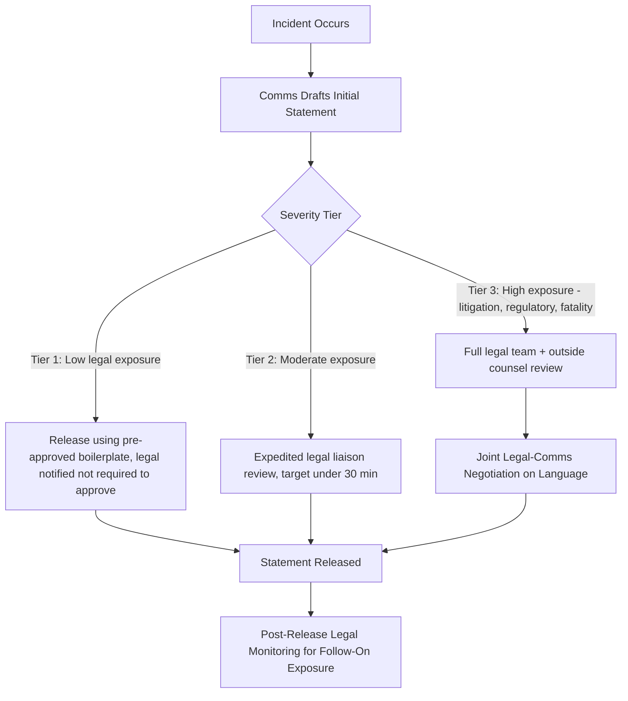

## Working with Legal Counsel During a Crisis

### Definition and Scope

Working with legal counsel during a crisis refers to the structured collaboration between communications/crisis management teams and legal advisors (in-house counsel and/or outside law firms) to balance two frequently competing objectives: protecting the organization's legal position and preserving its reputation and stakeholder trust. This item covers the operational dynamics, common points of friction, decision frameworks, and practical protocols for integrating legal review into time-compressed crisis communications.

### Why This Matters in Crisis & Reputation Management

Legal and communications functions optimize for different things by default. Legal counsel is trained to minimize liability exposure, which often favors caution, non-admission of fault, and minimal disclosure. Communications is trained to preserve trust, which often favors speed, empathy, and transparency. Unmanaged, this tension produces classic crisis failures: statements that are legally safe but read as evasive or cold, or statements released quickly that create unintended legal admissions. [Inference] Organizations without a pre-negotiated protocol for resolving this tension tend to default to whichever function has more organizational power in the moment, rather than the approach best suited to the specific incident.

### Core Tension: Legal Caution vs. Communications Urgency

**Key Points**

- **Admission risk**: Legal counsel typically advises against statements that could be construed as admitting fault, causation, or wrongdoing, since such statements can be used as evidence in litigation or regulatory proceedings.
- **Empathy gap**: Purely liability-driven language (e.g., avoiding the word "sorry," refusing to confirm basic facts) frequently reads to the public as cold or evasive, which can worsen reputational damage even if it reduces legal exposure.
- **Disclosure obligations vs. discretion**: In regulated industries (publicly traded companies, healthcare, financial services), there are often *mandatory* disclosure timelines (e.g., material event disclosure under securities law, breach notification laws) that constrain how much discretion communications teams actually have.
- **Speed mismatch**: Legal review processes are often designed for non-time-critical documents (contracts, filings) and may not have an expedited pathway for crisis-speed statement review, creating bottlenecks exactly when speed matters most.
- **Privilege considerations**: Communications prepared with legal input may be protected by attorney-client privilege in some contexts, but this protection can be inadvertently waived if draft materials are shared too broadly or through improper channels — a technical legal point that affects how crisis teams should route sensitive drafts.

### Structural Solutions: Building the Working Relationship Before a Crisis

- **Pre-negotiated escalation matrix**: Define in advance which categories of statements require full legal review, which require expedited (e.g., 15-minute) legal check, and which can be released with only pre-approved legal boilerplate.
- **Embedded legal liaison**: Many organizations designate a specific legal team member (not the General Counsel personally, typically) as the crisis-response legal point of contact, who has pre-delegated authority to approve routine language quickly.
- **Pre-approved language libraries**: Legal and communications jointly develop, in advance of any crisis, a library of legally vetted phrases and structures for common scenarios (data breach notification, product safety concern, workplace incident) so that live drafting starts from an approved baseline rather than from scratch.
- **Joint training and simulation participation**: Legal counsel should participate in crisis simulations and tabletop exercises, not just review real incidents, so that the working relationship and mutual expectations are tested under low-stakes conditions first.
- **Documented decision authority**: A clear, written record of who has final sign-off authority when legal and communications disagree (often the CEO or a designated crisis committee chair) prevents deadlock during an actual event.

### Legal Review Workflow During an Active Crisis

### Practical Example: Negotiating Language in a Product Safety Incident

**Example**

A consumer goods company discovers a manufacturing defect that has caused several minor injuries. The initial communications draft reads:

> "We are deeply sorry this defect caused injuries to our customers, and we are pulling the affected product line immediately."

Legal counsel flags two concerns: (1) "this defect caused injuries" is a causation admission before root-cause analysis is complete, and (2) "immediately" implies a specific recall timeline the operations team has not yet confirmed it can meet.

A negotiated revision, developed jointly rather than legal simply rewriting the draft unilaterally:

> "We are aware that some customers have reported injuries potentially associated with this product, and we take this extremely seriously. We have begun a safety review and are pausing distribution of the affected product line while we investigate."

This version preserves empathy and urgency ("take this extremely seriously," "pausing distribution") while avoiding a premature causation admission ("potentially associated with," "investigate") and an unconfirmed operational commitment ("pausing" rather than "immediately pulling"). The negotiation process — comms proposing, legal flagging specific risk phrases with reasoning, comms revising rather than legal dictating — is itself the practice being modeled, not just the final text.

### Common Failure Patterns

- **Legal veto without alternative language**: Counsel rejecting a phrase for liability reasons without proposing a legally safer alternative, forcing communications to either delay or guess, which slows the process unnecessarily.
- **Communications bypassing legal under time pressure**: Releasing statements without required review because "there wasn't time," which can create larger downstream legal exposure than the delay would have caused.
- **Treating all statements as equally high-risk**: Applying full legal review rigor to routine, low-exposure communications (e.g., a minor service delay notice) wastes the expedited-review capacity needed for genuinely high-risk situations.
- **No outside counsel relationship pre-established**: For incidents requiring specialized expertise (e.g., data breach notification law varies significantly by jurisdiction), scrambling to engage outside counsel during the crisis itself adds delay.
- **Privilege mishandling**: Circulating legally-reviewed drafts through insecure or overly broad distribution channels, potentially undermining privilege protection in later litigation. [Unverified] Privilege rules vary by jurisdiction and specific fact pattern; organizations should confirm current guidance with counsel rather than relying on general practice.

### Regulatory Context Affecting Legal-Communications Coordination

- **Securities law (public companies)**: Material event disclosure requirements (e.g., Regulation FD and Form 8-K obligations in the US) can create hard deadlines that override normal crisis communication discretion.
- **Data breach notification laws**: Many jurisdictions impose specific notification timelines (varying by jurisdiction, e.g., 72 hours under GDPR for supervisory authority notification) that legal counsel must translate into operational deadlines for the communications team.
- **Industry-specific regulation**: Healthcare (HIPAA), financial services, and other regulated sectors carry additional disclosure and confidentiality constraints that shape what communications can say.

### Related Topics

- Building a Pre-Approved Crisis Language Library
- Securities Disclosure Obligations in Crisis Communications
- Attorney-Client Privilege Considerations in Crisis Drafting
- Cross-Functional Crisis Team Design and Escalation Matrices
- Data Breach Notification Timelines by Jurisdiction
- Tabletop Exercise Design Including Legal Stakeholders
- Balancing Empathy and Liability in Public Statements