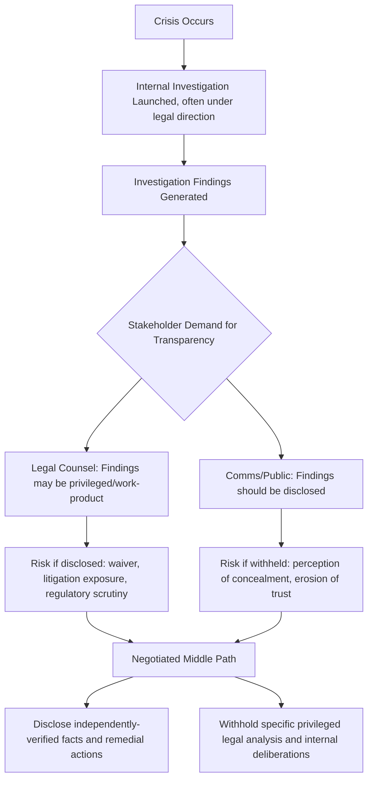

## Attorney-Client Privilege vs Transparency Tensions

### Definition and Scope

This item addresses the structural conflict between attorney-client privilege — the legal doctrine protecting confidential communications between a client and its lawyer from compelled disclosure — and the reputational and stakeholder expectation of transparency during a crisis. It covers how privilege operates mechanically, how it can be inadvertently waived through crisis communications practices, and how organizations navigate the resulting tension when stakeholders, regulators, or the public demand openness that legal counsel views as risky to disclose.

### Why This Matters in Crisis & Reputation Management

Privilege exists to encourage full and frank communication between clients and counsel by shielding it from later disclosure (e.g., in litigation discovery or regulatory investigation). But a crisis is precisely the moment when stakeholders most want to know "what did the organization know, and when, and what is it doing about it" — questions that often touch directly on internally investigated facts, root-cause findings, and legal risk assessments that counsel would prefer to keep privileged. This creates a structural bind: the more thoroughly and honestly an organization investigates and documents a crisis internally (which is good practice), the more material exists that could be protected by privilege — and stakeholders may perceive that protection as concealment. [Inference] Organizations that don't have a pre-established framework for distinguishing "what must stay privileged" from "what can be shared transparently" are more likely to default to blanket non-disclosure, which itself often reads publicly as evasive.

### How Privilege Works: Mechanical Basics

**Key Points**

- **What privilege protects**: Confidential communications made for the purpose of seeking or providing legal advice, between a client (including, for organizations, appropriately authorized employees) and an attorney.
- **What privilege does not automatically protect**: Underlying facts. The doctrine protects the *communication about* facts made to counsel for legal advice purposes — it does not protect the facts themselves from discovery through other means (e.g., witness testimony, business records created independent of the legal communication).
- **Work-product doctrine (related but distinct)**: In many jurisdictions, materials prepared in anticipation of litigation by or for a party (including some investigation materials) receive separate protection from privilege, with somewhat different rules about waiver and applicability.
- **Waiver risk**: Privilege can be waived — intentionally or inadvertently — by disclosing privileged communications to third parties, including sometimes by circulating legal advice too broadly within an organization, sharing it with a public relations vendor without proper agreements, or referencing privileged legal advice in public statements.
- **Selective disclosure risk**: In some jurisdictions, voluntarily disclosing part of a privileged communication (e.g., "our lawyers told us we were not at fault") can be treated as waiving privilege over the entire related communication or subject matter — a doctrine sometimes called "subject matter waiver."

[Unverified] The precise scope of privilege, work-product protection, and waiver doctrines varies meaningfully across jurisdictions (and even across US states versus federal courts); this is a technical legal determination that should be confirmed with qualified counsel for the specific jurisdiction and fact pattern involved, not treated as a general rule.

### The Core Tension Illustrated

### Practical Approaches to Managing the Tension

- **Separate "facts and actions" from "legal analysis"**: A common practical resolution is to publicly disclose the factual findings of an investigation and the remedial actions being taken, while withholding the specific legal advice, risk assessments, or internal deliberations about liability that generated privilege in the first place. These are analytically distinct categories, and disclosure of one does not necessarily require disclosure of the other.
- **Use independent or parallel fact-finding**: Some organizations commission a factual review that is structured *outside* the attorney-client relationship (e.g., a technical/operational review reporting directly to the board or an independent committee) specifically so its findings can be disclosed without privilege complications, while a separate privileged legal risk assessment runs in parallel.
- **Selective, controlled disclosure with waiver awareness**: When some disclosure of privileged material is deemed necessary (e.g., regulatory cooperation, demonstrating good faith), organizations should do so deliberately and with counsel's guidance on scope, since inadvertent broad waiver is a real risk of piecemeal disclosure.
- **Executive/public statement discipline**: Public statements should generally avoid directly characterizing or quoting legal advice ("our lawyers assured us...") since this can trigger waiver arguments; instead, statements should describe *actions taken* and *facts established* independent of the legal advice itself.
- **Timing management**: Organizations sometimes commit publicly to disclosing findings *after* certain legal or regulatory processes conclude, providing stakeholders a concrete transparency commitment without requiring premature disclosure of privileged material mid-process.

### Practical Example: Data Breach Investigation Disclosure

**Example**

A company suffers a data breach and initiates an internal investigation under the direction of outside counsel (a common practice specifically intended to maximize privilege protection over investigation materials). Stakeholders, regulators, and media demand to know: what happened, how many people were affected, and what the company is doing about it.

A structured disclosure approach might separate:

- **Disclosed (facts and remediation)**: Number of affected records, general nature of the vulnerability (without operational security detail that could enable further attacks), date range of exposure, steps taken to remediate (patching, credential resets, monitoring services offered to affected individuals), and notification timeline compliance.
- **Withheld (privileged legal analysis)**: Counsel's assessment of litigation exposure, specific legal risk memos evaluating regulatory penalty likelihood, and internal deliberations about settlement strategy or insurance coverage positioning.

Public communications describe the facts and remediation in detail — because these are independently discoverable through technical forensics and operational records, not solely through privileged legal communications — while the company simply states that it "is working with legal counsel to evaluate its obligations and options" without characterizing what that legal advice actually concluded.

### Common Failure Patterns

- **Blanket "no comment" driven by absolute privilege caution**: Refusing to disclose even independently-known facts (not actually privileged) out of excessive caution, which reads as concealment and can independently exacerbate reputational damage.
- **Executives improvising characterizations of legal advice under media pressure**: Off-the-cuff statements like "our lawyers say we did nothing wrong" can create waiver exposure and are a well-documented crisis communications hazard.
- **Failing to distinguish audiences**: Providing more detailed disclosure to a regulator under a confidentiality agreement while giving the public a much thinner account can be appropriate, but doing so *without* a coherent, defensible rationale for the difference can itself become a secondary credibility issue if the discrepancy becomes known.
- **Treating the investigation report itself as automatically privileged**: Privilege depends on how and why a document was created (for legal advice purposes) — not merely on the fact that lawyers were involved somewhere in the process; documents created for business purposes are not automatically privileged simply because counsel later reviewed them. [Unverified] This determination is fact-specific and jurisdiction-dependent and should be confirmed with counsel rather than assumed.

### Related Topics

- Working with Legal Counsel During a Crisis
- Structuring Internal Investigations to Preserve Privilege
- Regulatory Cooperation and Voluntary Disclosure Strategy
- Data Breach Notification Timelines by Jurisdiction
- Crafting Executive Talking Points Under Legal Constraint
- Independent Board Committee Investigations During Crises
- Subject-Matter Waiver Risk in Public Statements