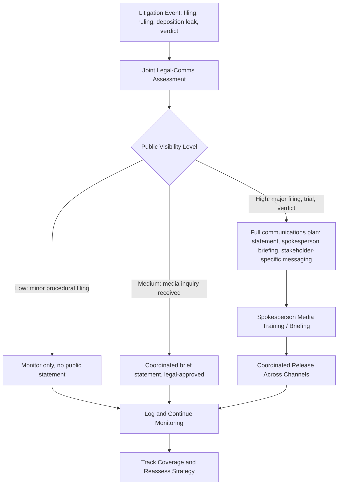

## Litigation Public Relations

### Definition and Scope

Litigation public relations (also called litigation communications) is the discipline of managing public perception and media coverage of an organization or individual before, during, and after legal proceedings — civil litigation, criminal proceedings, regulatory enforcement, or arbitration. It sits at the intersection of law and communications, requiring coordination with legal strategy while operating in the court of public opinion, which runs on different rules, timelines, and evidentiary standards than the court of law.

### Why This Matters in Crisis & Reputation Management

Legal proceedings are frequently public-facing even when the underlying legal strategy is not designed with public perception in mind. Court filings become news stories, depositions get leaked, and opposing counsel or media may frame narratives well before a legal outcome is reached — meaning reputational damage can occur (and often becomes irreversible) regardless of the eventual legal result. A company can "win" a lawsuit years later and still have suffered lasting reputational harm from the way the litigation was covered in its early stages. [Inference] Organizations that treat litigation purely as a legal matter, without a parallel communications strategy, are more likely to cede the public narrative to opposing parties or media framing by default, simply because no one is actively managing that channel.

### Core Tension: Legal Strategy vs. Public Narrative

**Key Points**

- **Different audiences, different standards**: A legal strategy is built for judges, juries, and regulators, operating under rules of evidence and procedure. A communications strategy is built for the public, media, customers, investors, and employees, who form opinions based on incomplete information, headlines, and emotional resonance rather than admissible evidence.
- **Timeline mismatch**: Litigation can take years; public attention and reputational damage often crystallize in the first days or weeks of a story breaking, long before any legal resolution.
- **The "no comment" trap**: Legal counsel frequently defaults to advising minimal public comment to avoid creating discoverable statements or prejudicing the case; but sustained silence in the face of active media coverage often gets filled by the opposing party's narrative or media speculation.
- **Court of public opinion vs. court of law**: Facts that would be inadmissible, procedurally excluded, or ultimately unproven in court (unverified allegations, dismissed claims, out-of-context documents) can still cause full reputational damage once reported, regardless of their eventual legal status.
- **Multiple audiences with different needs**: Employees, customers, investors, and regulators may all require different messaging cadences and detail levels about the same litigation, coordinated so the messages don't contradict each other publicly.

### Standard Practice Areas Within Litigation PR

| Practice Area | Function |
| --- | --- |
| Pre-litigation positioning | Shaping narrative before a suit is filed, when a dispute is known to be escalating |
| Filing-stage response | Rapid-response statements when a complaint, indictment, or regulatory action becomes public |
| Ongoing coverage management | Managing media relationships and messaging consistency across a multi-year proceeding |
| Trial communications | Coordinating courtroom-adjacent messaging (statements outside the courthouse, media pool management) during active trial |
| Verdict/settlement communications | Framing outcomes regardless of result, including favorable spin on unfavorable outcomes where legally permissible |
| Post-litigation reputation recovery | Longer-term narrative rebuilding after a matter concludes |

### Coordination Workflow with Legal Strategy

### Practical Example: Managing a Regulatory Enforcement Action

**Example**

A pharmaceutical company receives notice that a regulator has filed a formal enforcement action alleging labeling violations. The filing becomes public and is picked up by trade press within hours.

1. **Joint assessment**: Legal and communications jointly review the filing to identify what is being alleged, what is factually disputed, and what language is legally safe to use publicly.
2. **Differentiated statement**: A public statement acknowledges the filing exists (since it is a public court/regulatory record and denying its existence would be quickly disproven), states the company's general position ("we believe our labeling complies with applicable regulations and intend to respond through the appropriate process"), and avoids arguing the specific factual merits in the press, which legal counsel typically wants reserved for the formal proceeding.
3. **Stakeholder-specific messaging**: Investors receive a more detailed briefing addressing potential financial exposure (subject to securities disclosure rules), employees receive an internal message emphasizing the company's confidence in its compliance practices without prejudging the outcome, and customers receive reassurance focused on product safety rather than the legal dispute itself.
4. **Ongoing cadence**: The company designates a single spokesperson and commits to providing updates at defined proceeding milestones (e.g., "we will provide an update when the court rules on the motion to dismiss") rather than responding reactively to every media inquiry, which helps manage expectations and reduce ad hoc improvisation risk.
5. **Consistency check**: All stakeholder-specific messages are reviewed together to ensure no contradictions exist between what investors, employees, and the public are being told, since these audiences overlap and inconsistencies are often discovered and reported on.

### Ethical and Practical Boundaries

- **Do not try the case in the media in ways that violate legal ethics rules**: Many jurisdictions have specific ethical rules (e.g., ABA Model Rule 3.6 in the US) restricting what trial participants and their representatives can say publicly about a pending case, particularly regarding statements likely to materially prejudice a jury pool. [Unverified] Specific rule numbers, thresholds, and enforcement vary by jurisdiction and should be confirmed with counsel for the applicable jurisdiction.
- **Avoid statements that could constitute witness tampering or improper influence**: Communications about ongoing litigation must avoid any appearance of attempting to influence witnesses, jurors, or judicial officers.
- **Coordinate, don't contradict, sworn testimony**: Public statements should not directly contradict positions the organization has taken under oath or in formal filings, as this creates both a credibility problem and potential legal exposure (e.g., admissions usable against the organization).
- **Respect sealed/confidential materials**: Communications teams must be briefed on what portions of a proceeding are under seal, subject to protective order, or otherwise legally restricted from public discussion, to avoid inadvertent disclosure violations.

### Common Failure Patterns

- **Legal-only strategy with no communications involvement**: Allowing the legal team to run the entire response without communications input, ceding the public narrative by default.
- **Overpromising outcomes**: Public statements expressing excessive confidence in a legal outcome that, if the case is subsequently lost or settled unfavorably, create a credibility gap larger than if expectations had been more measured.
- **Inconsistent messaging across audiences**: Telling investors one thing and the public another in ways that create a documented contradiction, which itself can become a secondary story ("company told investors X while telling the public Y").
- **Ignoring the sentencing/settlement-adjacent news cycle**: Failing to prepare communications for predictable procedural milestones (verdict, sentencing, settlement announcement), resulting in reactive rather than proactive messaging at the highest-visibility moments.
- **Spokesperson unpreparedness**: Sending an untrained or under-briefed spokesperson into media interactions during active litigation, risking off-script statements that create new legal or reputational exposure.

### Related Topics

- Working with Legal Counsel During a Crisis
- Attorney-Client Privilege vs Transparency Tensions
- Securities Disclosure Obligations in Crisis Communications
- Spokesperson Selection and Media Training
- Stakeholder-Specific Messaging Strategy (Investors, Employees, Customers, Regulators)
- Managing Media Relationships During Multi-Year Legal Proceedings
- Post-Litigation Reputation Recovery Strategy