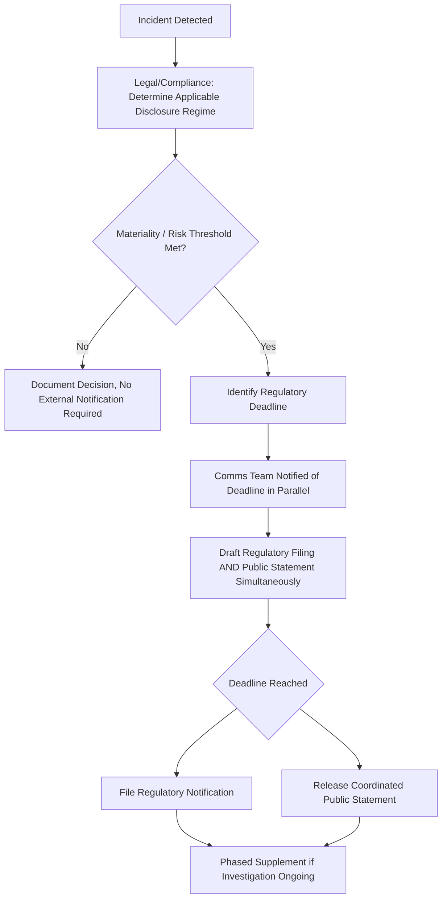

## Regulatory Disclosure Obligations by Sector

### Definition and Scope

Regulatory disclosure obligations by sector refers to the legally mandated requirements that compel organizations to notify regulators, affected individuals, investors, or the public about specific categories of events within defined timelines, varying substantially by industry (financial services, healthcare, technology/data privacy, energy, pharmaceuticals) and jurisdiction. This item maps the major disclosure regimes crisis communicators must coordinate with, since these legal deadlines frequently override communications teams' preferred timing and often set the *floor* (not the ceiling) for what must be disclosed and when.

### Why This Matters in Crisis & Reputation Management

Communications strategy typically wants control over timing and framing — releasing information when the organization is prepared, with a coherent narrative. Regulatory disclosure law frequently removes that control by imposing fixed deadlines regardless of communications readiness. A crisis team unaware of the applicable disclosure regime risks either missing a legal deadline (creating separate regulatory liability) or being blindsided by a regulatory filing becoming public before the communications team has prepared a public narrative to accompany it. [Inference] Organizations that map applicable disclosure triggers before a crisis, rather than during one, are better positioned to synchronize legal deadlines with a prepared communications response rather than reacting to a filing after the fact.

### Securities Disclosure: Material Events (US Context)

**Key Points**

- **Form 8-K generally**: US publicly traded companies must disclose specified "material events" to the SEC via Form 8-K, with most triggering items requiring filing within four business days of the event's occurrence or determination of materiality.
- **Cybersecurity incident disclosure (Item 1.05)**: Under SEC rules, a Form 8-K Item 1.05 filing is generally due four business days after a registrant determines a cybersecurity incident is material, requiring disclosure of the incident's nature, scope, timing, and material impact or reasonably likely material impact. Disclosure may be delayed if the U.S. Attorney General determines immediate disclosure would pose a substantial risk to national security or public safety. [TrustCloud](https://www.trustcloud.ai/risk-management/everything-you-need-to-know-about-the-sec-form-8-k/)[TrustCloud](https://www.trustcloud.ai/risk-management/everything-you-need-to-know-about-the-sec-form-8-k/)
- **Annual reporting on cyber risk governance (Regulation S-K Item 106)**: Registrants must describe their processes for assessing, identifying, and managing material cybersecurity risks, board oversight of those risks, and management's role in assessing and managing them, in the annual Form 10-K. [TrustCloud](https://www.trustcloud.ai/risk-management/everything-you-need-to-know-about-the-sec-form-8-k/)
- **Materiality determination is itself a legal judgment**: Whether an event is "material" (would a reasonable investor consider it important) is a fact-specific legal determination made jointly by legal, executive leadership, and often outside counsel — communications teams should not assume an event is or isn't material without this formal determination, since the clock for disclosure starts at determination, not necessarily at the moment of the underlying incident.
- **Regulation FD (Fair Disclosure)**: Generally prohibits selective disclosure of material nonpublic information to certain audiences (analysts, institutional investors) without simultaneous broad public disclosure — relevant when crisis teams are tempted to brief key investors privately before a public statement.

### Data Privacy and Breach Notification: GDPR (EU Context)

**Key Points**

- **72-hour supervisory authority notification**: Under GDPR, a controller must notify a personal data breach to the competent supervisory authority without undue delay and, where feasible, not later than 72 hours after becoming aware of it, unless the breach is unlikely to result in a risk to the rights and freedoms of natural persons. If notification is not made within 72 hours, it must be accompanied by reasons for the delay. [GDPR Info](https://gdpr-info.eu/art-33-gdpr/)[GDPR Info](https://gdpr-info.eu/art-33-gdpr/)
- **When the clock starts**: The 72-hour countdown begins when the organization has sufficient awareness that a personal data breach has likely occurred, not necessarily when full technical details are known. This is a frequent point of confusion: legal teams often want to wait for full forensic clarity before notifying, but the regulatory clock does not wait for that. [GDPRLocal](https://gdprlocal.com/data-breach-notification-requirements/)
- **Phased/incomplete notification is permitted**: GDPR allows phased reporting under Article 33(4) to prevent undue further delay in meeting initial deadlines, provided the organization clearly indicates which information is preliminary and provides realistic timelines for updates. This directly supports a practical crisis communications pattern: file an initial notification with known facts, then supplement as the investigation continues, rather than delaying the entire notification until investigation completes. [GDPRLocal](https://gdprlocal.com/data-breach-notification-requirements/)
- **Dual notification system**: Article 33 requires notifying the supervisory authority within 72 hours of a qualifying breach, while breaches affecting individuals at high risk also require data subject notification without undue delay under Article 34 — a higher risk threshold than the supervisory authority trigger. [Secureprivacy](https://support.secureprivacy.ai/article/how-your-dpo-handles-data-breach-notifications/)
- **Documentation obligation regardless of notification**: All breaches, regardless of risk level, must be documented in an internal breach register under Article 33(5), even when the risk threshold for external notification is not met. [Secureprivacy](https://support.secureprivacy.ai/article/how-your-dpo-handles-data-breach-notifications/)
- **Penalties for notification failure**: Failure to notify is treated as a separate violation from the underlying breach itself, carrying fines of up to €10 million or 2% of global turnover. [Glocertinternational](https://www.glocertinternational.com/resources/articles/gdpr-breach-notification-72-hour-rule/)
- **A common enforcement pitfall**: Conducting a full investigation before reporting — thereby exceeding the 72-hour window — is a frequently cited violation, reinforcing that the legal obligation favors prompt, incomplete disclosure over delayed, complete disclosure. [iGDPR](https://www.igdpr.eu/en/gdpr-personal-data-breach-notification/)

[Unverified] GDPR enforcement practice, specific supervisory authority interpretations, and equivalent frameworks in other jurisdictions (UK GDPR, US state-level breach laws, sector-specific breach rules) vary and should be confirmed with current counsel and DPO guidance for the specific jurisdictions and data types involved, as this area evolves through ongoing regulatory guidance and enforcement decisions.

### Sector Disclosure Comparison

| Sector/Regime | Trigger | Notification Timeline | Primary Recipient |
| --- | --- | --- | --- |
| US Securities (Form 8-K, material events) | Determination of a material event (M&A, executive change, cybersecurity incident, etc.) | Generally 4 business days from determination | SEC (public filing) |
| US Securities (cybersecurity, Item 1.05) | Determination that a cybersecurity incident is material | 4 business days from materiality determination (delay possible for national security) | SEC (public filing) |
| GDPR (EU data breach) | Awareness of a personal data breach likely to risk individuals' rights | 72 hours (phased notification permitted) | National supervisory authority |
| GDPR (high-risk individual notification) | Breach likely to result in high risk to individuals | Without undue delay | Affected data subjects directly |
| Healthcare (illustrative, e.g., HIPAA-type regimes) | Breach of protected health information | Varies by jurisdiction, often 60 days to individuals, shorter for large breaches to regulators | Regulator and affected patients |
| Industry-specific (energy, pharma, aviation, etc.) | Safety incidents, product defects, environmental releases | Varies significantly by regulator and incident type | Relevant sector regulator |

[Inference] Healthcare and other sector-specific timelines above are illustrative of common regulatory structures; exact current timelines, thresholds, and requirements should be verified against the specific applicable regulation before operational use, since sector rules are numerous and subject to amendment.

### Coordination Workflow: Aligning Legal Deadlines with Communications Readiness

### Practical Example: Coordinating a GDPR-Triggered Disclosure with Public Communications

**Example**

A SaaS company discovers unauthorized access to a customer database affecting EU residents' personal data.

1. **Hour 0–6**: Security team confirms unauthorized access occurred; legal/DPO makes a preliminary determination that this qualifies as a breach "likely to result in a risk to individuals' rights and freedoms," triggering the Article 33 clock.
2. **Hour 6–48**: Legal drafts the initial supervisory authority notification using only confirmed facts (approximate number of records, general nature of the incident, initial remediation steps), explicitly marked as preliminary per the phased-notification allowance. In parallel, communications drafts a public/customer-facing statement using the same confirmed-facts baseline, coordinated so the two documents do not contradict each other.
3. **Hour 60–72**: Both the supervisory authority notification and the public statement are finalized and released close to the 72-hour mark, with the public statement referencing that regulatory notification has been made (a factual, non-privileged statement) without characterizing any legal risk analysis.
4. **Following weeks**: As forensic investigation continues, a supplementary notification is filed with the supervisory authority; a corresponding public update is issued using the same updated facts, maintaining consistency between regulatory and public disclosure streams.

This pattern — parallel drafting against a shared fact baseline, synchronized release timing — is a standard practical mechanism for preventing the common failure of a regulatory filing becoming public (e.g., via a data breach tracking service or leak) before the organization's own communications are ready.

### Common Failure Patterns

- **Waiting for full investigation before any disclosure**: As enforcement guidance directly warns, conducting a complete investigation before reporting is a frequently cited violation under GDPR; the same principle of "disclose what is known, supplement later" applies conceptually across most modern disclosure regimes, even though specific rules differ.
- **Treating the regulatory filing and the public statement as sequential rather than parallel work**: Drafting the regulatory notification first and only starting the public statement afterward often causes communications to miss the coordinated release window, allowing the regulatory filing (many of which become public record) to surface before the organization has its own narrative ready.
- **Underestimating "awareness" as a legal trigger point**: Teams sometimes believe the clock starts only once forensics are complete; regulatory frameworks like GDPR start the clock at reasonable awareness, which is typically much earlier.
- **Applying one jurisdiction's timeline globally**: Multinational organizations often incorrectly assume a single notification timeline applies everywhere, when in fact obligations differ by jurisdiction, data type, and regulatory regime, requiring jurisdiction-specific legal mapping in advance.
- **Failing to update both regulatory and public disclosures in tandem**: Supplementing a regulatory filing without a corresponding public update (or vice versa) creates an inconsistency that can itself become a story if journalists or regulators compare the two.

### Related Topics

- Working with Legal Counsel During a Crisis
- Attorney-Client Privilege vs Transparency Tensions
- Data Breach Notification Timelines by Jurisdiction
- Securities Disclosure Obligations in Crisis Communications
- Building a Sector-Specific Disclosure Trigger Map
- Coordinating Regulatory Filings with Public Statement Timing
- Cross-Border Data Privacy Compliance in Multinational Crises