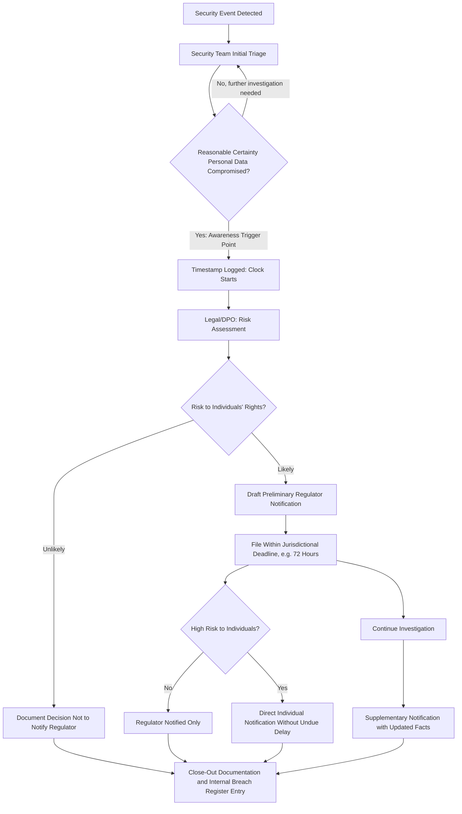

## Breach Disclosure Timelines and Regulatory Filings

### Definition and Scope

This item covers the specific procedural mechanics of complying with data breach and security incident notification requirements: how the notification clock is triggered, what content must be included, how phased/incomplete filings are handled, and how organizations build internal operational timelines that translate legal deadlines into actionable crisis workflow steps. It complements the broader sector-disclosure landscape by focusing specifically on breach/incident notification mechanics rather than the full range of regulatory disclosure categories.

### Why This Matters in Crisis & Reputation Management

Breach notification deadlines are unusual among crisis-relevant legal obligations in that they are often measured in hours or days, not weeks, and the clock frequently starts before the organization has full clarity on what happened. This creates a specific operational challenge: crisis and legal teams must be able to file a legally sufficient notification under incomplete information, then supplement it — a workflow that is fundamentally different from most other business documentation processes, which assume the drafter has complete facts before writing.

### The "Awareness" Trigger: When Does the Clock Start

**Key Points**

- **Awareness, not certainty**: Under GDPR, the 72-hour countdown starts when the organization has sufficient awareness that a personal data breach has likely occurred, not necessarily when full technical details are known. Guidance from the European Data Protection Board (EDPB Guidelines 9/2022) clarifies that a controller is considered "aware" once it has a reasonable degree of certainty that a security incident has occurred that has led to personal data being compromised.
- **Documenting the moment of awareness is itself an enforcement focus**: Supervisory authorities examine the documented moment of awareness first in an enforcement investigation, meaning organizations should log precisely when key personnel (security team, DPO, legal) first had reasonable certainty a breach occurred — this timestamp becomes evidentiary.
- **Risk threshold gates the external notification obligation**: Not every breach requires notification to the supervisory authority — only those likely to result in a risk to individuals' rights and freedoms. A low-risk breach (e.g., accidental deletion of data immediately recoverable from backup) may not require notification, but the assessment itself must still be documented, since the absence of notification must be justifiable on record.
- **Two distinct thresholds, two distinct obligations**: Article 33 (regulator notification) triggers at "risk," while Article 34 (direct individual notification) triggers at the higher bar of "high risk" — meaning many breaches require regulator notification without requiring direct notification to every affected individual.

### Phased Notification: Filing Under Incomplete Information

- **Legal basis for incomplete initial filing**: GDPR Article 33(4) specifically permits phased reporting to prevent undue delay in meeting the initial deadline. The organization files what is known within the deadline, clearly marks that information as preliminary, and provides a realistic timeline for supplementary updates.
- **Required initial content, even if incomplete**: A compliant initial notification typically addresses the nature of the breach, categories and approximate numbers of affected individuals and records, the likely consequences, and measures taken or proposed — even where each of these fields must be stated as an estimate or "under investigation."
- **The core operational trade-off this creates**: Legal and security teams are often culturally inclined to want full clarity before formal filing (a normal instinct in technical incident response); breach notification law explicitly rejects that default, favoring prompt-and-incomplete over delayed-and-complete. Building this expectation into incident response training in advance prevents teams from defaulting to the "wait until we know more" instinct during an actual event.

### Standard Breach Response Timeline Architecture

### Practical Example: Building an Internal Breach Notification Runbook

**Example**

A mid-size EU-operating SaaS company builds an internal runbook translating the GDPR requirement into an hour-by-hour operational checklist:

- **Hour 0**: Security detects anomalous database access. Ticket opened, but awareness clock has not yet started (investigation-only stage).
- **Hour 0–4**: Security escalates to incident response lead once initial indicators suggest personal data may have been accessed. Incident response lead and DPO jointly assess and reach "reasonable certainty" — this exact timestamp is logged in the incident record as the Article 33 trigger point.
- **Hour 4–8**: DPO and legal conduct the risk assessment (is this "likely to result in a risk to rights and freedoms"), documenting the reasoning regardless of outcome.
- **Hour 8–60**: If notification is required, legal and communications jointly draft the regulator notification using confirmed facts only, explicitly labeling estimated figures (e.g., "approximately 15,000–20,000 records, pending full log analysis") as preliminary, per the phased-notification allowance.
- **Hour 60–72**: Notification filed with the competent supervisory authority before the 72-hour deadline, referencing that a supplementary notification will follow.
- **Week 2–4**: Forensic investigation concludes; supplementary notification filed with finalized figures and root-cause findings; internal breach register updated to close out documentation requirements under Article 33(5).

Building this runbook *before* an incident occurs — with pre-identified roles (who declares "awareness," who owns the risk assessment, who drafts under time pressure) — is what allows the organization to meet a 72-hour deadline that starts, unpredictably, at any hour of any day.

### Content Requirements Checklist for Initial Notification

**Key Points**

A legally sufficient initial breach notification (even when phased/preliminary) generally needs to address:

- Nature of the breach (what type of security incident occurred)
- Categories and approximate number of data subjects affected
- Categories and approximate number of personal data records affected
- Likely consequences of the breach for affected individuals
- Measures taken or proposed to address the breach and mitigate adverse effects
- Contact point (e.g., DPO) for further information
- Explicit labeling of which elements are preliminary/estimated, with a stated timeline for supplementation, where the full facts are not yet available

### Common Failure Patterns

- **Waiting for complete forensic certainty before filing**: Conducting a full investigation before reporting — and thereby exceeding the 72-hour window — is a frequently cited violation in enforcement practice; this is the single most common and most avoidable failure mode.
- **Not logging the awareness timestamp contemporaneously**: Reconstructing "when did we become aware" after the fact, rather than logging it at the moment, creates a documentation gap that regulators scrutinize directly in enforcement reviews.
- **Skipping documentation for breaches deemed low-risk**: All breaches, regardless of risk level, must be documented in the internal breach register under Article 33(5) — organizations sometimes mistakenly believe that a "no notification needed" determination means no documentation is needed, which is incorrect.
- **Treating the 72-hour figure as a universal global standard**: The 72-hour supervisory authority timeline is specific to GDPR; other jurisdictions and sector-specific regimes impose different timelines (some shorter, some longer, some tiered by breach size), so multinational organizations need jurisdiction-specific runbooks rather than a single global timeline.
- **No pre-assigned decision authority for the "awareness" determination**: Ambiguity about who has authority to declare that the organization has reached "reasonable certainty" (and thus start the legal clock) can itself cause delay at the exact moment speed matters most.

[Unverified] This item focuses primarily on the GDPR framework as a detailed worked example of breach notification mechanics; equivalent notification regimes exist under other frameworks (US state breach notification laws, sector-specific rules, other national data protection laws) with their own specific timelines, triggers, and content requirements that should be separately confirmed with current counsel for any jurisdiction in scope, as these regimes are numerous and subject to ongoing legislative and regulatory change.

### Related Topics

- Regulatory Disclosure Obligations by Sector
- Working with Legal Counsel During a Crisis
- Attorney-Client Privilege vs Transparency Tensions
- Building an Internal Breach Notification Runbook
- Cross-Border Data Privacy Compliance in Multinational Crises
- Coordinating Regulatory Filings with Public Statement Timing
- Documenting Risk Assessment Decisions for Regulatory Defense