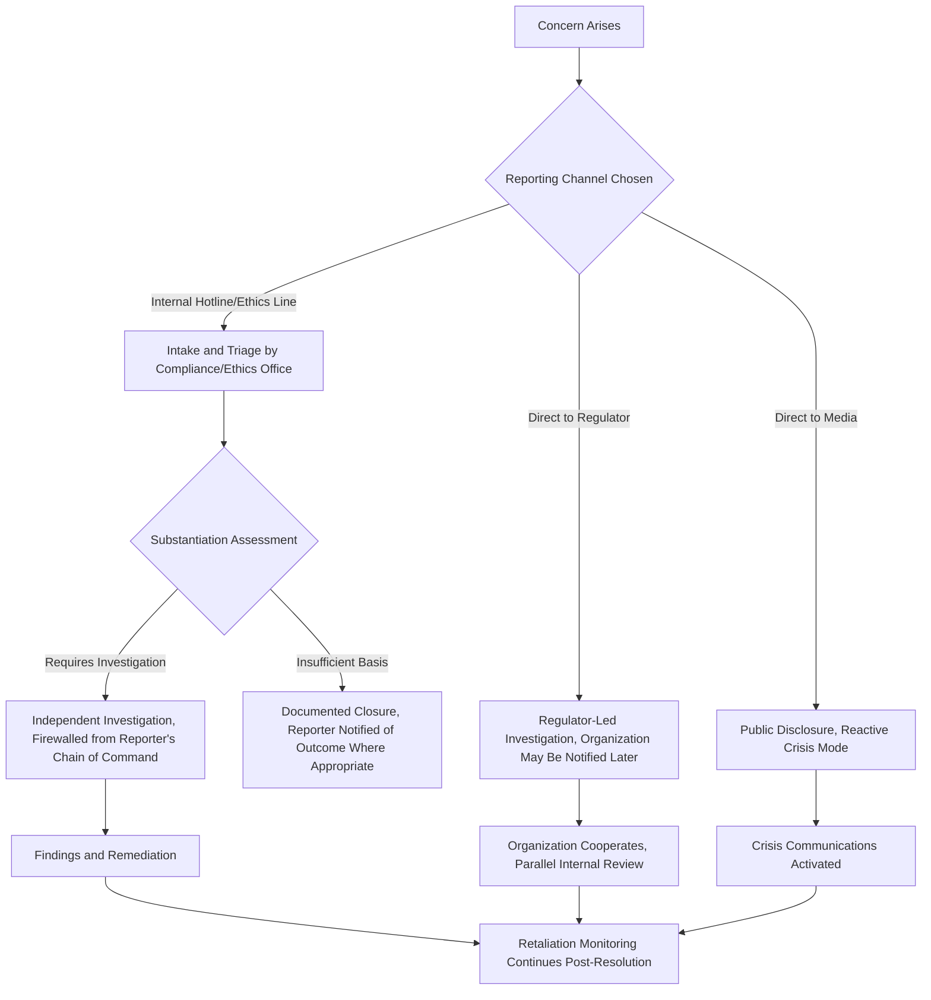

## Whistleblower Situations and Internal Reporting

### Definition and Scope

This item covers how organizations manage crisis and reputational risk arising from whistleblower disclosures — both internal reporting channels (hotlines, ombudspersons, internal audit escalation) designed to surface issues before they become public, and the crisis response required when a whistleblower disclosure becomes public, is made to regulators, or is leaked to media. It addresses the legal protections whistleblowers typically have, the retaliation risks organizations must actively avoid, and the communications strategy required when whistleblower allegations surface externally.

### Why This Matters in Crisis & Reputation Management

Whistleblower situations are distinctive among crisis triggers because the organization's own response to the whistleblower — not just the underlying misconduct allegation — becomes an independent reputational and legal risk. A company that had a genuine but manageable compliance problem can transform it into a much larger crisis through visible retaliation against the person who raised it, a pattern that recurs across major corporate scandals and that regulators, media, and the public specifically watch for. [Inference] Organizations that have not built a credible, well-used internal reporting channel are more likely to have whistleblowers bypass internal channels entirely and go directly to regulators or media, removing the organization's opportunity to address an issue before it becomes a public crisis.

### Core Legal and Ethical Framework

**Key Points**

- **Whistleblower protection is a distinct legal category**: Many jurisdictions provide specific legal protections against retaliation for individuals who report suspected legal violations, safety issues, fraud, or misconduct through protected channels — protections that are often separate from, and stronger than, general employment law.
- **Multiple reporting pathways exist and interact**: An individual may report internally (hotline, manager, compliance/ethics office), to a regulator directly (e.g., securities regulators often have direct whistleblower programs with financial incentive structures), or to media/public disclosure — each pathway carries different legal protections and different organizational risk profiles.
- **Retaliation is often the larger legal and reputational exposure**: Even where the underlying allegation is unsubstantiated or partially incorrect, adverse action taken against a good-faith reporter (demotion, termination, exclusion, harassment) frequently creates independent legal liability and is often the more damaging story from a reputational standpoint.
- **Confidentiality vs. anonymity are distinct concepts**: Confidential reporting means the organization knows the reporter's identity but commits to protecting it from broader disclosure; anonymous reporting means even the organization does not know who filed the report. Internal reporting systems should be clear with employees about which model is being offered, since conflating them undermines trust if a "confidential" report's source becomes known through the investigation process.
- **Non-retaliation policy must be operationalized, not just stated**: A written policy prohibiting retaliation is necessary but not sufficient; organizations need active monitoring (e.g., tracking whether a reporter's performance reviews, assignments, or team standing change after a report) to detect subtle retaliation that would not be admitted as such.

### Internal Reporting System Architecture

### Building an Effective Internal Reporting Channel

- **Accessibility and multiple modalities**: Effective systems typically offer multiple intake channels (phone hotline, web portal, in-person ombudsperson) since different individuals have different comfort levels with each format.
- **Independence from the reporting line's management chain**: Reports about a manager or executive must be routed to a function independent of that person's authority (e.g., directly to compliance, audit committee, or an external ethics line vendor) to avoid the appearing conflict of the concern being investigated by the very hierarchy it concerns.
- **Clear, realistic communication about anonymity limits**: Organizations should be transparent that true anonymity has practical limits (e.g., a report describing a very specific situation may effectively identify the reporter to those familiar with the team), rather than over-promising anonymity that cannot be technically guaranteed.
- **Defined investigation timeline and reporter feedback loop**: Reporters who receive no acknowledgment or update are more likely to escalate externally out of frustration or a sense that the internal channel is ineffective — a defined (even if general) timeline for status updates helps retain issues within the internal system.
- **Board/audit committee visibility for serious allegations**: Serious allegations (executive misconduct, financial fraud, safety violations with potential for harm) typically warrant a reporting line to the board or audit committee independent of management, both for governance integrity and to demonstrate to regulators that appropriate oversight exists.

### Crisis Communications When a Whistleblower Disclosure Goes Public

**Key Points**

- **Do not characterize the whistleblower negatively**: Public statements that criticize the reporter's motives, credibility, or character — even if factually arguable — are a well-documented reputational hazard, since they are read by the public (and often regulators) as evidence of a retaliatory culture, regardless of the underlying merits of the allegation.
- **Separate process statements from merits statements**: Organizations can generally state that they take all reports seriously and are investigating, without prematurely confirming or denying the specific factual allegations before an investigation concludes — this mirrors the fact/legal-analysis separation used in privilege management.
- **Coordinate with legal on regulatory-parallel-track dynamics**: If the same matter is also under review by a regulator (common when whistleblowers report to both internal channels and regulators, or when a regulator's own program is involved), public statements must be coordinated with legal to avoid contradicting positions taken with the regulator.
- **Prepare for the "did the company retaliate" secondary narrative**: Media coverage of whistleblower stories frequently investigates not just the underlying allegation but also how the organization treated the reporter afterward — crisis communications planning should anticipate and prepare a truthful, defensible account of the reporter's treatment as its own workstream.
- **Internal communications matter as much as external**: Employees watching how a whistleblower situation is handled form judgments about whether raising future concerns internally is safe — internal messaging (without violating the reporter's privacy or confidentiality) about the organization's commitment to non-retaliation is a distinct communications need from the external public statement.

### Practical Example: Responding to a Public Whistleblower Allegation

**Example**

A former employee at a manufacturing company gives an interview to a journalist alleging the company knowingly shipped products that failed internal safety tests, and claims they were terminated shortly after raising the concern internally.

1. **Immediate fact-gathering**: Legal and HR jointly and urgently review the actual internal record — was a report filed, what did it say, what was the termination's documented rationale, and what is the timeline relationship between the two events (a close timeline is itself a common evidentiary factor in retaliation claims).
2. **Statement discipline**: The company's initial public statement avoids both (a) confirming the specific safety allegation before technical review, and (b) disparaging the former employee's motives or character. A viable initial statement acknowledges the report, states that all safety concerns are taken seriously and reviewed rigorously, and commits to sharing findings through the appropriate process — without characterizing the termination's relationship to the report at all until facts are established.
3. **Parallel investigation**: An investigation independent of the product team's management chain reviews both the safety testing allegation and the termination circumstances separately, since conflating them prematurely (assuming guilt on one implies guilt on the other, or vice versa) would be an analytical error.
4. **Internal messaging**: Employees receive a message reaffirming the non-retaliation policy and the availability of the internal reporting channel, distinct from and not referencing the specific public allegation, to avoid appearing to relitigate the specific case internally.
5. **Outcome-dependent follow-through**: If the investigation substantiates either the safety concern or a retaliation pattern, the organization's credibility depends heavily on visible remediation (product action, policy change, or accountability for retaliatory conduct) rather than the initial statement alone — the initial statement buys time for a credible process, but doesn't substitute for one.

### Common Failure Patterns

- **Visible retaliation, even if legally arguable as unrelated**: Any adverse action against a reporter that is temporally close to their report invites a retaliation narrative regardless of the organization's actual internal rationale, making documentation of legitimate, independent grounds for any adverse action essential *before* it is taken, not reconstructed afterward.
- **Public attacks on the whistleblower's credibility or motives**: This is one of the most reliable ways to convert a manageable allegation into a significant, prolonged crisis, since it shifts media and public attention toward the organization's conduct rather than the original allegation's merits.
- **Under-resourced or performative internal reporting channels**: A hotline that exists on paper but is poorly publicized, slow to respond, or perceived as unsafe drives legitimate concerns toward external channels (regulators, media) where the organization has far less ability to manage the process or timeline.
- **Conflating investigation of the allegation with investigation of the reporter**: Treating the whistleblower as the subject of scrutiny (e.g., focusing internal investigation resources on how they gathered evidence or who they spoke to) rather than the underlying allegation itself is both a common retaliation pattern and a significant legal and reputational risk if it becomes known.
- **No board/oversight visibility for serious matters**: Serious allegations resolved entirely within management, with no independent board or audit committee awareness, can undermine the credibility of the eventual resolution with regulators and the public, particularly if management itself is implicated.

### Related Topics

- Working with Legal Counsel During a Crisis
- Attorney-Client Privilege vs Transparency Tensions
- Litigation Public Relations
- Building an Independent Internal Investigation Process
- Board and Audit Committee Crisis Oversight Roles
- Regulatory Cooperation and Voluntary Disclosure Strategy
- Employee Trust Recovery After Internal Misconduct Allegations