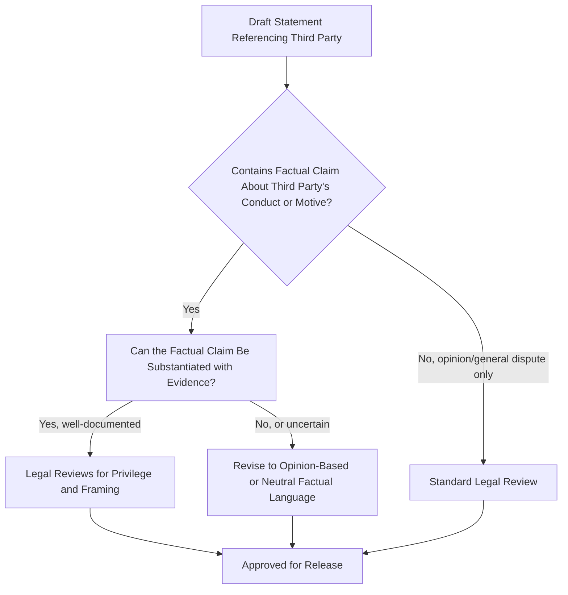

## Defamation and Libel Considerations in Response

### Definition and Scope

This item covers the defamation (libel for written/published statements, slander for spoken) risks organizations must navigate when crafting crisis responses — both the risk of the organization itself making defamatory statements about accusers, critics, or third parties in its response, and the risk assessment involved in deciding whether and how to pursue defamation claims against parties making false statements about the organization. It focuses on the practical intersection of defamation law and crisis communications drafting discipline, not general defamation litigation strategy.

### Why This Matters in Crisis & Reputation Management

Crisis responses are often drafted under significant emotional and time pressure, precisely the conditions under which defamatory language is most likely to slip into a statement — an angry or defensive characterization of an accuser, a competitor, or a critic that crosses from opinion or fair response into a false factual assertion of wrongdoing. Separately, organizations facing what they believe are false and damaging public statements must decide whether to pursue defamation claims, a decision with its own reputational trade-offs (litigation can appear either as justified accountability-seeking or as bullying/silencing critics, depending on framing and context). [Inference] Statements drafted without specific defamation-risk review are more likely to contain factual characterizations of a third party's conduct or motives that go beyond what the organization can actually substantiate, since the pressure to sound confident and decisive during a crisis pushes toward more assertive language than the underlying facts may support.

### Core Legal Concepts

**Key Points**

- **Defamation requires a false statement of fact, not opinion**: A core defense against defamation claims is that the statement was an opinion or rhetorical hyperbole rather than an assertion of verifiable fact. Statements like "we believe this claim is meritless" function differently, legally, than "this person is lying," which asserts a specific state of mind as fact.
- **Truth is generally a complete defense**: If a statement is factually true, it is generally not defamatory regardless of how damaging it is to the subject's reputation — but this places the burden on the organization to be able to substantiate the truth of any factual claim it makes about a third party.
- **Public figures face a higher bar in many jurisdictions**: In the US, public figures (and in defamation claims against media, public officials) generally must prove "actual malice" — that the statement was made knowing it was false or with reckless disregard for its truth — a higher standard than for private individuals. [Unverified] Whether a specific individual (e.g., a former employee, a customer, a critic) qualifies as a "public figure" for these purposes is a fact-specific legal determination that varies by jurisdiction and circumstances, and should be assessed by counsel rather than assumed.
- **Privilege defenses exist for certain contexts**: Some jurisdictions recognize qualified privileges for certain communications (e.g., statements made in specific legal or regulatory proceedings, some employment-reference contexts) that provide additional protection even for statements that might otherwise be actionable.
- **Jurisdictional variation is substantial**: Defamation law differs meaningfully between common law jurisdictions (US, UK, Australia, Canada) and civil law jurisdictions, and even among common law jurisdictions the balance between free speech protection and reputational protection differs significantly (UK defamation law has historically been considered more claimant-friendly than US law, for example). [Unverified] Specific doctrinal differences and current standards should be confirmed with jurisdiction-qualified counsel for any specific situation, as this is a rapidly evolving and jurisdiction-dependent area.

### Defamation Risk in Outbound Crisis Statements

- **Characterizing an accuser's motives as fact**: Statements asserting that a critic or accuser is acting out of a specific ulterior motive (e.g., "this is a competitor-funded smear campaign," "this individual has a personal vendetta") assert a factual claim about intent that the organization may not be able to substantiate, creating defamation exposure distinct from simply disputing the underlying allegation.
- **Using accusatory legal-sounding language informally**: Labeling someone's conduct with legally loaded terms ("fraud," "criminal," "extortion") in a public statement, without an actual legal proceeding or clear factual basis, creates specific defamation risk because such terms assert particular factual and legal conclusions.
- **Amplifying third-party defamatory content**: Sharing, requoting, or endorsing a third party's defamatory statement about someone else (even in the course of responding to a crisis) can itself create liability in some jurisdictions, particularly where the organization adds its own endorsement rather than neutrally reporting the existence of the claim.
- **Statements about employees or former employees**: Public statements characterizing a departed employee's conduct, performance, or reasons for departure carry specific risk, especially when the employee disputes the characterization — this frequently intersects with whistleblower and termination-related crisis scenarios.
- **Social media and spokesperson improvisation**: Off-script remarks by executives or spokespersons in live interviews or social media posts are a common source of defamation exposure precisely because they lack the review process applied to formal statements.

### Review Workflow for Defamation Risk in Crisis Drafting

### Practical Example: Revising a Draft Response for Defamation Risk

**Example**

A restaurant chain faces a viral social media post from a former employee alleging unsafe food handling practices. An initial internal draft response reads:

> "This former employee is spreading lies because they were fired for theft and are trying to get revenge."

Legal review flags multiple issues: (1) "spreading lies" asserts the person knowingly stated falsehoods, a factual claim about their state of mind; (2) "fired for theft" asserts a specific factual claim about the termination reason that, if not fully documented and provable, creates exposure; (3) "trying to get revenge" asserts a motive as fact.

A revised version:

> "We take all food safety concerns seriously and have reviewed our practices at this location; we found no violations of our safety protocols. We are unable to comment on personnel matters, but we stand behind our food safety record, which is independently audited."

This version disputes the substance of the allegation (no violations found) using a factual claim the organization can substantiate (the audit), avoids characterizing the former employee's motives or termination reasons at all, and explicitly declines to discuss personnel matters — sidestepping the defamation-risk territory entirely rather than trying to rebut it with counter-accusations.

### Deciding Whether to Pursue a Defamation Claim

**Key Points**

When an organization is considering legal action against a party making allegedly false and damaging statements, crisis communications input is relevant alongside the legal merits analysis:

- **The "Streisand effect" risk**: Pursuing legal action against a critic — even when legally justified — can dramatically amplify attention to the original statement and generate a "organization is trying to silence critics" narrative that may cause more reputational harm than the original statement itself.
- **Public figure/anti-SLAPP considerations**: Many jurisdictions have anti-SLAPP (Strategic Lawsuit Against Public Participation) statutes that make it easier for defendants to get meritless defamation suits targeting public commentary dismissed quickly, and can expose the plaintiff organization to the defendant's legal fees — a significant practical consideration in evaluating whether to sue. [Unverified] Anti-SLAPP protections and procedures vary substantially by jurisdiction (and by US state) and should be assessed with counsel for the applicable jurisdiction.
- **Cease-and-desist as an intermediate step**: Often used before litigation, a cease-and-desist letter can resolve a matter privately, though it carries its own risk if the recipient publicizes having received it, which can itself become a story.
- **Evidentiary discovery burden of pursuing a claim**: Bringing a defamation claim can open the organization's own conduct to discovery in the litigation, a consideration that should be weighed alongside the reputational benefit of "winning" the underlying dispute.
- **Alternative: factual correction rather than legal action**: In many cases, a well-substantiated, calm public correction of the factual record achieves more reputational benefit with less risk than litigation, reserving legal action for cases of sustained, high-impact, clearly false and damaging statements.

### Common Failure Patterns

- **Drafting under emotional pressure without dedicated defamation review**: Statements drafted quickly in response to a personally or professionally stinging allegation are disproportionately likely to include unsubstantiated characterizations of the accuser, which is precisely why a specific defamation-risk checkpoint (distinct from general legal review) is valuable in the drafting workflow.
- **Escalating to legal threats as a first response**: Threatening defamation action publicly or prematurely, before assessing the Streisand-effect and anti-SLAPP risk, can escalate a manageable situation into a much larger story about the organization's response rather than the original claim.
- **Confusing "we disagree with this characterization" with a provable factual rebuttal**: Organizations sometimes assert a rebuttal as though it were an established fact, when it is actually their own contested position — this is a subtler version of the same over-assertion risk, even without directly attacking the accuser.
- **Failing to distinguish spokesperson statements from official positions**: An executive's unscripted, emotionally charged remarks in an interview or on social media can create the same defamation exposure as a formal statement, but without the review process — spokesperson training should specifically address this risk, not just message discipline generally.

### Related Topics

- Working with Legal Counsel During a Crisis
- Litigation Public Relations
- Whistleblower Situations and Internal Reporting
- Spokesperson Selection and Media Training
- Anti-SLAPP Statutes and Their Crisis Communications Implications
- Drafting Legally Defensible Public Statements Under Time Pressure
- The Streisand Effect and Amplification Risk in Legal Responses