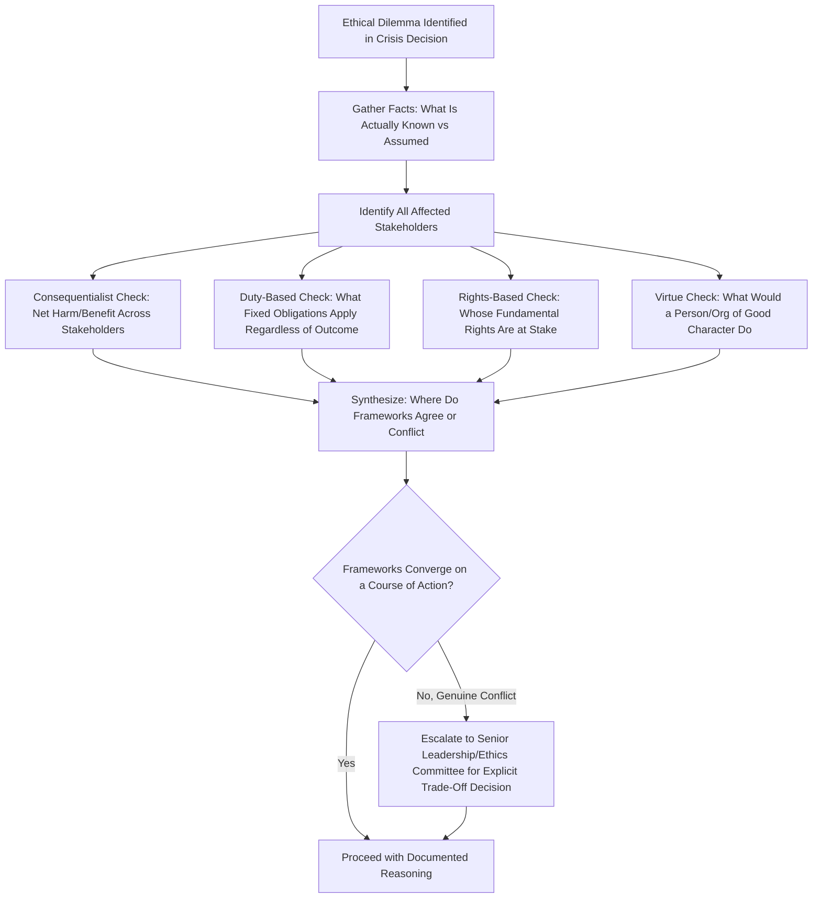

## Ethical Decision-Making Frameworks in Crisis

### Definition and Scope

This item covers the formal ethical reasoning frameworks that crisis and communications professionals can apply when facing decisions with genuine moral tension — situations where legal compliance alone does not resolve what the *right* course of action is, or where competing obligations (to shareholders, employees, affected individuals, the public, and truth itself) pull in different directions. It surveys the major applied-ethics frameworks used in professional crisis contexts and how they translate into practical decision tools under time pressure.

### Why This Matters in Crisis & Reputation Management

Crises frequently present decisions that are legally permissible but ethically contested — for example, a technically accurate statement that creates a misleading overall impression, or a legally sufficient disclosure that stakeholders would consider inadequate given the severity of harm involved. Communications and crisis professionals who rely solely on "is this legal" or "will this look bad" as their decision heuristics often miss the deeper question of whether a given response is *right*, independent of its legal or optics consequences. [Inference] Organizations that have not pre-established a shared ethical reasoning framework are more likely to see individual decision-makers default to intuition or personal risk tolerance under pressure, producing inconsistent ethical standards across similar incidents.

### Major Ethical Frameworks Applied to Crisis Decisions

**Key Points**

- **Consequentialism / utilitarian reasoning**: Evaluates a decision by its outcomes — which course of action produces the greatest net benefit (or least net harm) across all affected stakeholders. In crisis contexts, this often means weighing harm to affected individuals against broader harms (e.g., business disruption affecting employees, cascading effects on customers or communities) rather than treating any single stakeholder's interest as automatically dominant.
- **Deontological / duty-based reasoning**: Evaluates a decision by whether it adheres to fixed moral duties or rules (e.g., "do not deceive," "disclose material risks to those affected") regardless of the outcome produced. This framework resists the reasoning "the lie was justified because it produced a better outcome" — a duty not to deceive stakeholders holds independent of whether deception would have been advantageous.
- **Virtue ethics**: Evaluates a decision by asking what a person or organization of good character would do — emphasizing traits like honesty, courage, and accountability rather than a rule or outcome calculation. In practice, this often manifests as the question "if our full decision-making process were made public, would it reflect well on our character?"
- **Stakeholder theory**: A framework more specific to organizational ethics, holding that organizations have genuine obligations to multiple stakeholder groups (employees, customers, communities, shareholders, regulators) rather than a primary duty to shareholders alone — directly relevant to crisis decisions that trade off between these groups.
- **Rights-based reasoning**: Evaluates a decision by whether it respects the fundamental rights of affected parties (e.g., right to safety information, right to fair treatment, right to privacy) as a threshold consideration independent of cost-benefit calculation.

None of these frameworks is universally "correct" for all situations; professional practice typically uses them as complementary lenses, checking a proposed decision against several frameworks to surface blind spots that any single framework might miss.

### A Practical Multi-Framework Decision Process

### Common Crisis-Specific Ethical Tensions

| Tension | Framework Conflict Illustrated |
| --- | --- |
| Full transparency vs. avoiding panic | Duty to disclose (deontological) vs. consequentialist concern about harm from panic or misunderstanding |
| Protecting the organization's survival vs. full accountability | Stakeholder theory's employee/shareholder interests vs. rights-based accountability to directly harmed parties |
| Speed of response vs. accuracy of response | Consequentialist urgency (faster response reduces harm) vs. duty not to state unverified claims as fact |
| Legal minimalism vs. moral generosity | What the law requires (floor) vs. what a virtuous organization would voluntarily do beyond the legal minimum |
| Individual privacy vs. public's right to know | Rights-based privacy claim vs. consequentialist/public-interest disclosure argument |

### Practical Example: Applying the Framework to a Product Safety Decision

**Example**

A toy manufacturer discovers, mid-crisis, that a small percentage of a already-recalled product batch may pose a secondary, less severe risk not covered by the original recall notice. Legal counsel advises that current disclosure law does not technically require expanding the recall notice, since the original recall already addresses the primary risk and the secondary risk is statistically minor.

Applying the multi-framework process:

- **Consequentialist check**: The harm of not disclosing (some additional children potentially exposed to the secondary risk) is weighed against the harm of disclosing (potential erosion of trust in the recall process itself, cost of an expanded recall). Given the harm involves child safety, most consequentialist analyses would weight avoided harm to children heavily.
- **Duty-based check**: If the organization has an internal or professional duty not to withhold known safety-relevant information from affected consumers, this duty applies regardless of whether the law technically requires it — "the law doesn't require it" answers a legal question, not the ethical one.
- **Rights-based check**: Consumers arguably have a claim to information the organization already possesses about risks associated with a product they purchased, independent of statistical minority framing.
- **Virtue check**: The question "would a genuinely safety-first organization sit on information it has about a risk to children because disclosure isn't legally mandated" surfaces the reputational and character stakes clearly.

In this example, the frameworks converge: multiple ethical lenses point toward voluntary disclosure beyond the legal minimum. The organization documents this reasoning (both for internal governance record and to inform future policy) and expands the recall notice voluntarily, framing the decision publicly as an above-and-beyond safety commitment rather than as a legal requirement.

### Institutionalizing Ethical Decision-Making

**Next Steps**

- **Pre-established ethics escalation path**: Define, before a crisis, who has authority to weigh in on genuine ethical dilemmas (e.g., a chief ethics officer, an ethics committee, or specific board-level involvement for the most serious cases) so this isn't improvised under pressure.
- **Documented reasoning as institutional practice**: Requiring written documentation of the ethical reasoning behind close-call crisis decisions (not just the legal review) builds an institutional record that supports consistency across incidents and provides material for post-crisis review and training.
- **Training scenarios that isolate ethics from legality**: Crisis simulation exercises should include scenarios deliberately designed so that the legally safest option and the most ethically sound option diverge, forcing teams to practice explicit trade-off reasoning rather than defaulting to "what does legal say."
- **Board-level ethical oversight for the most severe cases**: The most consequential ethical trade-offs (e.g., involving risk to life, large-scale harm, or fundamental stakeholder trust) warrant visibility beyond the immediate crisis team, similar to serious whistleblower allegations warranting board/audit committee awareness.

### Common Failure Patterns

- **Treating "legal" as synonymous with "ethical"**: The most common failure mode is collapsing the ethical question entirely into the legal one, missing situations (like the example above) where the law sets a floor that a genuinely ethical response should exceed.
- **No structured process, relying on individual intuition under pressure**: Without a shared framework, different decision-makers facing similar dilemmas across different incidents may reach inconsistent conclusions, undermining the organization's perceived integrity over time.
- **Using ethical framing as post-hoc justification rather than genuine reasoning**: Retroactively describing a decision as "the ethical choice" after it has already been made for other reasons (cost, convenience, legal minimalism) is a credibility risk if the actual decision process becomes known or is inconsistent with the framing.
- **Ethics discussions happening only after the crisis, not during it**: Genuine ethical reasoning applied only in post-crisis reviews, rather than in real-time decision-making, misses the opportunity to actually influence the decision when it mattered.

### Related Topics

- Working with Legal Counsel During a Crisis
- Ethical Use of AI in Crisis Response
- Whistleblower Situations and Internal Reporting
- Stakeholder Mapping and Prioritization in Crisis Response
- Board-Level Ethics Oversight Structures
- Post-Crisis Ethical Review and Institutional Learning
- Building Crisis Simulation Scenarios with Genuine Ethical Trade-Offs