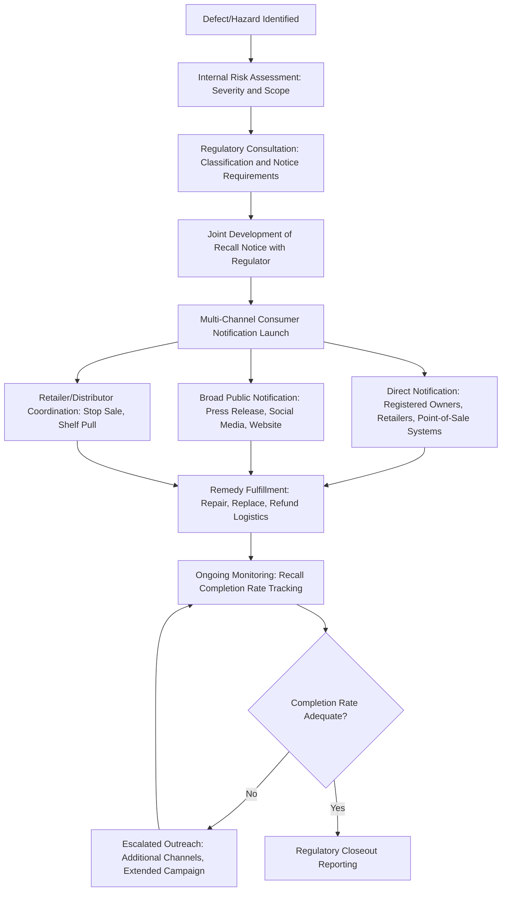

## Product Recalls and Consumer Safety Crises

### Definition and Scope

This item covers the specific crisis management discipline of managing a product recall or broader consumer safety crisis — where a defect, contamination, or hazard has been identified in a product already in the market, requiring a coordinated response across regulatory compliance, operational logistics (removing/repairing product), and public communications. It covers the regulatory triggers, communications architecture, and operational-communications coordination distinctive to this crisis type.

### Why This Matters in Crisis & Reputation Management

Product recalls are a crisis type with an unusually direct and measurable stakeholder harm dimension — the affected parties are identifiable consumers who purchased and may still be using a potentially hazardous product, not a diffuse reputational audience. This changes the calculus significantly: the primary communications objective is not persuasion or narrative management but successfully reaching and motivating action from affected consumers, with reputational outcomes following from how effectively and transparently that primary safety objective is achieved. [Inference] Organizations that treat a recall primarily as a reputational challenge to manage, rather than a consumer-reach problem to solve, tend to under-invest in the operational communications infrastructure (direct notification systems, multi-channel outreach) that actually drives recall effectiveness and, subsequently, reputational recovery.

### Regulatory Framework Governing Recalls

**Key Points**

- **Sector-specific regulators**: Recall processes are typically governed by an industry-specific regulator — for example, consumer products (in the US, the Consumer Product Safety Commission), food and pharmaceuticals (FDA-type agencies), automobiles (transportation safety regulators), and medical devices (health product regulators) — each with different notification timelines, classification systems, and required remediation processes.
- **Mandatory vs. voluntary recalls**: Many jurisdictions distinguish mandatory recalls (ordered by a regulator) from voluntary recalls (initiated by the manufacturer, often before or in coordination with regulatory involvement) — voluntary recalls are more common in practice and can be framed communications-wise as proactive safety leadership, whereas mandatory recalls generally carry a more adversarial regulatory narrative.
- **Severity/hazard classification systems**: Many regulatory regimes classify recalls by hazard severity (e.g., risk of serious injury/death vs. minor or no health consequence), which affects both the legal urgency of the required response and the appropriate tone and prominence of public communications.
- **Required elements of recall notices**: Regulators typically mandate that recall notices include specific identifying information (product model/batch/lot numbers, date ranges of manufacture or sale, description of the hazard, instructions for consumers), which the communications team must build its broader messaging around rather than treating as a separate legal document.
- **Coordination with regulator on notice timing and content**: In many jurisdictions, the recall notice itself is jointly developed or must be reviewed by the regulator before publication, meaning communications teams need a workflow that accounts for regulatory review time.

### Recall Response Architecture

### Multi-Channel Consumer Notification Strategy

- **Direct notification of known purchasers**: Where purchaser records exist (warranty registrations, loyalty programs, direct sales, retailer records where legally shareable), direct outreach (mail, email, phone) is generally the most effective channel and often carries a specific regulatory expectation for higher-severity recalls.
- **Retailer and distribution channel coordination**: Communicating clear stop-sale and shelf-pull instructions to retailers and distributors is both a legal/contractual necessity and a practical control point — unsold inventory reaching more consumers after a recall has been announced is a distinct and preventable failure mode.
- **Broad public notification**: Press releases, regulator recall databases, social media, and company website prominence serve the segment of affected consumers who cannot be directly identified (e.g., cash purchases, resale/secondhand owners, gift recipients).
- **Point-of-sale and registration-gap mitigation**: Many consumer products have low warranty registration rates, meaning direct notification reaches only a fraction of actual owners — recall strategy should assume broad public notification is necessary regardless of direct notification capability, not a fallback.
- **Search and social media findability**: Given that many consumers search online for product safety information after seeing news coverage, ensuring the recall notice is easily findable via search (proper SEO, prominent website placement) has become a practically important, though non-traditional, part of recall communications infrastructure.

### Practical Example: Coordinating a Multi-Channel Food Safety Recall

**Example**

A packaged food company identifies a potential allergen mislabeling issue affecting a specific product batch.

1. **Regulatory notification**: The company notifies the relevant food safety regulator within the required timeline, providing batch/lot numbers, distribution timeframe, and affected retail locations.
2. **Joint notice development**: Working with the regulator, the company finalizes recall notice language that meets regulatory content requirements (specific product identification, clear allergen risk description, and return/refund instructions) while the communications team ensures the language is understandable to a general consumer audience, not just regulatory-technical phrasing.
3. **Retailer coordination**: The company's distribution team issues stop-sale notices to all retail partners carrying the affected batch, coordinated to occur simultaneously with the public notice to prevent a gap where product remains on shelves after public awareness of the recall.
4. **Multi-channel consumer outreach**: Direct email/app notification goes to loyalty program members who purchased the product (identifiable via purchase history); a press release and prominent website/social media notice reach the broader public who cannot be directly identified; the recall is registered in the regulator's public recall database.
5. **Completion tracking and escalation**: The company tracks the rate of product returns/confirmed disposal against the estimated total units distributed; if completion rates lag expectations after a defined period, additional outreach waves (extended social media campaign, in-store signage extension) are triggered.
6. **Regulatory closeout**: Once completion metrics meet the regulator's expectations (or the recall period concludes per regulatory requirements), the company files closeout documentation.

### Tone and Messaging Principles for Safety Communications

**Key Points**

- **Lead with the safety instruction, not corporate framing**: Consumers scanning a recall notice need the actionable information (what to do with the product) immediately visible, not buried after corporate context or apology language — clarity of instruction takes priority over narrative framing in this specific document.
- **Avoid minimizing language for genuinely serious hazards**: Language that downplays a hazard's severity (e.g., "in rare cases" for a hazard the organization knows to be more common, or an overly reassuring tone for a serious injury risk) undermines both the recall's practical effectiveness and, if inconsistent with the actual hazard data, creates credibility and potential legal exposure.
- **Balance urgency with actionability**: Effective notices convey genuine urgency without inducing panic that could cause consumers to disregard clear instructions (e.g., unsafe self-directed disposal of a hazardous product rather than following the specified return process).
- **Empathy without premature liability admission**: As in general crisis communications, recall notices can express genuine concern and regret for the inconvenience or risk created without necessarily making legally premature causation admissions — though for recalls specifically, the safety instruction and factual hazard description generally take priority over liability-management language.

### Common Failure Patterns

- **Treating the recall as primarily a reputational event to manage rather than a consumer-reach problem to solve**: Under-resourcing the operational elements (direct notification systems, retailer coordination, completion tracking) in favor of "managing the story" produces both worse safety outcomes and, ultimately, worse reputational outcomes when the recall's practical ineffectiveness becomes visible.
- **Notice language that is regulatory-compliant but not genuinely understandable**: A notice that satisfies the letter of required content but is written in dense regulatory or technical language fails many consumers in practice, undermining the recall's actual safety purpose.
- **Gaps between public announcement and retailer stop-sale execution**: A timing gap where affected product remains available for purchase after the recall is publicly known is both a preventable operational failure and a significant credibility risk if reported.
- **Underinvesting in completion tracking and follow-up**: Treating notification as the end of the process, rather than monitoring actual completion rates and escalating outreach when rates lag, leaves affected consumers with unaddressed hazardous products and leaves the organization exposed to the recall being characterized as ineffective.
- **Delayed decision-making while awaiting complete root-cause certainty**: Similar to breach notification dynamics, waiting for full certainty about scope or cause before initiating any public notification can create a preventable-harm-during-delay problem that regulators and the public evaluate harshly in hindsight.

### Related Topics

- Regulatory Disclosure Obligations by Sector
- Working with Legal Counsel During a Crisis
- Ethical Decision-Making Frameworks in Crisis
- Building Direct Consumer Notification Systems
- Retailer and Distribution Channel Crisis Coordination
- Recall Completion Rate Measurement and Escalation Strategy
- Post-Recall Trust Recovery Communications