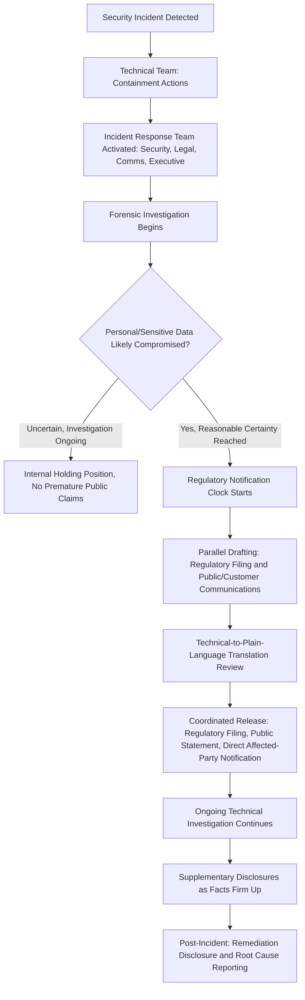

## Data Breaches and Cybersecurity Incidents

### Definition and Scope

This item covers crisis and reputation management specific to data breaches and cybersecurity incidents — unauthorized access, exposure, or exfiltration of data (personal, financial, or proprietary), ransomware attacks, and system compromises. It addresses the distinctive technical, legal, and communications coordination this crisis type requires, building on the regulatory notification mechanics covered elsewhere and focusing here on the operational crisis response architecture, technical-communications translation challenge, and stakeholder-specific messaging needs unique to cyber incidents.

### Why This Matters in Crisis & Reputation Management

Cybersecurity incidents present a distinctive communications challenge: the underlying technical facts are often genuinely uncertain for an extended period (attackers' access scope, what data was actually exfiltrated versus merely accessed, whether the threat actor retains access), while stakeholder pressure for information is immediate and intense. This creates a structural mismatch between the pace of forensic certainty and the pace of expected disclosure, compounded by the technical complexity of the subject matter, which most stakeholders (including many journalists and even executives) do not have specialized expertise to evaluate independently. [Inference] Organizations that have not pre-built technical-to-plain-language translation capability into their crisis team are likely to either overwhelm public communications with jargon that obscures rather than clarifies, or oversimplify to the point of stating claims the forensic investigation has not yet actually confirmed.

### Core Technical Concepts Communications Teams Must Understand

**Key Points**

- **Access vs. exfiltration**: A critical distinction — an attacker gaining unauthorized *access* to a system does not automatically mean data was *exfiltrated* (copied out). Public statements should be precise about which has actually been confirmed by forensic investigation, since conflating the two either understates or overstates the actual risk to affected individuals.
- **Ransomware vs. data breach**: Ransomware (malicious encryption of systems, typically with a ransom demand) is a distinct incident type from a data breach, though modern ransomware attacks increasingly involve a "double extortion" pattern where data is both encrypted (operational disruption) and separately exfiltrated (breach/disclosure risk) before encryption — meaning many current incidents require the communications and legal response appropriate to both incident types simultaneously.
- **Containment vs. eradication vs. recovery**: Standard incident response phases — containment (stopping ongoing unauthorized access), eradication (removing the threat actor's persistence mechanisms), and recovery (restoring normal operations) — occur on different timelines, and public statements conflating "we have contained the incident" with "the incident is fully resolved" can create expectations the technical team cannot yet support.
- **Indicators of compromise and forensic timeline reconstruction**: Determining when an attacker first gained access (which may predate detection by weeks or months) is often the most time-consuming forensic task, and directly affects the scope of the notification obligation (how far back does the affected data population extend) — communications planning should anticipate that this timeline may not be fully known even after initial public disclosure.
- **Third-party/vendor breach complexity**: Many incidents originate through a vendor or supply-chain partner rather than the organization's own systems directly, creating a distinct communications challenge of explaining shared responsibility without appearing to deflect blame inappropriately.

### Crisis Response Architecture for Cyber Incidents

### Stakeholder-Specific Messaging for Cyber Incidents

| Stakeholder | Primary Concern | Messaging Focus |
| --- | --- | --- |
| Affected individuals (customers, employees) | Is my data safe, what should I do | Clear description of data types involved, concrete protective steps (credential resets, monitoring services), support contact channel |
| Regulators | Compliance with notification obligations, adequacy of security practices | Factual, precise, timeline-documented filings; cooperation posture |
| Investors (public companies) | Financial and operational impact, governance adequacy | Material impact assessment, board oversight demonstration, remediation cost transparency where required |
| Employees | Is the organization capable of protecting my own data too, is my job at risk from business disruption | Internal-specific updates distinct from public messaging, reassurance grounded in actual remediation status |
| Media/public | Broader narrative of organizational competence and accountability | Balanced technical accuracy with accessible explanation; avoid both jargon and oversimplification |
| Business partners/vendors | Is their own data or systems at risk via the organization's compromise | Technical detail sufficient for their own risk assessment, often via more direct/less public channels |

### Practical Example: Coordinating Technical and Communications Response to a Ransomware Incident

**Example**

A logistics company discovers a ransomware attack that has encrypted portions of its operational systems, with the threat actor's ransom note claiming to have also exfiltrated customer data.

1. **Immediate technical response**: Security team contains the incident (isolating affected systems) and begins forensic investigation; legal is engaged immediately given the potential dual nature (operational disruption plus possible data breach).
2. **Internal-only holding position**: Because the threat actor's claim of data exfiltration is, at this stage, unverified (ransomware groups frequently exaggerate or fabricate exfiltration claims as additional leverage), the crisis team does not confirm or deny the exfiltration claim publicly until forensics can assess it — avoiding both false reassurance and unwarranted alarm based on an unverified threat actor claim.
3. **Operational impact disclosure**: Because the operational disruption (systems down, potential delivery delays) is immediately observable to customers regardless of the data question, the company proactively communicates about service disruption and expected recovery timeline separately from the data breach question, since customers experiencing service issues need that information regardless of the breach investigation's status.
4. **Forensic resolution and phased data disclosure**: Once forensic investigation reaches reasonable certainty about what data was actually accessed/exfiltrated (which may take days to weeks), the regulatory notification clock is triggered, and a parallel public/customer notification is prepared using the same phased-disclosure principle applied to breach notification generally — known facts disclosed promptly, explicitly marked as preliminary where appropriate, supplemented as investigation continues.
5. **Technical-to-plain-language translation**: The public notification avoids reproducing forensic/technical detail (specific malware families, technical indicators of compromise) in the consumer-facing notice, instead translating findings into concrete, actionable language ("attackers accessed a system containing names and account numbers; we have no evidence they accessed payment card data, which is stored separately and encrypted") while making full technical detail available to regulators and, where appropriate, security researchers.

### Common Failure Patterns

- **Confirming or denying an unverified threat actor claim prematurely**: Ransomware groups often make exaggerated exfiltration claims for leverage; publicly denying a claim that later proves partially true (or confirming one that proves false) both create credibility problems — the disciplined position is stating what is confirmed versus still under investigation.
- **Conflating containment with resolution in public messaging**: Announcing an incident is "resolved" or "over" based on containment actions, when eradication and full recovery are still in progress, risks a credibility-damaging correction if the situation is not actually fully resolved.
- **Technical jargon overload or oversimplification**: Both failure directions are common — statements so technical that affected individuals cannot understand their actual risk, or statements so simplified that they misstate what was actually confirmed (e.g., saying "no data was affected" when the accurate statement is "no evidence of exfiltration has been found to date").
- **Delayed operational-impact communication while awaiting full breach investigation clarity**: Customers experiencing service disruption need that information promptly regardless of the separate (and often slower) data-breach forensic timeline; conflating the two communications tracks can delay operationally necessary disclosure.
- **Underestimating third-party/vendor incident communications complexity**: When an incident originates through a vendor, failing to clearly and fairly describe the shared responsibility (without inappropriately deflecting blame or, conversely, taking on liability characterizations the facts don't yet support) creates confusion about who is actually responsible for what remediation.

### Related Topics

- Breach Disclosure Timelines and Regulatory Filings
- Regulatory Disclosure Obligations by Sector
- Working with Legal Counsel During a Crisis
- AI-Assisted Monitoring and Drafting Tools
- Vendor and Supply-Chain Incident Communications
- Technical-to-Plain-Language Translation for Crisis Statements
- Post-Incident Security Remediation Disclosure