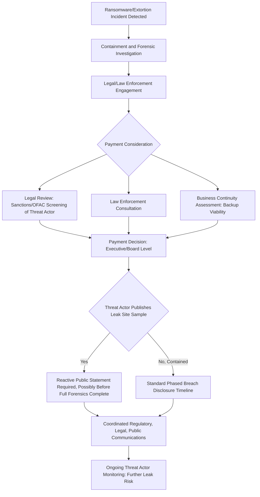

## Ransomware and Extortion Incidents

### Definition and Scope

This item covers crisis and reputation management specific to ransomware and digital extortion incidents — attacks where a threat actor encrypts, threatens to leak, or otherwise holds an organization's systems or data hostage, typically demanding payment. It builds on general cybersecurity incident response by focusing on the distinctive elements ransomware introduces: an active adversary making explicit demands and deadlines, the payment decision itself, and the "double/multi-extortion" dynamics that have become standard in the current threat landscape.

### Why This Matters in Crisis & Reputation Management

Ransomware incidents differ from passive data breaches in a critical way: there is an active, communicating adversary setting deadlines, making threats, and often directly pressuring the organization's public reputation as a negotiating lever (e.g., publishing sample stolen data, contacting journalists or customers directly, posting countdown timers on leak sites). This transforms crisis communications from a purely reactive/explanatory function into one that must account for an adversary actively trying to manipulate the organization's public response and negotiating position simultaneously. [Inference] Organizations that treat ransomware communications purely as a variant of standard breach communications, without accounting for the adversary's active influence attempts, are more likely to be caught off-guard by threat-actor tactics specifically designed to pressure public disclosure or payment.

### The Modern Extortion Model

**Key Points**

- **Single extortion (encryption only)**: The original ransomware model — systems/files encrypted, ransom demanded for a decryption key, primarily an operational disruption crisis.
- **Double extortion (encryption plus data theft)**: The now-standard model where the threat actor exfiltrates data before encrypting systems, then threatens to publish or sell the stolen data if ransom is not paid — meaning the incident is simultaneously an operational disruption crisis and a data breach crisis, each requiring its own communications and legal workstream.
- **Triple/multi-extortion**: Further escalation tactics including direct outreach to the victim's customers, employees, or business partners (threatening to expose *their* data specifically to increase pressure), distributed denial-of-service (DDoS) attacks to add operational pressure during negotiation, or public "naming and shaming" via leak sites and social media to pressure through reputational damage directly.
- **Leak site "proof" publication**: Threat actors frequently publish a small sample of stolen data publicly (on dark web leak sites or occasionally clearnet-accessible mirrors) as proof of exfiltration and negotiating leverage — this sample publication itself can become a public news event the organization must respond to, sometimes before its own internal forensic investigation has confirmed the scope.
- **Deadline-driven public pressure tactics**: Threat actors often set public countdown deadlines, threatening to publish more data or contact more parties if payment is not received — a tactic specifically designed to increase psychological and reputational pressure, which crisis teams should recognize as manipulation rather than treat as a legitimate deadline to be reactively managed.

### Ransomware-Specific Crisis Decision Points

### The Payment Decision and Its Communications Implications

- **Payment is a distinct, high-stakes decision with legal dimensions**: Whether to pay a ransom involves legal considerations (in some jurisdictions, payments to sanctioned entities or groups may be illegal regardless of the crisis circumstances), law enforcement consultation, and often specialized ransomware-negotiation firms — this decision should never be made unilaterally by the communications function, but communications needs early visibility into the decision process since it directly affects what can and cannot be said publicly.
- **No guarantee of data deletion or non-republication upon payment**: Organizations considering payment should understand there is no enforceable guarantee that a threat actor will actually delete stolen data or refrain from future extortion attempts, a consideration relevant to any public statement implying the matter is "resolved" following payment.
- **Public disclosure of payment itself is a distinct communications decision**: Some jurisdictions or circumstances create disclosure obligations or strong stakeholder expectations about whether a ransom was paid; organizations should have a considered position (in coordination with legal) on whether and how to address payment questions if asked, rather than improvising in the moment.
- **Law enforcement engagement supports both response and communications credibility**: Early engagement with relevant law enforcement or cybersecurity agencies is both an investigative resource and, often, a credibility-supporting element organizations can reference in public statements ("we are cooperating with law enforcement") without necessarily disclosing investigative specifics.

### Practical Example: Responding to a Leak Site Publication Mid-Investigation

**Example**

A healthcare services company suffers a ransomware attack. Before the company's own forensic investigation has determined the scope of exfiltrated data, the threat actor publishes a sample of stolen files on a leak site, and a cybersecurity journalist contacts the company for comment, having already seen the leak site post.

1. **Immediate cross-functional huddle**: Legal, security, and communications convene rapidly given the external pressure is now ahead of the internal investigation's pace — a scenario the crisis team should have specifically anticipated and planned for, since it is a common ransomware pattern rather than an unusual edge case.
2. **Verify before responding, but respond promptly**: The security team rapidly cross-checks the leaked sample against known systems to assess (even preliminarily) whether it appears authentic and from the organization's own environment, since responding to a claim without any internal verification risks confirming a claim that later proves partially fabricated or exaggerated (a known threat-actor tactic).
3. **Calibrated initial public statement**: Rather than either denying the incident (risking a credibility-destroying reversal if the leak is authentic) or fully confirming scope (before forensics can support specific claims), an appropriate initial statement acknowledges awareness of a security incident and the claims associated with it, confirms that an investigation is underway with external forensic and legal support, and commits to providing updates as facts are confirmed — declining to confirm specific details the investigation has not yet established.
4. **Direct notification acceleration**: Given the public nature of the leak site sample, the organization may need to accelerate direct notification to potentially affected individuals ahead of the normal phased-disclosure timeline it might otherwise follow, since the risk of affected individuals learning of potential exposure through media rather than the organization directly becomes acute once a journalist is already reporting on it.
5. **Ongoing threat monitoring**: The organization continues monitoring the leak site and related threat-actor communications for further publication threats or additional claims, feeding into ongoing communications planning rather than treating the initial response as the end of the matter.

### Common Failure Patterns

- **Treating the threat actor's deadline as legitimate and organizing the response around it**: Publicly reactive behavior driven by threat-actor-imposed deadlines cedes control of the organization's communications timeline to the adversary; response planning should be driven by the organization's own verification and stakeholder-notification obligations, not the extortion countdown.
- **Confirming unverified threat-actor claims about data scope**: Ransomware groups have a documented pattern of exaggerating the scope or sensitivity of stolen data for leverage; public statements should be careful to attribute claims to the threat actor rather than adopting them as confirmed fact before internal verification.
- **Communications function excluded from the payment decision process**: Even though payment is fundamentally a legal/executive/law-enforcement-informed decision, excluding communications from visibility into that process risks a public statement that is inconsistent with, or prematurely reveals, the actual decision status.
- **No plan for accelerated disclosure when public leak-site pressure outpaces internal investigation**: Assuming the standard phased-disclosure timeline will hold regardless of external events is a planning gap specifically exposed by ransomware's characteristic pattern of adversary-driven public pressure.
- **Silence interpreted as either weakness or an admission**: Prolonged "no comment" positions in the face of active threat-actor public pressure and leak-site publication are more likely, in this specific crisis type, to be filled by the threat actor's own narrative (via further leak site posts or direct outreach to affected parties) than in more passive breach scenarios.

### Related Topics

- Data Breaches and Cybersecurity Incidents
- Breach Disclosure Timelines and Regulatory Filings
- Working with Legal Counsel During a Crisis
- Regulatory Disclosure Obligations by Sector
- Law Enforcement Coordination in Cyber Incident Response
- Ransom Payment Legal and Sanctions Considerations
- Threat Actor Communications and Manipulation Tactics