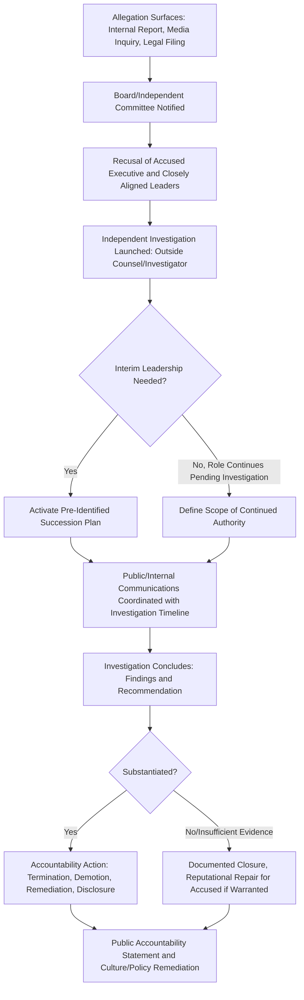

## Executive Misconduct and Leadership Crises

### Definition and Scope

This item covers crisis and reputation management specific to allegations or confirmed instances of executive misconduct — including financial fraud, harassment or discrimination, ethical violations, criminal conduct, or serious judgment failures by senior leaders (C-suite, board members, founders). It addresses the distinctive governance, succession, and communications challenges this crisis type creates, since the person at the center of the crisis is often also a primary decision-maker and public face of the organization.

### Why This Matters in Crisis & Reputation Management

Executive misconduct crises present a structural complication unlike most other crisis types: the individual whose conduct is in question may retain significant authority over the organization's response, creating conflicts of interest in decision-making, and the organization's brand may be closely identified with that individual (particularly for founder-led companies), making the response simultaneously a personnel matter, a governance matter, and a brand-identity matter. [Inference] Organizations without a pre-established, board-level protocol for executive misconduct allegations are more likely to see the response led by the very executives closest to the person in question, creating both real and perceived conflicts of interest that compound the reputational damage.

### Core Governance Considerations

**Key Points**

- **Independence of the investigation is paramount**: Any credible response requires an investigation structurally independent of the accused executive's authority — typically involving the board (or a specific board committee), outside counsel, and sometimes an independent investigator, rather than being run through the executive's own direct reports or an internal function the executive influences.
- **Recusal protocols for conflicted decision-makers**: The accused executive (and often executives closely aligned with them) should be formally recused from decisions about the investigation, the organization's public response, and — where relevant — decisions about their own continued employment or role, since their participation in these decisions creates an obvious and often disqualifying conflict of interest.
- **Board's fiduciary role is distinct from sympathy or loyalty to the individual**: Directors have fiduciary duties to the organization and its stakeholders that exist independent of personal or professional loyalty to the executive in question — governance best practice requires this distinction to be operationalized, not just acknowledged in principle.
- **Interim leadership and succession planning**: Organizations need a credible plan for interim leadership continuity if the executive is placed on leave or departs, ideally identified before a crisis occurs rather than improvised during one, since a leadership vacuum during an active crisis compounds instability.
- **Distinguishing allegation from substantiated finding in real time**: Governance and communications processes must maintain the distinction between an unproven allegation and an investigation's substantiated conclusion throughout the process, since collapsing this distinction prematurely (in either direction — assuming guilt or assuming innocence) undermines both fairness and credibility.

### Response Architecture for Executive Misconduct Allegations

### Communications Principles Specific to Executive Misconduct

- **Board or independent voice, not the accused executive's own communications team**: Statements about the situation should come from a source structurally independent of the accused executive (board chair, independent committee, or a designated spokesperson insulated from the executive's direct influence) to maintain credibility.
- **Avoid premature exoneration or condemnation**: Public statements before an investigation concludes should generally avoid asserting either that the allegations are baseless or that they are true, focusing instead on the fact and seriousness of the investigation process itself — language collapsing this distinction (in either direction) creates credibility risk if the eventual finding differs.
- **Address the "why did leadership not know/act sooner" question directly**: A recurring secondary narrative in executive misconduct crises is scrutiny of what other leaders or the board knew and when — organizations should anticipate and be prepared to address this question honestly rather than treating it as a lesser concern than the primary allegation.
- **Culture and systemic remediation, not just individual accountability**: Where misconduct is substantiated, credible communications typically need to address not just the individual consequence but what organizational or cultural factors may have allowed the conduct to occur or persist, and what changes address those factors — individual accountability alone, without systemic response, is often perceived as inadequate.
- **Employee-facing communications require particular care**: Employees, especially those who worked closely with or reported to the executive, need internal communications distinct from public statements — addressing psychological safety, avenues for reporting related concerns, and clarity about organizational stability, without violating confidentiality obligations owed to the accused or to reporters/witnesses.

### Practical Example: Managing a Substantiated Harassment Finding

**Example**

A technology company's board receives multiple internal reports alleging a pattern of harassment by a senior executive.

1. **Board committee formation**: The board's audit or a specifically formed independent committee, excluding any director with close personal or professional ties to the executive, takes oversight of the matter.
2. **Independent investigation**: Outside counsel with no prior relationship to the executive is retained to conduct interviews and review evidence, reporting directly to the board committee rather than through the executive's normal management chain.
3. **Interim leave and recusal**: The executive is placed on leave pending investigation (a common practice that avoids both an appearance of unaddressed risk to potential further reports and preserves the investigation's independence), with a pre-identified interim leader activating a continuity plan.
4. **Calibrated interim public statement**: If the matter becomes public before the investigation concludes, the company's statement (from the board, not the executive's own office) acknowledges that serious allegations have been received, confirms an independent investigation is underway, states the executive is on leave pending its outcome, and commits to appropriate action based on the findings — without characterizing the allegations' truth or falsity.
5. **Substantiated outcome and accountability action**: Upon a substantiated finding, the company terminates the executive's employment, and the subsequent public statement addresses both the individual accountability action and specific policy/culture remediation steps (e.g., enhanced reporting channel visibility, mandatory training, review of promotion practices) undertaken as a result.
6. **Internal trust-rebuilding**: A separate internal communication reinforces the non-retaliation policy, availability of support resources for those affected, and the board's ongoing oversight commitment, distinct from and less exposed to media/legal scrutiny than the public statement.

### Distinctive Challenges for Founder-Led Organizations

**Key Points**

- **Brand-identity entanglement**: Where an organization's public identity is closely tied to a founder (common in startups, personal-brand-driven companies), misconduct allegations against that individual create reputational risk that extends to the organization's core identity in a way that is less pronounced for organizations with less individually-identified leadership — a genuinely harder communications challenge, not merely a larger version of a standard executive crisis.
- **Governance power imbalances**: Founders often hold disproportionate board influence, super-voting shares, or informal authority that can complicate the independence of an investigation or accountability process in ways that professional, non-founder executives typically do not present — governance structures should be assessed for this risk before a crisis occurs, since it is difficult to correct in the moment.
- **Investor and stakeholder pressure dynamics**: Significant investors may have their own incentives regarding a founder's continued involvement (e.g., concern about company value tied to the founder's personal brand) that can create pressure on the board's independence — governance processes should be explicitly designed to withstand this pressure where fiduciary duty requires it.

### Common Failure Patterns

- **Investigation run through channels the accused executive influences**: Even the appearance of a compromised investigation (reporting through the executive's own direct reports, or overseen by close allies) undermines credibility regardless of the investigation's actual findings.
- **Premature public defense of the executive by the organization**: Statements defending the executive's character or asserting the allegations are baseless before an investigation concludes create significant credibility risk if the investigation later substantiates the allegations.
- **Treating individual termination as sufficient without systemic remediation**: A substantiated finding followed only by individual consequence, without addressing how the conduct was allowed to occur or persist, is frequently perceived by employees, media, and the public as an incomplete response.
- **No pre-identified interim leadership plan**: Improvising executive succession during an active crisis compounds instability and can itself become a secondary story about organizational readiness and governance quality.
- **Conflating the investigation's confidentiality needs with excessive public opacity**: While investigation details and witness confidentiality genuinely require protection, using "we can't discuss an ongoing investigation" as a blanket justification for withholding all process information (e.g., whether an investigation exists at all, its general timeline, who is conducting it) can appear evasive rather than appropriately careful.

### Related Topics

- Whistleblower Situations and Internal Reporting
- Working with Legal Counsel During a Crisis
- Ethical Decision-Making Frameworks in Crisis
- Board-Level Ethics Oversight Structures
- Succession Planning for Crisis Continuity
- Founder-Led Organization Reputational Risk
- Employee Trust Recovery After Internal Misconduct Allegations