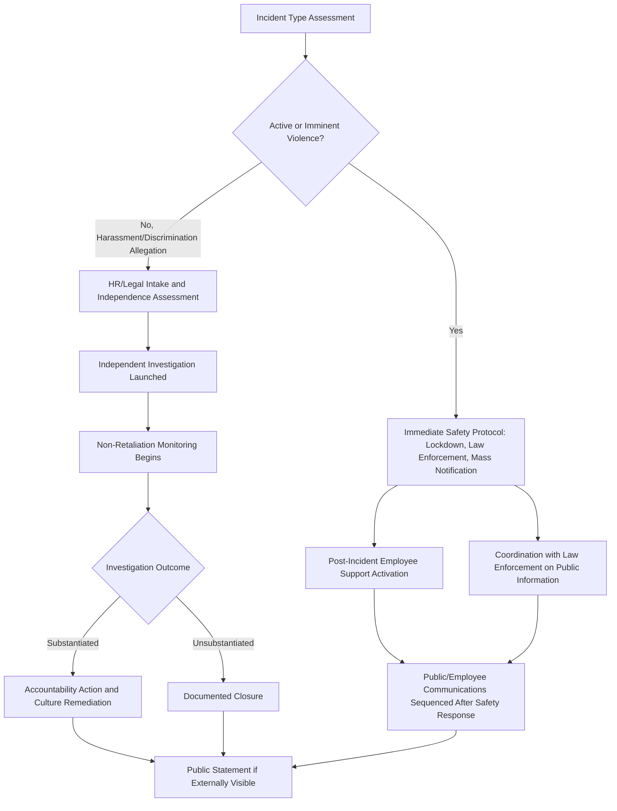

## Workplace Harassment, Discrimination, and Violence

### Definition and Scope

This item covers crisis and reputation management specific to workplace harassment, discrimination, and violence incidents — spanning sexual harassment, racial or other protected-class discrimination, hostile work environment claims, and acts or threats of workplace violence. It addresses the distinctive employee-safety, legal, and communications coordination this crisis type requires, with particular attention to how these incidents differ from other crisis types in involving current employees as both potential victims and, in violence scenarios, immediate physical safety concerns.

### Why This Matters in Crisis & Reputation Management

Workplace harassment, discrimination, and violence crises carry a distinctive dual character: they are simultaneously an internal employee-relations and safety matter and, increasingly, a public reputational matter, as employees, former employees, and media have more channels than ever to surface these issues publicly (social media, employment review platforms, organized employee action). Additionally, workplace violence incidents introduce an acute physical safety dimension absent from most other crisis types, requiring immediate operational response (law enforcement coordination, facility security, employee safety communication) that must be sequenced correctly relative to broader crisis communications. [Inference] Organizations that have not clearly distinguished the immediate safety-response protocol (for violence) from the broader reputational-response protocol (for harassment/discrimination allegations) risk applying the wrong response speed and tone to each — under-reacting to safety threats or over-formalizing what needs to be an urgent, protective response.

### Workplace Violence: Immediate Response Priorities

**Key Points**

- **Physical safety response takes absolute priority over communications considerations**: In any active or imminent violence scenario, facility lockdown/evacuation protocols, law enforcement notification, and employee safety instructions must be executed immediately and take precedence over any reputational or messaging consideration — this is a threshold principle, not a balancing test.
- **Clear internal communication channels for active incidents**: Organizations need pre-established, tested channels (mass notification systems, building-wide alerts) to communicate safety instructions to employees during an active incident, separate from the broader crisis communications infrastructure used for public-facing statements.
- **Threat assessment protocols for pre-incident warning signs**: Many organizations maintain a threat assessment process (often involving HR, security, and sometimes external behavioral threat assessment professionals) to evaluate reported concerning behavior before it escalates — this is a preventive process distinct from crisis response but directly relevant to an organization's credibility if a violent incident occurs after warning signs were reported and inadequately addressed.
- **Post-incident employee support**: Following any violence incident, organizations typically need to activate employee assistance resources (counseling, trauma support) as an immediate operational priority, both for genuine employee wellbeing and because visible, adequate support is closely scrutinized in post-incident public and media assessment.
- **Coordination with law enforcement on public information**: Active violence incidents typically involve law enforcement as the primary source of public factual information during the acute phase (e.g., confirming casualty counts, describing what occurred); organizational communications should generally defer factual specifics of an active incident to law enforcement while focusing organizational messaging on employee safety status and support resources.

### Harassment and Discrimination: Investigation and Communications Framework

- **Prompt, credible investigation process**: Legal and reputational exposure both increase substantially when an organization's investigation into a harassment or discrimination complaint is perceived (or proves to be) slow, superficial, or compromised by conflicts of interest — this mirrors the independence principles relevant to executive misconduct but applies at all levels of the organization.
- **Confidentiality balanced against systemic pattern recognition**: Investigations must protect the confidentiality of complainants and witnesses, but organizations also need a mechanism (without violating that confidentiality) to recognize when multiple complaints indicate a systemic pattern rather than isolated incidents, since pattern recognition failures are a recurring element of major workplace culture crises that become public.
- **Non-retaliation monitoring**: As with whistleblower situations, monitoring for retaliation against complainants and witnesses (changes in assignments, exclusion, performance review patterns) following a complaint is an essential, ongoing safeguard, not a one-time policy statement.
- **Aggregate disclosure and transparency practices**: Some organizations, particularly under employee or investor pressure, have moved toward publishing aggregate data on harassment/discrimination complaints and resolutions (without identifying individuals) as a transparency and accountability measure — this is a voluntary practice choice with its own communications trade-offs (transparency benefit vs. potential for the raw numbers to be used against the organization without context).
- **Addressing organizational culture, not just individual incidents**: Similar to executive misconduct, credible public response to a pattern of harassment or discrimination allegations typically requires addressing systemic and cultural factors (reporting channel effectiveness, manager training, promotion and accountability practices) rather than treating each incident as isolated.

### Response Architecture Distinguishing Violence from Harassment/Discrimination Tracks

### Practical Example: Sequencing Response to a Workplace Violence Threat

**Example**

An employee at a manufacturing facility reports that a coworker made a specific, credible threat of violence against a supervisor.

1. **Immediate threat assessment and safety action**: Security and HR immediately assess the credibility and immediacy of the threat; given the specificity described, the company suspends the reported individual's facility access pending investigation and notifies law enforcement, consistent with a pre-established threat assessment protocol.
2. **Employee safety communication**: Affected employees (those who work near the individuals involved) receive prompt, factual communication about the safety measures taken, without disclosing investigation specifics that could compromise the process or the reported individual's due process rights.
3. **Deferred external public statement**: Because the situation was contained internally before escalating to an actual violent act, no public statement is issued; however, the incident is logged and reviewed to assess whether the organization's threat-reporting and response protocol functioned as intended — this internal review itself becomes relevant if the situation is later referenced in media inquiries or legal proceedings.
4. **If the situation had escalated publicly** (e.g., if violence had occurred or the threat became known to media), the organization's public communications would prioritize confirming employee safety status, deferring factual specifics of the incident itself to law enforcement, and activating employee support resources — sequenced strictly after the safety response, not in parallel with it.

### Practical Example: Responding to a Public Pattern-of-Harassment Allegation

**Example**

Multiple current and former employees post on social media alleging a pattern of discriminatory treatment by management at a company's regional office, with the posts gaining significant media attention.

1. **Rapid internal fact-gathering distinguishing known from unknown**: HR and legal review whether any of the specific allegations correspond to prior internal complaints, and if so, what investigation and outcome occurred — without assuming the public allegations are either fully accurate or fully unfounded before this review.
2. **Independent investigation commitment**: The company publicly commits to a prompt, independent review of the allegations (potentially using outside investigators given the pattern and public visibility), rather than either dismissing the claims or making premature findings.
3. **Non-retaliation reaffirmation**: Given the public nature of the allegations, the company proactively reinforces its non-retaliation policy internally, recognizing that other employees with related experiences may be watching how the current situation is handled before deciding whether to come forward themselves.
4. **Culture-level response alongside individual investigation**: Independent of the outcome of any individual investigation, the company reviews its reporting channel effectiveness and management training at the regional office in question, since a public pattern allegation — even if individual claims are contested — often indicates broader areas warranting proactive review regardless of specific investigation findings.
5. **Outcome-based follow-through**: Public communications following investigation conclusion address both individual accountability (where substantiated) and the broader systemic review undertaken, avoiding a response that addresses only the specific incidents raised publicly while ignoring the pattern-level concern that prompted public attention in the first place.

### Common Failure Patterns

- **Communications considerations delaying an immediate safety response**: Any hesitation in executing safety protocols (lockdown, law enforcement notification, evacuation) due to concern about optics or process is a serious failure mode — safety response speed should never be compromised by communications sequencing concerns.
- **Investigation conducted or perceived as compromised by proximity to alleged perpetrators**: Similar to executive misconduct, an investigation run through channels with real or apparent conflicts of interest undermines credibility regardless of substantive findings.
- **Treating isolated-incident framing as a substitute for pattern review**: Responding to each individual complaint in isolation without a mechanism to recognize cumulative patterns (while still protecting individual confidentiality) allows systemic issues to persist undetected until they surface publicly and cumulatively.
- **Inadequate or delayed post-violence-incident employee support**: Underinvesting in visible, accessible support resources following a violence incident is both a genuine employee wellbeing failure and a closely scrutinized element of post-incident public and media assessment.
- **Silence mistaken for discretion in genuinely public pattern allegations**: While individual complaint confidentiality must be protected, organizations facing public, aggregated pattern allegations that decline to say anything beyond "we don't comment on personnel matters" risk appearing to conflate legitimate confidentiality obligations with an unwillingness to engage with a legitimate public concern about organizational culture.

### Related Topics

- Whistleblower Situations and Internal Reporting
- Executive Misconduct and Leadership Crises
- Ethical Decision-Making Frameworks in Crisis
- Working with Legal Counsel During a Crisis
- Threat Assessment and Workplace Violence Prevention Protocols
- Employee Assistance and Post-Incident Trauma Support
- Organizational Culture Remediation After Public Allegations