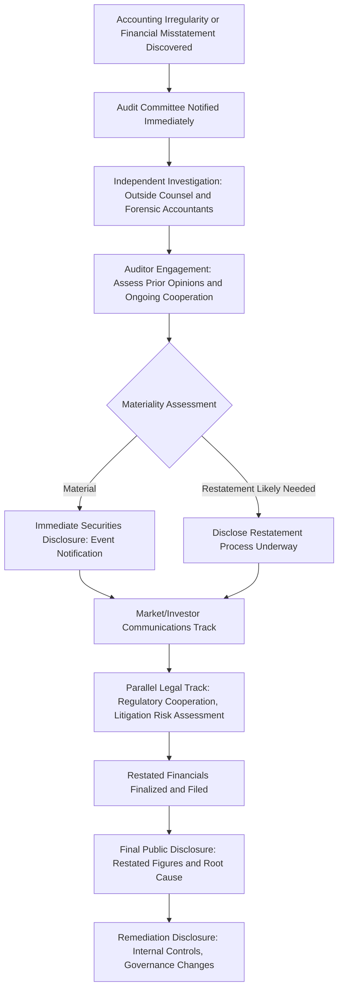

## Financial and Accounting Scandals

### Definition and Scope

This item covers crisis and reputation management specific to financial and accounting scandals — including accounting fraud, financial misstatement or restatement, undisclosed related-party transactions, auditor disputes, and securities fraud allegations. It addresses the distinctive regulatory, capital-markets, and multi-audience communications challenges this crisis type creates, given that financial scandals directly implicate the credibility of an organization's core financial reporting and typically trigger simultaneous regulatory, legal, and market-facing response tracks.

### Why This Matters in Crisis & Reputation Management

Financial and accounting scandals strike at a foundational trust layer distinct from most other crisis types: investors, lenders, employees (via equity compensation), and business partners rely on the accuracy of financial statements as a baseline assumption underlying nearly every other relationship the organization has. When that baseline is credibly called into question, the resulting crisis often has cascading effects — stock price impact, loan covenant triggers, credit rating actions, and going-concern questions — that compound faster and more severely than reputational damage from most other crisis categories, because capital markets react to financial credibility questions in real time. [Inference] Organizations that treat a financial restatement or accounting irregularity primarily as a technical/compliance matter, without recognizing its distinct capital-markets communications urgency, risk a slower response than the market's actual reaction speed requires, potentially compounding the credibility damage.

### Core Regulatory and Legal Dimensions

**Key Points**

- **Securities disclosure obligations are immediate and specific**: As covered in regulatory disclosure obligations generally, financial misstatements or restatements typically trigger specific, time-sensitive securities disclosure requirements (e.g., Form 8-K-type filings for material events in the US) distinct from and often faster than the normal periodic reporting cycle.
- **Auditor involvement and independence considerations**: External auditors play a distinctive dual role in financial scandals — they may have missed or been party to the issue (raising their own credibility and liability questions), and their ongoing cooperation and sign-off is typically required for the organization to file corrected financials, meaning auditor relationship management is a parallel workstream to public communications.
- **Restatement process and its own disclosure requirements**: Correcting previously issued financial statements ("restatement") is itself a formal process with disclosure obligations distinct from the original discovery disclosure — organizations typically must first disclose that a restatement is being considered/undertaken, then later disclose the actual restated figures once the process concludes, creating a multi-stage disclosure timeline communications must track.
- **Potential criminal and civil securities fraud exposure**: Depending on severity and intent, financial scandals can trigger parallel regulatory enforcement (securities regulator investigation), civil litigation (shareholder class actions are common following significant stock price drops tied to financial misstatement disclosure), and in serious cases criminal referral — meaning legal strategy across multiple simultaneous proceedings must be tightly coordinated with any public communications.
- **Board audit committee's central governance role**: Financial reporting integrity issues are a core audit committee responsibility; credible crisis response typically requires visible, substantive audit committee (not just management) engagement and oversight, given inherent questions about whether management itself is implicated.

### Multi-Track Response Architecture

### Stakeholder-Specific Communications Considerations

| Stakeholder | Primary Concern | Communications Approach |
| --- | --- | --- |
| Investors/analysts | Financial impact magnitude, management credibility, ongoing reliability of guidance | Precise, fact-bound disclosure; avoid speculation on magnitude before investigation supports specific figures |
| Securities regulators | Compliance with disclosure timelines, cooperation posture | Factual, promptly-filed disclosures; demonstrated cooperation with investigation |
| Lenders/creditors | Covenant compliance, going-concern risk | Often requires direct, more detailed communication given contractual triggers distinct from public disclosure |
| Employees (especially equity holders) | Job security, equity value, organizational stability | Internal-specific messaging addressing operational continuity, distinct from investor-facing disclosure |
| Credit rating agencies | Creditworthiness reassessment | Technical financial briefings often required separately from public statements |
| Media/public | Broader narrative of management integrity and organizational health | Balanced, non-speculative framing; avoid both minimization and alarmist language |

### Practical Example: Managing a Revenue Recognition Restatement

**Example**

A mid-cap technology company's internal audit function identifies that a business unit has been recognizing revenue in a manner inconsistent with applicable accounting standards, potentially overstating revenue in prior reporting periods.

1. **Immediate audit committee escalation**: Internal audit escalates directly to the audit committee (bypassing the standard management reporting chain given the finance function's proximity to the issue), which engages outside forensic accountants and legal counsel independent of the implicated business unit's management.
2. **Initial materiality assessment and disclosure**: Once preliminary investigation suggests the issue is likely material, the company files an initial securities disclosure stating that a restatement is being considered and that previously issued financial statements should no longer be relied upon — a specific, formal disclosure category distinct from a full explanation of the restated figures, which are not yet finalized.
3. **Investor communications discipline**: Investor relations and executive leadership hold a call acknowledging the restatement process, providing what can be factually supported (the accounting issue's general nature, the business unit involved, the fact that an independent investigation is underway) while explicitly declining to estimate the restatement's magnitude before the investigation concludes — resisting pressure from analysts for a premature figure.
4. **Auditor and regulator coordination**: The company's external auditor conducts its own review of the matter as part of assessing whether prior audit opinions require adjustment; the company simultaneously keeps securities regulators informed of investigation progress, consistent with cooperative disclosure practice.
5. **Final restatement disclosure and remediation**: Upon investigation conclusion, the company files the corrected financial statements along with a root-cause explanation (e.g., a control deficiency in the business unit's revenue recognition process) and discloses specific remediation steps (enhanced controls, personnel changes, audit committee oversight enhancements) — addressing both the technical correction and the "how will this not happen again" question stakeholders will have.

### Communications Discipline Principles Specific to Financial Scandals

- **Never speculate on financial magnitude before the investigation supports it**: Given the direct, quantifiable nature of financial disclosures, an early estimate that proves inaccurate creates a specific, easily-documented credibility problem distinct from more qualitative crisis types — silence on magnitude paired with clear process communication is generally safer than premature quantification.
- **Distinguish "restatement being considered" from "restatement finalized" in all communications**: These are formally distinct disclosure stages; conflating them (e.g., stating specific corrected figures before the process is actually complete) can itself create a subsequent disclosure problem if those preliminary figures change.
- **Address management credibility directly, not just the technical accounting issue**: Financial scandals often raise an implicit question about whether current management can be trusted going forward; credible communications typically need to address governance and oversight enhancements, not solely the technical correction, similar to the systemic-remediation principle in other crisis types.
- **Coordinate guidance withdrawal/revision carefully**: If the company had previously issued financial guidance based on the now-questioned figures, formally withdrawing or revising that guidance is often a necessary, separate disclosure action that should be sequenced deliberately alongside the broader restatement communications.

### Common Failure Patterns

- **Investigation influenced by the finance function whose work is in question**: Given that financial scandals often originate within or near the finance/accounting function itself, failing to ensure genuine independence (outside forensic accountants, reporting to the audit committee rather than the CFO) undermines credibility regardless of findings.
- **Premature figures that later require correction**: Providing an early damage estimate to satisfy investor pressure, which then proves inaccurate once the investigation concludes, compounds the credibility problem the restatement was already creating.
- **Treating the matter as purely a technical accounting correction**: Underestimating the governance and management-credibility dimension of the crisis, and therefore failing to address board oversight, personnel accountability, or control remediation alongside the technical correction.
- **Inconsistent messaging to auditors, regulators, and the public**: Given that financial scandals involve multiple sophisticated audiences with access to overlapping information (auditors, regulators, and increasingly the public via detailed disclosure requirements), inconsistencies between what is told to each are more likely to be discovered and scrutinized than in less document-intensive crisis types.
- **Delayed audit committee engagement**: Allowing management (particularly implicated management) to control the initial response and investigation scope before genuine audit committee independence is established creates both a credibility and, potentially, an evidentiary problem for the eventual investigation's defensibility.

### Related Topics

- Regulatory Disclosure Obligations by Sector
- Litigation Public Relations
- Working with Legal Counsel During a Crisis
- Executive Misconduct and Leadership Crises
- Board Audit Committee Governance Role in Crisis
- Shareholder Class Action Litigation Dynamics
- Auditor Independence and Cooperation in Restatement Processes