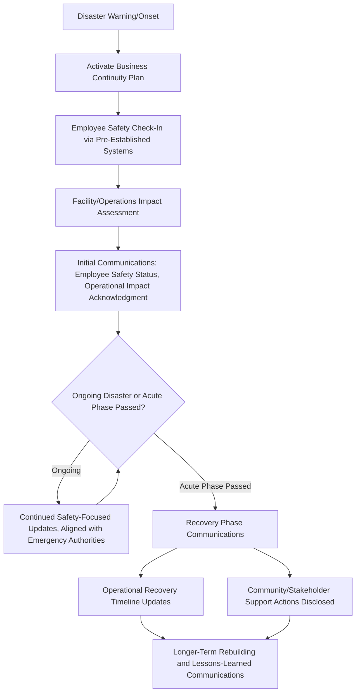

## Natural Disasters and Business Continuity

### Definition and Scope

This item covers crisis and reputation management specific to natural disasters (hurricanes, earthquakes, floods, wildfires, severe storms, pandemics) and the business continuity planning and communications required to manage organizational, employee, and stakeholder impact. It addresses the distinctive characteristics of this crisis category: the triggering event is external and not organizationally caused, impact is often geographically concentrated but can affect operations broadly through supply chains, and the response typically unfolds over a longer sustained period (days to months) rather than resolving in a single acute news cycle.

### Why This Matters in Crisis & Reputation Management

Natural disasters differ from most other crisis categories in a key respect: the organization is generally not the cause of the triggering event, which shifts public and stakeholder scrutiny away from "who is at fault" and toward "how effectively and humanely did the organization respond" — employee safety, business continuity execution, and community support become the primary evaluation criteria rather than root-cause accountability. However, this does not reduce reputational stakes; organizations are frequently judged harshly for perceived inadequate preparation, slow response, or prioritizing operational/financial recovery over employee and community welfare. [Inference] Organizations without pre-established business continuity and communications infrastructure tend to default to reactive, ad hoc response during the actual disaster window, precisely when planning capacity is most constrained by the disaster's own disruption of normal operations and communications infrastructure.

### Core Business Continuity Planning Elements

**Key Points**

- **Employee safety and accountability systems**: A foundational business continuity requirement is the ability to account for employee safety and location status during and immediately after a disaster — this requires pre-established systems (emergency contact databases, mass notification tools, check-in protocols) that function even when normal communications infrastructure (office phone systems, email if servers are affected) is disrupted.
- **Critical operations continuity planning**: Identifying which business functions are mission-critical and must continue (or resume fastest) during a disruption, with pre-planned alternative arrangements (backup facilities, remote work capability, alternative suppliers) — this planning should be done well in advance, since disaster conditions themselves make new planning extremely difficult.
- **Supply chain and third-party dependency mapping**: Many organizations face disaster impact not through direct physical damage to their own facilities but through disruption to key suppliers, logistics partners, or infrastructure (power, telecommunications) in the affected region — business continuity planning should map these dependencies rather than assuming risk is limited to owned facilities.
- **Data and systems backup/recovery infrastructure**: Technical disaster recovery planning (data backup, redundant systems, failover infrastructure) is a distinct but related discipline that directly supports the organization's ability to communicate and operate during a disaster.
- **Financial and insurance preparedness**: Business interruption insurance, emergency funding access, and pre-established financial continuity plans affect how quickly an organization can fund emergency response and recovery, indirectly shaping the communications timeline for what commitments the organization can credibly make.

### Communications-Specific Considerations for Natural Disasters

- **Infrastructure disruption affects the organization's own communications capability**: Unlike most crisis types, natural disasters can directly damage or disable the communications infrastructure (power, internet, phone networks) the crisis team would normally use to respond — planning should include alternative communications channels (satellite phones, out-of-region backup teams, pre-established social media access from unaffected locations) precisely because primary channels may be unavailable when needed most.
- **Extended timeline requires sustained, evolving communications rather than a single statement**: Natural disaster response often unfolds over weeks or months (initial impact, employee/community safety confirmation, operational recovery, longer-term rebuilding) requiring a communications cadence that evolves through distinct phases rather than a single crisis statement and resolution.
- **Community and broader public impact considerations**: Where an organization operates in or serves a disaster-affected community, communications often need to address not just organizational impact but the organization's role in community response and support — this is a distinctive stakeholder dimension less present in internally-caused crisis types.
- **Avoiding the appearance of prioritizing business recovery over human welfare**: A frequently scrutinized communications risk is any messaging (or visible action) suggesting operational or financial recovery is being prioritized ahead of employee safety and community welfare — even where both are genuinely being pursued in parallel, sequencing and framing in communications should reflect welfare as the clear first priority.
- **Coordination with emergency management authorities**: Public communications during an active disaster should generally align with, not contradict or compete with, official emergency management guidance (evacuation orders, safety instructions), similar to the principle of deferring factual specifics to law enforcement during active violence incidents.

### Disaster Response Communications Timeline Architecture

### Practical Example: Coordinating Response to a Regional Hurricane Impact

**Example**

A retail company with a significant number of stores and a regional distribution center in a hurricane's projected path activates its business continuity plan.

1. **Pre-landfall preparation**: Following the organization's pre-established plan, affected stores are closed per a defined protocol, employees receive advance safety guidance and information about pay/scheduling during the closure period, and the distribution center's critical data and systems are backed up to unaffected regional infrastructure.
2. **Employee accountability during the event**: Using a pre-established mass notification and check-in system (chosen specifically because it does not depend on office-based infrastructure that may lose power), the company confirms the safety status of employees in the affected region, escalating outreach for anyone who does not respond within a defined window.
3. **Initial post-impact communications**: As soon as safety status is reasonably confirmed, the company issues an internal and public update leading with employee safety status and community impact acknowledgment, followed by a general (not overly specific, given ongoing assessment) statement about operational impact — deliberately sequenced so safety information precedes operational/business framing.
4. **Recovery phase updates**: Over the following weeks, the company provides periodic updates on store reopening timelines, distribution center recovery, and specific actions taken to support both employees (emergency assistance funds, extended pay continuity) and the broader affected community (donations, supply support), maintaining a cadence appropriate to the extended recovery timeline rather than treating the initial post-impact statement as sufficient.
5. **Coordination with official guidance**: Throughout, the company's public communications about safety and operational status are checked against and do not contradict official emergency management guidance for the affected region, avoiding any appearance of independently second-guessing evacuation orders or safety instructions.

### Common Failure Patterns

- **No pre-established communications infrastructure independent of primary systems**: Discovering during an actual disaster that the crisis communications plan depends on infrastructure (office phones, on-site servers) that the disaster itself has disabled is a preventable planning gap.
- **Business/operational framing preceding or overshadowing safety framing**: Communications that lead with store reopening timelines or financial impact before clearly and prominently addressing employee and community safety status create a strong negative perception regardless of the organization's actual priorities.
- **Treating the disaster as a single event requiring one statement**: Natural disaster recovery often unfolds over an extended period; a single initial statement followed by communications silence during a prolonged recovery phase leaves a perception vacuum, particularly for employees and communities still experiencing ongoing impact.
- **Underestimating supply chain and third-party disaster exposure**: Business continuity planning focused solely on owned facilities, without mapping key supplier or logistics dependencies in disaster-prone regions, leaves organizations unprepared for disruption that originates outside their direct control.
- **Contradicting or appearing to second-guess official emergency guidance**: Organizational communications that create ambiguity about safety instructions relative to official emergency management guidance (even unintentionally) can create confusion with real safety consequences, compounding the crisis rather than managing it.

### Related Topics

- Working with Legal Counsel During a Crisis
- Data Breaches and Cybersecurity Incidents
- Building Direct Consumer Notification Systems
- Employee Assistance and Post-Incident Trauma Support
- Supply Chain and Third-Party Dependency Risk Mapping
- Emergency Management Authority Coordination Protocols
- Long-Term Community Trust and Rebuilding Communications