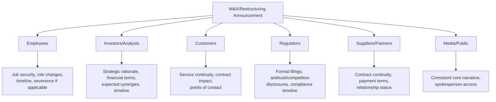

## Mergers, Acquisitions, and Restructuring Crises

### Overview

Mergers, acquisitions, and restructuring crises arise when a planned or executed corporate transaction — an M&A deal, divestiture, bankruptcy restructuring, or major layoff — triggers reputational, operational, or legal fallout that exceeds the organization's anticipated communication plan. Unlike sudden-onset crises (accidents, breaches), these events are often self-initiated and scheduled, which paradoxically makes communication failures more damaging: stakeholders reasonably expect a controlled, well-prepared narrative for an event the organization chose to initiate, and visible communication chaos around a planned event signals deeper organizational dysfunction.

### Why M&A and Restructuring Events Become Crises

- **Multiple simultaneous stakeholder shocks**: A single transaction can simultaneously alarm employees (job security), investors (valuation and strategic rationale), customers (service continuity), regulators (antitrust/competition concerns), and communities (economic impact), each requiring distinct messaging within a compressed timeframe
- **Information leakage before official announcement**: Deal terms, layoff numbers, or closure plans frequently leak to media or employees before the organization's planned announcement, forcing reactive rather than proactive communication
- **Regulatory approval uncertainty**: Announced deals can be delayed, modified, or blocked by antitrust or other regulatory review, creating an extended period of stakeholder uncertainty the organization must manage without a firm resolution date
- **Cultural and identity disruption**: Employees and sometimes customers experience a merger or major restructuring as an identity disruption (brand change, leadership change, cultural integration), which generates emotional reactions that pure financial or strategic messaging fails to address

**[Inference]** Organizations that treat M&A communication as primarily an investor relations exercise, with employee and customer communication treated as secondary, frequently experience the most acute crisis symptoms (leaks, morale collapse, customer attrition) precisely in the stakeholder groups given the least proactive attention.

### Types of M&A/Restructuring Crisis Triggers

#### 1. Pre-Announcement Leaks

Deal details, merger partner identity, or restructuring scope becomes public before the organization's planned disclosure, often via employee speculation, financial press investigation, or a counterparty leak.

#### 2. Post-Announcement Employee Backlash

Layoff scope, severance terms, or perceived unfairness in role redundancy decisions generates public employee criticism, particularly via social media or employee review platforms.

#### 3. Deal Collapse or Regulatory Rejection

A previously announced deal fails to close due to regulatory blocking, financing failure, or shareholder rejection, requiring the organization to explain the collapse while managing the reputational and strategic narrative reset.

#### 4. Integration Failure Signals

Post-close integration problems (culture clashes, executive departures, customer service disruption, technology integration failures) become publicly visible and raise questions about whether the original deal rationale was sound.

#### 5. Bankruptcy or Distressed Restructuring

Financial distress becomes public, triggering concerns from suppliers (payment risk), customers (continuity of service/warranty), employees (job and pension security), and creditors, often under formal legal process constraints (e.g., court-supervised proceedings) that limit what can be communicated and when.

### Stakeholder-Specific Communication Priorities

| Stakeholder | Core Concern | Sequencing Priority |
| --- | --- | --- |
| Employees (especially affected roles) | Job security, timeline, fairness of process | Often first or simultaneous with public announcement — hearing via media first is a major trust breach |
| Investors/Analysts | Valuation, strategic logic, execution risk | Formal disclosure obligations (e.g., securities filings) often dictate strict timing |
| Customers | Continuity of product/service, contract terms | Before or at public announcement if directly affected (e.g., a divested product line) |
| Regulators | Competition/antitrust implications, formal filings | Per legal/regulatory filing requirements, often before public announcement for certain deal types |
| Suppliers/Partners | Contract continuity, payment stability | Direct outreach, particularly for suppliers with concentrated exposure |
| Media/General Public | Overall narrative, credibility of stated rationale | Coordinated with formal disclosure requirements |

**[Unverified]** The specific legal disclosure timing and format requirements (e.g., for publicly listed companies) vary by jurisdiction and transaction type, and must be confirmed with securities/M&A legal counsel rather than assumed from general practice.

### Employee Communication: The Highest-Risk Segment

Employee communication deserves particular emphasis because it is both the most emotionally charged and the most likely to leak or escalate publicly if handled poorly.

**Key Points**

- **Timing discipline**: Employees directly affected by role elimination should generally be informed before the broader employee population and well before public/media disclosure, through direct, personal communication (not mass email) wherever feasible
- **Manager preparation**: Managers delivering difficult news need scripted talking points and clear guidance on what they can and cannot say about timeline, severance, and next steps, since unprepared managers are a common source of inconsistent or inaccurate information reaching affected employees
- **Survivor communication**: Employees who remain after a restructuring ("survivors") need explicit communication about organizational direction and their own role stability, since unaddressed survivor anxiety can produce broader morale and retention problems beyond the directly affected group
- **Severance and support clarity**: Clear, consistent communication of severance terms, benefits continuation, and outplacement support reduces both individual distress and the likelihood of public criticism about perceived unfair treatment

### Investor and Financial Communication

- **Strategic rationale clarity**: Investors and analysts scrutinize whether the stated rationale for a deal (synergies, market expansion, cost savings) is credible and specific, not generic language
- **Timeline transparency**: Providing realistic integration timelines and acknowledging execution risk tends to be better received than overly optimistic projections that create a credibility gap if unmet
- **Consistent messaging through the deal lifecycle**: From announcement through regulatory review to close (and integration), investor messaging should remain consistent in its core claims, since narrative shifts (e.g., changing stated synergy estimates) attract scrutiny

### Managing Deal Collapse or Regulatory Rejection

When a previously announced deal fails to close:

1. **Prompt, direct disclosure**: Confirm the collapse and reason (to the extent legally permissible) promptly rather than allowing speculation to fill the gap
2. **Forward-looking narrative**: Address what the organization's strategic path looks like without the deal, since stakeholders will immediately ask "what now" rather than dwelling solely on why the deal failed
3. **Address sunk cost and morale impact**: Employees who anticipated organizational change (positive or negative) around the deal need direct communication about what has and hasn't changed
4. **Coordinate with the counterparty**: Where possible, align messaging with the deal counterparty to avoid contradictory public narratives about why the transaction collapsed, since a public dispute over blame can generate its own secondary crisis

### Bankruptcy and Distressed Restructuring Considerations

**[Unverified]** Formal insolvency or court-supervised restructuring processes impose specific legal constraints on communication (e.g., what can be promised to creditors or customers) that vary by jurisdiction and proceeding type; any communication in this context should be developed jointly with restructuring/insolvency legal counsel rather than following general crisis communication templates alone.

General principles that commonly apply, subject to jurisdiction-specific legal guidance:

- Prioritize communication that maintains operational continuity confidence for customers and critical suppliers, since a loss of operational confidence can accelerate the underlying financial distress
- Coordinate closely with legal counsel on any statements regarding continued operations, payment of obligations, or timeline, since restructuring proceedings often impose specific legal constraints on such statements
- Address employee concerns about job security and benefits directly and as early as legally permissible, since employee attrition during a restructuring can itself undermine the restructuring plan's viability

### Practical Example: Divestiture Announcement

For an organization divesting a business unit:

1. **Pre-announcement**: Prepare differentiated messaging for employees within the divested unit (transition details, employment continuity with acquirer if applicable) versus employees remaining in the parent organization
2. **Announcement day**: Coordinate simultaneous or near-simultaneous communication to affected employees, investors (per disclosure timing requirements), and customers of the divested unit regarding continuity
3. **Customer-specific messaging**: Customers of the divested business need explicit clarity on contract continuity, support continuity, and any changes to points of contact
4. **Ongoing integration communication**: As the divestiture progresses toward close, provide periodic updates to affected stakeholders rather than a single announcement followed by silence until close

### Common Pitfalls

- **Employees learning via media or leak**: The single most common trigger for M&A-related crisis escalation, converting a planned transaction into a trust crisis
- **Generic, non-specific strategic rationale**: Vague synergy or growth language that doesn't withstand analyst or media scrutiny, inviting skepticism about the deal's true purpose
- **Inconsistent severance/treatment across similar roles**: Perceived unfairness in how layoff decisions were made, particularly if patterns suggest discriminatory impact, generates both reputational and potential legal exposure
- **Silence during extended regulatory review periods**: Leaving stakeholders without updates during a prolonged antitrust or regulatory review creates an information vacuum often filled by speculation
- **Uncoordinated messaging with deal counterparty**: Contradictory statements between merging/transacting parties about deal rationale, timeline, or collapse reasons undermine both parties' credibility simultaneously
- **Underestimating integration-phase reputational risk**: Treating the announcement and close as the end of crisis risk, when integration failures (culture clashes, service disruptions, executive departures) often generate the more damaging and sustained reputational narrative

### Related Legal/Regulatory Coordination Points

| Coordination Point | Why It Matters |
| --- | --- |
| Securities disclosure timing (public companies) | Determines legally mandated announcement timing, independent of communication readiness |
| Antitrust/competition filings | May require specific public disclosures at defined stages of regulatory review |
| Employment law (mass layoff notifications) | Many jurisdictions impose advance notice requirements for large-scale layoffs, affecting communication sequencing |
| Insolvency/restructuring proceedings | Court-supervised processes may constrain what can be communicated regarding continued operations or creditor treatment |

**[Unverified]** Specific mass-layoff notice period requirements and thresholds vary by jurisdiction and must be confirmed with local employment counsel rather than assumed from a general standard.

**Next Steps**

- Employee Communication Sequencing and Manager Preparation for Layoffs
- Investor Relations Messaging Through the Deal Lifecycle
- Managing Public Narrative During Extended Regulatory Review Periods
- Cross-Party Coordination in Deal Collapse Communications
- Legal Constraints on Communication During Insolvency Proceedings
- Post-Merger Integration Reputational Risk Monitoring