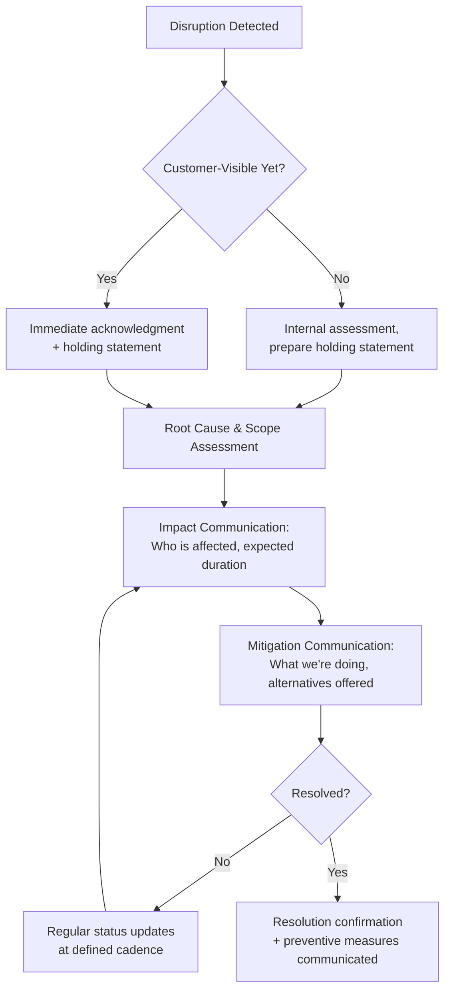

## Supply Chain and Operational Disruptions

### Overview

Supply chain and operational disruption crises occur when a break in the organization's ability to produce, source, or deliver products or services becomes visible to customers, investors, or the public in a way that threatens trust, contractual relationships, or brand perception. These crises are distinct from other categories because the root cause is frequently outside the organization's direct control (supplier failure, natural disaster, geopolitical event, logistics breakdown), yet stakeholders typically hold the organization accountable for its response and communication regardless of fault attribution.

### Why Supply Chain Disruptions Escalate into Reputational Crises

- **Customer-facing visibility with unclear cause**: Customers experience the disruption directly (stockouts, delayed shipments, service outages) often before the organization has fully diagnosed or can explain the root cause, creating a communication gap that speculation fills
- **Contractual and financial exposure**: Business customers with supply agreements may face their own downstream consequences, escalating the disruption from a customer service issue to a contractual/legal one
- **Multi-tier opacity**: Modern supply chains often involve multiple tiers of sub-suppliers the organization doesn't directly monitor, meaning the organization itself may not have full visibility into the disruption's cause or duration when stakeholders first demand answers
- **Perceived attribution regardless of actual fault**: Even when the root cause is a third-party supplier failure or a force majeure event (natural disaster, geopolitical disruption), customers and media often frame the story around the organization whose product or service they directly experienced the failure through

**[Inference]** Organizations that respond to supply chain disruptions with "this wasn't our fault" framing, even when factually accurate, often find this framing perceived as evasive by affected customers, whereas framing centered on "here is what we're doing to solve it" tends to be received more constructively regardless of root cause.

### Categories of Supply Chain and Operational Disruption

#### 1. Supplier Failure

A key supplier ceases or reduces production due to financial distress, quality failure, labor action, or their own crisis, cascading into the organization's ability to fulfill orders.

#### 2. Natural Disaster / Force Majeure

Earthquakes, floods, typhoons, or other events disrupt manufacturing, logistics, or raw material availability — particularly relevant for organizations sourcing from or operating in disaster-prone regions.

#### 3. Geopolitical and Trade Disruption

Tariffs, export controls, sanctions, or political instability disrupt cross-border sourcing or logistics routes.

#### 4. Logistics and Transportation Breakdown

Port congestion, shipping capacity shortages, carrier failures, or infrastructure damage (e.g., a blocked shipping channel) delay delivery independent of production capacity.

#### 5. Quality or Safety Failure Within the Chain

A component or ingredient supplied by a third party is found to be defective or unsafe, requiring the organization to communicate about a problem that originated outside its own operations but affects its finished product.

#### 6. Cyber or IT-Driven Operational Disruption

A cyberattack or IT system failure — either the organization's own or a critical logistics/ERP partner's — halts production, order processing, or fulfillment.

### Communication Framework by Disruption Phase

#### Phase 1: Acknowledgment

Confirm awareness of the disruption promptly once customer-visible, even before full root-cause clarity exists — a holding statement acknowledging the issue and committing to updates is preferable to silence while investigation continues.

#### Phase 2: Impact Scoping

Communicate, as soon as reliably known, which customers/products/regions are affected and the best available estimate of duration — over-promising a resolution timeline that then slips is a common secondary trust failure in this crisis type.

#### Phase 3: Mitigation and Alternatives

Where possible, offer concrete mitigation: alternative products, expedited restocking for priority customers, compensation or accommodation for delayed orders, or transparent prioritization logic (e.g., existing order commitments honored first).

#### Phase 4: Ongoing Status Updates

Establish and hold to a regular update cadence (e.g., daily or weekly depending on disruption severity) even when there is no material change, since "still working on it, next update [date]" is generally better received than customers being left to wonder if the organization has gone silent.

#### Phase 5: Resolution and Preventive Communication

Confirm resolution clearly and, where appropriate, communicate what structural or process changes are being made to reduce recurrence risk — this final step is often skipped but meaningfully affects longer-term trust recovery.

### Stakeholder-Specific Messaging

| Stakeholder | Core Concern | Key Message Elements |
| --- | --- | --- |
| B2C Customers | When will I get my order/product | Honest timeline, compensation/accommodation if applicable, simple status-check channel |
| B2B/Enterprise Customers | Contractual impact, their own downstream exposure | Direct account management contact, specific volume/timeline commitments, contractual remedy discussion |
| Investors/Analysts | Financial materiality, duration, margin impact | Quantified impact where estimable, mitigation cost, expected recovery timeline |
| Suppliers/Partners | Payment continuity, relationship stability, shared risk | Transparency about the organization's own exposure and expectations of the supply partner |
| Employees (especially customer-facing) | What to tell customers, job security if production halts | Clear talking points, consistent messaging with external statements, honest internal updates |
| Regulators (where safety-related) | Compliance with disclosure or safety obligations | Formal notifications per applicable regulatory requirements |

### Root Cause Transparency vs. Operational Security

A tension specific to this crisis type: stakeholders want to understand *why* the disruption occurred, but disclosing certain operational details (e.g., specific supplier vulnerabilities, security weaknesses in a cyber-driven disruption) can create competitive or security risk.

**Key Points**

- General causal transparency (e.g., "a key supplier experienced a production halt due to [general cause]") is usually appropriate and expected
- Highly specific operational or security details (e.g., naming a specific vulnerability exploited, or a specific supplier's confidential financial distress) may need to be withheld or generalized for legal, contractual, or security reasons
- Where detail is withheld, explicitly acknowledging that some information isn't being shared for a stated reason (security, contractual confidentiality) tends to be better received than appearing to withhold without any stated reason

### Multi-Tier Supply Chain Visibility Challenge

**[Inference]** Organizations with limited visibility into sub-tier suppliers (suppliers of their direct suppliers) often face a communication delay not because they are being evasive, but because they genuinely lack root-cause information until their direct supplier can trace the issue further upstream — this delay itself should be communicated honestly ("we are working with our supplier to determine full scope") rather than the organization guessing at a cause prematurely.

Building supply chain visibility is a preventive measure that directly reduces future crisis communication difficulty:

- Mapping critical Tier 1 and, where feasible, Tier 2 suppliers for single points of failure
- Establishing early-warning communication agreements with key suppliers (contractual notification obligations for supply-affecting events)
- Maintaining alternative sourcing relationships for critical inputs to reduce both actual disruption risk and the credibility of "we have a mitigation plan" messaging when disruption occurs

### Practical Example: Key Component Shortage

For a manufacturer facing a critical component shortage from a sole-source supplier:

1. **Acknowledgment**: Confirm awareness of delayed shipments once customer-visible, without yet specifying full cause if not confirmed
2. **Impact scoping**: Communicate which product lines/order dates are affected once the organization has reasonable clarity, rather than speculating early and risking a later correction
3. **Mitigation**: Communicate any prioritization logic (e.g., existing backorders fulfilled first), alternative product options, or expedited timelines for affected customers
4. **B2B-specific outreach**: Enterprise customers with volume commitments receive direct account management contact rather than only the general public statement
5. **Ongoing updates**: Regular cadence updates until resolved, with specific milestones (e.g., "alternate supplier qualified," "shipments resuming [date]") rather than vague reassurance
6. **Preventive communication**: Post-resolution, communicate steps taken to diversify sourcing or increase buffer inventory, particularly to enterprise customers who may factor this into future contract negotiations

### Common Pitfalls

- **Silence during root-cause investigation**: Waiting for full clarity before any communication, when an honest "we're investigating, here's what we know so far" holding statement is available almost immediately
- **Over-promising resolution timelines**: Committing to a specific resolution date under pressure to reassure stakeholders, then having to walk it back — repeated timeline slippage compounds credibility loss more than an initially honest "timeline uncertain" statement would have
- **Uniform messaging across B2C and B2B audiences**: Enterprise customers with contractual exposure need direct, specific communication beyond a general public statement or FAQ page
- **Deflecting blame to suppliers without offering solutions**: Technically accurate attribution to a third-party supplier failure, without paired mitigation and solution-focused messaging, is often perceived as evasive
- **Ignoring employee-facing communication**: Customer-facing employees (sales, support) fielding direct questions without adequate internal briefing tend to provide inconsistent information that can contradict official statements
- **Treating resolution as communication endpoint**: Failing to communicate preventive measures post-resolution misses an opportunity to rebuild trust and can leave customers uncertain whether the same disruption risk remains

### Related Preventive and Structural Measures

| Measure | Communication Benefit |
| --- | --- |
| Multi-tier supplier mapping | Reduces root-cause diagnosis delay during a live disruption |
| Contractual supplier notification clauses | Provides earlier internal warning, enabling more proactive stakeholder communication |
| Diversified/dual sourcing | Provides concrete mitigation content for crisis messaging ("we activated our alternate supplier") |
| Pre-built customer status/tracking channels | Reduces individual inbound inquiry volume and provides self-service transparency during disruption |

**Next Steps**

- Building Supply Chain Visibility and Sub-Tier Supplier Mapping
- B2B Account-Level Crisis Communication and Contractual Risk Management
- Holding Statement Templates for Root-Cause-Unknown Scenarios
- Compensation and Accommodation Policies for Service/Delivery Disruptions
- Cyber-Driven Operational Disruption Communication Protocols
- Post-Disruption Preventive Measure Communication Strategy