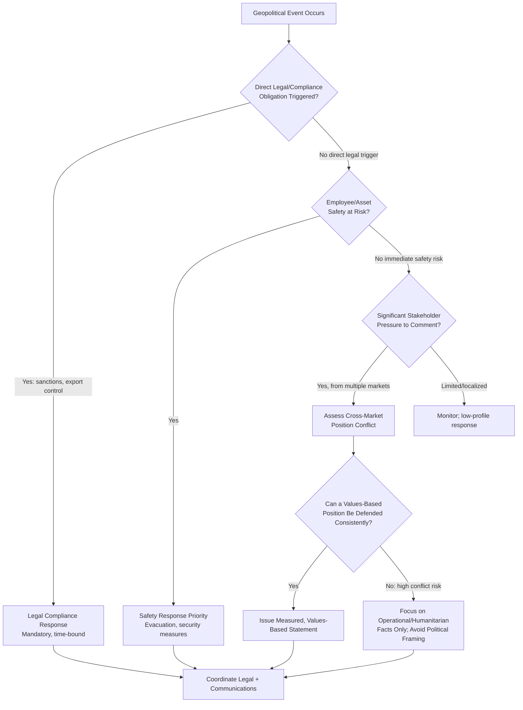

## Geopolitical and Cross-Border Crises

### Overview

Geopolitical and cross-border crises occur when political events, government actions, international conflict, or diplomatic tension between states create reputational, operational, or legal exposure for an organization operating across national borders. Unlike most other crisis categories, the triggering event is frequently entirely outside the organization's control and often outside the control of any single government — yet the organization is still expected to navigate stakeholder expectations that can be directly contradictory across different markets, since what one government or public views as an appropriate organizational response, another may view as complicity or betrayal.

### Why Geopolitical Crises Present Unique Communication Challenges

- **No neutral position is truly neutral**: In politically polarized situations, silence, continued operation, withdrawal, or any public statement can each be interpreted by different stakeholder groups as taking a side, meaning there is frequently no communication choice that satisfies all audiences simultaneously
- **Rapidly shifting legal and regulatory ground**: Sanctions regimes, export controls, and government directives can change with little notice, requiring the organization to adjust operational and communication posture faster than typical crisis response cycles
- **Employee safety and welfare intersect with corporate positioning**: Where the organization has employees or operations in an affected region, physical safety obligations may need to be addressed simultaneously with reputational and political positioning questions
- **Conflicting stakeholder expectations across markets**: A stance that satisfies stakeholders, media, or government expectations in one country may generate significant criticism or even legal risk in another operating market

**[Inference]** Organizations that attempt to satisfy all geopolitical stakeholder expectations simultaneously with carefully hedged, non-committal language often find that the hedging itself becomes the story, perceived as evasive by multiple audiences rather than successfully neutral to any of them.

### Categories of Geopolitical and Cross-Border Crisis Triggers

#### 1. Armed Conflict or War

Conflict in a region where the organization operates, sources, or sells, raising questions about continued operations, employee safety, and public positioning.

#### 2. Sanctions and Export Control Changes

New or expanded sanctions regimes affecting the organization's ability to operate, transact, or supply certain markets or entities, often with short compliance windows.

#### 3. Diplomatic Disputes and Trade Tensions

Bilateral or multilateral disputes (tariffs, trade restrictions, diplomatic expulsions) that indirectly affect the organization's cross-border operations or public perception by association with a home country's position.

#### 4. Government Expropriation or Regulatory Action

A government action targeting the organization directly (nationalization, forced divestiture, licensing revocation) tied to broader geopolitical tension rather than organization-specific misconduct.

#### 5. Human Rights and Labor Practice Scrutiny in Politically Sensitive Regions

Operations or sourcing in regions subject to international scrutiny over human rights conditions, creating pressure from advocacy groups, investors, or home-market governments regardless of the organization's direct culpability.

#### 6. Boycotts and Consumer-Driven Political Pressure

Consumer boycotts or purchasing pressure tied to a geopolitical position the organization is perceived to hold (or perceived to avoid taking), often amplified rapidly via social media across borders.

### Decision Framework: Assessing Response Posture

**[Inference]** The decision of whether to issue a values-based public statement versus restricting communication to operational facts is one of the highest-stakes judgment calls in this crisis category, and should involve senior legal, communications, and executive leadership jointly rather than being resolved solely by the communications function.

### Core Response Priorities in Sequence

#### 1. Legal and Regulatory Compliance (Highest Priority, Non-Discretionary)

Sanctions, export control, and government directive compliance are legal obligations, not communication choices — the organization's operational and communication posture must first ensure compliance before any reputational messaging is developed.

**[Unverified]** Specific sanctions and export control obligations change frequently and vary by jurisdiction (the organization's home jurisdiction, the jurisdictions where it operates, and the jurisdictions of any affected counterparties); current, specific legal guidance must be obtained from qualified legal/compliance counsel rather than relying on general awareness of a sanctions regime.

#### 2. Employee and Personnel Safety

Where the organization has personnel in an affected region, safety response (evacuation planning, security measures, communication with affected employees and their families) takes priority over external reputational messaging.

#### 3. Operational Continuity Assessment

Determining whether operations in the affected region can continue, must pause, or must wind down, factoring in legal compliance, safety, and business continuity considerations.

#### 4. External Stakeholder Communication

Only after legal, safety, and operational assessments are underway should broader public/stakeholder communication strategy be finalized, since premature public positioning before operational facts are clear risks having to reverse or contradict an earlier statement.

### Navigating Conflicting Cross-Market Expectations

A structural approach to managing the reality that different markets may expect different things:

**Key Points**

- **Anchor to consistent values, not situational political positions**: Organizations that articulate a consistent set of operating principles (e.g., commitment to employee safety, compliance with applicable law, humanitarian concern) applied consistently across events tend to be more defensible than ad hoc positions that appear to shift based on which market is most vocal
- **Distinguish operational facts from political characterization**: Communicating factual operational decisions (e.g., "we have paused operations in [region] due to [safety/compliance reason]") is generally more defensible across audiences than statements characterizing the underlying political conflict itself
- **Avoid comment on matters without direct organizational nexus**: Where a geopolitical event has no direct operational, employee, or customer connection to the organization, many communications approaches favor restraint over voluntary political commentary, since unsolicited political positioning on unrelated matters increases exposure without a clear stakeholder necessity driving it

### Employee Communication in Geopolitical Crises

- Employees in or connected to an affected region require direct, empathetic communication addressing safety measures and support resources, separate from any external public positioning
- Employees globally may have strong personal views on a geopolitical situation; internal communication should generally focus on organizational facts (safety measures, operational decisions, available support) rather than the organization adjudicating the underlying political dispute
- **[Inference]** Employee resource groups or informal employee sentiment can create internal pressure for the organization to take a public position; this pressure should be acknowledged and heard, but the decision to take a public political position involves broader considerations beyond internal employee sentiment alone

### Practical Example: Operational Region Affected by Armed Conflict

For an organization with operations or personnel in a region affected by armed conflict:

1. **Immediate**: Activate employee safety protocols (accounting for personnel, evacuation assessment if needed, communication with affected employees and families) — this precedes any public statement
2. **Legal/compliance check**: Assess any sanctions or export control implications affecting continued operations, transactions, or supply relationships connected to the affected region
3. **Operational decision**: Determine and document the operational posture (continue, pause, wind down) based on safety and legal assessment, not solely public pressure
4. **Internal communication**: Inform employees globally of the operational decision and any support measures for affected personnel, before or alongside any external statement
5. **External communication**: If external comment is warranted (due to significant stakeholder inquiry or direct organizational nexus), focus on factual operational and humanitarian points (safety measures taken, operational status) rather than characterizing the political conflict itself
6. **Ongoing monitoring**: Continue monitoring the situation for compliance changes (sanctions updates) and stakeholder sentiment shifts, since geopolitical crises often extend over long, uncertain timeframes rather than resolving quickly

### Common Pitfalls

- **Premature public statements before legal/safety assessment is complete**: Issuing a values-based public statement before operational and compliance facts are confirmed, risking a need to walk back or contradict the position
- **Treating all markets' expectations as reconcilable through careful wording**: Assuming sufficiently careful, hedged language can satisfy fundamentally opposed stakeholder expectations across markets, when in some cases no single public statement can achieve this
- **Delayed sanctions/export control compliance response**: Treating legal compliance as a secondary concern to reputational messaging, when compliance failures carry direct legal and financial consequences independent of communication quality
- **Inconsistent application of stated values**: Articulating a set of operating principles but applying them selectively depending on which market is exerting the most pressure, which undermines credibility of the stated values framework over time
- **Neglecting internal employee safety communication in favor of external positioning**: Prioritizing the external public statement over direct communication and support for employees physically affected by the situation
- **Assuming the crisis will resolve quickly**: Geopolitical crises often extend for extended, uncertain periods; a communication plan built only for an acute short-term response may leave the organization unprepared for sustained stakeholder management

### Coordination Structure

| Function | Role |
| --- | --- |
| Legal/Compliance | Sanctions and export control assessment, ongoing regulatory monitoring |
| Security/Safety | Employee safety protocols, evacuation planning where applicable |
| Executive Leadership | Final decision on operational posture and whether/how to issue public positioning |
| Communications | Message development, stakeholder-specific communication, media monitoring across affected markets |
| Government Affairs/Public Policy | Monitoring regulatory and diplomatic developments, liaison with relevant government bodies |
| HR | Employee support resources, internal communication coordination |

**Next Steps**

- Sanctions and Export Control Compliance Monitoring Systems
- Employee Safety and Evacuation Protocols for High-Risk Regions
- Values-Based Positioning Frameworks for Politically Sensitive Events
- Cross-Market Stakeholder Conflict Assessment Methodologies
- Government Affairs Coordination During Diplomatic Disputes
- Long-Duration Crisis Communication Planning for Extended Geopolitical Situations