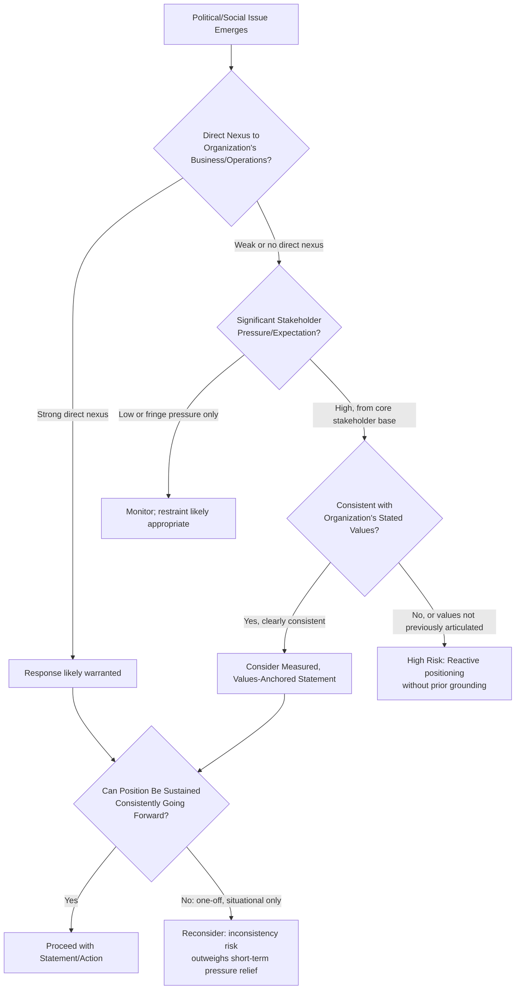

## Brands, Politics, and Stakeholder Expectations

### Overview

Brands, politics, and stakeholder expectations addresses the growing phenomenon in which organizations face pressure — from customers, employees, investors, and advocacy groups — to take public positions on social and political issues that were traditionally considered outside the scope of corporate communication. This is sometimes referred to in industry commentary as "brand activism" or the challenge of navigating a "politically polarized" stakeholder environment, and it functions as a distinct crisis risk category because both action (taking a stance) and inaction (staying silent) now carry potential reputational consequences with different, often opposing, stakeholder segments.

### Why This Has Become a Distinct Crisis Risk Category

- **Erosion of the "neutral corporation" assumption**: Historically, many organizations operated on the assumption that avoiding political or social commentary was a safe, neutral default; growing stakeholder expectation (particularly among younger consumer and employee demographics, per widely cited industry surveys) has weakened that assumption in many sectors
- **Employee activism as an internal pressure source**: Employees increasingly expect organizational alignment with their values and may organize internally (open letters, walkouts, internal petitions) to pressure leadership on social or political issues
- **Investor and ESG-linked pressure**: Some institutional investors and ESG-focused stakeholders now factor social and political positioning into investment and engagement decisions, adding a financial dimension to what was previously a purely reputational consideration
- **Rapid amplification and polarized response**: Social media ensures that any position taken (or notably not taken) reaches broad audiences quickly, and polarized political environments mean audiences often react to the same statement in diametrically opposed ways

**[Inference]** Organizations operating in this environment increasingly cannot assume that silence itself is a neutral or safe position, since silence on an issue where stakeholders expect comment can itself be interpreted as an implicit position.

### Categories of Political/Social Pressure Organizations Face

#### 1. Reactive Pressure Following an External Event

A significant social, political, or legislative event occurs, and stakeholders expect or demand the organization to comment (e.g., a legislative change affecting a stakeholder group, a significant social movement moment).

#### 2. Pressure Tied to the Organization's Own Products, Services, or Operations

The organization's specific business practices intersect directly with a political or social issue (e.g., a company's data practices intersecting with privacy legislation debates, a company's labor practices intersecting with labor rights movements).

#### 3. Internal Employee-Driven Pressure

Employees organize to request or demand a public organizational position on an issue, sometimes tied to internal culture or workplace policy questions, sometimes tied to broader external political matters.

#### 4. Sponsorship, Partnership, and Association Pressure

Stakeholders pressure the organization regarding its sponsorships, advertising placements, or partnerships with entities perceived as politically or socially controversial.

#### 5. Executive or Founder Personal Political Expression

A senior executive's or founder's personal political statements or activities create reputational spillover onto the organization itself, regardless of whether the statement was made in an official capacity.

### Decision Framework: Should the Organization Respond Publicly?

**Key Points**

- **Direct business nexus** is generally the strongest justification for public positioning — commentary on issues directly affecting the organization's employees, customers, or operations is more defensible than commentary on unrelated matters
- **Consistency over time** is a critical test: a position taken once under pressure, then abandoned or contradicted when convenient, tends to generate more reputational damage than either consistently engaging or consistently refraining

### The "Authenticity Gap" Risk

**[Inference]** A common failure pattern is an organization issuing a public statement on a social or political issue that is not reflected in its actual internal practices or policies (sometimes referred to in industry commentary as a form of "performative" positioning); stakeholders — particularly employees and engaged advocacy audiences — often scrutinize whether public statements are backed by substantive action, and a mismatch between stated position and actual practice tends to generate more severe criticism than either silence or an authentic, substantiated position would have.

Before issuing any public statement on a social or political issue, a substantive gap-check is advisable:

- Does the organization's internal policy or practice on this issue actually align with what the statement claims or implies?
- Has the organization historically been active or silent on adjacent issues, and would this statement appear as a sudden, situational departure?
- Are there any past organizational actions that directly contradict the position about to be stated publicly?

### Employee-Driven Pressure: A Distinct Management Track

Internal employee pressure for organizational political positioning requires handling distinct from external stakeholder pressure:

- **Listening without automatic commitment**: Acknowledging employee concerns and providing channels for them to be heard does not obligate a specific public position; these are separable actions
- **Values-based internal communication**: Where the organization decides not to take an external public position, internal communication explaining the reasoning (e.g., a general policy of restraint on matters without direct business nexus, applied consistently) tends to be better received than silence alone
- **Avoiding selective response to internal pressure**: Responding publicly to employee pressure on some issues but not others, without an articulable consistent principle, invites internal perception of favoritism or inconsistency

### Sponsorship and Association Risk Management

- **Pre-screening partnerships and sponsorships**: Assessing potential reputational and political sensitivity before entering sponsorship or partnership agreements reduces reactive crisis risk later
- **Monitoring partner conduct on an ongoing basis**: Political and reputational risk associated with a partner or sponsored entity can emerge after the relationship begins, requiring ongoing (not just pre-engagement) monitoring
- **Clear criteria for partnership decisions**: Having articulable, consistently applied criteria for partnership and sponsorship decisions provides a defensible basis for responding to pressure regarding a specific partnership

### Executive/Founder Personal Expression Spillover

- **Distinguishing personal from official capacity**: Organizations often face pressure to comment on or distance themselves from a senior leader's personal political statements; the organization's own position and the individual's personal expression are legally and reputationally distinct, though stakeholders may not always draw that distinction
- **Pre-established policies on executive public conduct**: Organizations with clear, pre-established expectations regarding executive public political expression (where legally permissible to establish such expectations) are generally better positioned to respond consistently than those developing a position reactively during a live controversy
- **[Unverified]** The extent to which an organization can legally restrict or address an executive's personal political expression varies by jurisdiction and employment context, and should be assessed with employment counsel rather than assumed.

### Practical Example: Reactive Pressure Following a Legislative Change

For an organization facing stakeholder pressure to comment following a significant legislative or policy change relevant to a stakeholder group:

1. **Assess direct nexus**: Determine whether the legislative change directly affects the organization's employees, customers, or operations, or is adjacent without direct connection
2. **Gap-check internal alignment**: Confirm whether the organization's internal policies and practices are consistent with any position under consideration
3. **Assess consistency implications**: Consider whether taking a position on this issue creates an expectation of similar engagement on comparable future issues, and whether that is a sustainable posture
4. **Engage relevant internal stakeholders**: Where employee pressure is significant, ensure internal listening channels are used, separate from the external statement decision
5. **Decide and articulate rationale**: Whether the decision is to comment or to maintain restraint, an internally articulable rationale (tied to consistent principles, not one-off convenience) supports defensibility if challenged later
6. **Monitor reaction across stakeholder segments**: Given that reactions will likely be polarized, monitor both critical and supportive responses rather than reacting only to the loudest immediate feedback

### Common Pitfalls

- **Reactive, one-off positioning without a values framework**: Taking a position under acute pressure without a pre-established, consistently applied set of principles, making the position appear opportunistic rather than genuine
- **Authenticity gaps between statement and practice**: Public positioning unsupported by actual internal policy or practice, which invites more severe scrutiny than either silence or substantiated positioning
- **Treating all stakeholder pressure as equally weighted**: Responding primarily to the loudest or most visible pressure (which may be a vocal minority) without assessing broader stakeholder sentiment
- **Inconsistent application across similar issues**: Engaging on some socially/politically adjacent issues but not comparable others, without an articulable distinguishing principle, undermining credibility of the stated rationale
- **Underestimating internal employee sentiment as a driver**: Treating employee-driven pressure as less consequential than external/customer pressure, when internal morale and retention effects can be equally or more significant
- **Failure to distinguish executive personal expression from organizational position**: Allowing ambiguity about whether an executive's personal statement represents the organization's official position, prolonging and amplifying spillover controversy

### Coordination Structure

| Function | Role |
| --- | --- |
| Executive Leadership | Final decision on organizational positioning; consistency oversight across issues over time |
| Communications | Message development, stakeholder segment monitoring, statement drafting |
| HR/Employee Relations | Internal listening channels, employee sentiment monitoring, internal communication |
| Legal | Assessment of legal risk in statements, employment law considerations for executive expression policies |
| ESG/Sustainability (where applicable) | Alignment assessment between public positioning and existing ESG commitments/reporting |
| Government Affairs | Assessment of legislative/regulatory dimension where relevant |

**Next Steps**

- Building a Values Framework to Guide Political/Social Positioning Decisions
- Internal Employee Listening Channels for Social and Political Concerns
- Sponsorship and Partnership Risk Screening Criteria
- Executive Public Conduct Policies and Employment Law Considerations
- Measuring Stakeholder Sentiment Across Polarized Audience Segments
- Authenticity Gap Assessment Between Public Statements and Internal Practice