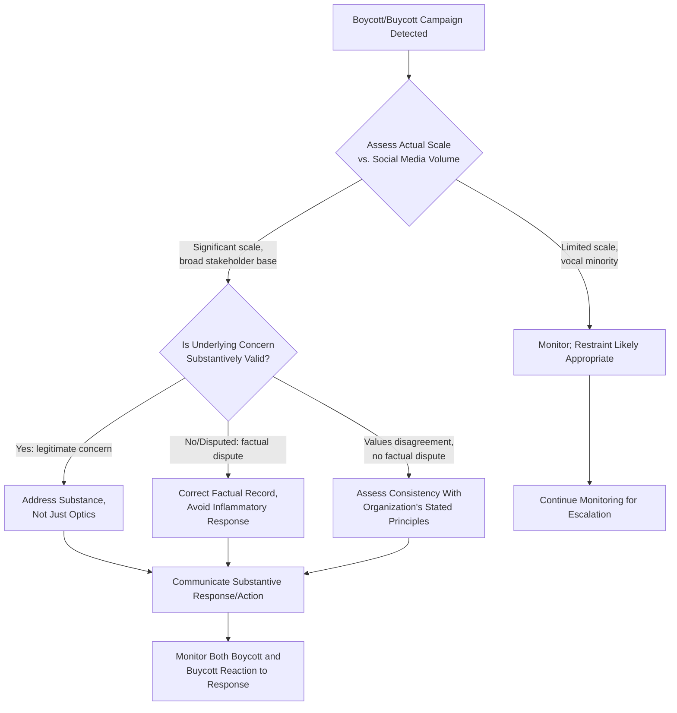

## Politically Motivated Boycotts and Buycotts

<syllabot_broad_topic/>

### Overview

Politically motivated boycotts and buycotts are coordinated consumer actions in which individuals deliberately withhold purchases (boycott) or deliberately concentrate purchases (buycott) to reward or punish an organization based on a perceived political or social position, action, or association. These campaigns represent a distinct crisis category because they are consumer-driven, values-based, and typically amplified through social media at a speed that can outpace an organization's traditional crisis response cycle, and because a single triggering event can generate simultaneous, opposing boycott and buycott campaigns from different stakeholder segments.

### Distinguishing Boycotts from Buycotts

- **Boycott**: Organized withholding of purchase or patronage intended to pressure the organization to change a position, action, or association, or to impose reputational and financial cost for a perceived transgression
- **Buycott**: Organized concentration of purchase or patronage intended to reward the organization for a position, action, or association, often emerging as a counter-response to a boycott or in support of a company perceived as aligned with a cause

**[Inference]** A single triggering event (e.g., an organization taking or declining to take a public political position) frequently generates both a boycott from one stakeholder segment and a buycott from an opposing segment simultaneously, meaning the organization's overall reputational and sales impact reflects the net effect of both, not just the more visible or vocal campaign.

### Why Boycotts/Buycotts Function as a Distinct Crisis Type

- **Consumer-initiated, not organization-initiated**: Unlike most crisis categories, the triggering "event" from the organization's perspective may already be past (a statement, a sponsorship, an executive action); the crisis is the *reaction*, which the organization does not fully control the timing or framing of
- **Rapid social media amplification**: Hashtag-driven boycott campaigns can achieve significant visibility within hours, often before the organization has fully assessed the situation or prepared a response
- **Ambiguous actual financial impact vs. perceived impact**: Social media visibility of a boycott campaign does not necessarily correlate directly with actual sales or revenue impact; **[Unverified]** the relationship between social media boycott volume and measurable financial impact varies significantly by campaign and sector, and should be assessed through the organization's own sales data rather than assumed from social media visibility alone
- **Risk of escalation through response itself**: How an organization responds to a boycott (ignoring it, engaging directly, capitulating, doubling down) can itself become a secondary news story independent of the original triggering issue

### Triggers for Boycott/Buycott Campaigns

#### 1. Public Statement or Position Taken (or Declined)

The organization's stated (or conspicuously absent) position on a social or political issue triggers a values-aligned or values-opposed consumer response.

#### 2. Advertising, Sponsorship, or Partnership Association

A specific advertisement, sponsored event, or partner relationship is perceived as politically or socially aligned with a controversial position or entity.

#### 3. Executive or Founder Conduct

Statements or actions by a senior executive or founder, in personal or official capacity, trigger consumer reaction directed at the organization as a whole.

#### 4. Perceived Hypocrisy or Inconsistency

A gap between the organization's stated values/public positioning and its actual practices (e.g., labor practices, environmental record, past statements) becomes public, triggering a boycott framed around inconsistency rather than the underlying issue alone.

#### 5. Product, Marketing, or Content Controversy

A specific product feature, marketing campaign, or piece of content is perceived as politically or socially offensive to a stakeholder segment.

### Response Assessment Framework

**Key Points**

- The first assessment step — distinguishing actual campaign scale from social media visibility — is critical, since an overreaction to a vocal but numerically limited campaign can itself generate a larger secondary controversy than restraint would have
- Distinguishing a **factual dispute** (something inaccurate is being claimed about the organization) from a **values disagreement** (accurate facts, differing opinion on whether the organization's position/action was appropriate) determines whether the appropriate response is factual correction or a substantive policy/position discussion

### Response Options and Trade-offs

| Response Option | When It May Be Appropriate | Risk |
| --- | --- | --- |
| **No public response; monitor only** | Limited-scale campaign, vocal minority, no direct business nexus | May be perceived as dismissive if campaign scale grows |
| **Factual correction/clarification** | Campaign based on inaccurate claims about the organization | Risk of appearing defensive if not paired with acknowledgment of any valid underlying concern |
| **Direct engagement/dialogue** | Legitimate concern from a significant stakeholder segment | Time-intensive; requires genuine willingness to consider substantive change |
| **Policy or practice change** | Substantive, valid concern with broad stakeholder support | Risk of appearing to capitulate to pressure rather than principled decision-making; may trigger opposing buycott/boycott reaction |
| **Reaffirm existing position without change** | Organization has assessed the concern and determined its existing position is consistent with stated values | Risk of prolonged campaign visibility; requires genuine confidence in the position's defensibility |

**[Inference]** There is no universally correct response option; the appropriate choice depends on campaign scale, the substantive validity of the underlying concern, consistency with the organization's previously stated values, and the direct business nexus — a decision framework should weigh these factors explicitly rather than defaulting to either automatic capitulation or automatic resistance.

### Assessing Actual vs. Perceived Campaign Scale

Distinguishing genuine widespread consumer sentiment from a vocal but numerically limited campaign is a critical diagnostic step:

- **Social media volume metrics** (hashtag usage, engagement) indicate visibility and vocal intensity but not necessarily broad representativeness of the overall customer base
- **Actual sales/traffic data** during the campaign period provides a more direct measure of real financial impact, though attribution to the specific campaign versus other factors requires careful analysis
- **Survey or sentiment research** among the broader customer base (not just vocal social media participants) can provide a more representative picture of overall stakeholder sentiment
- **[Inference]** Organizations that respond primarily based on social media volume without cross-referencing actual sales impact or broader sentiment data risk overreacting to a vocal minority in ways that alienate a larger, less vocal majority holding a different view.

### Managing Simultaneous Boycott and Buycott Dynamics

When a triggering event generates opposing campaigns simultaneously:

- **Avoid whipsaw responses**: Reacting to whichever campaign is most vocal at a given moment, then reversing when the opposing campaign gains volume, generates a perception of an organization without genuine principles, damaging credibility with both sides
- **Ground the response in pre-established values, not campaign volume**: A response grounded in the organization's previously articulated and consistently applied principles is more defensible against the specific criticism of "caving to pressure" (from either direction) than a response that visibly tracks whichever campaign is currently louder
- **Prepare for sustained duration**: Boycott/buycott campaigns, particularly those tied to broader political or social movements, may not resolve quickly; planning for sustained stakeholder management rather than a short acute response cycle is often necessary

### Practical Example: Boycott Following a Sponsorship Decision

For an organization facing a boycott campaign following a sponsorship or partnership decision perceived as politically aligned:

1. **Scale assessment**: Determine campaign reach relative to actual customer base, using social listening combined with sales/traffic monitoring
2. **Nexus and consistency check**: Assess whether the sponsorship decision was consistent with previously articulated partnership criteria and organizational values
3. **Factual accuracy review**: Confirm whether the boycott is based on accurate characterization of the sponsorship/partnership or includes factual inaccuracies requiring correction
4. **Stakeholder listening**: Engage with both critical and supportive stakeholder voices to understand the full range of sentiment, not only the most vocal
5. **Decision and communication**: Determine response (maintain position, adjust position, or provide additional context) based on the above assessment, communicated with reference to the organization's stated principles rather than solely in reaction to campaign pressure
6. **Sustained monitoring**: Continue monitoring both boycott and any counter-buycott sentiment over an extended period, since these campaigns often have longer tails than acute crisis events

### Common Pitfalls

- **Overreacting to social media volume without verifying actual scale/impact**: Making significant policy changes based primarily on vocal social media pressure without cross-referencing actual customer sentiment or sales data
- **Whipsaw reversals**: Changing position in response to whichever campaign (boycott or buycott) is currently more vocal, then reversing again, which damages credibility with all stakeholder segments
- **Treating every boycott as requiring a public response**: Responding publicly to every boycott campaign regardless of scale can inadvertently amplify visibility of campaigns that would otherwise have remained limited in reach
- **Conflating factual disputes with values disagreements**: Responding to a legitimate factual inaccuracy with a values-based defense, or responding to a genuine values disagreement with only a factual correction, when the two require different response approaches
- **Underestimating sustained campaign duration**: Planning only for a short-term acute response when politically motivated campaigns tied to broader social movements may persist for extended periods
- **Failing to distinguish organization-wide impact from vocal minority impact**: Assuming a highly visible campaign represents majority sentiment among the actual customer base without verifying through broader data

### Coordination Structure

| Function | Role |
| --- | --- |
| Communications | Message development, social media monitoring, media response coordination |
| Data/Analytics | Sales and traffic impact assessment, distinguishing actual from perceived campaign scale |
| Executive Leadership | Final decision on response posture, consistency oversight with organizational values |
| Legal | Assessment of any factual/defamation dimension in boycott campaign claims |
| Customer Insights/Research | Broader sentiment measurement beyond vocal social media participants |
| Government Affairs (where relevant) | Monitoring any regulatory or legislative dimension tied to the underlying issue |

**Next Steps**

- Social Listening Methodologies for Distinguishing Vocal Minority from Broad Sentiment
- Sales and Traffic Impact Analysis During Active Boycott Campaigns
- Values Framework Development to Guide Consistent Response Decisions
- Managing Simultaneous Opposing Campaign Dynamics
- Long-Duration Campaign Monitoring and Sustained Stakeholder Management
- Partnership and Sponsorship Criteria to Reduce Reactive Boycott Risk