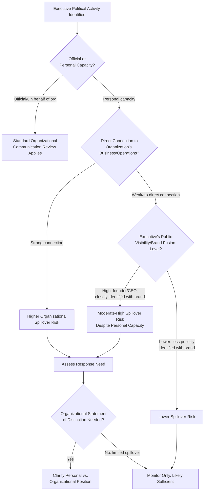

## Executive Political Positioning Risk

### Overview

Executive political positioning risk refers to the reputational, operational, and legal exposure an organization faces when a senior executive, founder, or board member takes a public political stance — whether in an official capacity, a personal capacity, or in the ambiguous space between the two — that stakeholders attribute to the organization itself. This is a distinct risk category from general brand political positioning because it centers on an individual's visibility and influence, meaning organizational control over the message is structurally weaker: an executive's personal social media account, media interview, public speech, or campaign donation can generate organizational consequences the communications function did not initiate and may not be able to fully contain.

### Why Executive Positioning Carries Distinct Risk

- **Attribution regardless of stated capacity**: Stakeholders and media frequently attribute an executive's personal statement to the organization as a whole, particularly for highly visible figures (CEOs, founders) whose public identity is closely fused with the brand, regardless of disclaimers about personal versus official capacity
- **Reduced organizational control over timing and content**: Unlike a planned corporate statement, an executive's spontaneous remark, social media post, or unscripted interview answer is not subject to the same communications review process, creating exposure the organization did not choose or prepare for
- **Asymmetric visibility of founders and long-tenured leaders**: Founder-led organizations in particular often have institutional identity closely tied to a single individual, making it structurally difficult to separate "the founder's view" from "the company's view" in stakeholder perception even when the two are formally distinct
- **Employee and investor spillover**: An executive's political positioning can affect internal morale, retention, and recruitment (employees may feel misaligned with leadership's publicly stated views) as well as investor perception, independent of customer-facing reputational effects

**[Inference]** Organizations with a highly visible founder or CEO whose personal brand is central to the company's public identity often find that formal disclaimers distinguishing "personal opinion" from "company position" have limited effectiveness in shaping how stakeholders and media actually attribute the statement.

### Categories of Executive Political Positioning Risk

#### 1. Public Statements and Media Commentary

Interviews, speeches, opinion pieces, or public remarks in which an executive addresses a political or social issue.

#### 2. Social Media Activity

Personal social media posts, likes, shares, or follows that stakeholders interpret as political positioning, often occurring outside any organizational review process entirely.

#### 3. Political Donations and Affiliations

Personal political campaign contributions, party affiliations, or involvement in political organizations that become publicly known or are disclosed under applicable transparency requirements.

#### 4. Advocacy and Activism Participation

Personal participation in protests, advocacy campaigns, or public demonstrations connected to a political or social cause.

#### 5. Board or Organizational Governance Positions

An executive's or board member's positions or votes on governance matters (e.g., a shareholder resolution related to a social or political issue) that become public and are interpreted as reflecting organizational values.

**[Unverified]** The extent to which political donations or affiliations are subject to public disclosure requirements varies significantly by jurisdiction and role (e.g., disclosure obligations for executives of publicly listed companies may differ from those of privately held companies); specific disclosure obligations should be confirmed with legal/compliance counsel.

### Risk Assessment Framework

**Key Points**

- **Capacity (official vs. personal)** is the first-order distinction, but as the framework shows, personal capacity does not eliminate organizational risk when the executive's public identity is closely fused with the brand
- **Business nexus** (whether the executive's statement touches on matters directly connected to the organization's operations, customers, or employees) significantly affects spillover risk regardless of stated capacity

### Pre-Crisis Preventive Measures

#### 1. Executive Communication Policies

Establishing clear, pre-articulated expectations regarding executive public conduct — including social media use, media engagement protocols, and disclosure practices for personal political activity — provides a framework to reference during an actual incident rather than developing a position reactively.

**[Unverified]** The extent to which an organization can legally establish binding policies restricting an executive's or employee's personal political expression varies significantly by jurisdiction and by the individual's role (e.g., protections for political expression or activity may differ for ordinary employees versus senior executives, and by country); any such policy should be developed with employment counsel rather than adopted from a generic template.

#### 2. Media Training with Political Question Preparedness

Executive media training should specifically include preparation for handling politically charged questions during interviews intended to cover unrelated business topics, since journalists may use business interviews as an opportunity to elicit political commentary.

#### 3. Social Media Guidelines for Senior Leadership

Clear internal guidance (not necessarily prohibition) on how senior leaders should approach personal social media activity, including awareness that personal accounts of highly visible executives are often treated as quasi-official by external audiences regardless of privacy settings or disclaimers.

#### 4. Board-Level Awareness and Succession Consideration

For founder-led or highly personality-driven organizations, boards may consider the concentration of brand identity risk in a single individual as part of broader governance and succession planning discussions.

### Response Options When an Incident Occurs

| Response Option | When Appropriate | Risk |
| --- | --- | --- |
| **No organizational comment** | Personal capacity, weak business nexus, limited spillover | May be perceived as tacit organizational endorsement if spillover grows |
| **Statement distinguishing personal from organizational view** | Moderate spillover risk, genuine capacity distinction exists | Risk of appearing evasive if the distinction isn't broadly credible given the executive's visibility |
| **Direct executive clarification/correction** | Factual misstatement or misattribution requiring correction | Risk of prolonging the story if not handled carefully |
| **Internal-only communication** | Primarily internal employee concern with limited external visibility | May be insufficient if the matter has already gone external |
| **Formal governance/personnel response** | Severe cases involving conduct violating organizational policy or values | Requires HR/legal/board-level process; significant organizational disruption |

**[Inference]** The most defensible response is typically the one most consistent with pre-established, previously communicated executive conduct expectations; an ad hoc response developed reactively, with no prior policy reference point, is more vulnerable to being perceived as inconsistent or as favoring the executive's interests over stakeholder concerns.

### Internal Stakeholder Considerations

Executive political positioning can create distinct internal dynamics:

- **Employee alignment concerns**: Employees who disagree with an executive's publicly stated political views may experience reduced engagement, morale concerns, or in some cases departure, particularly if the executive's statement touches on matters affecting employee identity or workplace experience
- **Internal consistency expectations**: Employees may expect that an executive's stated public values are reflected in actual internal policy and practice; a gap here compounds the authenticity risk discussed in broader brand political positioning contexts
- **HR and internal communication coordination**: Internal communication addressing employee concerns about an executive's public positioning requires close coordination between HR, internal communications, and executive leadership, since employee-facing messaging and external messaging may need to differ in emphasis while remaining factually consistent

### Practical Example: Executive Personal Social Media Controversy

For a scenario in which a senior executive's personal social media post on a political topic generates public attention and is attributed to the organization:

1. **Immediate assessment**: Determine the post's actual content, the executive's stated capacity (personal account, personal views), and initial scale of attention
2. **Business nexus and visibility assessment**: Evaluate how closely the executive's public identity is fused with the organizational brand, and whether the topic has any direct connection to the organization's business
3. **Policy reference check**: Review any existing executive communication policy for guidance on how such situations should be handled
4. **Coordinate legal, HR, and communications**: Assess any employment policy implications, legal exposure, and appropriate external communication approach jointly
5. **Determine response**: Based on the above, decide whether organizational comment is warranted, and if so, whether it takes the form of a distinguishing statement, no comment, or another approach
6. **Internal communication**: Address any internal employee concern or confusion, particularly if the matter has generated internal discussion
7. **Post-incident review**: Assess whether existing executive communication policies were adequate or require revision based on the incident

### Common Pitfalls

- **Assuming disclaimers alone resolve attribution risk**: Relying solely on a "personal views, not company position" disclaimer without accounting for the executive's actual public visibility and brand fusion level
- **No pre-established executive conduct policy**: Developing a response approach reactively during an actual incident, without any prior framework to reference, increasing inconsistency risk
- **Delayed or absent internal communication**: Focusing exclusively on external/media response while neglecting internal employee concern, which can generate a parallel internal morale crisis
- **Treating founder/CEO positioning identically to other executives**: Failing to account for the substantially higher spillover risk associated with highly visible, brand-fused leaders compared to less publicly identified executives
- **Reactive policy creation during a live incident**: Attempting to establish conduct expectations for the first time in the middle of an active controversy, which can appear as a targeted response to the specific individual rather than a genuine, principled policy
- **Ignoring legal constraints on restricting personal expression**: Assuming the organization has unlimited latitude to restrict or discipline an executive's personal political expression without confirming actual legal boundaries in the relevant jurisdiction

### Coordination Structure

| Function | Role |
| --- | --- |
| Executive Leadership/Board | Governance oversight, succession/concentration risk consideration, final response decisions for board-level matters |
| Communications | External statement development, media monitoring, message consistency between executive and organizational statements |
| HR/Employee Relations | Internal employee concern management, policy enforcement where applicable |
| Legal/Employment Counsel | Assessment of legal boundaries on restricting personal expression, employment policy compliance |
| Investor Relations | Assessment of investor sentiment and disclosure implications where relevant |

**Next Steps**

- Drafting Executive Communication and Social Media Conduct Policies
- Media Training for Politically Charged Interview Scenarios
- Founder/CEO Brand Fusion Risk and Succession Planning Considerations
- Employee Sentiment Management Following Executive Political Controversy
- Legal Boundaries on Restricting Executive Personal Political Expression
- Coordinating Internal and External Messaging During Executive-Driven Controversy