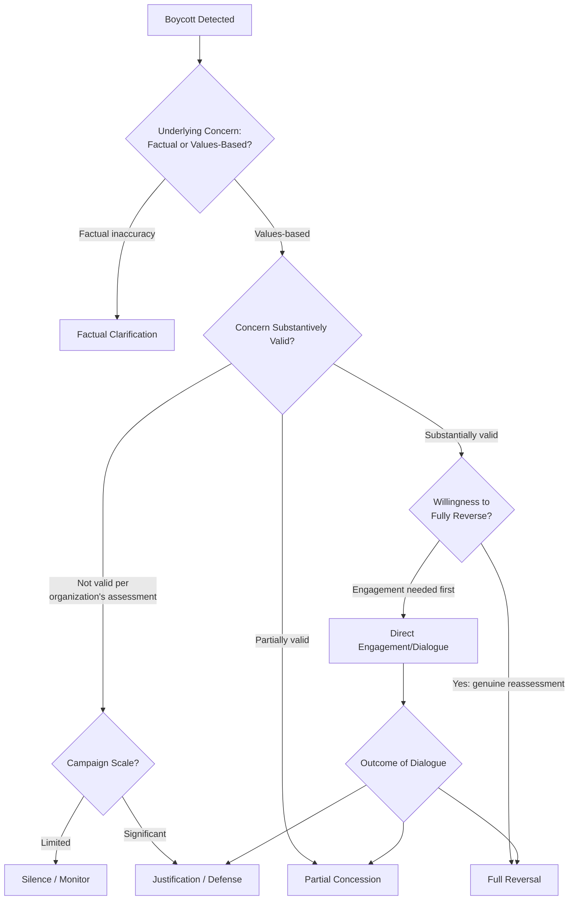

## Boycott Response Typologies

<syllabot_broad_topic/>

### Overview

Boycott response typologies provide a structured classification of the strategic postures an organization can adopt when facing a boycott, distinct from the tactical decision framework covered under general boycott/buycott management. Where a general boycott framework asks "should we respond and how," a response typology asks "which of a discrete set of recognized strategic postures does this response represent, and what are the known trade-offs of each type" — giving crisis teams a shared vocabulary for evaluating options before committing to one.

### Why a Typology Approach Is Useful

- **Forces explicit strategy selection**: Naming the response type being considered (rather than drafting an ad hoc statement) makes the underlying strategic logic visible and debatable among decision-makers before commitment
- **Surfaces trade-offs systematically**: Each typology carries known risks and known benefits documented from prior organizational experience across many crises; naming the type invokes that accumulated pattern knowledge
- **Supports consistency tracking**: An organization can review whether its chosen response type is consistent with how it has responded to comparable situations previously, which is central to the credibility concerns raised in adjacent boycott/buycott and brand-politics topics

**[Inference]** Crisis teams that skip explicit typology naming and move directly to statement drafting often produce a response that unintentionally blends elements of multiple types (e.g., partial concession language mixed with defensive language), which tends to read as incoherent or evasive to external audiences compared to a clearly and consistently executed single strategic posture.

### The Core Response Typologies

#### 1. Silence / Non-Response

Deliberately declining to issue any public statement or acknowledgment of the boycott.

- **When potentially appropriate**: Limited-scale campaigns, vocal minority without broad stakeholder resonance, no direct business nexus to the underlying issue
- **Risk**: Can be perceived as dismissive or as tacit confirmation of the criticism if campaign scale grows; provides no organizational narrative to counter external framing

#### 2. Factual Clarification / Correction

Publicly correcting specific factual inaccuracies in the boycott's underlying claims without addressing the broader values question.

- **When potentially appropriate**: The boycott is substantially based on a factual misunderstanding or inaccurate claim about the organization's actual practices or statements
- **Risk**: If any part of the underlying concern is factually valid, a purely corrective response that ignores the valid portion can appear evasive or overly legalistic

#### 3. Justification / Defense of Position

Publicly explaining and defending the reasoning behind the original action or position that triggered the boycott, without changing course.

- **When potentially appropriate**: The organization has assessed the action as consistent with its stated values and believes the position is substantively defensible
- **Risk**: Can appear tone-deaf if delivered without acknowledgment of the concerns raised; may prolong the news cycle if perceived as dismissive of legitimate grievance

#### 4. Partial Concession / Modification

Adjusting some aspect of the triggering action, policy, or statement while maintaining the overall position, signaling responsiveness without full reversal.

- **When potentially appropriate**: The underlying concern has some validity but full reversal isn't warranted or feasible; a middle-ground adjustment can address the most legitimate portion of the criticism
- **Risk**: Can be perceived by critics as insufficient (inviting continued pressure) while simultaneously being perceived by supporters of the original position as capitulation — potentially dissatisfying multiple stakeholder segments simultaneously

#### 5. Full Reversal / Capitulation

Completely reversing the triggering decision, statement, or action in response to the boycott.

- **When potentially appropriate**: The underlying concern is substantively valid and significant, and the organization determines the original action was a genuine misstep inconsistent with its actual values
- **Risk**: If not grounded in genuine principled reassessment, can appear as capitulation purely to pressure, inviting future boycotts as a perceived-effective tactic against the organization, and can trigger an opposing buycott/backlash from stakeholders who supported the original position

#### 6. Direct Engagement / Dialogue

Initiating direct conversation with boycott organizers or representative stakeholders rather than only issuing public statements.

- **When potentially appropriate**: A significant, organized stakeholder group with legitimate concerns and a genuine willingness on the organization's part to understand and potentially act on the concern
- **Risk**: Time-intensive; can be perceived as insufficient if not eventually paired with a visible outcome (statement, policy change, or clearly communicated decision not to change)

#### 7. Redirection / Reframing

Shifting public narrative focus toward a different but related organizational action, initiative, or fact, without directly addressing the boycott's central claim.

- **When potentially appropriate**: Rarely a standalone appropriate strategy; sometimes used as a supplementary element alongside another primary response type
- **Risk**: Frequently perceived as evasive if used as the primary strategy rather than a supporting element, since it can appear to dodge the central question being raised

### Typology Selection Framework

**Key Points**

- The critical branch point is distinguishing **factual disputes** from **values-based disagreements**, since these require fundamentally different response types
- **Campaign scale assessment** (covered in depth under general boycott/buycott management) should inform whether Silence is a viable option — it is generally only appropriate for limited-scale campaigns

### Consistency Testing Across Typologies

Before finalizing a response type, testing against the organization's history of comparable situations helps avoid the "whipsaw" credibility risk:

| Question | Purpose |
| --- | --- |
| Has the organization used this same response type for comparable past situations? | Identifies potential inconsistency that critics may highlight |
| Would this response type, applied consistently to a hypothetical future comparable situation from an opposing political direction, still be defensible? | Tests whether the response is grounded in genuine principle versus situational pressure-relief |
| Does the chosen response type align with the organization's previously and publicly stated values framework (where one exists)? | Assesses authenticity risk |

**[Inference]** Organizations that select a response type primarily by asking "what will make this specific controversy go away fastest" rather than "what response type is most consistent with how we have handled and would handle comparable situations" tend to accumulate a track record of situational inconsistency that becomes its own recurring news narrative over time.

### Hybrid and Sequenced Responses

In practice, responses often combine or sequence multiple typologies rather than selecting a single pure type:

- **Engagement then Partial Concession**: Direct dialogue with organized stakeholders, followed by a publicly communicated partial policy adjustment reflecting what was learned
- **Factual Clarification then Justification**: Correcting specific inaccuracies first, then providing broader context defending the underlying position on the accurately-characterized elements
- **Silence then Justification (if escalation occurs)**: Initial restraint, with a prepared justification response held in reserve if the campaign's scale grows beyond the threshold where silence remains appropriate

**[Inference]** Sequenced approaches (rather than a single immediate response) are often more defensible than an immediate, single-type response issued under acute pressure, since they allow time for accurate scale assessment and substantive validity evaluation before commitment to a specific strategic posture.

### Practical Example: Applying the Typology to a Sponsorship-Triggered Boycott

For a boycott triggered by a sponsorship decision:

1. **Initial classification**: Assess whether criticism centers on factual claims (e.g., mischaracterizing the sponsored entity) or a values-based objection to the sponsorship itself
2. **Scale and validity assessment**: Determine actual campaign scale and whether the underlying concern has substantive merit given the organization's own partnership criteria
3. **Typology selection**:
   - If factually inaccurate: Factual Clarification
   - If values-based but limited scale and organization stands by the decision: Justification or Silence
   - If values-based, significant scale, and partial merit: Direct Engagement followed by Partial Concession (e.g., revised future sponsorship criteria without necessarily ending the current relationship)
   - If values-based, significant scale, and organization determines the original decision was a genuine misstep: Full Reversal
4. **Consistency check**: Compare the selected typology against how the organization has handled comparable past sponsorship controversies
5. **Execution and monitoring**: Deliver the chosen response type clearly and monitor both the original boycott and any counter-reaction

### Common Pitfalls

- **Blending typologies incoherently**: Combining defensive/justification language with concession language in a single statement, producing a response that reads as internally inconsistent
- **Defaulting to Redirection as a primary strategy**: Using narrative redirection as the main response rather than a supporting element, which is frequently perceived as evasive
- **Selecting Full Reversal without genuine principled basis**: Reversing purely to end immediate pressure without a substantive reassessment, inviting perception that boycotts are an effective lever regardless of the merits of future claims
- **Underusing Direct Engagement before committing to a public typology**: Moving directly to a public statement (of any type) without first understanding the organized stakeholder group's actual concerns through direct dialogue
- **Ignoring consistency testing**: Selecting a response type based solely on resolving the immediate controversy without testing it against past organizational responses to comparable situations
- **Treating typology selection as purely a communications decision**: Failing to involve legal, executive leadership, and where relevant HR in typology selection, particularly for Partial Concession or Full Reversal types that may carry policy, contractual, or governance implications

### Coordination Structure

| Function | Role |
| --- | --- |
| Executive Leadership | Final typology selection, particularly for Partial Concession or Full Reversal options |
| Communications | Message drafting and delivery consistent with selected typology, monitoring reaction |
| Legal | Assessment of any contractual or legal implications of concession/reversal options |
| Data/Analytics | Scale and impact assessment informing typology selection |
| HR (where relevant) | Assessment of internal employee implications of the selected response type |

**Next Steps**

- Consistency Auditing Frameworks for Historical Response Comparison
- Direct Engagement Protocols with Organized Boycott Stakeholder Groups
- Drafting Techniques to Avoid Incoherent Hybrid Responses
- Sequenced Response Planning for Escalating Boycott Campaigns
- Legal and Contractual Considerations in Partial Concession Decisions
- Post-Response Monitoring for Counter-Reaction and Backlash Assessment