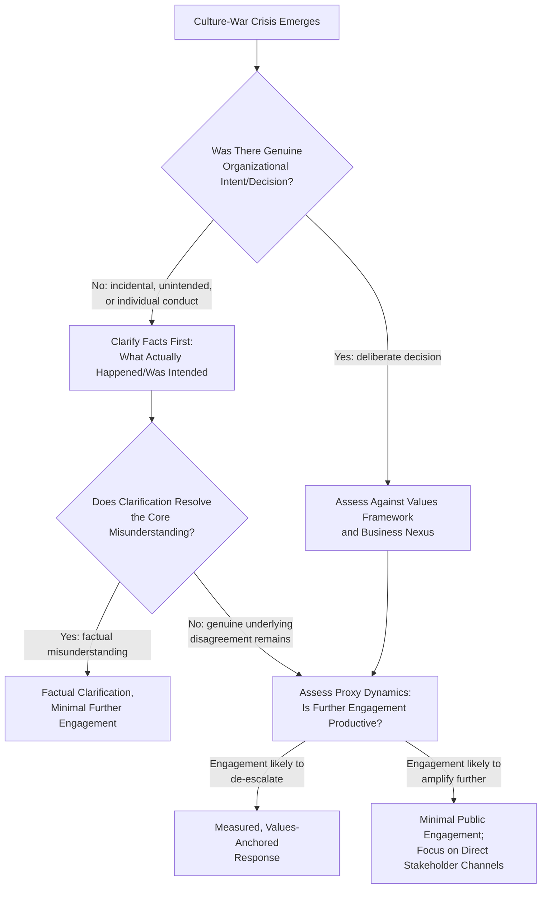

## Navigating Culture-War Crises

### Overview

Culture-war crises are reputational events in which an organization becomes the focal point of a broader, pre-existing societal ideological conflict — often involving identity, values, or social norms — rather than a crisis originating primarily from the organization's own conduct. The organization's role is frequently that of an unwitting proxy battleground: a product, advertisement, policy, or even an incidental detail becomes a symbol onto which opposing sides of an existing societal divide project a larger argument that predates and extends beyond the specific incident. This distinguishes culture-war crises from other categories covered elsewhere (general brand political positioning, boycotts/buycotts, executive positioning) in that the organization's specific action is often less determinative of outcome than the pre-existing polarization state of the issue it happens to touch.

### Why Culture-War Crises Behave Differently from Other Crisis Types

- **The organization is a proxy, not the primary subject**: Much of the public discourse in a culture-war crisis is actually about the underlying societal issue, with the organization serving as a convenient, currently-topical example rather than the substantive focus — meaning the crisis often continues or reignites independent of anything further the organization does
- **Resolution is frequently not achievable through organizational action alone**: Because the conflict predates and exceeds the organization, no communication response, policy change, or apology fully resolves the underlying societal disagreement; the best achievable outcome is often narrative de-escalation and stakeholder management rather than "resolution"
- **Extremely rapid escalation velocity**: Culture-war incidents can escalate from a minor internal decision or an isolated piece of content to national or international attention within hours, driven by pre-existing polarized audiences and media ecosystems already primed to amplify the specific narrative frame
- **Bad-faith actors and disinformation risk**: Culture-war crises are more susceptible than most other categories to exploitation by actors with no genuine stake in the underlying issue but who amplify or distort the incident for engagement, political, or commercial reasons unrelated to the organization

**[Inference]** Organizations that treat a culture-war crisis using standard crisis communication playbooks calibrated for organization-caused incidents (full investigation, root-cause explanation, corrective action commitment) often find these tools poorly matched to a situation where the "root cause" is a societal division the organization cannot investigate or correct.

### Common Triggers for Culture-War Crises

#### 1. Incidental Content or Product Detail

A minor product feature, background element in an advertisement, or incidental content detail becomes interpreted as carrying ideological significance, often disproportionate to the organization's actual intent or awareness.

#### 2. Employee or Contractor Individual Conduct

An individual employee's or contractor's personal statement or conduct, sometimes entirely unrelated to their work function, becomes attributed to the organization and interpreted through a culture-war lens.

#### 3. Policy or Practice Touching a Polarized Social Topic

An HR policy, product design choice, or operational practice intersects with an already-polarized societal topic (e.g., identity-related policies, health-related product design, educational content), drawing both organized advocacy attention and organized opposition simultaneously.

#### 4. Marketing or Advertising Campaign Interpretation

A marketing campaign is interpreted—accurately or not—as taking a side in an ongoing societal debate, triggering reaction from audiences primed to see the campaign through that lens regardless of the organization's actual intended message.

#### 5. Association or Amplification by External Political Actors

A political figure, commentator, or media outlet with an existing audience amplifies an organizational detail as an example within their broader ongoing commentary on the culture-war issue, regardless of the detail's actual significance to the organization.

### Response Strategy Framework

**Key Points**

- The first branch — distinguishing **genuine organizational decision** from **incidental or individual conduct**—materially changes the appropriate response, since defending or explaining a decision the organization never actually made is a different task than clarifying facts
- The **proxy dynamics assessment** (whether further public engagement is likely to de-escalate or further amplify the controversy) is a judgment call specific to culture-war crises that doesn't have a clean equivalent in most other crisis categories, since the audience driving amplification is often engaged with the broader societal issue rather than the organization specifically

### Fact-Finding and Clarification as a First Step

Because many culture-war crises stem from incidental or misinterpreted details, an early and rigorous fact-finding step is disproportionately valuable:

- **Verify what actually occurred or was intended**, distinct from how it has been characterized in circulating commentary, since initial viral framing frequently diverges from the underlying facts
- **Assess intent versus impact separately**: A detail can have been entirely unintentional from the organization's perspective while still carrying real impact or offense to an affected stakeholder group — acknowledging impact does not require conceding that ideological intent existed where it did not
- **Distinguish the organization's actual position from a position attributed to it by amplifying commentary**: In fast-moving culture-war narratives, the organization's actual statement or action is sometimes significantly distorted by the time it reaches broad audiences, making direct factual clarification a valuable first response even before any values-based positioning decision is made

### The Proxy Dynamics Assessment

**[Inference]** A central judgment specific to culture-war crises is assessing whether the organization is likely to remain a significant focal point of the broader societal debate regardless of its response, versus whether the organization's specific role in the narrative is likely to fade relatively quickly as attention moves to the next topical example — this assessment should inform how much public engagement effort is proportionate, since substantial engagement with a rapidly fading proxy controversy can inadvertently prolong the organization's association with the underlying culture-war topic beyond what continued silence would have produced.

Factors that may inform this assessment:

- Whether the organization has an ongoing, structural connection to the underlying issue (making it a more durable rather than transient symbol)
- The velocity and pattern of past comparable culture-war news cycles (whether the broader media/social ecosystem tends to move on quickly to new examples)
- Whether organized advocacy or political actors have selected the organization for sustained, ongoing campaign attention versus a single viral moment

### Internal Considerations Specific to Culture-War Crises

- **Employee polarization**: Because culture-war issues are, by definition, ones where the broader workforce likely holds genuinely divided views, internal communication requires particular care to avoid the organization itself appearing to adjudicate the underlying societal question in a way that alienates a significant portion of its own employee base
- **Customer service and frontline preparedness**: Customer-facing staff may face direct questions or confrontations tied to the controversy and need clear, simple guidance that doesn't require them to personally defend a position on the underlying societal issue
- **Distinguishing organizational neutrality from indifference**: Where the organization determines restraint is the appropriate posture, internal communication explaining this as a considered, principled position (e.g., a general policy of restraint on matters without direct business nexus) tends to land better internally than unexplained silence, which employees may interpret as institutional indifference to a matter some of them feel strongly about

### Practical Example: Incidental Product Detail Controversy

For a scenario where an incidental design or content element in a product is interpreted as carrying ideological significance:

1. **Immediate fact verification**: Confirm what the actual design/content decision was, who made it, and what (if any) intent existed, distinct from the circulating interpretation
2. **Intent vs. impact assessment**: Acknowledge any genuine impact on affected stakeholders without conceding an ideological intent that did not exist, if that is factually the case
3. **Proxy dynamics assessment**: Evaluate whether the controversy is likely to be a short-lived viral moment or connects to a sustained ongoing campaign or media narrative
4. **Response calibration**: For likely short-lived, low-nexus controversies, a brief factual clarification with minimal further public engagement is often proportionate; for sustained, high-nexus situations, more substantive engagement following the broader response typology framework may be warranted
5. **Internal communication**: Provide employees with clear factual context and guidance, acknowledging the topic's sensitivity without requiring the organization to adjudicate the broader societal question
6. **Frontline preparedness**: Equip customer-facing staff with simple, non-argumentative guidance for handling direct customer inquiries or confrontations related to the controversy

### Common Pitfalls

- **Treating a proxy controversy as if the organization is the primary subject**: Investing disproportionate resources into fully "resolving" a controversy whose actual substance is a societal debate the organization did not create and cannot resolve
- **Skipping fact verification in favor of immediate positioning**: Rushing to a values-based public position before confirming what actually occurred, when many culture-war controversies stem substantially from factual distortion during viral amplification
- **Conflating acknowledgment of impact with concession of ideological intent**: Either refusing to acknowledge genuine impact on affected stakeholders (appearing dismissive) or over-conceding ideological intent that did not exist (creating an inaccurate record and inviting further scrutiny)
- **Engaging extensively with a fading proxy controversy**: Prolonging organizational association with a culture-war topic through sustained public engagement when the controversy's natural attention cycle was likely to fade on its own
- **Underestimating internal employee polarization**: Assuming internal communication challenges mirror external ones, when employees may hold more genuinely divided views than external commentary suggests, requiring more careful internal messaging calibration
- **Allowing frontline staff to become de facto spokespeople on the underlying societal issue**: Failing to provide customer-facing employees with guidance that keeps them out of substantive ideological debate with customers

### Coordination Structure

| Function | Role |
| --- | --- |
| Communications | Fact verification, message development, media/social monitoring of narrative evolution |
| Legal | Assessment of any defamation, misattribution, or factual dispute dimensions |
| Executive Leadership | Proxy dynamics assessment, engagement-level decision, consistency oversight |
| HR/Internal Communications | Internal employee messaging calibrated for polarized internal sentiment |
| Customer Service/Frontline Training | Preparedness guidance for direct stakeholder inquiries |
| Government Affairs (where relevant) | Monitoring any political actor amplification with legislative or regulatory dimension |

**Next Steps**

- Fact-Verification Protocols for Rapidly Distorted Viral Narratives
- Proxy Dynamics Assessment Methodologies for Culture-War Controversies
- Internal Communication Calibration for Polarized Employee Sentiment
- Frontline Staff Preparedness for Ideologically Charged Customer Interactions
- Distinguishing Intent from Impact in Public Clarification Statements
- Monitoring Organized Political Actor Amplification of Organizational Incidents