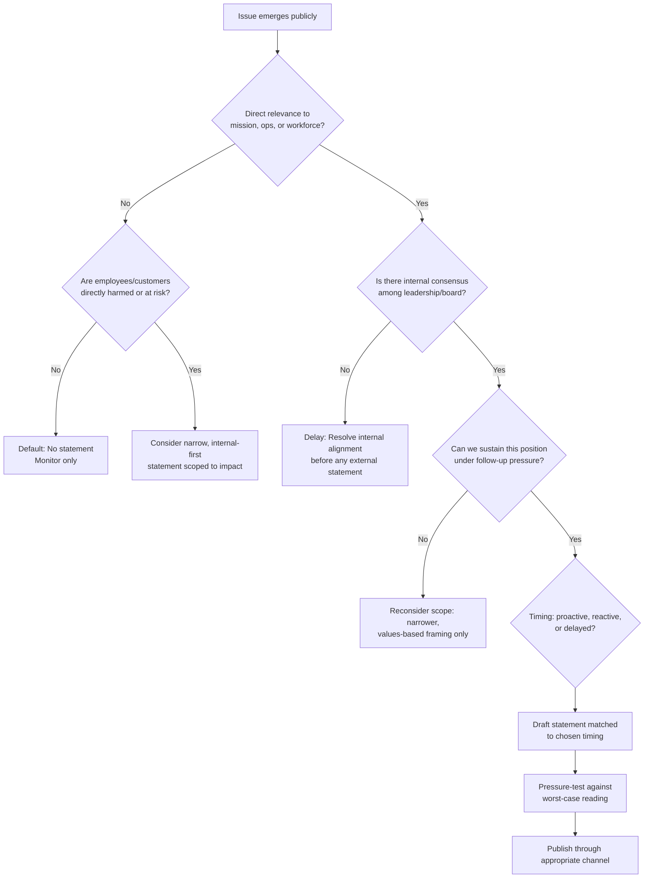

## Deciding Whether and When to Take a Public Stand


### Overview

Deciding whether and when to take a public stand on a social, political, or cultural issue is one of the highest-variance decisions a communications or executive team can make. Unlike a product crisis, where the triggering event is usually unambiguous and the organization's culpability is a known quantity, stands on external issues (legislation, social movements, geopolitical events, culture-war flashpoints) are discretionary. The organization is choosing to enter a conflict it did not create and cannot fully control, and the downside of speaking and the downside of staying silent are both real, asymmetric, and audience-dependent.

This topic sits at the intersection of stakeholder mapping, values articulation, and risk modeling. It is distinct from standard crisis response because the "crisis" (if one exists) is often reputational exposure to *inaction*, not a discrete incident.

### Why This Decision Is Structurally Different from Crisis Response

**Key Points**

- In a product recall or data breach, the facts are largely fixed and the organization's job is to communicate around them.
- In a stand-taking decision, the organization is generating a new fact (its own position) that did not previously exist in the public record.
- There is no "neutral" baseline: silence is itself interpreted as a stance by at least one audience segment, a phenomenon sometimes called the "silence is violence" framing on one side and "stay in your lane" framing on the other.
- The decision is reversible in theory but rarely in practice — once a position is stated, retraction reads as either cowardice or capitulation, compounding reputational cost.

### The Core Decision Framework

A structured approach typically evaluates four dimensions before any drafting begins.

#### 1. Relevance to Core Mission and Operations

The strongest and most defensible stands are those with a direct line to the organization's business, workforce, or customer base. This is often called the "stay in your lane" test.

- **High relevance**: a tech company on encryption policy, a healthcare company on public health legislation, an employer on workplace discrimination law.
- **Low relevance**: a consumer snack brand issuing a statement on unrelated foreign policy.

[Inference] Organizations with high perceived relevance to an issue face substantially less "why are you talking about this" backlash than those without it, though the exact threshold is audience- and issue-specific and not something that can be benchmarked universally.

#### 2. Stakeholder Alignment Mapping

Before drafting, map at minimum:

- Employees (current and prospective)
- Customers / user base
- Investors / board
- Regulators
- Industry peers (has anyone else moved first?)

**Example**

A B2B software company considering a statement on a state-level legislative issue might find:

- Employees: strongly favor a statement (60%+ in internal sentiment channels)
- Enterprise customers: split, with some in opposing jurisdictions
- Investors: indifferent unless it affects revenue exposure
- Regulators: not a direct factor

This kind of split is common and is precisely why the decision requires explicit tradeoff analysis rather than defaulting to either action or inaction.

#### 3. Timing Analysis

Timing changes the meaning of an identical statement.

- **Proactive** (before the issue peaks): reads as principled, but risks appearing to invite controversy the organization didn't need to enter.
- **Reactive** (during peak media attention): reads as responsive, but is often perceived as opportunistic or performative ("jumping on the bandwagon").
- **Delayed** (after peak attention has passed): often reads worse than either — perceived as calculated, focus-grouped, or forced by external pressure (e.g., employee walkouts, boycott threats).

[Inference] Reactive statements issued in the first 24–72 hours of a news cycle tend to receive more credit for authenticity than statements issued after the cycle has moved on, but this is a directional pattern observed by communications practitioners rather than a fixed, measurable rule.

#### 4. Reversibility and Consistency Cost

Once a position is taken, the organization has created a standard it will be held to in future, analogous situations. This is the "precedent trap."

- If a company speaks on Issue A but stays silent on structurally similar Issue B, it will be asked to explain the inconsistency — often by the same journalists or activist groups who praised the first statement.
- Organizations should ask: *if this exact situation recurs in 18 months with a different political valence, are we prepared to speak again, and will our prior statement constrain what we can say?*

### Decision Tree





```
### Channel Selection

The channel itself communicates weight and intent.

| Channel | Signal Sent | Typical Use Case |
|---|---|---|
| CEO personal statement (LinkedIn/X) | High personal conviction, high risk exposure | Founder-led companies, issues tied to personal values |
| Corporate blog/newsroom post | Institutional, deliberate, reviewed | Most B2B and policy-adjacent stands |
| Internal memo (leaked or shared voluntarily) | Employee-facing priority, deniable externally | Workforce-sensitive issues |
| Paid advertising / op-ed | Maximum control over framing, higher cost, seen as more "campaign-like" | Coordinated industry positions |
| Silence with private employee communication | Avoids public record while addressing internal pressure | Low-relevance issues with vocal internal minority |

### Drafting Principles for the Statement Itself

- **Anchor to values or policy, not partisan identity.** A statement framed around "we believe employees deserve safe working conditions" is more durable than one framed around a specific political figure or party.
- **Avoid vague euphemism.** Statements criticized as "corporate word salad" (e.g., "we stand with all impacted communities during this difficult time") often generate more backlash than either silence or specificity, because they read as risk-averse without providing cover.
- **State what, if anything, the organization will do.** A stand without an accompanying action (donation, policy change, PAC withdrawal) is more vulnerable to "performative allyship" criticism.
- **Pre-empt the obvious counter-question.** If the statement invites "why now and not before," address it directly rather than leaving it for reporters to ask.

### Common Failure Modes

1. **The Split-the-Difference Statement** — attempting to satisfy all stakeholder segments simultaneously, resulting in a statement that satisfies none and is mocked for its vagueness.
2. **The Uncoordinated Multi-Channel Response** — CEO posts personally while corporate account stays silent, or regional offices issue conflicting statements, creating a visible internal contradiction that becomes its own story.
3. **The Retracted Stand** — publishing under pressure, then walking it back after backlash from the opposite side, which typically damages credibility with both audiences simultaneously.
4. **The Selective Silence Pattern** — speaking on issues favored by one stakeholder group while remaining silent on structurally similar issues favored by another, which is frequently documented and cited by critics as evidence of inconsistency.

### Illustrative Case Pattern (Composite, Not Attributed)

A mid-size consumer brand faces internal employee pressure to comment on a contested state law. Leadership maps stakeholders and finds employees split roughly evenly. Rather than a public statement, the organization:
- Issues an internal-only memo affirming support for affected employees and outlining concrete internal accommodations (relocation assistance, expanded leave).
- Declines external comment, citing lack of direct operational relevance.
- Faces some criticism from external advocacy accounts for "staying silent," but retains higher internal trust scores in post-decision employee surveys than peer companies that issued public statements later retracted or walked back.

[Inference] This pattern — internal action paired with external restraint — is a commonly recommended middle path in practitioner literature for issues with low direct operational relevance but real internal stakeholder concern, though outcomes are highly context-dependent and cannot be generalized as a universal best practice.

### Conclusion

The decision to take a public stand is best modeled as a structured risk assessment rather than a binary reflex. Relevance to mission, stakeholder alignment, timing, and reversibility form the four load-bearing variables. Organizations that skip this analysis — reacting purely to volume of pressure (media, employee, or social) — are disproportionately represented among the retraction and backlash cases documented in post-mortems of failed corporate stands.

**Next Steps**
- Crisis Communication Message Mapping and Pre-Approved Statement Templates
- Employee Activism and Internal Dissent Management
- Stakeholder Mapping Methodologies for Reputational Risk
- The Role of the Board in High-Visibility Public Statements
- Boycott and Counter-Boycott Dynamics: Risk Modeling
- Media Training for Executives on Politically Sensitive Topics
- Case Study Analysis: Comparative Outcomes of Proactive vs. Reactive Corporate Statements


```