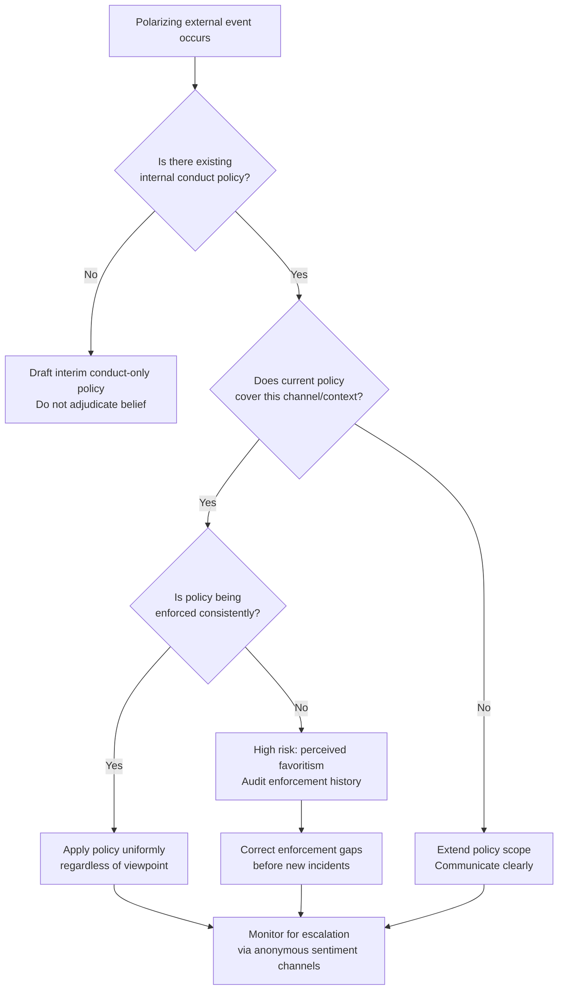

## Managing Polarized Internal Workforces


### Overview

Managing a polarized internal workforce refers to the set of organizational policies, communication protocols, and leadership practices used when employees hold sharply divergent — and often publicly expressed — views on contested social, political, or cultural issues. This differs from ordinary workplace disagreement in that the source of tension originates outside the organization (national politics, geopolitical conflict, culture-war issues) but manifests inside it, through internal channels (Slack, town halls, ERGs, internal social tools) and sometimes spills into external visibility (leaks, walkouts, public employee statements).

The management challenge is structural: standard HR conflict-resolution frameworks assume a resolvable dispute between parties. Polarization frameworks instead assume the dispute is *not* resolvable internally and design for coexistence, containment, and continued productivity rather than consensus.

### Why Standard HR Tools Are Insufficient

**Key Points**

- Traditional workplace conflict resolution (mediation, HR-facilitated conversations) assumes a shared factual baseline and a path to compromise. Political and identity-based polarization often lacks both.
- Attempts to "resolve" the underlying disagreement (e.g., forcing opposing employee groups into a mediated dialogue about a geopolitical conflict) frequently escalate rather than de-escalate, because the goal shifts from workplace functioning to ideological persuasion.
- The more tractable goal is behavioral: defining what conduct is acceptable *at work*, regardless of the underlying belief, and enforcing that boundary consistently across ideological lines.

### The Core Framework: Belief vs. Conduct Separation

The most widely used practitioner approach separates two categories:

1. **Belief** — what an employee privately thinks about an issue. Organizations generally have no legitimate mechanism to manage this and attempting to do so (through mandatory trainings intended to change opinions, for example) is a common source of backlash and legal exposure in some jurisdictions.
2. **Conduct** — what an employee says or does in the workplace, on internal tools, or under the company's identity. This is legitimately governable through code-of-conduct policy.

**Example**

A policy might state: "Employees may hold and privately discuss any political view. Internal channels (Slack, email, town halls) may not be used to advocate for electoral candidates, campaign for donations, or target colleagues based on their presumed political affiliation." This governs conduct without adjudicating the underlying belief.

### Structural Decision: Scope of Permissible Discourse

Organizations generally choose one of three postures, each with distinct tradeoffs.

| Posture | Description | Primary Risk |
| --- | --- | --- |
| Open Forum | All political topics permitted on internal channels within conduct rules | High ongoing moderation burden; frequent flare-ups; risk of channel capture by most vocal minority |
| Scoped Forum | Political discussion permitted only in designated, opt-in channels (e.g., `#politics-discussion`) | Reduces spillover into work channels; some employees feel unheard if excluded from main channels |
| Closed Forum | No political discussion permitted on any company system, regardless of topic | Minimizes internal conflict; risks appearing to suppress legitimate workforce concerns (e.g., DEI, safety issues with political valence) |

[Inference] Scoped Forum policies are the most commonly adopted middle path among large employers who have publicly documented their internal communication policies, though the exact prevalence across all organizations is not something that can be precisely benchmarked.

### Decision Flow for Policy Design





```
### Enforcement Consistency: The Highest-Risk Failure Point

**Key Points**
- The single most common cause of internal-polarization crises becoming external reputational crises is *inconsistent enforcement* — disciplining or tolerating conduct differently depending on the political direction of the speech.
- Once inconsistency is documented (often via leaked Slack screenshots), the story shifts from the original political issue to "company plays favorites," which is a more damaging and harder-to-defend narrative because it implicates leadership integrity rather than a single contested opinion.
- Enforcement logs and precedent should be tracked centrally (typically by HR or People Ops) specifically so that "have we handled a similar case before, and how" can be answered before a new incident is resolved.

### Role of Employee Resource Groups (ERGs) and Internal Advocacy Groups

ERGs occupy an ambiguous position: they are company-sanctioned groups often organized around identity characteristics that correlate with political viewpoints (though are not synonymous with them). Common friction points:

- ERGs issuing statements on external political events using company branding or channels, which can be read as an implicit company position.
- Non-members perceiving ERG statements as exclusionary or as company-endorsed political speech.
- Leadership facing pressure to either formally endorse or formally distance from ERG statements, both of which carry risk.

A common mitigation is a written policy requiring ERGs to use personal (not company) channels/branding for any statement on an external political or social issue unrelated to the ERG's stated internal mission (e.g., mentorship, internal community-building).

### Town Halls and Leadership Communication During Active Polarization

- **Pre-brief leadership** on anticipated flashpoint questions before open Q&A sessions; unscripted answers to politically charged questions are a frequent source of leaked, out-of-context clips.
- **Distinguish "we acknowledge this is difficult" from "we are taking a position."** Acknowledging employee distress is not the same as endorsing a specific framing of the underlying issue, and conflating the two is a common unforced error.
- **Avoid forced unanimity language** ("we all agree that...") when internal sentiment data shows the workforce is genuinely split; this reads as inauthentic to the dissenting segment and can be selectively quoted.

### Metrics and Monitoring

Organizations managing this proactively typically track:
- Anonymous pulse-survey sentiment on psychological safety, segmented (where legally and ethically permissible) by relevant demographic or tenure cohorts
- Volume and topic clustering of HR/ethics-line complaints related to political conduct
- Attrition analysis for statistically significant patterns correlated with major political events (note: this requires careful methodology to avoid spurious correlation)
- External leak frequency (screenshots of internal channels reaching press or social media)

[Unverified] Specific attrition-correlation figures are highly organization- and context-dependent; no single benchmark generalizes across industries or company sizes, and any such analysis should be treated as internal, non-comparable data.

### Common Failure Modes

1. **The Mandatory Opinion Training** — requiring employees to attend training explicitly designed to change political views (as opposed to conduct standards), which frequently generates backlash, legal risk in some jurisdictions, and internal leaks framing the company as ideologically coercive.
2. **The Silent Favoritism Pattern** — enforcing conduct policy against one political direction while tolerating comparable conduct from the other, discovered later via employee-compiled evidence.
3. **The Reactive Policy Vacuum** — having no conduct policy at all until the first major incident, forcing improvised, inconsistent rulings under time pressure and media attention.
4. **Channel Bleed** — political discourse migrating from a scoped/opt-in channel into general work channels because moderation was not actively maintained.

### Conclusion

Managing a polarized workforce is best approached as a conduct-governance problem, not a belief-reconciliation problem. The organizations that manage this most durably separate what employees are free to think from what they may say or do using company systems and identity, and — critically — enforce that boundary with visible, documented consistency regardless of which political direction a given incident originates from. Enforcement inconsistency, not the underlying political division itself, is the more common root cause of these situations escalating into external reputational crises.

**Next Steps**
- Drafting Enforceable Internal Conduct Policies for Political Speech
- Employee Resource Group Governance and Branding Guidelines
- Leak Prevention and Internal Communication Security Practices
- Leadership Media Training for Town Hall Q&A
- Legal Considerations: Political Speech Protections by Jurisdiction
- Anonymous Employee Sentiment Measurement Methodologies
- Case Study Analysis: Comparative Outcomes of Open vs. Closed Internal Discourse Policies


```