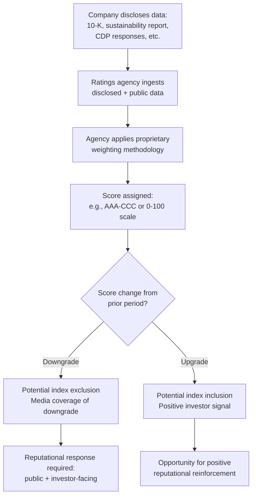

## ESG as a Reputation Driver


### Overview

Environmental, Social, and Governance (ESG) criteria function as a reputational risk and opportunity vector distinct from traditional CSR (Corporate Social Responsibility) in that ESG performance is increasingly quantified, rated by third parties, and directly referenced by investors, regulators, and institutional stakeholders — not just consumers. This gives ESG a dual reputational exposure: it can damage or build reputation with the general public (via media coverage, activism, boycotts) *and* independently with capital markets (via ratings agencies, index inclusion/exclusion, and disclosure-driven scrutiny). A crisis-and-reputation management practice must treat these as related but operationally distinct audiences.

### ESG vs. Traditional CSR: The Reputational Distinction

**Key Points**

- CSR is typically voluntary, narrative-driven, and reported at the organization's discretion (e.g., an annual "sustainability report" with self-selected highlights).
- ESG performance is increasingly benchmarked against standardized frameworks (e.g., GRI, SASB/ISSB standards, TCFD-aligned climate disclosures) and scored by third-party raters (MSCI, Sustainalytics, ISS ESG, among others).
- Because ESG is externally scored, an organization's reputation on these dimensions can move independent of its own communications — a ratings downgrade or exclusion from an ESG index is itself a media event, even absent any new underlying incident.
- [Inference] This externally-scored quality makes ESG-linked reputational risk somewhat less controllable through communications alone compared to traditional CSR narrative risk, since the scoring inputs (disclosures, incident records, litigation history) are the primary lever, not messaging.

### The Two-Audience Model

| Audience | Primary Concern | Reputational Mechanism |
| --- | --- | --- |
| Capital markets (investors, asset managers, ratings agencies) | Long-term risk-adjusted returns, regulatory compliance, disclosure quality | ESG scores, index inclusion, shareholder resolutions, proxy voting |
| General public / consumers / employees | Perceived authenticity, alignment with values, absence of hypocrisy | Media coverage, social campaigns, boycotts, employer-brand perception |

A statement or disclosure can succeed with one audience and fail with the other simultaneously — a common and high-risk pattern. For example, a detailed climate disclosure that satisfies investor demands for transparency may simultaneously reveal underperformance that becomes a public-facing "greenwashing" story.

### Primary Reputational Risk Vectors Within ESG

#### 1. Greenwashing Exposure

Greenwashing risk arises when public-facing environmental claims (marketing, sustainability reports, product labeling) outpace or contradict the underlying disclosed data or third-party verification.

- **Mechanism**: Regulators (e.g., FTC Green Guides in the US, EU Green Claims Directive-type frameworks), NGOs, and financial journalists increasingly cross-reference marketing claims against filed disclosures, litigation records, and emissions data.
- **Common failure pattern**: A "net zero by 2030" pledge made in marketing materials without a filed, third-party-verified transition plan, later exposed via investigative reporting or shareholder activist research.
- [Unverified] The exact rate at which greenwashing claims escalate into formal regulatory action versus remaining reputational-only varies significantly by jurisdiction and is not something that generalizes across markets.

#### 2. Governance Failures as Reputational Amplifiers

Governance (the "G" in ESG) failures — executive misconduct, board independence issues, related-party transactions, weak whistleblower protections — tend to amplify, rather than exist independently of, environmental and social reputational events.

- A company with strong environmental performance but a governance scandal (e.g., executive compensation controversy, board conflicts of interest) often sees its overall ESG-linked reputation degrade faster than the isolated E or S performance would predict, because governance failures are read as evidence that *all* the organization's reported metrics may be unreliable.

#### 3. Social ("S") Pillar Volatility

The social pillar (labor practices, DEI programs, supply chain labor conditions, community impact) is the most politically contested and reputationally volatile of the three, because:

- It intersects directly with the polarization dynamics covered under workforce and public-stand topics.
- Metrics are less standardized than environmental (carbon) or governance (board composition) metrics, making claims easier to contest from multiple ideological directions simultaneously.

### Rating Agency Mechanics (Simplified)





```
[Inference] Because rating methodologies differ substantially across providers (MSCI, Sustainalytics, and others use different weightings and data sources), a single company can receive materially different scores from different agencies simultaneously; this divergence is a known and often-cited criticism of the ESG ratings industry rather than a flaw specific to any one company's disclosure.

### Reputation Management Response Framework by Trigger Type

| Trigger | Primary Audience Affected | Recommended First Response |
|---|---|---|
| Ratings downgrade | Investors, financial media | Direct outreach to ratings agency for methodology clarification; investor-facing explanatory statement; avoid public dispute unless factual error is demonstrable |
| Greenwashing accusation (NGO/media) | General public, regulators | Verify underlying claim accuracy before responding; if claim is indefensible, correct and disclose rather than defend |
| Governance scandal (executive/board) | All audiences simultaneously | Board-level response required, not communications-only; governance failures typically demand structural remedy (board changes, policy changes) alongside statement |
| Supply chain labor exposure | General public, NGOs, some investors | Independent audit commissioning; avoid premature denial before investigation completes |
| Shareholder ESG resolution | Investors, some public attention | Board and IR-led response; communications supports but does not lead |

### Disclosure Quality as Preemptive Reputation Management

**Key Points**
- Organizations with mature, consistent, third-party-assured disclosure practices generally have more credibility buffer when an isolated negative ESG event occurs, because their baseline data is already trusted.
- Conversely, organizations with sparse, inconsistent, or newly-adopted disclosure practices face compounded skepticism during a crisis — reporters and analysts question not just the incident but whether *any* of the company's ESG claims are reliable.
- [Inference] This suggests disclosure maturity functions as a form of reputational insurance, though it does not eliminate risk from a genuine underlying failure (governance or otherwise).

### Common Failure Modes

1. **The Marketing-Disclosure Gap** — public sustainability marketing that overstates what is supportable by filed, auditable disclosure data.
2. **The Single-Metric Fixation** — over-indexing communications on one favorable metric (e.g., carbon intensity) while ignoring materially worse performance on another (e.g., water usage, labor practices), inviting "cherry-picking" criticism.
3. **The Reactive Ratings Dispute** — publicly disputing a ratings agency's methodology only after a downgrade, which reads as sour grapes rather than principled critique.
4. **The Governance Blind Spot** — treating ESG communications as primarily an environmental/marketing function while under-resourcing the governance dimension, despite governance failures being disproportionately damaging when they surface.
5. **Underestimating Cross-Audience Spillover** — assuming investor-facing disclosure and public-facing marketing operate in separate media environments; in practice, financial journalists and consumer/NGO researchers now regularly cross-reference both.

### Conclusion

ESG functions as a reputation driver precisely because it is quantified and externally validated, which removes some of the narrative control organizations are accustomed to having over their own sustainability story. Effective reputation management in this domain treats disclosure accuracy as the primary defensive asset, recognizes that governance failures amplify rather than sit alongside environmental and social risks, and maintains distinct but coordinated response protocols for capital-market and general-public audiences rather than treating ESG reputation as a single undifferentiated communications problem.

**Next Steps**
- Greenwashing Litigation and Regulatory Risk (FTC Green Guides, EU frameworks)
- ESG Ratings Agency Methodology and Engagement Strategy
- Governance Crisis Response: Board-Level Communication Protocols
- Supply Chain Labor Audits and Third-Party Verification
- Shareholder Activism and ESG-Linked Proxy Resolutions
- Disclosure Framework Comparison: GRI, SASB/ISSB, TCFD
- Cross-Functional Coordination Between Investor Relations and Corporate Communications


```